 Imagen del cluster AWS:
 
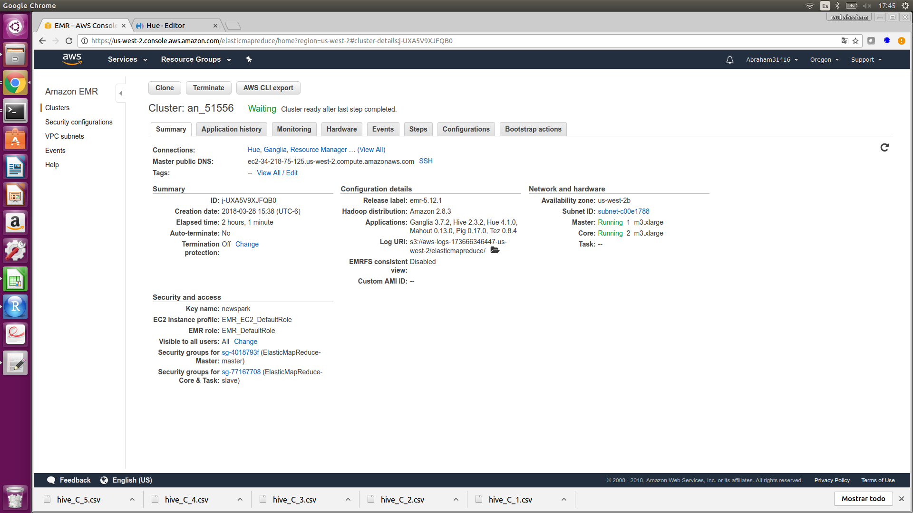


MapReduce (A)

Incluye el conteo total y el conteo de nulos o vacíos

A.1 ¿Cuántas estaciones meteorológicas diferentes tienes por año?

```{r}
library(knitr)
library(readr)
respa1 <- read_csv('./MapReduce/mr_a_1.csv/resultados.csv',col_names=TRUE)
kable(respa1)
```

evidencia A1 AWS:

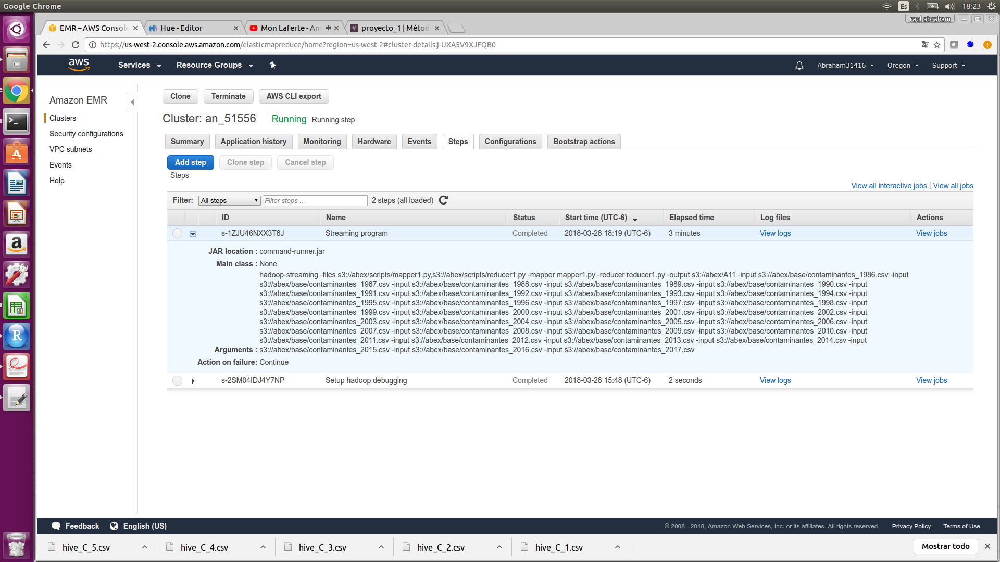

Archivo Mapper, Reducer: /MapReduce/mapper1.py, /MapReduce/reducer1.py
Archivo de salida(Particiones): /MapReduce/mr_a_1.csv (part-00000-part-00006)


A.2 ¿Cuántos registros hay por contaminante y estación meteorológica?

```{r}
library(readr)
respa2 <- read_csv('./MapReduce/mr_a_2.csv/resultado.csv',col_names=TRUE)
kable(respa2)
```

evidencia A2 AWS:

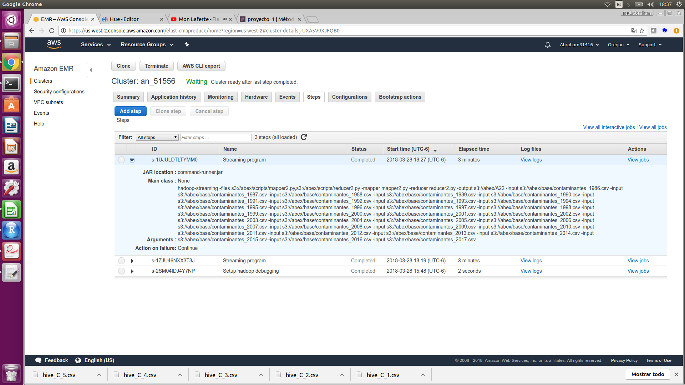

Archivo Mapper, Reducer: /MapReduce/mapper2.py, /MapReduce/reducer2.py
Archivo de salida(Particiones): /MapReduce/mr_a_2.csv (part-00000-part-00006)


A.3 ¿Cuántos registros hay por contaminante y año? 

```{r}
library(readr)
respa3 <- read_csv('./MapReduce/mr_a_3.csv/resultado.csv',col_names=TRUE)
kable(respa3)
```

evidencia A3 AWS:

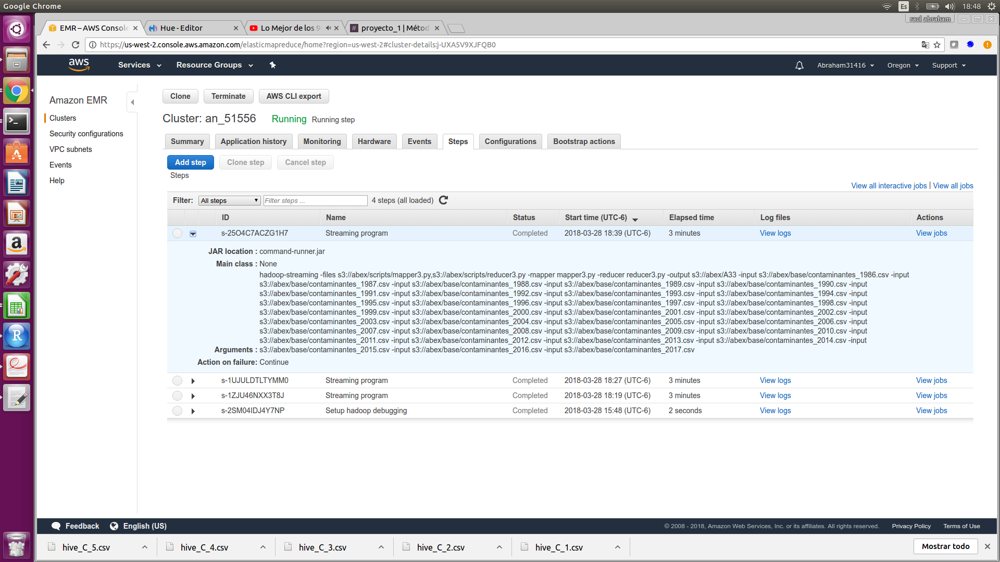

Archivo Mapper, Reducer: /MapReduce/mapper3.py, /MapReduce/reducer3.py
Archivo de salida(Particiones): /MapReduce/mr_a_3.csv (part-00000-part-00006)


A.4 ¿Cuántos registros hay por contaminante, año y estación meteorológica? 

```{r}
library(readr)
respa4 <- read_csv('./MapReduce/mr_a_4.csv/resultado.csv',col_names=TRUE)
kable(respa4)
```

evidencia A4 AWS:


Archivo Mapper, Reducer: /MapReduce/mapper4.py, /MapReduce/reducer4.py
Archivo de salida(Particiones): /MapReduce/mr_a_4.csv (part-00000-part-00006)


A.5 ¿Cuántos registros hay por estación meteorológica en el Estado de México?

```{r}
library(readr)
respa5 <- read_csv('./MapReduce/mr_a_5.csv/resultado.csv',col_names=TRUE)
kable(respa5)
```

evidencia A5 AWS:

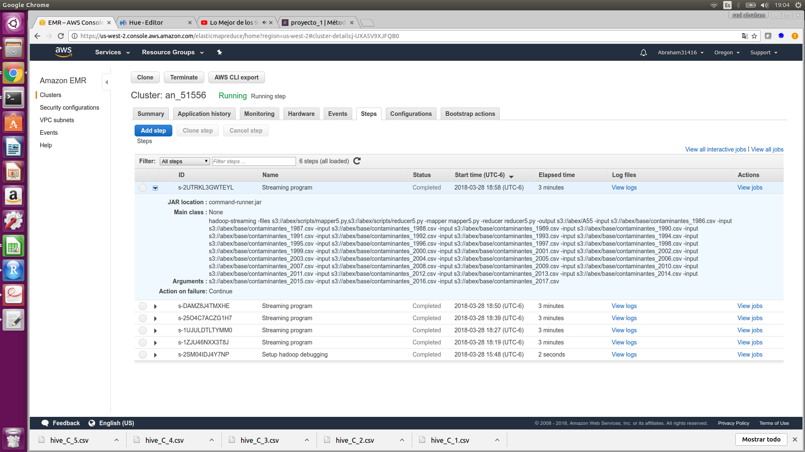

Archivo Mapper, Reducer: /MapReduce/mapper5.py, /MapReduce/reducer5.py
Archivo de salida(Particiones): /MapReduce/mr_a_5.csv (part-00000-part-00006)
 


# PIG

### Preambulo
 - Para todos los ejercicios, se eliminaron los registros con mediciones nulas; lo anterior, en virtud de que al no tener valor, no se pueden utilizar ni interpretar adecuadamente.
 
 - Para las preguntas B.2 y B.3 se eliminaron lo siguientes contaminantes pues no tienen una ecuación de transformación a IMECA asociada y por lo tanto no fue posible compararlos con los demás contaminantes: NO, NOX y PMCO. 

### B.1
__¿Cuál es la estación meteorológica más "nueva"?__

La estación meteorológica más nueva es Milpa Alta (MPA) pues su primer registro es en enero 2016.


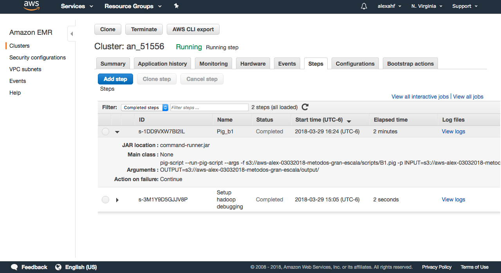

Archivo Script: script_pig_B1.pig
Archivo de salida: pig_b_1.csv

### B.2

__¿Cuál es el contaminante con la medición más alta? -ten cuidado con las unidades de cada contaminante!-, 
¿en qué fecha sucedió?, ¿qué estación metorológica la registró?__

El contaminante con la medicion más alta fue PM2.5 con un valor IMECA de 1319.52. La fecha en que sucedió fue el 16-04-2013 en al estación Xalostoc (XAL), en el Estado de México.

Es importante destacar que aunque se obtuvo este valor de IMECA, probablemente exista algun problema con el "value" de el presente registro, pues en internet se indicaba que el valor máximo de IMECA es 500.


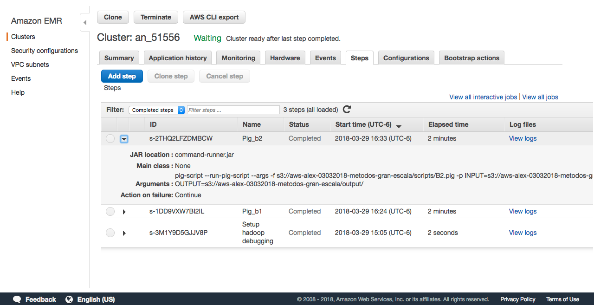

Archivo Script: script_pig_B2.pig
Archivo de salida: pig_b_2.csv


### B.3
__¿Cuál es el contaminante con la medición más baja? -ten cuidado con las unidades de cada contaminante!-, 
¿en qué fecha sucedió?, ¿qué estación metorológica la registró?__

No es posible determinar el contaminante con la medición más baja (tomando el IMECA como unidad para realizar la comparación entre variables); lo anterior, pues existen 328,277 mediciones con "value" cero y por lo tanto el valor IMECA que se calcula también es cero en dichas mediciones. En particular, lo anterior sucede con los siguientes contaminantes: CO, SO2, O3, PM2.5 y NO2.

No obstante, se anexa base con todas las mediciones cero, pues son las que constituirian las mediciones más bajas.


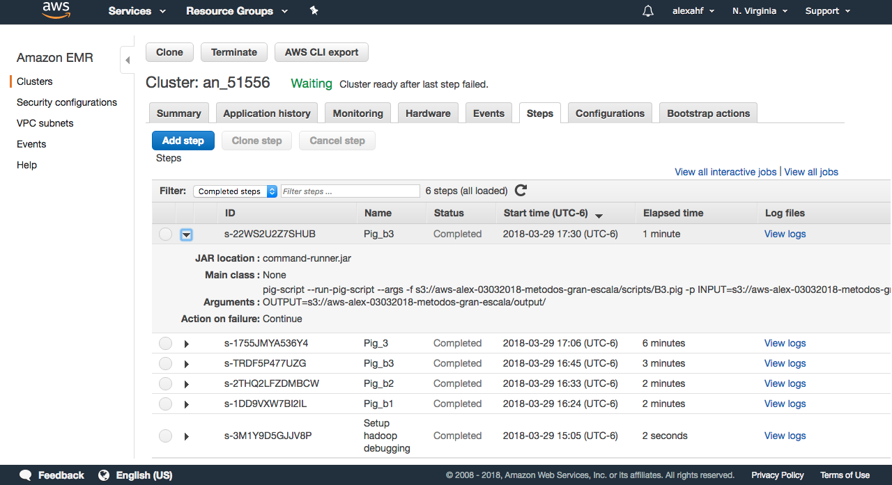

Archivo Script: script_pig_B3.pig
Archivo de salida: pig_b_3.csv


### B.4
__¿Cuál es el promedio de mediciones (número de observaciones) de cada estación meteorológica por día 
(redondeado a enteros)?__

El promedio de las mediciones se muestra en la última columna:

```{r,eval=FALSE}
estacion,nombre,num_dias,num_obs,promedio_mediciones
ACO,Acolman,3437,402274,117
AJM,Ajusco Medio,1076,217270,201
AJU,Ajusco,969,35792,36
ATI,Atizapán,8256,742320,89
BJU,Benito Juarez,7143,632556,88
CAM,Camarones,4914,500148,101
CCA,Centro de Ciencias de la Atmósfera,1212,182193,150
CHO,Chalco,3465,307018,88
CUA,Cuajimalpa,8155,464084,56
CUT,Cuautitlán,1995,253291,126
FAC,FES Acatlán,10743,1294628,120
GAM,Gustavo A. Madero,735,23477,31
HGM,Hospital General de México,2116,409780,193
INN,Investigaciones Nucleares,773,93932,121
IZT,Iztacalco,3738,591241,158
LLA,Los Laureles,8052,337647,41
LPR,La Presa,9358,347666,37
MER,Merced,11183,1657411,148
MGH,Miguel Hidalgo,1061,218803,206
MON,Montecillo,8241,381846,46
MPA,Milpa Alta,687,88220,128
NEZ,Nezahualcóyotl,2182,338819,155
PED,Pedregal,11341,1599425,141
SAG,San Agustín,9594,1349926,140
SFE,Santa Fe,1861,341822,183
TAH,Tláhuac,8539,690603,80
TLA,Tlalnepantla,11178,1641310,146
TLI,Tultitlán,8588,957095,111
UAX,UAM Xochimilco,2129,333794,156
UIZ,UAM Iztapalapa,9883,1278624,129
VIF,Villa de las Flores,8262,952891,115
XAL,Xalostoc,11082,1550022,139

```


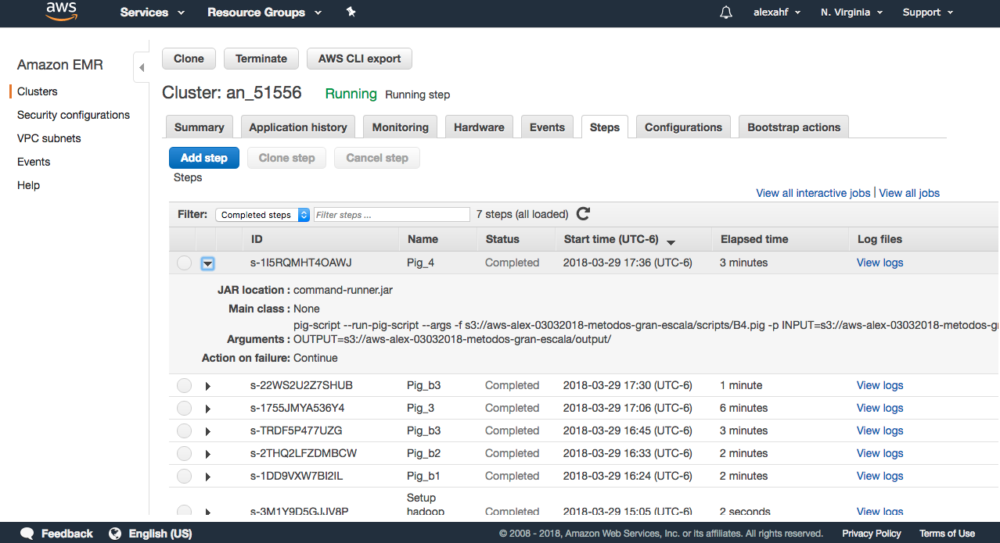

Archivo Script: script_pig_B4.pig
Archivo de salida: pig_b_4.csv


### B.5
__¿Cuántas veces por año hemos estado con $NO_{x}$ entre la Fase I y la Fase II de contingencia ambiental? (entre 191 y 239 -inclusive-) Promedia el contaminante por día__

Para este ejercicio se utilizó el contaminante $NO_X$ haciendo uso de la ecuación de transformación a IMECA de NO2, es decir; la ecuación simplificada: $0.001*C[NO_X]*100/0.21$, donde $C[NO_X]$ es la concentración de $NO_X$.

Por otro lado, utilizando el promedio del contaminante por día se obtienen cero resultados, razón por la cual se utilizó el máximo por dia.

Considerando lo anterior, se obtuvo que hemos estado entre la Fase I y Fase II el siguiente número de veces:

```{r,eval=FALSE}
year,fase1_fase2
1986,26
1987,28
1988,13
1989,23
1990,26
1991,16
1992,28
1993,79
1994,81
1995,89
1996,152
1997,145
1998,101
1999,69
2000,102
2001,45
2002,38
2003,35
2004,36
2005,46
2006,42
2007,28
2008,32
2009,26
2010,24
2011,29
2012,33
2013,39
2014,20
2015,14
2016,22
2017,26

```


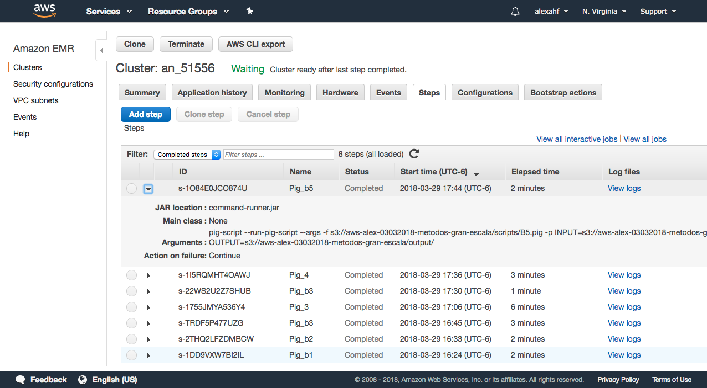

Archivo Script: script_pig_B5.pig
Archivo de salida: pig_b_5.csv


Hive (C)

**Nota.- para estos ejercicios se procesa la información de la siguiente manera se juntan todos los** **archivos en 1 solo es decir contaminantes_1986 a contaminantes_2017 y este archivo se nombra como contaminantes.csv, posterior para los registros con fecha 31/12/2017 24:00 se eliminan dela base dado que estos registros en realidad pertenecen a la fecha 01/01/2018 entonces se eliminan 241 registros y se crea la base contaminantesf con este query:**

```{r eval=FALSE} 
create table contaminantesf as select*from contaminantes where year(from_unixtime(unix_timestamp(`date`,'dd/MM/yyyy HH:mm')))!=2018;

```

**y sobre esta base se hacen las consultas para responder las preguntas:**

C.1 ¿En qué hora (solo hora, en formato 0-23) del día normalmente hay picos por contaminante/mes? ¡Incluir la unidad del contaminante! (catálogo de unidades) Por ejemplo:
|contaminante|mes|hora|valor|unidad| |:-----|:-----|:------|:----| |CO|enero|8|0.8|partes por millon| |NO|enero|10|1|pates por billon|


```{r}
library(readr)
respc1 <- read_csv('./hive/hive_C_1.csv',col_names=TRUE)
kable(respc1)
```

evidencia C1 HUE:

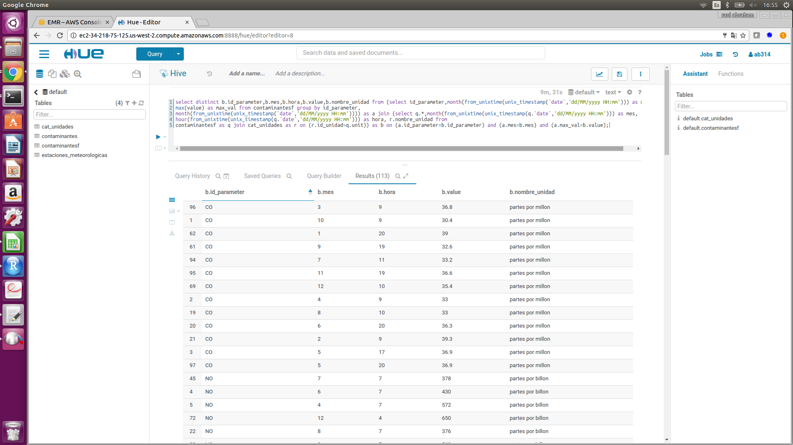

Archivo hql: /hive/script_hive_C1.hql
Archivo de salida: /hive/hive_C_1.csv


**Nota- para preguntas 2 y 3 se utilizó el mΰaximo por dΰia en vez del promedio ya que este hace más sentido y además en datos el promedio no daba nada, además para promediar no se tomaron en cuenta los valres nulos**

C.2 ¿Cuántas veces por año hemos estado con $O_{3}$ entre la Fase I y la Fase II de contingencia ambiental? (entre 191 y 239 -inclusive-) Promedia el contaminante por día


```{r}
library(readr)
respc2 <- read_csv('./hive/hive_C_2.csv',col_names=TRUE)
kable(respc2)
```

evidencia C2 HUE:

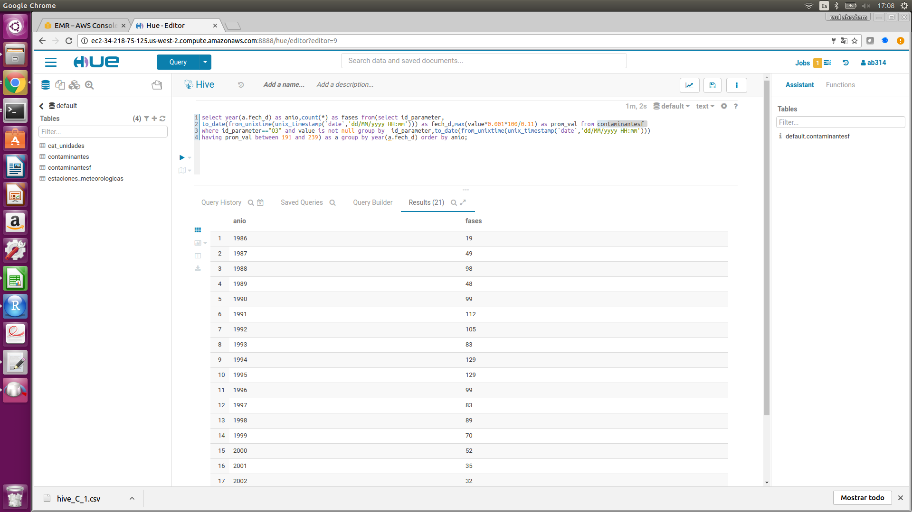

Archivo hql: /hive/script_hive_C2.hql
Archivo de salida: /hive/hive_C_2.csv


C.3 ¿Cuántas veces por año hemos estado con $SO_{2}$ entre la Fase I y la Fase II de contingencia ambiental? (entre 191 y 239 -inclusive-) Promedia el contaminante por día 


```{r}
library(readr)
respc3 <- read_csv('./hive/hive_C_3.csv',col_names=TRUE)
kable(respc3)
```

evidencia C3 HUE:

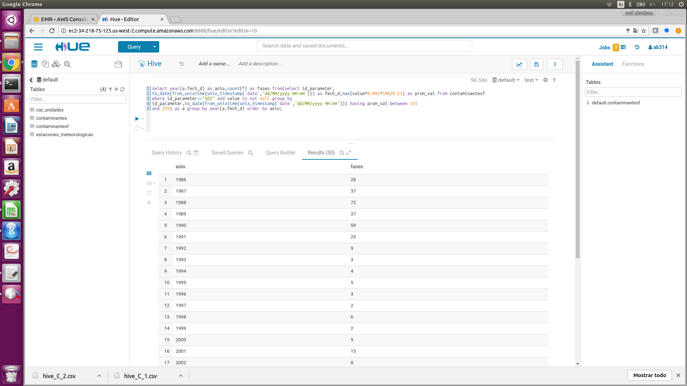

Archivo hql: /hive/script_hive_C3.hql
Archivo de salida: /hive/hive_C_3.csv


C.4 De acuerdo a la definición del índice IMECA (pag 6 pdf) ¿Cuántas veces y cuáles veces hemos estado en un nivel IMECA malo para $PM_{2.5}$? Promedia el contaminante por día

Para que $PM_{2.5}$ sea tomado como malo su valor debe estar entre 40.5 y 65.4 equivalente al rango de 101-150 imecas segun el pdf.
son 378 y son los sguientes:

```{r}
library(readr)
respc4 <- read_csv('./hive/hive_C_4.csv',col_names=TRUE,col_types =cols(
  id_parameter = col_character(),
  fech_d = col_character(),
  prom_val = col_double()
))
kable(respc4)
```

evidencia C4 HUE:

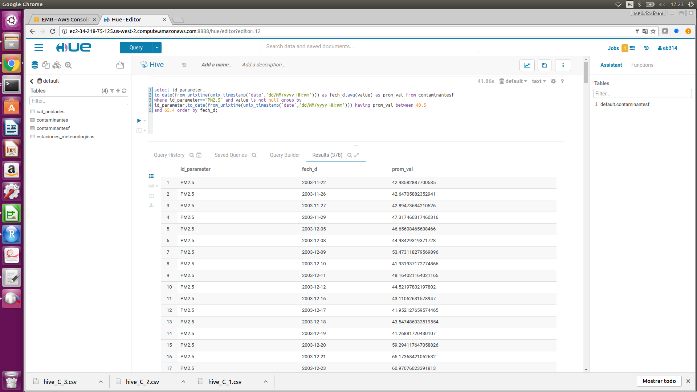

Archivo hql: /hive/script_hive_C4_cuantos.hql, /hive/script_hive_C4_cuales.hql
Archivo de salida: /hive/hive_C_4.csv


C.5 De acuerdo a la definición del índice IMECA (pag 6 pdf) ¿Cuántas veces y cuáles veces hemos estado en un nivel IMECA malo para $PM_{10}$? Promedia el contaminante por día 

han sido 72 veces, recordar que para que el nivel sea considerado malo debe ser entre los valores 121 y
220 para $PM_{10}$, equivalente al rango de 101-150 imecas segun el pdf.


```{r}
library(readr)
respc5 <- read_csv('./hive/hive_C_5.csv',col_names=TRUE,col_types =cols(
  id_parameter = col_character(),
  fech_d = col_character(),
  prom_val = col_double()
) )
kable(respc5)
```

evidencia C5 HUE:

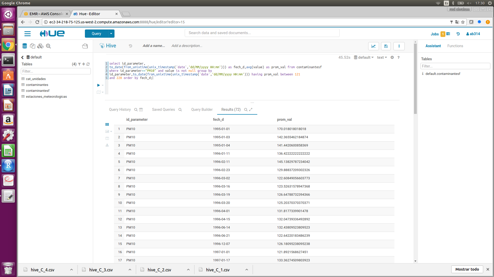


Archivo hql: /hive/script_hive_C5_cuantos.hql, /hive/script_hive_C5_cuales.hql
Archivo de salida: /hive/hive_C_5.csv


### Levantamiento de tecnologías
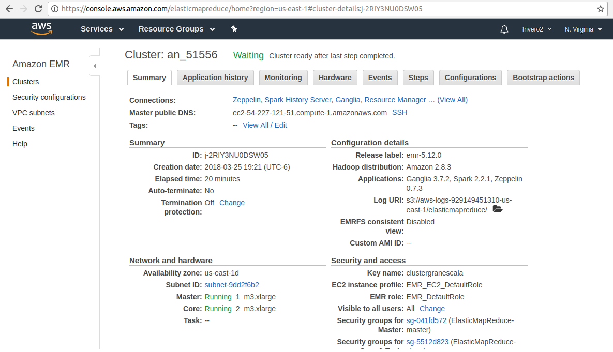


Para el presente ejercicio levantamos un cluster en AWS con 3 nodos. (Con Spark y Zeppelin por supuesto)


Y después montamos zeppelin desde nuestro navegador abriendo un "canal" vía la terminal.


Y cargamos los datos (vía S3 primero).

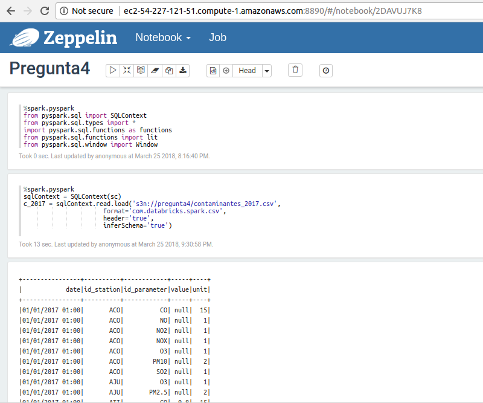


### D.1 Realiza un pequeño profiling a los datos por métrica/año indicando: min, max, mean, approximateQuantiles, desviación estándar, número de datos sin registro (nulos, vacíos). 

Para éste ejercicio, hicimos uso de la programación funcional y la recursión de Spark/Pyspark/Python y cargamos todo en una sola 'linea de comando' a un dataframe de pandas, ordenado primero por parámetro (métrica) y luego por año agregando minimo, maximo, media, cuantiles, desviación y nulos . Aquí la imagen preliminar del output:
**El código de la consulta está en el archivo 

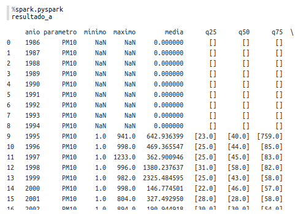

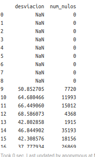


Y luego guardamos el output en archivos distribuídos:

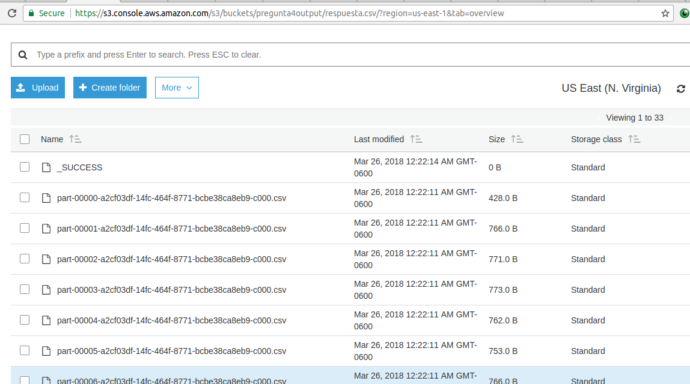

Archivo script: pyspark/script_spark_1.py
Archivo de salida: pyspark/output_a


### D.2 ¿Existe evidencia que sugiera que el metrobus ayudó a reducir contaminantes en ciertas estaciones meteorológicas? (No hace falta construir un modelo, qué nos dice la estadística descriptiva??)

Se corrió la consulta para almacenar los resultados por sucursal y contaminante en los años 2005, 2006 y 2007 para ver qué contaminantes bajaban en qué sucursales y así poder <b>sospechar</b> de alguna mejora, más no concluír.

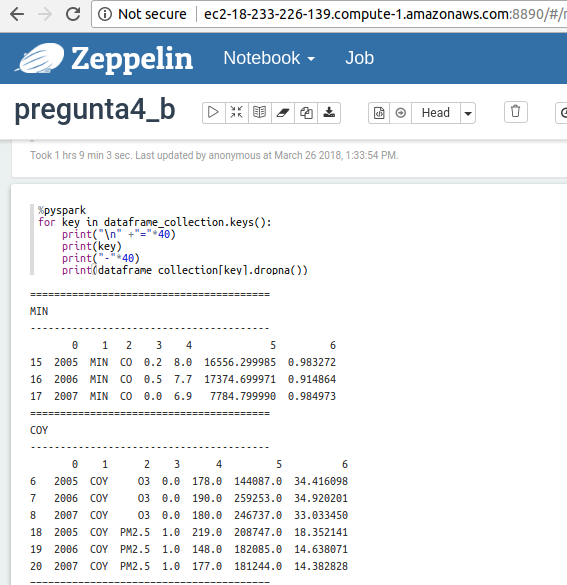

### Los resultados para cada estación fueron los siguientes:

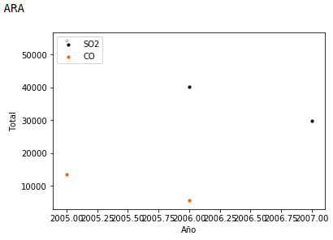

Podemos ver que SO2 y CO2 presentan evidencia de decrecimiento en estación: ARA.

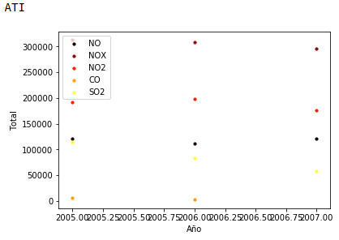

Podemos ver que SO2 presenta evidencia de decrecimiento en estación: **ATI**.

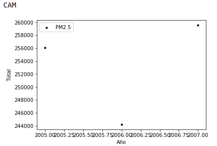

Podemos ver que no hay evidencia de decrecimiento en estación: **CAM**.

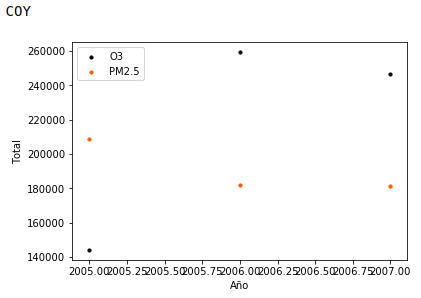

Podemos ver que hay evidencia de decrecimiento en PM2.5 en estación: **COY**.

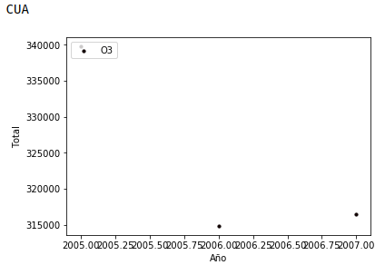

Podemos ver que hay evidencia de decrecimiento de O3 en estación: CUA.

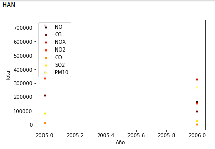

Podemos ver que hay evidencia de decrecimiento de PM10, NO2, O3 y NOX en estación: **HAN**.

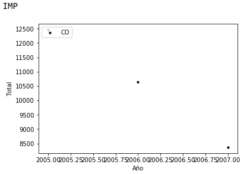

Podemos ver que hay evidencia de decrecimiento de CO en estación: **IMP**.


Podemos ver que No hay evidencia en estación: **LAG**.

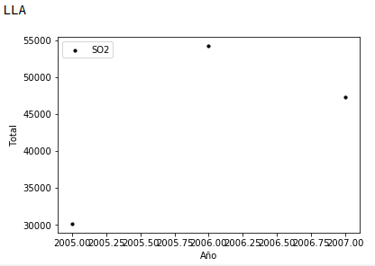

Podemos ver que no hay evidencia en estación: **LLA**.

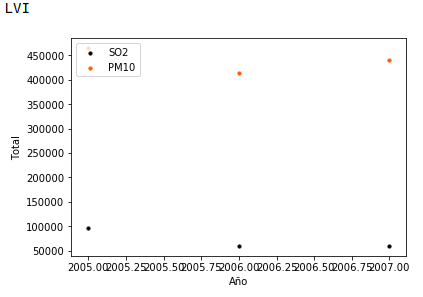

Podemos ver que hay ligera eviencia en SO2 en estación: **LVI**.

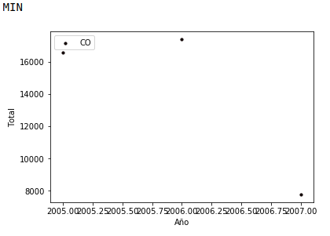

Podemos ver que no hay evidencia en estación: **MIN**.

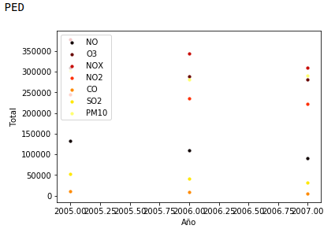

Podemos ver que hay ligera evidencia en NO y NO2 en estación: **PED**.

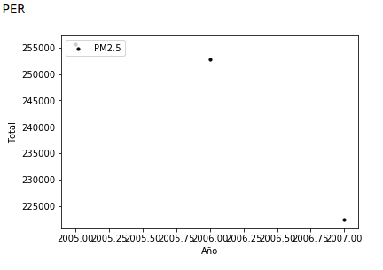

Podemos ver que hay ligera evidencia en PM2.5 en estación: **PER**.

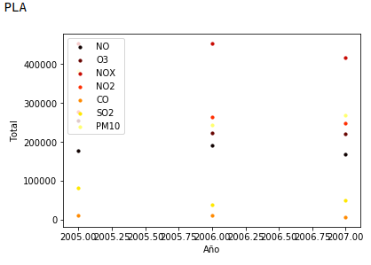

Podemos ver que hay ligera evidencia en NOX en estación: **PLA**.

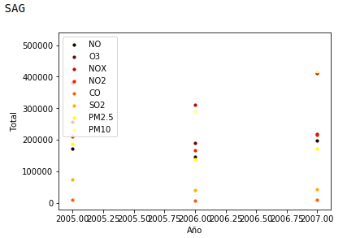

Podemos ver que hay ligera evidencia en NOX en estación: **SAG**.

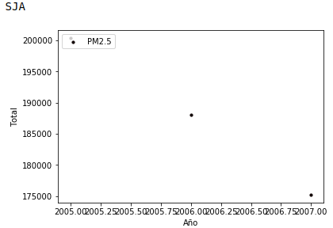

Podemos ver que hay clara evidencia en PM2.5 en estación: **SJA**.

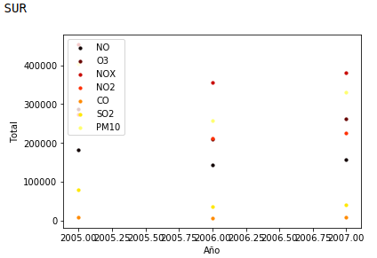

Podemos ver que no hay evidencia en estación: **SUR**.

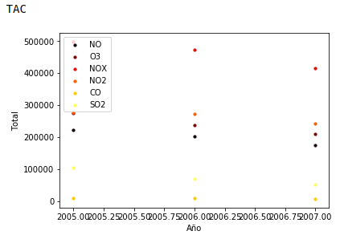

Podemos ver que hay ligera evidencia en todas excepto CO en estación: **TAC**.

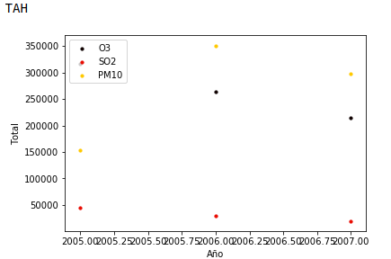

Podemos ver que hay ligera evidencia en O3 en estación: **TAH**.

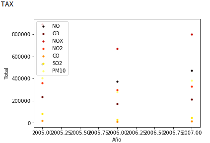


Podemos ver que no hay evidencia en estación: **TAX**.

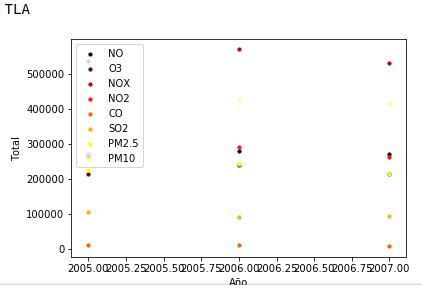


Podemos ver que No hay evidencia en estación: **TLA**.

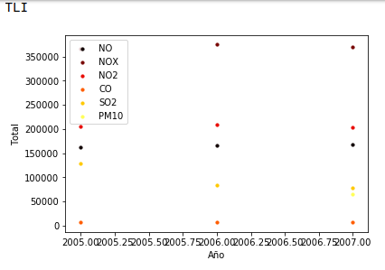


Podemos ver que hay ligera evidencia en SO2 y PM10 en estación: **TLI**.

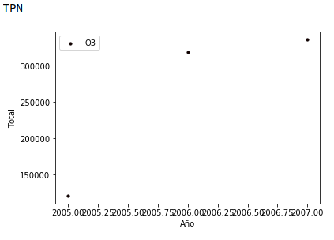


Podemos ver que NO hay  evidencia en estación: **TPN**.

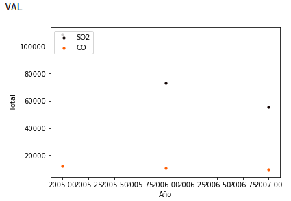


Podemos ver que hay ligera evidencia en SO2 en estación: **VAL.

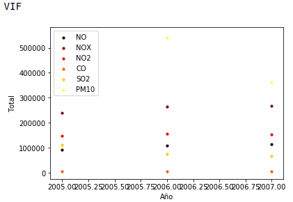


Podemos ver que hay ligera evidencia en PM10 en estación: **VIF**.

Archivo script: pyspark/script_spark_2.py
Archivo de salida: 

### Conclusión: 
Se sugiere un estudio más profundo en donde se encontró evidencia de que fué el metrobús. Lo primero sería descartar las estaciones que no son geográficamente relevantes. Después sería revisar por meses dónde fueron los cambios para comparar con aperturas de diferentes partes del metrobús. En principio parece que podría haber influencia del metrobús en algunas métricas para algunos parámetros.


### D.3 ¿Cuál es el contaminante que ha tenido mayor descenso con el paso del tiempo? Obtén el promedio por métrica del día (todas las estaciones), luego genera un lag por día, luego saca el promedio del lag por contaminante, selecciona el que tenga mayor lag.  →→  ordena de 1986 a 2017!

El contaminante con mayor descenso en el paso del tiempo es **NOX**:

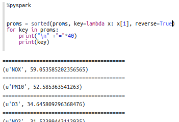


Archivo script: pyspark/script_spark_3.py
Archivo de salida: 

### D.4 De acuerdo al histórico de PM2.5 ¿cuál es el mes del año en el que se pone peor?

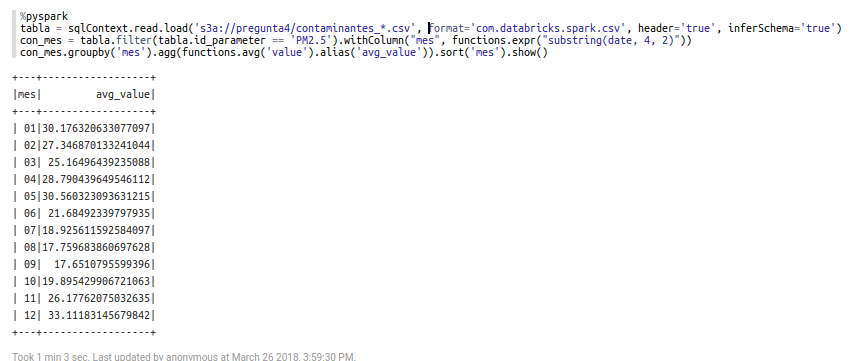


De acuerdo a su histórico, las temporadas del año cuando se pone peor son **Mayo*</b>** y **Diciembre/Enero**. Por un lado Diciembre es fácil de explicar por la alta cantidad de tráfico generada por consumo de fin de año, pero en Mayo es una interrogante que habría que investigar más a fondo. 

Archivo script: pyspark/script_spark_4.py
Archivo de salida:

### D.5 ¿En qué horario/mes evitarías irte en Ecobici a cualquier lugar de acuerdo al histórico de mediciones de PM2.5?

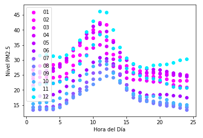

Definitivamente y sin lugar a futura discusión, a mediodía, esto es; entre 11:00 y 12:00 de la mañana, cualquier mes del año y cualquier horario entre más alejado de éste mejor. Los meses nos hablan de que Invierno es lo peor y verano-otoño lo menos grave.

Archivo script: pyspark/script_spark_5.py
Archivo de salida:


**Reflexiones**


**Conclusiones**

En 2007 y 2015 son los años donde más estaciones meteorológicas han habido
La estación meteorológica con más  registros, en el Estado de México es FAC con  casi
1.5mill de registros aunque el 13% de estos son nulos o s no se tomo registro.

A las 7 Hrs. es cuando es mas frecuencia de picos encontramos y paticularmente estos son con Monóxido de nitrógeno y Óxidos de nitrógeno.
Eaño donde más veces hemos estado entre fase 1 y 2 de contingencia por Ozono fue 1994 y 95, análogamente para Dióxido de nitrógeno esto se presentó más veces en 1988.
