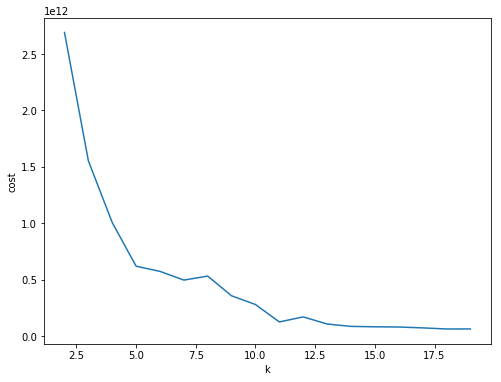

# Spark (SQL y ML)

## Cluster

Para la realización de la parte de Spark se creó un cluster de 3 nodos:


## Código:

A continuación se presenta el código para responder cada pregunta con el output visible. Por otra parte, los archivos ".parquet" se encuentran en las carpetas respectivas de outputs.


```python
from pyspark.sql import SQLContext
from pyspark.sql.types import *
import pyspark.sql.functions as functions
from pyspark.sql.functions import desc
from pyspark.sql.functions import col
import pandas as pd
import numpy as np
from pyspark.sql.functions import lit
import matplotlib.pyplot as plt
%matplotlib inline
```

## Carga de Datos


```python
sqlContext = SQLContext(sc)

# DATOS DE DEFUNCIONES EN MEXICO
defun_2016 = sqlContext.read.load('datos/defun_2016.csv', 
                      format='com.databricks.spark.csv', 
                      header='true', 
                      inferSchema='true')

# DICCIONARIO DE DATOS
diccionario = sqlContext.read.load('datos/diccionario_datos_defun2016.csv', 
                      format='com.databricks.spark.csv', 
                      header='true', 
                      inferSchema='true')

# ENTIDADES DEL PAIS
decateml = sqlContext.read.load('datos/decateml.csv', 
                      format='com.databricks.spark.csv', 
                      header='true', 
                      inferSchema='true')

# CAUSA DEL DECESO
decatcausa = sqlContext.read.load('datos/decatcausa.csv', 
                      format='com.databricks.spark.csv', 
                      header='true', 
                      inferSchema='true')

# EDAD
deedad = sqlContext.read.load('datos/deedad.csv', 
                      format='com.databricks.spark.csv', 
                      header='true', 
                      inferSchema='true')

# SEXO
desexo = sqlContext.read.load('datos/desexo.csv', 
                      format='com.databricks.spark.csv', 
                      header='true', 
                      inferSchema='true')

```

# Preguntas SparkSQL

### a. ¿Cuántos casos de defunción por Hepatitis A hay por entidad? (B150, B159) ordena la salida de forma descendente por número de decesos.<br>


```python
defun_2016.select("causa_def","ent_ocurr").filter((defun_2016.causa_def == 'B150') | (defun_2016.causa_def == 'B159')).groupby('ent_ocurr').agg(functions.count('causa_def').alias('cuenta')).sort(desc("cuenta")).join(decateml.filter((decateml.cve_mun == 0) & (decateml.cve_loc == 0)),defun_2016.ent_ocurr == decateml.cve_ent).select("cuenta","nom_loc").show()
```

    +------+--------------------+
    |cuenta|             nom_loc|
    +------+--------------------+
    |     5|Veracruz de Ignac...|
    |     5|    Ciudad de México|
    |     4|             Jalisco|
    |     3|             Chiapas|
    |     3|              Oaxaca|
    |     3|              México|
    |     2|             Nayarit|
    |     2|            Guerrero|
    |     1|            Campeche|
    |     1|             Yucatán|
    |     1|          Guanajuato|
    |     1|          Nuevo León|
    |     1|             Tabasco|
    |     1|             Durango|
    |     1|             Hidalgo|
    |     1| Michoacán de Ocampo|
    +------+--------------------+
    


### b. ¿Cuál es la 6ta causa de defunción por entidad y sexo para las personas de 53 años?

Se considera que la clave de la edad de 53 años es 4053. Se corre un ciclo para hombres y otro para mujeres (ambos de 53 años) y se despliegan los resultados por entidad.

### Ciclo para sexo = hombres


```python
hombres = {}
for entidad in decateml.filter((decateml.cve_mun == 0) & (decateml.cve_loc == 0)).select('nom_loc').distinct().rdd.flatMap(list).collect():
    un_resultado = defun_2016.select("causa_def","ent_ocurr","sexo","edad").filter(defun_2016.edad == '4053').join(decateml.filter((decateml.cve_mun == 0) & (decateml.cve_loc == 0)),defun_2016.ent_ocurr == decateml.cve_ent).select("sexo","nom_loc","causa_def").filter((col("sexo") == 1) & (col("nom_loc") == entidad)).groupby('causa_def').agg(functions.count('causa_def').alias('cuenta')).sort(desc('cuenta'))
    if(un_resultado.count()>0):
        hombres[entidad] = un_resultado.join((un_resultado.select("cuenta")
            .distinct()
            .orderBy(desc("cuenta"))
            .rdd
            .zipWithIndex()
            .map(lambda x: x[0] + (x[1], ))
            .toDF(["cuenta", "rank"])), ["cuenta"]).withColumn("rank", col("rank") + 1).orderBy("cuenta").filter(col("rank") < 7).join(decatcausa, decatcausa.CVE == col("causa_def")).select("DESCRIP", "cuenta", "rank")
```

### Resultados hombres (sexo = 1) de 53 años por entidad.
Las tablas tienen el "ranking" en forma descendiente, si hubo (o hubieron) sextos lugares los desliega, si no hubieron sextos lugares despliega el siguiente rank mas alto disponible por instrucciones de la maestra.


```python
for key in hombres.keys():
    print(key)
    print(hombres[key].show())
```

    Ciudad de México
    +--------------------+------+----+
    |             DESCRIP|cuenta|rank|
    +--------------------+------+----+
    |Otras cirrosis de...|    13|   6|
    |Diabetes mellitus...|    18|   5|
    |Cirrosis hepática...|    21|   4|
    |Diabetes mellitus...|    28|   3|
    |Diabetes mellitus...|    33|   2|
    |Infarto agudo del...|    63|   1|
    +--------------------+------+----+
    
    None
    Michoacán de Ocampo
    +--------------------+------+----+
    |             DESCRIP|cuenta|rank|
    +--------------------+------+----+
    |Agresión con disp...|     5|   6|
    |Trastornos mental...|     5|   6|
    |Diabetes mellitus...|     8|   5|
    |Diabetes mellitus...|     9|   4|
    |Otras cirrosis de...|    14|   3|
    |Cirrosis hepática...|    15|   2|
    |Infarto agudo del...|    18|   1|
    +--------------------+------+----+
    
    None
    Sinaloa
    +--------------------+------+----+
    |             DESCRIP|cuenta|rank|
    +--------------------+------+----+
    |Diabetes mellitus...|     1|   5|
    |Otros trastornos ...|     1|   5|
    |Insuficiencia res...|     1|   5|
    |Hepatitis viral n...|     1|   5|
    |Hemorragia subara...|     1|   5|
    |Secuelas de otros...|     1|   5|
    |Envenenamiento ac...|     1|   5|
    |Diabetes mellitus...|     1|   5|
    |Otros estrangulam...|     1|   5|
    |Diabetes mellitus...|     1|   5|
    |Anemia aplástica,...|     1|   5|
    |Agresión por medi...|     1|   5|
    |Otros trastornos ...|     1|   5|
    |Melanoma maligno ...|     1|   5|
    |Exposición al cal...|     1|   5|
    |Tuberculosis de p...|     1|   5|
    |Enfermedad renal ...|     1|   5|
    |Agresión con obje...|     1|   5|
    |Enfermedad cardía...|     1|   5|
    |Enfermedad cardio...|     1|   5|
    +--------------------+------+----+
    only showing top 20 rows
    
    None
    Durango
    +--------------------+------+----+
    |             DESCRIP|cuenta|rank|
    +--------------------+------+----+
    |Otras pancreatiti...|     1|   4|
    |Diabetes mellitus...|     1|   4|
    |Enfermedad renal ...|     1|   4|
    |Hemorragia subara...|     1|   4|
    |Infección de vías...|     1|   4|
    |Insuficiencia hep...|     1|   4|
    |Hemorragia intrae...|     1|   4|
    |Hidrocéfalo, no e...|     1|   4|
    |Bronconeumonía, n...|     1|   4|
    |Anemia aplástica,...|     1|   4|
    |Hipotiroidismo, n...|     1|   4|
    |Enfermedad cerebr...|     1|   4|
    |Otras obstruccion...|     1|   4|
    |Lesión autoinflig...|     1|   4|
    |Hepatitis alcohólica|     1|   4|
    |Lesión autoinflig...|     1|   4|
    |Tumor maligno del...|     1|   4|
    |Persona lesionada...|     1|   4|
    |Agresión por medi...|     1|   4|
    |Motociclista no e...|     1|   4|
    +--------------------+------+----+
    only showing top 20 rows
    
    None
    Guerrero
    +--------------------+------+----+
    |             DESCRIP|cuenta|rank|
    +--------------------+------+----+
    |Insuficiencia hep...|     3|   6|
    |Diabetes mellitus...|     3|   6|
    |Agresión con obje...|     3|   6|
    |Persona lesionada...|     3|   6|
    |Cirrosis hepática...|     3|   6|
    |Diabetes mellitus...|     5|   5|
    |Diabetes mellitus...|     8|   4|
    |Otras cirrosis de...|    11|   3|
    |Agresión con disp...|    14|   2|
    |Infarto agudo del...|    16|   1|
    +--------------------+------+----+
    
    None
    Chiapas
    +--------------------+------+----+
    |             DESCRIP|cuenta|rank|
    +--------------------+------+----+
    |Neumonía, no espe...|     5|   6|
    |Trastornos mental...|     5|   6|
    |Diabetes mellitus...|     6|   5|
    |Diabetes mellitus...|     6|   5|
    |Diabetes mellitus...|     7|   4|
    |Diabetes mellitus...|    10|   3|
    |Otras cirrosis de...|    14|   2|
    |Cirrosis hepática...|    14|   2|
    |Infarto agudo del...|    17|   1|
    +--------------------+------+----+
    
    None
    Guanajuato
    +--------------------+------+----+
    |             DESCRIP|cuenta|rank|
    +--------------------+------+----+
    |Diabetes mellitus...|     9|   6|
    |Diabetes mellitus...|    12|   5|
    |Cirrosis hepática...|    13|   4|
    |Otras cirrosis de...|    16|   3|
    |Diabetes mellitus...|    19|   2|
    |Infarto agudo del...|    22|   1|
    +--------------------+------+----+
    
    None
    Hidalgo
    +--------------------+------+----+
    |             DESCRIP|cuenta|rank|
    +--------------------+------+----+
    |Enfermedad pulmon...|     3|   6|
    |Enfermedad pulmon...|     4|   5|
    |Diabetes mellitus...|     4|   5|
    |Diabetes mellitus...|     6|   4|
    |Otras cirrosis de...|     7|   3|
    |Cirrosis hepática...|     9|   2|
    |Infarto agudo del...|    18|   1|
    +--------------------+------+----+
    
    None
    Nayarit
    +--------------------+------+----+
    |             DESCRIP|cuenta|rank|
    +--------------------+------+----+
    |Diabetes mellitus...|     1|   4|
    |Diabetes mellitus...|     1|   4|
    |Diabetes mellitus...|     1|   4|
    |Hemorragia intrae...|     1|   4|
    |Mordedura o ataqu...|     1|   4|
    |Agresión con disp...|     1|   4|
    |Tumor maligno del...|     1|   4|
    |   Coma mixedematoso|     1|   4|
    |Otros tipos de ob...|     1|   4|
    |Diabetes mellitus...|     1|   4|
    |Ocupante no espec...|     1|   4|
    |Cirrosis hepática...|     1|   4|
    |Hemorragia subdur...|     1|   4|
    |Hiperlipidemia no...|     1|   4|
    |Exposición a fact...|     1|   4|
    |Diabetes mellitus...|     1|   4|
    |Accidente vascula...|     1|   4|
    |Conductor de auto...|     1|   4|
    |Trastornos mental...|     1|   4|
    |Colitis ulcerativ...|     1|   4|
    +--------------------+------+----+
    only showing top 20 rows
    
    None
    Coahuila de Zaragoza
    +--------------------+------+----+
    |             DESCRIP|cuenta|rank|
    +--------------------+------+----+
    |Diabetes mellitus...|     4|   6|
    |Diabetes mellitus...|     5|   5|
    |Diabetes mellitus...|     6|   4|
    |Diabetes mellitus...|     7|   3|
    |Otras cirrosis de...|     9|   2|
    |Infarto agudo del...|    16|   1|
    +--------------------+------+----+
    
    None
    Chihuahua
    +--------------------+------+----+
    |             DESCRIP|cuenta|rank|
    +--------------------+------+----+
    |Lesión autoinflig...|     5|   6|
    |Diabetes mellitus...|     6|   5|
    |Neumonía, no espe...|     7|   4|
    |Cirrosis hepática...|     9|   3|
    |Otras cirrosis de...|    18|   2|
    |Infarto agudo del...|    25|   1|
    +--------------------+------+----+
    
    None
    Morelos
    +--------------------+------+----+
    |             DESCRIP|cuenta|rank|
    +--------------------+------+----+
    |Tumor maligno de ...|     2|   6|
    |Enfermedad renal ...|     2|   6|
    |Insuficiencia hep...|     2|   6|
    |Tumor maligno del...|     2|   6|
    |Otras cirrosis de...|     2|   6|
    |Exposición a fact...|     2|   6|
    |Agresión con disp...|     2|   6|
    |Insuficiencia hep...|     3|   5|
    |Diabetes mellitus...|     3|   5|
    |Neumonía, no espe...|     4|   4|
    |Agresión con disp...|     5|   3|
    |Diabetes mellitus...|     5|   3|
    |Cirrosis hepática...|     8|   2|
    |Infarto agudo del...|    10|   1|
    +--------------------+------+----+
    
    None
    Veracruz de Ignacio de la Llave
    +--------------------+------+----+
    |             DESCRIP|cuenta|rank|
    +--------------------+------+----+
    |Neumonía, no espe...|     6|   6|
    |Exposición a fact...|     6|   6|
    |Diabetes mellitus...|     8|   5|
    |Diabetes mellitus...|     8|   5|
    |Trastornos mental...|     8|   5|
    |Diabetes mellitus...|    12|   4|
    |Diabetes mellitus...|    12|   4|
    |Otras cirrosis de...|    23|   3|
    |Cirrosis hepática...|    23|   3|
    |Diabetes mellitus...|    27|   2|
    |Infarto agudo del...|    46|   1|
    +--------------------+------+----+
    
    None
    Yucatán
    +--------------------+------+----+
    |             DESCRIP|cuenta|rank|
    +--------------------+------+----+
    |Diabetes mellitus...|     2|   6|
    |Tumor maligno de ...|     2|   6|
    |Otras enfermedade...|     2|   6|
    |Cirrosis hepática...|     2|   6|
    |Enfermedad isquém...|     2|   6|
    |Tumor maligno del...|     2|   6|
    |Diabetes mellitus...|     3|   5|
    |Tumor maligno del...|     3|   5|
    |Diabetes mellitus...|     4|   4|
    |Insuficiencia hep...|     5|   3|
    |Otras cirrosis de...|     8|   2|
    |Infarto agudo del...|    10|   1|
    +--------------------+------+----+
    
    None
    Colima
    +--------------------+------+----+
    |             DESCRIP|cuenta|rank|
    +--------------------+------+----+
    |Hemorragia subara...|     1|   3|
    |Enfermedad renal ...|     1|   3|
    |Agresión con disp...|     1|   3|
    |Insuficiencia hep...|     1|   3|
    |Infección de vías...|     1|   3|
    |Tumor maligno de ...|     1|   3|
    |  Absceso del hígado|     1|   3|
    |Enfermedad pulmon...|     1|   3|
    |Gastritis crónica...|     1|   3|
    |Ahogamiento y sum...|     1|   3|
    |Agresión por ahor...|     1|   3|
    |Otras obstruccion...|     1|   3|
    |Tumor maligno de ...|     1|   3|
    |Neumonía, no espe...|     1|   3|
    |Agresión por medi...|     1|   3|
    |Enfermedad por VI...|     1|   3|
    |Diabetes mellitus...|     1|   3|
    |Persona lesionada...|     1|   3|
    |Tumor maligno de ...|     1|   3|
    |Enfermedad del hí...|     1|   3|
    +--------------------+------+----+
    only showing top 20 rows
    
    None
    Campeche
    +--------------------+------+----+
    |             DESCRIP|cuenta|rank|
    +--------------------+------+----+
    |Ocupante (cualqui...|     1|   3|
    |Caída no especifi...|     1|   3|
    |Diabetes mellitus...|     1|   3|
    |Otras caídas de u...|     1|   3|
    |Tumor maligno de ...|     1|   3|
    |Tumor maligno del...|     1|   3|
    |Diabetes mellitus...|     1|   3|
    |Trastorno fibrobl...|     1|   3|
    |Lesión autoinflig...|     1|   3|
    |Neumonía, no espe...|     1|   3|
    |Disparo de rifle,...|     1|   3|
    |Epilepsia, tipo n...|     1|   3|
    |Diabetes mellitus...|     1|   3|
    |Lesión autoinflig...|     1|   3|
    |Insuficiencia hep...|     1|   3|
    |Otras cirrosis de...|     1|   3|
    |Hemorragia subdur...|     1|   3|
    |Agresión por ahor...|     1|   3|
    |Embolia pulmonar ...|     1|   3|
    |Ahogamiento y sum...|     1|   3|
    +--------------------+------+----+
    only showing top 20 rows
    
    None
    Tabasco
    +--------------------+------+----+
    |             DESCRIP|cuenta|rank|
    +--------------------+------+----+
    |Tumor maligno de ...|     3|   6|
    |Linfoma no Hodgki...|     3|   6|
    |Tumor maligno del...|     3|   6|
    |Enfermedad renal ...|     4|   5|
    |Diabetes mellitus...|     4|   5|
    |Diabetes mellitus...|     5|   4|
    |Cirrosis hepática...|     5|   4|
    |Peatón lesionado ...|     6|   3|
    |Diabetes mellitus...|     6|   3|
    |Otras cirrosis de...|     8|   2|
    |Infarto agudo del...|    12|   1|
    +--------------------+------+----+
    
    None
    Oaxaca
    +--------------------+------+----+
    |             DESCRIP|cuenta|rank|
    +--------------------+------+----+
    |Agresión con disp...|     5|   6|
    |Otras cirrosis de...|     5|   6|
    |Diabetes mellitus...|     6|   5|
    |Trastornos mental...|     6|   5|
    |Diabetes mellitus...|     7|   4|
    |Diabetes mellitus...|     8|   3|
    |Infarto agudo del...|    11|   2|
    |Cirrosis hepática...|    13|   1|
    +--------------------+------+----+
    
    None
    San Luis Potosí
    +--------------------+------+----+
    |             DESCRIP|cuenta|rank|
    +--------------------+------+----+
    |Insuficiencia ren...|     1|   6|
    |Conductor ciclist...|     1|   6|
    |Diabetes mellitus...|     1|   6|
    |Insuficiencia hep...|     1|   6|
    |Hemorragia subara...|     1|   6|
    |Agresión con disp...|     1|   6|
    |Nefritis tubuloin...|     1|   6|
    |Tumor maligno de ...|     1|   6|
    |Cardiomiopatía di...|     1|   6|
    |Hemorragia intrae...|     1|   6|
    |  Colecistitis aguda|     1|   6|
    |Linfoma no Hodgki...|     1|   6|
    |Otras obstruccion...|     1|   6|
    |Envenenamiento ac...|     1|   6|
    |Otras caídas en e...|     1|   6|
    |Tumor maligno del...|     1|   6|
    |Enfermedad renal ...|     1|   6|
    |Pancreatitis agud...|     1|   6|
    |Persona lesionada...|     1|   6|
    |Neumonía, no espe...|     1|   6|
    +--------------------+------+----+
    only showing top 20 rows
    
    None
    Aguascalientes
    +--------------------+------+----+
    |             DESCRIP|cuenta|rank|
    +--------------------+------+----+
    |Gastroenteritis y...|     1|   3|
    |Otras formas de e...|     1|   3|
    |Envenenamiento au...|     1|   3|
    | Hipertensión portal|     1|   3|
    |Enfermedad pulmon...|     1|   3|
    |Otras gastroenter...|     1|   3|
    |Lesión autoinflig...|     1|   3|
    |Tumor maligno del...|     1|   3|
    |Tumor maligno del...|     1|   3|
    |Tumor maligno del...|     1|   3|
    |Pancreatitis agud...|     1|   3|
    |Enfermedad cardio...|     1|   3|
    |Otros tipos de ob...|     1|   3|
    |Caída desde, fuer...|     1|   3|
    |Persona lesionada...|     1|   3|
    |Parálisis cerebra...|     1|   3|
    |Otros trastornos ...|     1|   3|
    |Diabetes mellitus...|     1|   3|
    |Ocupante no espec...|     1|   3|
    |Cirrosis hepática...|     1|   3|
    +--------------------+------+----+
    only showing top 20 rows
    
    None
    Baja California Sur
    +--------------------+------+----+
    |             DESCRIP|cuenta|rank|
    +--------------------+------+----+
    |Tumor maligno de ...|     1|   3|
    |Úlcera gástrica, ...|     1|   3|
    |Lesión autoinflig...|     1|   3|
    |Agresión con disp...|     1|   3|
    |Tumor maligno del...|     1|   3|
    |Lesión autoinflig...|     1|   3|
    |Tuberculosis de p...|     1|   3|
    |Desnutrición prot...|     1|   3|
    |Neumonía, no espe...|     1|   3|
    |Epilepsia, tipo n...|     1|   3|
    |Disección de aort...|     1|   3|
    |Diabetes mellitus...|     1|   3|
    |Otras formas de e...|     1|   3|
    |Agresión con obje...|     1|   3|
    |Otras cirrosis de...|     1|   3|
    |Cirrosis hepática...|     1|   3|
    |Enfermedad divert...|     1|   3|
    |Otras enfermedade...|     1|   3|
    |Víctima de tormen...|     1|   3|
    |Enfermedad reumát...|     1|   3|
    +--------------------+------+----+
    only showing top 20 rows
    
    None
    Puebla
    +--------------------+------+----+
    |             DESCRIP|cuenta|rank|
    +--------------------+------+----+
    |Insuficiencia hep...|     7|   6|
    |Diabetes mellitus...|     7|   6|
    |Diabetes mellitus...|     8|   5|
    |Diabetes mellitus...|    13|   4|
    |Otras cirrosis de...|    13|   4|
    |Cirrosis hepática...|    21|   3|
    |Diabetes mellitus...|    24|   2|
    |Infarto agudo del...|    29|   1|
    +--------------------+------+----+
    
    None
    Nuevo León
    +--------------------+------+----+
    |             DESCRIP|cuenta|rank|
    +--------------------+------+----+
    |Diabetes mellitus...|     6|   6|
    |Tumor maligno del...|     7|   5|
    |Neumonía, no espe...|     8|   4|
    |Otras cirrosis de...|    10|   3|
    |Diabetes mellitus...|    11|   2|
    |Infarto agudo del...|    29|   1|
    +--------------------+------+----+
    
    None
    Tamaulipas
    +--------------------+------+----+
    |             DESCRIP|cuenta|rank|
    +--------------------+------+----+
    |Diabetes mellitus...|     6|   6|
    |Diabetes mellitus...|     7|   5|
    |Diabetes mellitus...|     8|   4|
    |Diabetes mellitus...|    12|   3|
    |Otras cirrosis de...|    14|   2|
    |Infarto agudo del...|    35|   1|
    +--------------------+------+----+
    
    None
    Zacatecas
    +--------------------+------+----+
    |             DESCRIP|cuenta|rank|
    +--------------------+------+----+
    |Tumor maligno de ...|     1|   3|
    |Enfermedad renal ...|     1|   3|
    |Hipercolesterolem...|     1|   3|
    |Diabetes mellitus...|     1|   3|
    |Hemorragia intrae...|     1|   3|
    |Envenenamiento ac...|     1|   3|
    |Lesión autoinflig...|     1|   3|
    |Enfermedad renal ...|     1|   3|
    |Conductor de cami...|     1|   3|
    |Ocupante no espec...|     1|   3|
    |Neumonía, no espe...|     1|   3|
    |Endocarditis, vál...|     1|   3|
    |Motociclista no e...|     1|   3|
    |Tumor maligno del...|     1|   3|
    |Ahogamiento y sum...|     1|   3|
    |Absceso del pulmó...|     1|   3|
    |Tumor de comporta...|     1|   3|
    |Diabetes mellitus...|     1|   3|
    |Tumor maligno de ...|     1|   3|
    |Conductor de cami...|     1|   3|
    +--------------------+------+----+
    only showing top 20 rows
    
    None
    Tlaxcala
    +--------------------+------+----+
    |             DESCRIP|cuenta|rank|
    +--------------------+------+----+
    |Perforación del i...|     1|   4|
    |Insuficiencia car...|     1|   4|
    |Diabetes mellitus...|     1|   4|
    |Insuficiencia hep...|     1|   4|
    |Diabetes mellitus...|     1|   4|
    |Secuelas de accid...|     1|   4|
    |Diabetes mellitus...|     1|   4|
    |Agresión con obje...|     1|   4|
    |Fascitis necrotiz...|     1|   4|
    |Enfermedad cerebr...|     1|   4|
    |Agresión con disp...|     1|   4|
    |Neumonía, no espe...|     1|   4|
    |Tumor maligno de ...|     1|   4|
    |Enfermedad renal ...|     1|   4|
    |Exposición a fact...|     1|   4|
    |Diabetes mellitus...|     1|   4|
    |Tumor maligno del...|     1|   4|
    |    Mieloma múltiple|     1|   4|
    |Muerte sin asiste...|     1|   4|
    |Agresión con disp...|     1|   4|
    +--------------------+------+----+
    only showing top 20 rows
    
    None
    Querétaro
    +--------------------+------+----+
    |             DESCRIP|cuenta|rank|
    +--------------------+------+----+
    |Insuficiencia hep...|     1|   6|
    |Motociclista no e...|     1|   6|
    |Peatón lesionado ...|     1|   6|
    |Diabetes mellitus...|     1|   6|
    |Gastritis crónica...|     1|   6|
    |Diabetes mellitus...|     1|   6|
    |Hemorragia intrae...|     1|   6|
    |Hernia umbilical ...|     1|   6|
    |Linfoma no Hodgki...|     1|   6|
    |Hepatitis alcohólica|     1|   6|
    |Agresión con disp...|     1|   6|
    |Lesión autoinflig...|     1|   6|
    |Tumor maligno de ...|     1|   6|
    |Enfermedad renal ...|     1|   6|
    |Lesión autoinflig...|     1|   6|
    |Otras enfermedade...|     1|   6|
    |Agresión por medi...|     1|   6|
    |Úlcera duodenal, ...|     1|   6|
    |Trastornos mental...|     1|   6|
    |Enfermedad por VI...|     1|   6|
    +--------------------+------+----+
    only showing top 20 rows
    
    None
    Jalisco
    +--------------------+------+----+
    |             DESCRIP|cuenta|rank|
    +--------------------+------+----+
    |Neumonía, no espe...|     8|   6|
    |Diabetes mellitus...|    10|   5|
    |Diabetes mellitus...|    13|   4|
    |Cirrosis hepática...|    14|   3|
    |Otras cirrosis de...|    16|   2|
    |Infarto agudo del...|    26|   1|
    +--------------------+------+----+
    
    None
    Quintana Roo
    +--------------------+------+----+
    |             DESCRIP|cuenta|rank|
    +--------------------+------+----+
    |Agresión con obje...|     1|   3|
    |Diabetes mellitus...|     1|   3|
    |Enfermedad por VI...|     1|   3|
    |Enfermedad renal ...|     1|   3|
    |Insuficiencia hep...|     1|   3|
    | Hipertensión portal|     1|   3|
    |Otras apendicitis...|     1|   3|
    |Persona lesionada...|     1|   3|
    |Insuficiencia hep...|     1|   3|
    |Agresión por ahor...|     1|   3|
    |Evento no especif...|     1|   3|
    |Tumor maligno de ...|     1|   3|
    |Diabetes mellitus...|     1|   3|
    |Persona lesionada...|     1|   3|
    |Insuficiencia hep...|     1|   3|
    |Sepsis, no especi...|     1|   3|
    |Exposición a fact...|     1|   3|
    |Estenosis (de la ...|     1|   3|
    |Ahogamiento y sum...|     1|   3|
    |Enfermedad isquém...|     1|   3|
    +--------------------+------+----+
    only showing top 20 rows
    
    None
    Sonora
    +--------------------+------+----+
    |             DESCRIP|cuenta|rank|
    +--------------------+------+----+
    |Ocupante no espec...|     1|   6|
    |Motociclista no e...|     1|   6|
    |Enfermedad por VI...|     1|   6|
    |Tumor maligno del...|     1|   6|
    |Malformación cong...|     1|   6|
    |Otras formas de e...|     1|   6|
    |Úlcera gástrica, ...|     1|   6|
    |Desnutrición prot...|     1|   6|
    |Infección de vías...|     1|   6|
    |Influenza debida ...|     1|   6|
    |Caída desde, fuer...|     1|   6|
    |Conductor ciclist...|     1|   6|
    |Enfermedad isquém...|     1|   6|
    |Asma, no especifi...|     1|   6|
    |Hemorragia intrae...|     1|   6|
    |Secuelas de accid...|     1|   6|
    |Bronconeumonía, n...|     1|   6|
    |Anemia aplástica,...|     1|   6|
    |Peatón lesionado ...|     1|   6|
    |Endocarditis infe...|     1|   6|
    +--------------------+------+----+
    only showing top 20 rows
    
    None
    México
    +--------------------+------+----+
    |             DESCRIP|cuenta|rank|
    +--------------------+------+----+
    |Insuficiencia hep...|    14|   6|
    |Diabetes mellitus...|    17|   5|
    |Diabetes mellitus...|    27|   4|
    |Cirrosis hepática...|    42|   3|
    |Diabetes mellitus...|    48|   2|
    |Infarto agudo del...|    59|   1|
    +--------------------+------+----+
    
    None
    Baja California
    +--------------------+------+----+
    |             DESCRIP|cuenta|rank|
    +--------------------+------+----+
    |Lesión autoinflig...|     4|   6|
    |Neumonía, no espe...|     4|   6|
    |Exposición a fact...|     4|   6|
    |Enfermedad ateros...|     4|   6|
    |Cirrosis hepática...|     5|   5|
    |      Edema pulmonar|     5|   5|
    |Tuberculosis de p...|     6|   4|
    |Hemorragia intrae...|     8|   3|
    |Otras cirrosis de...|    17|   2|
    |Infarto agudo del...|    23|   1|
    +--------------------+------+----+
    
    None


### Ciclo para sexo = mujeres


```python
mujeres = {}
for entidad in decateml.filter((decateml.cve_mun == 0) & (decateml.cve_loc == 0)).select('nom_loc').distinct().rdd.flatMap(list).collect():
    un_resultado = defun_2016.select("causa_def","ent_ocurr","sexo","edad").filter(defun_2016.edad == '4053').join(decateml.filter((decateml.cve_mun == 0) & (decateml.cve_loc == 0)),defun_2016.ent_ocurr == decateml.cve_ent).select("sexo","nom_loc","causa_def").filter((col("sexo") == 2) & (col("nom_loc") == entidad)).groupby('causa_def').agg(functions.count('causa_def').alias('cuenta')).sort(desc('cuenta'))
    if(un_resultado.count()>0):
        mujeres[entidad] = un_resultado.join((un_resultado.select("cuenta")
            .distinct()
            .orderBy(desc("cuenta"))
            .rdd
            .zipWithIndex()
            .map(lambda x: x[0] + (x[1], ))
            .toDF(["cuenta", "rank"])), ["cuenta"]).withColumn("rank", col("rank") + 1).orderBy("cuenta").filter(col("rank") < 7).join(decatcausa, decatcausa.CVE == col("causa_def")).select("DESCRIP", "cuenta", "rank")
```

### Resultado para mujeres (sexo = 2) de 53 años por entidad
Las tablas tienen el "ranking" en forma descendiente, si hubo (o hubieron) sextos lugares los desliega, si no hubieron sextos lugares despliega el siguiente rank mas alto disponible por instrucciones de la maestra.


```python
for key in mujeres.keys():
    print(key)
    print(mujeres[key].show())
```

    Ciudad de México
    +--------------------+------+----+
    |             DESCRIP|cuenta|rank|
    +--------------------+------+----+
    |Tumor maligno del...|    10|   6|
    |Neumonía, no espe...|    12|   5|
    |Diabetes mellitus...|    12|   5|
    |Diabetes mellitus...|    15|   4|
    |Diabetes mellitus...|    16|   3|
    |Tumor maligno del...|    16|   3|
    |Infarto agudo del...|    18|   2|
    |Tumor maligno de ...|    26|   1|
    +--------------------+------+----+
    
    None
    Michoacán de Ocampo
    +--------------------+------+----+
    |             DESCRIP|cuenta|rank|
    +--------------------+------+----+
    |Perforación del i...|     1|   6|
    |Tumor maligno del...|     1|   6|
    |Enfermedad renal ...|     1|   6|
    |Síndrome de Down,...|     1|   6|
    |Diabetes mellitus...|     1|   6|
    |Infección de vías...|     1|   6|
    |Infección aguda n...|     1|   6|
    |Insuficiencia hep...|     1|   6|
    |Diabetes mellitus...|     1|   6|
    |Fiebre, no especi...|     1|   6|
    |Diabetes mellitus...|     1|   6|
    |Enfermedad cerebr...|     1|   6|
    |Síndrome hepatorr...|     1|   6|
    |Tumor maligno del...|     1|   6|
    |Tumor maligno de ...|     1|   6|
    |Enfermedad renal ...|     1|   6|
    |Cardiomiopatía, n...|     1|   6|
    |Enfermedad pulmon...|     1|   6|
    |Otras causas mal ...|     1|   6|
    |Tumor de comporta...|     1|   6|
    +--------------------+------+----+
    only showing top 20 rows
    
    None
    Sinaloa
    +--------------------+------+----+
    |             DESCRIP|cuenta|rank|
    +--------------------+------+----+
    |Agresión con obje...|     1|   5|
    |Tumor maligno de ...|     1|   5|
    |Nefritis tubuloin...|     1|   5|
    |Diabetes mellitus...|     1|   5|
    |Diabetes mellitus...|     1|   5|
    |Bronconeumonía, n...|     1|   5|
    |Anemia aplástica,...|     1|   5|
    |Otros trastornos ...|     1|   5|
    |Tumor benigno de ...|     1|   5|
    |Tumor maligno del...|     1|   5|
    |Enfermedad cardía...|     1|   5|
    |Neumonía, no espe...|     1|   5|
    |Linfoma de célula...|     1|   5|
    |Diabetes mellitus...|     1|   5|
    |Fibrilación y ale...|     1|   5|
    |Exposición a fact...|     1|   5|
    |Diabetes mellitus...|     1|   5|
    |          Colangitis|     1|   5|
    |Agresión con disp...|     1|   5|
    |Tumor maligno del...|     1|   5|
    +--------------------+------+----+
    only showing top 20 rows
    
    None
    Durango
    +--------------------+------+----+
    |             DESCRIP|cuenta|rank|
    +--------------------+------+----+
    |Enfermedad cardía...|     1|   4|
    |Diabetes mellitus...|     1|   4|
    |Tumor maligno de ...|     1|   4|
    |Úlcera gástrica, ...|     1|   4|
    |Tumor maligno del...|     1|   4|
    |Diabetes mellitus...|     1|   4|
    |Hemorragia intrae...|     1|   4|
    |Aneurisma y disec...|     1|   4|
    |Hidrocéfalo, no e...|     1|   4|
    |Tumor maligno del...|     1|   4|
    |Peatón lesionado ...|     1|   4|
    |Hidropesía de la ...|     1|   4|
    |Trastorno vascula...|     1|   4|
    |Otras cirrosis de...|     1|   4|
    |Ocupante no espec...|     1|   4|
    |Úlcera gástrica, ...|     1|   4|
    |Secuelas de otras...|     1|   4|
    |Várices esofágica...|     1|   4|
    |Tumor maligno del...|     1|   4|
    |Diabetes mellitus...|     2|   3|
    +--------------------+------+----+
    only showing top 20 rows
    
    None
    Guerrero
    +--------------------+------+----+
    |             DESCRIP|cuenta|rank|
    +--------------------+------+----+
    |Enfermedad renal ...|     3|   6|
    |Otras cirrosis de...|     3|   6|
    |Diabetes mellitus...|     3|   6|
    |Diabetes mellitus...|     4|   5|
    |Tumor maligno del...|     4|   5|
    |Tumor maligno de ...|     5|   4|
    |Diabetes mellitus...|     5|   4|
    |Infarto agudo del...|     6|   3|
    |Diabetes mellitus...|    10|   2|
    |Diabetes mellitus...|    11|   1|
    +--------------------+------+----+
    
    None
    Chiapas
    +--------------------+------+----+
    |             DESCRIP|cuenta|rank|
    +--------------------+------+----+
    |Diabetes mellitus...|     5|   6|
    |Accidente vascula...|     5|   6|
    |Tumor maligno del...|     6|   5|
    |Diabetes mellitus...|     7|   4|
    |Diabetes mellitus...|     8|   3|
    |Infarto agudo del...|     9|   2|
    |Tumor maligno del...|     9|   2|
    |Diabetes mellitus...|    15|   1|
    +--------------------+------+----+
    
    None
    Guanajuato
    +--------------------+------+----+
    |             DESCRIP|cuenta|rank|
    +--------------------+------+----+
    |Tumor maligno del...|     3|   6|
    |Infección de vías...|     4|   5|
    |Peritonitis, no e...|     4|   5|
    |Tumor maligno del...|     4|   5|
    |Diabetes mellitus...|     5|   4|
    |Diabetes mellitus...|     5|   4|
    |Diabetes mellitus...|     7|   3|
    |Tumor maligno de ...|    10|   2|
    |Infarto agudo del...|    10|   2|
    |Diabetes mellitus...|    11|   1|
    +--------------------+------+----+
    
    None
    Hidalgo
    +--------------------+------+----+
    |             DESCRIP|cuenta|rank|
    +--------------------+------+----+
    |Insuficiencia ren...|     1|   4|
    |Malformación cong...|     1|   4|
    |Diabetes mellitus...|     1|   4|
    |Tumores de compor...|     1|   4|
    |Tumor maligno de ...|     1|   4|
    |Influenza debida ...|     1|   4|
    |Enfermedad pulmon...|     1|   4|
    |Tumor maligno del...|     1|   4|
    |Hemorragia intrae...|     1|   4|
    |Diabetes mellitus...|     1|   4|
    |Hipotiroidismo, n...|     1|   4|
    |Riñón poliquístic...|     1|   4|
    |Tumor maligno de ...|     1|   4|
    |Trastornos mixtos...|     1|   4|
    |Tumor maligno del...|     1|   4|
    |Enfermedad renal ...|     1|   4|
    |   Coma mixedematoso|     1|   4|
    |Enfermedad cardía...|     1|   4|
    |Enfermedad renal ...|     1|   4|
    |Infarto cerebral,...|     1|   4|
    +--------------------+------+----+
    only showing top 20 rows
    
    None
    Nayarit
    +--------------------+------+----+
    |             DESCRIP|cuenta|rank|
    +--------------------+------+----+
    |Tumor maligno de ...|     1|   3|
    |Tumor maligno de ...|     1|   3|
    |       Cardiomegalia|     1|   3|
    |Enfermedad pulmon...|     1|   3|
    |Otras cirrosis de...|     1|   3|
    |Diabetes mellitus...|     1|   3|
    |Tumor de comporta...|     1|   3|
    |Esclerosis sistém...|     1|   3|
    |Tumor maligno del...|     1|   3|
    |Tumor maligno del...|     1|   3|
    |Tumor maligno del...|     1|   3|
    |Diabetes mellitus...|     2|   2|
    |Infarto agudo del...|     3|   1|
    +--------------------+------+----+
    
    None
    Coahuila de Zaragoza
    +--------------------+------+----+
    |             DESCRIP|cuenta|rank|
    +--------------------+------+----+
    |Enfermedad del re...|     1|   6|
    |Perforación del i...|     1|   6|
    |Diabetes mellitus...|     1|   6|
    |Hiperosmolaridad ...|     1|   6|
    |Gastroenteritis y...|     1|   6|
    |Diabetes mellitus...|     1|   6|
    |Cardiomiopatía di...|     1|   6|
    |Aneurisma cerebra...|     1|   6|
    |Diabetes mellitus...|     1|   6|
    |Enfermedad divert...|     1|   6|
    |Diabetes mellitus...|     1|   6|
    |Diabetes mellitus...|     1|   6|
    |Otras enfermedade...|     1|   6|
    |Anemia aplástica,...|     1|   6|
    |Trastorno hemorrá...|     1|   6|
    |Tumor maligno de ...|     1|   6|
    |Desnutrición prot...|     1|   6|
    |Enfermedad cardía...|     1|   6|
    |Neumonía, no espe...|     1|   6|
    |Otras enfermedade...|     1|   6|
    +--------------------+------+----+
    only showing top 20 rows
    
    None
    Chihuahua
    +--------------------+------+----+
    |             DESCRIP|cuenta|rank|
    +--------------------+------+----+
    |Diabetes mellitus...|     1|   5|
    |Aneurisma cerebra...|     1|   5|
    |Tumor maligno de ...|     1|   5|
    |Tumor maligno del...|     1|   5|
    |Hemorragia intrae...|     1|   5|
    |Enfermedad inflam...|     1|   5|
    |Agresión con disp...|     1|   5|
    |Tumor maligno del...|     1|   5|
    |Tuberculosis de p...|     1|   5|
    |     Estado asmático|     1|   5|
    |Enfermedad renal ...|     1|   5|
    |Enfermedad por VI...|     1|   5|
    |Cirrosis biliar p...|     1|   5|
    |Enfermedad cardía...|     1|   5|
    |    Estenosis mitral|     1|   5|
    |Hemorragia gastro...|     1|   5|
    |Persona lesionada...|     1|   5|
    |Epilepsia, tipo n...|     1|   5|
    |Otras enfermedade...|     1|   5|
    |Diabetes mellitus...|     1|   5|
    +--------------------+------+----+
    only showing top 20 rows
    
    None
    Morelos
    +--------------------+------+----+
    |             DESCRIP|cuenta|rank|
    +--------------------+------+----+
    |Hemorragia subara...|     1|   5|
    |Procedimiento qui...|     1|   5|
    |Síndrome de Down,...|     1|   5|
    |Influenza debida ...|     1|   5|
    |Diabetes mellitus...|     1|   5|
    |Anemia aplástica,...|     1|   5|
    |Agresión con disp...|     1|   5|
    |Tumor maligno del...|     1|   5|
    |Tumor maligno de ...|     1|   5|
    |Diabetes mellitus...|     1|   5|
    |Enfermedad renal ...|     1|   5|
    |Tumor maligno del...|     1|   5|
    |Tumor benigno de ...|     1|   5|
    | Esclerosis múltiple|     1|   5|
    |Tumor de comporta...|     1|   5|
    |Úlcera de decúbit...|     1|   5|
    |Otras cirrosis de...|     1|   5|
    |Enfermedad renal ...|     1|   5|
    |         Hematemesis|     1|   5|
    |Hipertensión esen...|     1|   5|
    +--------------------+------+----+
    only showing top 20 rows
    
    None
    Veracruz de Ignacio de la Llave
    +--------------------+------+----+
    |             DESCRIP|cuenta|rank|
    +--------------------+------+----+
    |Diabetes mellitus...|     8|   6|
    |Otras cirrosis de...|    10|   5|
    |Tumor maligno de ...|    11|   4|
    |Infarto agudo del...|    16|   3|
    |Diabetes mellitus...|    19|   2|
    |Diabetes mellitus...|    22|   1|
    +--------------------+------+----+
    
    None
    Yucatán
    +--------------------+------+----+
    |             DESCRIP|cuenta|rank|
    +--------------------+------+----+
    |Diabetes mellitus...|     1|   6|
    |Hemorragia subara...|     1|   6|
    |Enfermedad renal ...|     1|   6|
    |Diabetes mellitus...|     1|   6|
    |Infección de vías...|     1|   6|
    |Enfermedad pulmon...|     1|   6|
    |Insuficiencia hep...|     1|   6|
    |Tumor maligno del...|     1|   6|
    |Diabetes mellitus...|     1|   6|
    |Inflamación aguda...|     1|   6|
    |Neumonía bacteria...|     1|   6|
    |Otras obstruccion...|     1|   6|
    |Lesión autoinflig...|     1|   6|
    | Choque cardiogénico|     1|   6|
    |Hemorragia gastro...|     1|   6|
    |Tirotoxicosis, no...|     1|   6|
    |Artritis reumatoi...|     1|   6|
    |Otras causas mal ...|     1|   6|
    |Otras formas de e...|     1|   6|
    |Otras cirrosis de...|     1|   6|
    +--------------------+------+----+
    only showing top 20 rows
    
    None
    Colima
    +--------------------+------+----+
    |             DESCRIP|cuenta|rank|
    +--------------------+------+----+
    |Infección de vías...|     1|   3|
    |Asma, no especifi...|     1|   3|
    |Otros tipos de ob...|     1|   3|
    |Diabetes mellitus...|     1|   3|
    |Diabetes mellitus...|     1|   3|
    |Tumor maligno, si...|     1|   3|
    |Embolia pulmonar ...|     1|   3|
    |Tumor maligno del...|     1|   3|
    |Diabetes mellitus...|     2|   2|
    |Tumor maligno de ...|     2|   2|
    |Infarto agudo del...|     4|   1|
    +--------------------+------+----+
    
    None
    Campeche
    +--------------------+------+----+
    |             DESCRIP|cuenta|rank|
    +--------------------+------+----+
    |Gastroenteritis y...|     1|   3|
    |Insuficiencia hep...|     1|   3|
    |Tumor maligno del...|     1|   3|
    |Diabetes mellitus...|     1|   3|
    |Otros tipos de ob...|     1|   3|
    |Diabetes mellitus...|     1|   3|
    |Tumor de comporta...|     1|   3|
    |Otras enfermedade...|     1|   3|
    |Diabetes mellitus...|     1|   3|
    |Accidente vascula...|     1|   3|
    |Leucemia linfoblá...|     1|   3|
    |Tumor maligno del...|     1|   3|
    |Tumor maligno del...|     1|   3|
    |Tumor maligno del...|     1|   3|
    |Diabetes mellitus...|     1|   3|
    |Tumor maligno del...|     1|   3|
    |    Síndrome CR(E)ST|     1|   3|
    |Diabetes mellitus...|     2|   2|
    |Tumor maligno de ...|     2|   2|
    |Diabetes mellitus...|     2|   2|
    +--------------------+------+----+
    only showing top 20 rows
    
    None
    Tabasco
    +--------------------+------+----+
    |             DESCRIP|cuenta|rank|
    +--------------------+------+----+
    |Leucemia, no espe...|     1|   6|
    |Insuficiencia hep...|     1|   6|
    |Síndrome de lacer...|     1|   6|
    |Enfermedad divert...|     1|   6|
    |Tumor maligno de ...|     1|   6|
    |Leucemia promielo...|     1|   6|
    |Bronconeumonía, n...|     1|   6|
    |Agresión con obje...|     1|   6|
    |Linfoma no Hodgki...|     1|   6|
    |Congestión pasiva...|     1|   6|
    |Tumor maligno del...|     1|   6|
    |Enfermedad renal ...|     1|   6|
    |Tumor maligno del...|     1|   6|
    |Hemorragia gastro...|     1|   6|
    |Neumonía, no espe...|     1|   6|
    |Epilepsia, tipo n...|     1|   6|
    |Artritis reumatoi...|     1|   6|
    |Enfermedad pulmon...|     1|   6|
    |Síndrome de Cushi...|     1|   6|
    |Tumor maligno, si...|     1|   6|
    +--------------------+------+----+
    only showing top 20 rows
    
    None
    Oaxaca
    +--------------------+------+----+
    |             DESCRIP|cuenta|rank|
    +--------------------+------+----+
    |Absceso y granulo...|     1|   5|
    |Tumor maligno del...|     1|   5|
    |Otros Trastornos ...|     1|   5|
    |Insuficiencia hep...|     1|   5|
    |  Absceso del hígado|     1|   5|
    |Enfermedad pulmon...|     1|   5|
    |Esclerosis sistém...|     1|   5|
    |Meningitis bacter...|     1|   5|
    |Ahorcamiento, est...|     1|   5|
    |Diabetes mellitus...|     1|   5|
    |Asma, no especifi...|     1|   5|
    |Anemia aplástica,...|     1|   5|
    |Fascitis necrotiz...|     1|   5|
    |Linfoma no Hodgki...|     1|   5|
    |Agresión con disp...|     1|   5|
    |Tumor maligno de ...|     1|   5|
    |Hipertensión intr...|     1|   5|
    |Enfermedad renal ...|     1|   5|
    |     Estado asmático|     1|   5|
    |Enfermedad cardía...|     1|   5|
    +--------------------+------+----+
    only showing top 20 rows
    
    None
    San Luis Potosí
    +--------------------+------+----+
    |             DESCRIP|cuenta|rank|
    +--------------------+------+----+
    |Tumor maligno de ...|     1|   5|
    |Hemorragia subara...|     1|   5|
    |Tumor de comporta...|     1|   5|
    |Hemorragia intrae...|     1|   5|
    |Endocarditis infe...|     1|   5|
    |Nefritis tubuloin...|     1|   5|
    |Tuberculosis del ...|     1|   5|
    |Tumor maligno del...|     1|   5|
    |Enfermedad renal ...|     1|   5|
    |     Estado asmático|     1|   5|
    |Neumonía, no espe...|     1|   5|
    |Epilepsia, tipo n...|     1|   5|
    |Tumor maligno de ...|     1|   5|
    |Infarto agudo del...|     1|   5|
    |Leucemia de célul...|     1|   5|
    |Enfermedad pulmon...|     1|   5|
    |Tumor maligno, si...|     1|   5|
    |Diabetes mellitus...|     1|   5|
    |Peritonitis, no e...|     1|   5|
    |Tumor maligno del...|     1|   5|
    +--------------------+------+----+
    only showing top 20 rows
    
    None
    Aguascalientes
    +--------------------+------+----+
    |             DESCRIP|cuenta|rank|
    +--------------------+------+----+
    |Absceso y granulo...|     1|   4|
    |Tumor maligno de ...|     1|   4|
    |Diabetes mellitus...|     1|   4|
    |Tumor maligno del...|     1|   4|
    |Tumor maligno del...|     1|   4|
    |Jinete u ocupante...|     1|   4|
    |Otras hidronefros...|     1|   4|
    |Neumonía, no espe...|     1|   4|
    |Epilepsia, tipo n...|     1|   4|
    |Disección de aort...|     1|   4|
    |Otras cirrosis de...|     1|   4|
    |Absceso amebiano ...|     1|   4|
    |Diabetes mellitus...|     1|   4|
    |Otras enfermedade...|     1|   4|
    |Enfermedad ateros...|     1|   4|
    |Obstrucción del c...|     1|   4|
    |Tumor maligno del...|     1|   4|
    |Enfermedad cardio...|     1|   4|
    |Tumor maligno del...|     2|   3|
    |Infarto agudo del...|     3|   2|
    +--------------------+------+----+
    only showing top 20 rows
    
    None
    Baja California Sur
    +--------------------+------+----+
    |             DESCRIP|cuenta|rank|
    +--------------------+------+----+
    |Tumor maligno de ...|     1|   3|
    |Estado de mal epi...|     1|   3|
    |Hepatitis viral t...|     1|   3|
    |Tumor maligno del...|     1|   3|
    |Neumonía, no espe...|     1|   3|
    |Tumor maligno del...|     1|   3|
    |Infarto agudo del...|     1|   3|
    |Diabetes mellitus...|     1|   3|
    |Enfermedad divert...|     1|   3|
    |Tumor maligno de ...|     2|   2|
    |Diabetes mellitus...|     3|   1|
    +--------------------+------+----+
    
    None
    Puebla
    +--------------------+------+----+
    |             DESCRIP|cuenta|rank|
    +--------------------+------+----+
    |Tumor maligno de ...|     4|   6|
    |Hemorragia intrae...|     4|   6|
    |Tumor maligno del...|     4|   6|
    |Cirrosis hepática...|     5|   5|
    |Tumor maligno del...|     5|   5|
    |Tumor maligno del...|     6|   4|
    |Neumonía, no espe...|     6|   4|
    |Infarto agudo del...|     6|   4|
    |Enfermedad pulmon...|     6|   4|
    |Diabetes mellitus...|     8|   3|
    |Diabetes mellitus...|    10|   2|
    |Otras cirrosis de...|    10|   2|
    |Diabetes mellitus...|    19|   1|
    +--------------------+------+----+
    
    None
    Nuevo León
    +--------------------+------+----+
    |             DESCRIP|cuenta|rank|
    +--------------------+------+----+
    |Tumor maligno de ...|     3|   6|
    |Diabetes mellitus...|     3|   6|
    |Diabetes mellitus...|     3|   6|
    |Tumor maligno del...|     3|   6|
    |Diabetes mellitus...|     4|   5|
    |Tumor maligno del...|     4|   5|
    |Tumor maligno del...|     5|   4|
    |Infarto agudo del...|     8|   3|
    |Diabetes mellitus...|    12|   2|
    |Tumor maligno de ...|    13|   1|
    +--------------------+------+----+
    
    None
    Tamaulipas
    +--------------------+------+----+
    |             DESCRIP|cuenta|rank|
    +--------------------+------+----+
    |  Distrofia muscular|     1|   6|
    |Hemorragia subara...|     1|   6|
    |Tumor maligno de ...|     1|   6|
    |Tumor maligno de ...|     1|   6|
    |Diabetes mellitus...|     1|   6|
    |Persona lesionada...|     1|   6|
    |Otros trastornos ...|     1|   6|
    |Linfoma no Hodgki...|     1|   6|
    |Embolia y trombos...|     1|   6|
    |Tumor maligno del...|     1|   6|
    |Agresión con obje...|     1|   6|
    |   Coma mixedematoso|     1|   6|
    |Hemorragia gastro...|     1|   6|
    |Persona lesionada...|     1|   6|
    |Epilepsia, tipo n...|     1|   6|
    |Otras enfermedade...|     1|   6|
    |Meningitis, no es...|     1|   6|
    |Tumor maligno, si...|     1|   6|
    |Tumor de comporta...|     1|   6|
    |Otras cirrosis de...|     1|   6|
    +--------------------+------+----+
    only showing top 20 rows
    
    None
    Zacatecas
    +--------------------+------+----+
    |             DESCRIP|cuenta|rank|
    +--------------------+------+----+
    |Hipercolesterolem...|     1|   3|
    |Diabetes mellitus...|     1|   3|
    |  Estrechez arterial|     1|   3|
    |Otras gastroenter...|     1|   3|
    |Agresión con disp...|     1|   3|
    |Diabetes mellitus...|     1|   3|
    |Otras cirrosis de...|     1|   3|
    |Trastorno metaból...|     1|   3|
    |Agresión por ahor...|     1|   3|
    |Peritonitis, no e...|     1|   3|
    |Enfermedades de l...|     1|   3|
    |Tumor maligno del...|     1|   3|
    |Tumor maligno de ...|     2|   2|
    |Tumor maligno de ...|     2|   2|
    |Hipotiroidismo, n...|     2|   2|
    |Neumonía, no espe...|     2|   2|
    |Diabetes mellitus...|     3|   1|
    |Hemorragia intrae...|     3|   1|
    |Infarto agudo del...|     3|   1|
    |Diabetes mellitus...|     3|   1|
    +--------------------+------+----+
    
    None
    Tlaxcala
    +--------------------+------+----+
    |             DESCRIP|cuenta|rank|
    +--------------------+------+----+
    |Insuficiencia ren...|     1|   5|
    |Leucemia, no espe...|     1|   5|
    |Enfermedad por VI...|     1|   5|
    |Tumor maligno de ...|     1|   5|
    |Tumor maligno del...|     1|   5|
    |Febrilación y ale...|     1|   5|
    |Sepsis, no especi...|     1|   5|
    |Tumor maligno del...|     1|   5|
    |Enfermedad renal ...|     1|   5|
    |Insuficiencia ren...|     1|   5|
    |Diabetes mellitus...|     2|   4|
    |Diabetes mellitus...|     3|   3|
    |Otras cirrosis de...|     3|   3|
    |Infarto agudo del...|     4|   2|
    |Diabetes mellitus...|     6|   1|
    +--------------------+------+----+
    
    None
    Querétaro
    +--------------------+------+----+
    |             DESCRIP|cuenta|rank|
    +--------------------+------+----+
    |Enfermedad renal ...|     1|   4|
    |Tumor maligno de ...|     1|   4|
    |Encefalitis, miel...|     1|   4|
    |Infección de vías...|     1|   4|
    |Hipercolesterolem...|     1|   4|
    |Tumor maligno,  d...|     1|   4|
    |Linfoma no Hodgki...|     1|   4|
    |Tumor maligno del...|     1|   4|
    |Diabetes mellitus...|     1|   4|
    |Otras cirrosis de...|     1|   4|
    |Cirrosis hepática...|     1|   4|
    |Tuberculosis mili...|     1|   4|
    |Diabetes mellitus...|     1|   4|
    |Peritonitis, no e...|     1|   4|
    |Tumor maligno del...|     1|   4|
    |Otras enfermedade...|     1|   4|
    |Parálisis de las ...|     1|   4|
    |Depleción del vol...|     1|   4|
    |Insuficiencia hep...|     2|   3|
    |Lupus eritematoso...|     2|   3|
    +--------------------+------+----+
    only showing top 20 rows
    
    None
    Jalisco
    +--------------------+------+----+
    |             DESCRIP|cuenta|rank|
    +--------------------+------+----+
    |Tumor maligno, si...|     5|   6|
    |Otras cirrosis de...|     5|   6|
    |Diabetes mellitus...|     6|   5|
    |Tumor maligno del...|     8|   4|
    |Diabetes mellitus...|    11|   3|
    |Infarto agudo del...|    14|   2|
    |Tumor maligno de ...|    17|   1|
    |Diabetes mellitus...|    17|   1|
    +--------------------+------+----+
    
    None
    Quintana Roo
    +--------------------+------+----+
    |             DESCRIP|cuenta|rank|
    +--------------------+------+----+
    |Diabetes mellitus...|     1|   3|
    |Tumor maligno de ...|     1|   3|
    |Insuficiencia hep...|     1|   3|
    |Infección de vías...|     1|   3|
    |Diabetes mellitus...|     1|   3|
    |Tumor maligno,  d...|     1|   3|
    |Tumor maligno del...|     1|   3|
    |Tumor benigno de ...|     1|   3|
    |Tumor maligno del...|     1|   3|
    |Enfermedad renal ...|     1|   3|
    |Lesión de sitios ...|     1|   3|
    |Hernia paraestoma...|     1|   3|
    |Úlcera de decúbit...|     1|   3|
    |Cirrosis hepática...|     1|   3|
    |Obesidad, no espe...|     1|   3|
    |Apendicitis, no e...|     1|   3|
    |          Colangitis|     1|   3|
    |Tumor maligno del...|     1|   3|
    |Infarto agudo del...|     2|   2|
    |Tumor maligno del...|     2|   2|
    +--------------------+------+----+
    only showing top 20 rows
    
    None
    Sonora
    +--------------------+------+----+
    |             DESCRIP|cuenta|rank|
    +--------------------+------+----+
    |Diabetes mellitus...|     1|   6|
    |Trastornos especí...|     1|   6|
    |Otros trastornos ...|     1|   6|
    |Ahogamiento y sum...|     1|   6|
    |Diabetes mellitus...|     1|   6|
    |Infección de vías...|     1|   6|
    |       Cardiomegalia|     1|   6|
    |Influenza debida ...|     1|   6|
    |Infección aguda n...|     1|   6|
    |Insuficiencia ven...|     1|   6|
    |Tumor maligno del...|     1|   6|
    |Bronconeumonía, n...|     1|   6|
    |Diabetes mellitus...|     1|   6|
    |Tumor maligno del...|     1|   6|
    |Fascitis necrotiz...|     1|   6|
    |Tumor maligno de ...|     1|   6|
    |Tumor maligno de ...|     1|   6|
    |Agresión con obje...|     1|   6|
    |Hernia abdominal ...|     1|   6|
    |Desnutrición prot...|     1|   6|
    +--------------------+------+----+
    only showing top 20 rows
    
    None
    México
    +--------------------+------+----+
    |             DESCRIP|cuenta|rank|
    +--------------------+------+----+
    |Tumor maligno del...|    11|   6|
    |Diabetes mellitus...|    13|   5|
    |Diabetes mellitus...|    16|   4|
    |Tumor maligno de ...|    21|   3|
    |Infarto agudo del...|    32|   2|
    |Diabetes mellitus...|    41|   1|
    +--------------------+------+----+
    
    None
    Baja California
    +--------------------+------+----+
    |             DESCRIP|cuenta|rank|
    +--------------------+------+----+
    |Hemorragia intrac...|     1|   5|
    |Enfermedad por VI...|     1|   5|
    |Influenza debida ...|     1|   5|
    |Fiebre maculosa d...|     1|   5|
    |Linfoma de Hodgki...|     1|   5|
    |Tumor maligno del...|     1|   5|
    |Tumor maligno del...|     1|   5|
    |Enfermedad cardía...|     1|   5|
    |     Vaginitis aguda|     1|   5|
    |Persona lesionada...|     1|   5|
    |Enfermedad pulmon...|     1|   5|
    |Secuelas de otras...|     1|   5|
    |Tumor maligno de ...|     1|   5|
    |Enfermedad renal ...|     1|   5|
    |         Hematemesis|     1|   5|
    |Diabetes mellitus...|     1|   5|
    |Embolia pulmonar ...|     1|   5|
    |    Mieloma múltiple|     1|   5|
    |Tumor maligno del...|     1|   5|
    |Accidente vascula...|     1|   5|
    +--------------------+------+----+
    only showing top 20 rows
    
    None


# Preguntas SparkML

## Genera un k-means para obtener clústers de los decesos en México del 2016

### a. ¿Cuántos grupos generaste? Justificación


```python
from pyspark.ml.clustering import KMeans
from pyspark.ml.evaluation import ClusteringEvaluator
from pyspark.ml.feature import VectorAssembler, VectorIndexer
from pyspark.sql.functions import monotonically_increasing_id
from pyspark.sql.functions import isnan, when, count, col
```


```python
df_feat = defun_2016.select(*(defun_2016[c].cast("float").alias(c) for c in defun_2016.columns[1:]))
df_feat = df_feat.withColumn("id", monotonically_increasing_id())
```

### Ovservando tuplas nulas por columna

Vemos que hay 4 columnas con una cantidad muy grande de nulos que no vale la pena imputar. 


```python
cantidad_nulos = df_feat.select([count(when(isnan(c) | col(c).isNull(), c)).alias(c) for c in df_feat.columns])
cantidad_nulos.select("causa_def", "lista_mex", "maternas", "gr_lismex").show()
```

    +---------+---------+--------+---------+
    |causa_def|lista_mex|maternas|gr_lismex|
    +---------+---------+--------+---------+
    |   685766|   466060|  685766|    72821|
    +---------+---------+--------+---------+
    


```python
df_feat = df_feat.drop("causa_def", "lista_mex", "maternas", "gr_lismex")
```


```python
FEATURES_COL = df_feat.drop("id").columns
```

Juntamos las variables en forma de vector "features"


```python
vecAssembler = VectorAssembler(inputCols=FEATURES_COL, outputCol="features")
df_kmeans = vecAssembler.transform(df_feat).select('id', 'features')
df_kmeans.show()
```

    +---+--------------------+
    | id|            features|
    +---+--------------------+
    |  0|[3.0,1.0,1.0,15.0...|
    |  1|[1.0,1.0,6.0,8.0,...|
    |  2|[1.0,1.0,10.0,1.0...|
    |  3|[1.0,1.0,1.0,1.0,...|
    |  4|[6.0,1.0,6.0,8.0,...|
    |  5|[1.0,1.0,1.0,15.0...|
    |  6|[1.0,1.0,1.0,15.0...|
    |  7|[1.0,1.0,1.0,15.0...|
    |  8|[1.0,1.0,1.0,15.0...|
    |  9|[1.0,1.0,1.0,15.0...|
    | 10|[1.0,1.0,1.0,15.0...|
    | 11|[1.0,1.0,1.0,15.0...|
    | 12|[1.0,1.0,1.0,15.0...|
    | 13|[1.0,1.0,1.0,15.0...|
    | 14|[1.0,1.0,1.0,15.0...|
    | 15|[1.0,1.0,1.0,15.0...|
    | 16|[1.0,1.0,1.0,15.0...|
    | 17|[1.0,1.0,1.0,15.0...|
    | 18|[1.0,1.0,1.0,15.0...|
    | 19|[1.0,1.0,1.0,15.0...|
    +---+--------------------+
    only showing top 20 rows
    


### "Magic Loop" para optimizar el valor de 'k' que más conviene


```python
cost = np.zeros(20)
for k in range(2,20):
    kmeans = KMeans().setK(k).setSeed(1).setFeaturesCol("features")
    model = kmeans.fit(df_kmeans.sample(False,0.1, seed=105898))
    cost[k] = model.computeCost(df_kmeans)
```

Visualizamos la curva de costo.


```python
fig, ax = plt.subplots(1,1, figsize =(8,6))
ax.plot(range(2,20),cost[2:20])
ax.set_xlabel('k')
ax.set_ylabel('cost')
```


    <matplotlib.text.Text at 0x7f1eb90e07b8>





Podemos ver que el valor de 'k' después de 13 deja de reducír costo. (Incluso podríamos poner 11) pero para estar seguros iremos con 13.


```python
kmeans = KMeans().setK(13).setSeed(1).setFeaturesCol("features")
model = kmeans.fit(df_kmeans.sample(False,0.1, seed=105898))
```


```python
centers = model.clusterCenters()
print("Cluster Centers: ")
for center in centers:
    print(center)
```

    Cluster Centers: 
    [  5.02825193e+01   1.65561192e+01   5.12100534e+01   1.00978481e+01
       2.10638781e+01   1.64234225e+01   4.92904108e+01   1.11213071e+01
       1.52038363e+01   1.45114228e+00   4.05166406e+03   1.57867303e+01
       6.35395736e+00   2.01596261e+03   1.81595544e+01   6.32298816e+00
       2.01600000e+03   1.56157200e+01   6.60177725e+00   1.95015882e+03
       1.75535993e+01   8.94126132e+00   3.84308167e+00   7.45198780e+00
       7.72233827e+00   8.06625054e+01   2.86032362e+00   1.61576975e+00
       8.59381942e+00   2.61475845e+00   1.00494048e+00   1.23524653e+01
       7.98434961e+00   7.92202991e+00   1.26353659e+01   2.22879903e+01
       8.44688153e+00   6.47005869e+00   6.52349216e+01   8.02616134e+00
       1.17134189e+00   1.76052091e+01   7.92217912e+00   1.59983255e+01
       6.34777347e+00   2.01598781e+03   2.88371630e+00   1.96742266e+00
       8.83244471e+01   8.78357373e+01   8.85844159e+02   8.89463086e+03
       1.35946152e-03   9.96295186e+02]
    [  7.36762488e+01   1.79853911e+01   7.43600377e+01   1.02167766e+00
       7.77700000e+03   1.79745523e+01   7.40560792e+01   1.02167766e+00
       7.77700000e+03   1.42035815e+00   4.04525825e+03   1.58647502e+01
       6.29029218e+00   2.01593402e+03   1.72563619e+01   6.22478794e+00
       2.01600000e+03   1.59114043e+01   6.96748351e+00   1.94725966e+03
       1.75155514e+01   8.60320452e+00   3.88501414e+00   7.50282752e+00
       7.77049953e+00   8.13383600e+01   2.93590952e+00   1.94203582e+00
       1.23350613e+01   2.82799246e+00   1.00188501e+00   2.17082941e+01
       8.00848256e+00   7.97360980e+00   1.24844486e+01   1.47596607e+01
       8.88972667e+00   6.25966070e+00   6.65131951e+01   8.01837889e+00
       1.99811499e+00   1.81658812e+01   7.97408106e+00   1.61229972e+01
       6.27709708e+00   2.01598256e+03   2.71536287e+00   2.08671065e+00
       8.82097078e+01   8.75527804e+01   8.82273327e+02   8.88381150e+03
       4.71253534e-04   9.91739397e+02]
    [  4.74982651e+01   1.79555864e+01   5.45697432e+01   1.03816794e+00
       7.77502082e+03   1.80020819e+01   4.79888966e+01   9.78487162e+00
       3.10895212e+01   1.42678695e+00   3.91972311e+03   1.62692575e+01
       6.50659264e+00   2.01592713e+03   2.01387925e+01   6.50451076e+00
       2.01600000e+03   1.59437890e+01   6.61832061e+00   1.95719639e+03
       2.29486468e+01   1.38667592e+01   4.31297710e+00   7.14434421e+00
       7.61693269e+00   7.70117974e+01   3.18251214e+00   1.72241499e+00
       5.88549618e+00   2.47675226e+00   1.00346981e+00   1.31103400e+01
       7.98403886e+00   7.92713393e+00   1.24677307e+01   2.40992366e+01
       9.82720333e+00   7.02290076e+00   7.00791117e+01   8.01873699e+00
       1.99653019e+00   1.59604441e+01   7.93060375e+00   1.68660652e+01
       6.53435115e+00   2.01598057e+03   3.18251214e+00   2.38723109e+00
       8.82997918e+01   8.70444136e+01   8.75965996e+02   8.88722901e+03
       4.85773768e-03   9.96133241e+02]
    [  5.02027741e+01   1.65885073e+01   5.32932629e+01   9.68824306e+00
       2.88771466e+01   1.64735799e+01   4.94874505e+01   1.24233818e+01
       9.66182299e+00   1.50726552e+00   1.72321268e+03   1.58560106e+01
       6.63474240e+00   2.01599934e+03   1.70310436e+01   6.85138705e+00
       2.01600000e+03   1.60548217e+01   6.64531044e+00   2.01598217e+03
       9.70000000e+01   8.80000000e+01   8.00000000e+00   7.96763540e+00
       8.00000000e+00   8.75653897e+01   3.43064729e+00   1.51387054e+00
       3.87912814e+00   2.18758256e+00   1.00264201e+00   1.70066050e+01
       8.00000000e+00   8.00000000e+00   1.20244386e+01   2.51974901e+01
       1.60984148e+01   4.84940555e+00   9.16605020e+01   8.00066050e+00
       1.16908851e+00   1.00000000e+00   8.00000000e+00   1.58896962e+01
       6.78071334e+00   2.01600000e+03   5.59577279e+00   8.00000000e+00
       8.80072655e+01   8.80072655e+01   8.88073316e+02   8.88873382e+03
       0.00000000e+00   9.97132100e+02]
    [  6.34925926e+01   1.62185185e+01   5.79629630e+01   8.58148148e+00
       3.64888889e+01   1.64111111e+01   1.01229630e+02   9.90000000e+01
       9.99900000e+03   1.23333333e+00   4.01907778e+03   1.63481481e+01
       7.20000000e+00   2.01580370e+03   3.22185185e+01   6.49259259e+00
       2.01600000e+03   1.92592593e+01   9.51851852e+00   2.17881111e+03
       3.08333333e+01   1.45296296e+01   3.51851852e+00   3.15925926e+00
       5.77777778e+00   2.66925926e+01   2.34074074e+00   3.47777778e+00
       1.95074074e+01   2.38888889e+00   1.01481481e+00   2.95925926e+01
       7.95925926e+00   7.85185185e+00   1.55444444e+01   1.99814815e+01
       1.67333333e+01   1.20185185e+01   8.93407407e+01   8.15185185e+00
       1.26296296e+00   1.34444444e+01   7.85185185e+00   1.67296296e+01
       6.93703704e+00   2.01598148e+03   4.36296296e+00   2.18518519e+00
       8.98629630e+01   7.13814815e+01   6.84551852e+02   9.31594074e+03
       0.00000000e+00   9.90085185e+02]
    [  1.14965116e+02   1.97558140e+01   1.61616279e+02   8.93139535e+01
       9.77938372e+03   1.87093023e+01   1.23186047e+02   9.33023256e+01
       9.86981395e+03   1.41279070e+00   4.01868023e+03   1.50813953e+01
       6.00000000e+00   2.01572093e+03   2.41395349e+01   6.02906977e+00
       2.01600000e+03   1.81860465e+01   1.06511628e+01   1.95605814e+03
       2.64709302e+01   1.85116279e+01   3.94186047e+00   6.24418605e+00
       7.36046512e+00   6.52732558e+01   3.12209302e+00   2.75000000e+00
       1.62848837e+01   2.59302326e+00   1.03488372e+00   2.80290698e+01
       7.95348837e+00   7.87790698e+00   1.34534884e+01   1.89476744e+01
       1.14360465e+01   8.54651163e+00   7.42616279e+01   8.02325581e+00
       8.30813953e+00   1.63546512e+01   7.87209302e+00   1.61744186e+01
       6.14534884e+00   2.01595930e+03   3.50581395e+00   2.68604651e+00
       8.85465116e+01   8.30058140e+01   8.27511628e+02   8.97843023e+03
       5.81395349e-03   9.66366279e+02]
    [  4.17896679e+01   1.65129151e+01   3.83413284e+01   9.57933579e+00
       4.83284133e+02   1.66125461e+01   3.85221402e+01   1.06568266e+01
       4.78265683e+01   1.22324723e+00   4.03888007e+03   1.65571956e+01
       6.56457565e+00   2.01599446e+03   4.34428044e+01   6.40221402e+00
       2.01600000e+03   1.58099631e+01   6.68265683e+00   1.99133210e+03
       2.75442804e+01   8.68819188e+00   3.60701107e+00   1.00000000e+00
       3.83394834e+00   4.05166052e+00   1.29151292e+00   2.58118081e+00
       8.50184502e+00   2.00922509e+00   1.00922509e+00   1.97047970e+01
       7.91512915e+00   7.74354244e+00   2.16457565e+01   2.62121771e+01
       2.00000000e+01   5.35608856e+00   9.60000000e+01   8.00000000e+00
       1.21033210e+00   1.23653137e+01   7.74354244e+00   1.62749077e+01
       6.40036900e+00   2.01599815e+03   3.07933579e+00   1.51845018e+00
       8.80000000e+01   1.66217712e+01   3.86088561e+01   1.73081181e+01
       0.00000000e+00   9.98215867e+02]
    [  3.72946058e+01   1.77261411e+01   3.76265560e+01   9.84232365e+00
       5.25186722e+01   1.78215768e+01   3.60290456e+01   9.87966805e+00
       3.14402490e+02   1.29875519e+00   4.20943568e+03   1.90705394e+01
       1.00373444e+01   2.08153942e+03   1.82531120e+01   6.62240664e+00
       2.01600000e+03   9.90000000e+01   9.90000000e+01   9.99900000e+03
       6.32074689e+01   4.21535270e+01   4.69709544e+00   4.30705394e+00
       7.70124481e+00   3.82406639e+01   7.69709544e+00   7.54356846e+00
       7.04315353e+01   2.60995851e+00   1.00000000e+00   8.56058091e+01
       8.14522822e+00   8.14522822e+00   1.46639004e+01   1.57510373e+01
       1.56597510e+01   1.40497925e+01   8.73360996e+01   8.29460581e+00
       1.17842324e+00   1.67717842e+01   8.14522822e+00   1.91991701e+01
       7.48962656e+00   2.01599585e+03   8.40248963e+00   3.27800830e+00
       9.12406639e+01   8.95975104e+01   9.04120332e+02   9.04934855e+03
       0.00000000e+00   9.97883817e+02]
    [  3.55000000e+01   1.70000000e+01   3.55000000e+01   9.90000000e+01
       9.99900000e+03   1.70000000e+01   1.32500000e+01   5.00000000e+01
       8.88800000e+03   3.00000000e+00   4.99800000e+03   9.90000000e+01
       9.90000000e+01   9.99900000e+03   4.15000000e+01   4.75000000e+00
       2.01600000e+03   9.90000000e+01   9.90000000e+01   9.99900000e+03
       9.90000000e+01   9.90000000e+01   9.00000000e+00   3.25000000e+00
       8.75000000e+00   2.62500000e+01   9.00000000e+00   9.00000000e+00
       7.52500000e+01   2.00000000e+00   1.00000000e+00   9.90000000e+01
       8.00000000e+00   8.00000000e+00   4.95000000e+01   4.95000000e+01
       1.95000000e+01   2.30000000e+01   1.00250000e+02   8.50000000e+00
       9.00000000e+00   3.00000000e+01   8.00000000e+00   7.80000000e+01
       4.75000000e+00   2.01600000e+03   9.00000000e+00   9.00000000e+00
       9.35000000e+01   8.80000000e+01   8.88000000e+02   8.88800000e+03
       0.00000000e+00   9.99000000e+02]
    [  4.06000000e+01   1.43500000e+01   4.15333333e+01   7.12333333e+01
       9.36943333e+03   1.40666667e+01   5.49833333e+01   5.82000000e+01
       9.07316667e+03   1.76666667e+00   4.63106667e+03   1.65333333e+01
       9.53333333e+00   2.01530000e+03   2.93000000e+01   6.81666667e+00
       2.01600000e+03   9.90000000e+01   9.90000000e+01   9.99900000e+03
       9.26500000e+01   7.22166667e+01   7.16666667e+00   2.93333333e+00
       8.46666667e+00   1.95000000e+01   6.10000000e+00   7.68333333e+00
       7.82333333e+01   3.53333333e+00   1.00000000e+00   9.58500000e+01
       8.06666667e+00   8.06666667e+00   2.43333333e+01   2.37166667e+01
       1.83500000e+01   1.99500000e+01   9.59000000e+01   8.51666667e+00
       7.01666667e+00   2.34166667e+01   8.06666667e+00   2.18833333e+01
       6.80000000e+00   2.01598333e+03   8.88333333e+00   5.83333333e+00
       9.36833333e+01   8.77666667e+01   8.84450000e+02   9.01761667e+03
       0.00000000e+00   9.92333333e+02]
    [  4.20814332e+01   1.43387622e+01   1.12257329e+02   9.70846906e+01
       9.95557329e+03   1.42736156e+01   4.02182410e+01   1.04885993e+01
       3.17654723e+01   1.41368078e+00   4.76424430e+03   1.85342020e+01
       8.41693811e+00   2.06777199e+03   2.53452769e+01   6.92833876e+00
       2.01600000e+03   9.90000000e+01   9.90000000e+01   9.99900000e+03
       9.60716612e+01   9.61465798e+01   8.73941368e+00   3.62866450e+00
       8.56026059e+00   2.77394137e+01   5.47557003e+00   6.96091205e+00
       5.68892508e+01   3.36156352e+00   1.00325733e+00   9.74885993e+01
       8.09120521e+00   8.09120521e+00   1.85863192e+01   2.22280130e+01
       1.70423453e+01   1.85114007e+01   9.19413681e+01   8.41368078e+00
       8.86319218e+00   2.59087948e+01   8.09120521e+00   1.88697068e+01
       7.01954397e+00   2.01596743e+03   8.81758958e+00   8.67752443e+00
       9.25504886e+01   8.78013029e+01   8.88641694e+02   8.90319218e+03
       0.00000000e+00   9.98478827e+02]
    [  5.62974217e+01   1.84861878e+01   5.77053407e+01   2.67587477e+00
       9.81528545e+01   1.84981584e+01   5.62090239e+01   1.22283610e+00
       7.77904604e+03   1.37108656e+00   4.05616667e+03   1.57504604e+01
       6.66022099e+00   2.01588306e+03   2.15110497e+01   6.55893186e+00
       2.01600000e+03   1.62725599e+01   7.31675875e+00   1.95009945e+03
       1.73112339e+01   8.33517495e+00   3.74309392e+00   6.68876611e+00
       7.32780847e+00   7.08664825e+01   2.66666667e+00   2.03775322e+00
       1.27725599e+01   2.56169429e+00   1.00460405e+00   2.09852670e+01
       7.98342541e+00   7.93001842e+00   1.34779006e+01   1.68250460e+01
       1.03093923e+01   7.96040516e+00   7.09613260e+01   8.04880295e+00
       1.81860037e+00   1.76252302e+01   7.93001842e+00   1.62762431e+01
       6.60405157e+00   2.01598066e+03   2.91712707e+00   1.94106814e+00
       8.86749540e+01   8.51325967e+01   8.52289134e+02   8.84298803e+03
       0.00000000e+00   9.94964088e+02]
    [  3.44557721e+01   1.71634183e+01   3.10283358e+02   9.90000000e+01
       9.99900000e+03   1.30914543e+01   3.13523238e+01   1.27316342e+01
       1.83838081e+01   1.26686657e+00   3.94317691e+03   1.66101949e+01
       6.55022489e+00   2.01586507e+03   2.45352324e+01   6.27586207e+00
       2.01600000e+03   5.50179910e+01   5.01649175e+01   1.96714243e+03
       6.36596702e+01   6.11019490e+01   6.47376312e+00   5.69565217e+00
       7.73463268e+00   5.48785607e+01   1.99400300e+00   3.55022489e+00
       1.59025487e+01   2.22488756e+00   1.15892054e+00   6.40494753e+01
       8.01349325e+00   7.95802099e+00   1.94452774e+01   2.69850075e+01
       1.32743628e+01   1.22068966e+01   8.02368816e+01   8.11244378e+00
       9.00000000e+00   1.42368816e+01   7.96101949e+00   1.71799100e+01
       6.35382309e+00   2.01594153e+03   6.43628186e+00   5.79310345e+00
       8.93868066e+01   8.56626687e+01   8.60028486e+02   8.66497001e+03
       2.99850075e-03   9.96505247e+02]


Ahora hacemos un modelo para predecir en cuál cluster va cada observación y generamos un anueva columna de predicciones.


```python
transformed = model.transform(df_kmeans).select('id', 'prediction')
rows = transformed.collect()
print(rows[:3])
```

    [Row(id=0, prediction=0), Row(id=1, prediction=0), Row(id=2, prediction=1)]


```python
df_pred = sqlContext.createDataFrame(rows)
df_pred.show()
```

    +---+----------+
    | id|prediction|
    +---+----------+
    |  0|         0|
    |  1|         0|
    |  2|         1|
    |  3|        11|
    |  4|         0|
    |  5|         0|
    |  6|         0|
    |  7|         0|
    |  8|         0|
    |  9|         0|
    | 10|         0|
    | 11|         0|
    | 12|         0|
    | 13|         0|
    | 14|         0|
    | 15|         0|
    | 16|         0|
    | 17|         0|
    | 18|         0|
    | 19|         0|
    +---+----------+
    only showing top 20 rows
    


Pegamos las predicciones por id al dataset original.


```python
df_pred = df_pred.join(df_feat, 'id')
df_pred.show()
```

    +----+----------+---------+---------+---------+----------+---------+---------+---------+----------+---------+----+------+---------+---------+---------+---------+---------+----------+---------+---------+----------+---------+----------+---------+--------+----------+----------+---------+----------+----------+---------+----------+----------+--------+--------+-----+-------+--------+-----+------+--------+-------+---------+----------+--------+--------+---------+------+--------+--------+----------+----------+----------+-------+----------+
    |  id|prediction|mun_regis|ent_resid|mun_resid|tloc_resid|loc_resid|ent_ocurr|mun_ocurr|tloc_ocurr|loc_ocurr|sexo|  edad|dia_ocurr|mes_ocurr|anio_ocur|dia_regis|mes_regis|anio_regis|dia_nacim|mes_nacim|anio_nacim|ocupacion|escolarida|edo_civil|presunto|ocurr_trab|lugar_ocur|necropsia|asist_medi|sitio_ocur|cond_cert|nacionalid|derechohab|embarazo|rel_emba|horas|minutos|capitulo|grupo|lista1|vio_fami|area_ur|edad_agru|complicaro|dia_cert|mes_cert|anio_cert|lengua|cond_act|par_agre|ent_ocules|mun_ocules|loc_ocules|razon_m|dis_re_oax|
    +----+----------+---------+---------+---------+----------+---------+---------+---------+----------+---------+----+------+---------+---------+---------+---------+---------+----------+---------+---------+----------+---------+----------+---------+--------+----------+----------+---------+----------+----------+---------+----------+----------+--------+--------+-----+-------+--------+-----+------+--------+-------+---------+----------+--------+--------+---------+------+--------+--------+----------+----------+----------+-------+----------+
    |  26|         0|      1.0|      1.0|      1.0|      15.0|      1.0|      1.0|      1.0|      15.0|      1.0| 1.0|4080.0|      1.0|      1.0|   2016.0|     11.0|      1.0|    2016.0|     20.0|      3.0|    1935.0|     11.0|       4.0|      5.0|     8.0|       8.0|      88.0|      9.0|       1.0|       3.0|      3.0|       1.0|       2.0|     8.0|     8.0| 10.0|   45.0|     4.0|  2.0|  52.0|     8.0|    1.0|     21.0|       8.0|     1.0|     1.0|   2016.0|   2.0|     2.0|    88.0|      88.0|     888.0|    8888.0|    0.0|     999.0|
    |  29|         3|      1.0|      1.0|      1.0|      15.0|      1.0|      1.0|      1.0|      15.0|      1.0| 2.0|2018.0|      4.0|      1.0|   2016.0|     13.0|      1.0|    2016.0|     17.0|     12.0|    2015.0|     97.0|      88.0|      8.0|     8.0|       8.0|      88.0|      2.0|       1.0|       3.0|      3.0|       1.0|       2.0|     8.0|     8.0| 17.0|    5.0|    16.0|  4.0|  92.0|     8.0|    1.0|      1.0|       8.0|     4.0|     1.0|   2016.0|   9.0|     8.0|    88.0|      88.0|     888.0|    8888.0|    0.0|     999.0|
    | 474|         0|      1.0|     14.0|    116.0|       7.0|      1.0|      1.0|      1.0|      15.0|      1.0| 1.0|4052.0|     13.0|      1.0|   2016.0|     21.0|      1.0|    2016.0|     22.0|      5.0|    1963.0|      4.0|       7.0|      5.0|     8.0|       8.0|      88.0|      2.0|       1.0|       9.0|      1.0|       1.0|       7.0|     8.0|     8.0| 21.0|   50.0|    11.0|  9.0|  81.0|     8.0|    1.0|     15.0|       8.0|    13.0|     1.0|   2016.0|   2.0|     1.0|    88.0|      88.0|     888.0|    8888.0|    0.0|     999.0|
    | 964|         0|      6.0|      1.0|      6.0|       8.0|      1.0|      1.0|      6.0|       8.0|      1.0| 2.0|4095.0|     16.0|      2.0|   2016.0|     19.0|      2.0|    2016.0|     13.0|      7.0|    1920.0|     11.0|       1.0|      3.0|     8.0|       8.0|      88.0|      2.0|       1.0|      11.0|      1.0|       1.0|       3.0|     8.0|     8.0| 14.0|   30.0|     5.0|  1.0|  57.0|     8.0|    1.0|     24.0|       8.0|    16.0|     2.0|   2016.0|   2.0|     2.0|    88.0|      88.0|     888.0|    8888.0|    0.0|     999.0|
    |1677|         0|      1.0|      1.0|      1.0|       1.0|   2040.0|      1.0|      1.0|      15.0|      1.0| 1.0|4055.0|     27.0|      2.0|   2016.0|      7.0|      3.0|    2016.0|     12.0|      8.0|    1960.0|      1.0|       9.0|      1.0|     8.0|       8.0|      88.0|      2.0|       1.0|       2.0|      1.0|       1.0|       2.0|     8.0|     8.0|  0.0|    6.0|     4.0|  2.0|  52.0|     8.0|    2.0|     16.0|       8.0|    27.0|     2.0|   2016.0|   2.0|     1.0|    88.0|      88.0|     888.0|    8888.0|    0.0|     999.0|
    |1697|        11|      1.0|      1.0|      1.0|       1.0|   2363.0|      1.0|      1.0|       1.0|   7777.0| 2.0|4079.0|     23.0|      2.0|   2016.0|      9.0|      3.0|    2016.0|      3.0|      8.0|    1936.0|     11.0|       1.0|      1.0|     8.0|       8.0|      88.0|      2.0|       1.0|      11.0|      3.0|       1.0|       1.0|     8.0|     8.0|  9.0|   30.0|     9.0|  7.0|  69.0|     8.0|    2.0|     20.0|       8.0|    23.0|     2.0|   2016.0|   9.0|     2.0|    88.0|      88.0|     888.0|    8888.0|    0.0|     999.0|
    |1806|         0|      1.0|      1.0|      1.0|      15.0|      1.0|      1.0|      1.0|      15.0|      1.0| 2.0|4019.0|     20.0|      3.0|   2016.0|     30.0|      3.0|    2016.0|      2.0|      8.0|    1996.0|     11.0|       8.0|      1.0|     8.0|       8.0|      88.0|      9.0|       9.0|       3.0|      3.0|       1.0|       2.0|     5.0|     2.0|  2.0|    0.0|    14.0|  3.0|  86.0|     8.0|    1.0|      8.0|       2.0|    20.0|     3.0|   2016.0|   2.0|     2.0|    88.0|      88.0|     888.0|    8888.0|    0.0|     999.0|
    |1950|         0|      5.0|      1.0|      5.0|      10.0|      1.0|      1.0|      1.0|      15.0|      1.0| 2.0|4088.0|     29.0|      2.0|   2016.0|      1.0|      4.0|    2016.0|     28.0|      9.0|    1927.0|     11.0|       3.0|      3.0|     8.0|       8.0|      88.0|      2.0|       1.0|       1.0|      1.0|       1.0|       7.0|     8.0|     8.0|  8.0|    8.0|     2.0|  7.0|  36.0|     8.0|    1.0|     22.0|       8.0|    29.0|     2.0|   2016.0|   2.0|     2.0|    88.0|      88.0|     888.0|    8888.0|    0.0|     999.0|
    |2040|         0|      1.0|      1.0|      1.0|      15.0|      1.0|      1.0|      1.0|      15.0|      1.0| 2.0|4087.0|     15.0|      4.0|   2016.0|     19.0|      4.0|    2016.0|     22.0|      4.0|    1928.0|     11.0|      99.0|      3.0|     8.0|       8.0|      88.0|      2.0|       2.0|       3.0|      3.0|       1.0|       2.0|     8.0|     8.0|  7.0|   45.0|     9.0|  4.0|  67.0|     8.0|    1.0|     22.0|       8.0|    15.0|     4.0|   2016.0|   2.0|     2.0|    88.0|      88.0|     888.0|    8888.0|    0.0|     999.0|
    |2214|         0|      1.0|      1.0|      1.0|      15.0|      1.0|      1.0|      1.0|      15.0|      1.0| 2.0|4083.0|      2.0|      4.0|   2016.0|     15.0|      4.0|    2016.0|     25.0|      1.0|    1933.0|     11.0|       3.0|      3.0|     8.0|       8.0|      88.0|      2.0|       1.0|       1.0|      3.0|       1.0|       7.0|     8.0|     8.0|  5.0|    0.0|     9.0|  7.0|  69.0|     8.0|    1.0|     21.0|       8.0|     2.0|     4.0|   2016.0|   9.0|     2.0|    88.0|      88.0|     888.0|    8888.0|    0.0|     999.0|
    |2250|         0|      1.0|      1.0|      1.0|      15.0|      1.0|      1.0|      1.0|      15.0|      1.0| 2.0|4077.0|     11.0|      4.0|   2016.0|     29.0|      4.0|    2016.0|     10.0|      7.0|    1938.0|     11.0|       4.0|      5.0|     8.0|       8.0|      88.0|      2.0|       1.0|       3.0|      3.0|       1.0|       2.0|     8.0|     8.0|  6.0|   30.0|     9.0|  7.0|  69.0|     8.0|    1.0|     20.0|       8.0|    11.0|     4.0|   2016.0|   2.0|     2.0|    88.0|      88.0|     888.0|    8888.0|    0.0|     999.0|
    |2453|         0|      7.0|      1.0|      7.0|       1.0|     11.0|      1.0|      7.0|       1.0|     11.0| 1.0|4068.0|     22.0|      4.0|   2016.0|     11.0|      5.0|    2016.0|      1.0|      5.0|    1947.0|      9.0|       3.0|      5.0|     8.0|       8.0|      88.0|      2.0|       1.0|      11.0|      3.0|       1.0|       2.0|     8.0|     8.0| 19.0|   30.0|     4.0|  2.0|  52.0|     8.0|    2.0|     18.0|       8.0|    22.0|     4.0|   2016.0|   2.0|     1.0|    88.0|      88.0|     888.0|    8888.0|    0.0|     999.0|
    |2509|         0|      1.0|      1.0|      1.0|      15.0|      1.0|      1.0|      1.0|      15.0|      1.0| 2.0|4086.0|     23.0|      5.0|   2016.0|     25.0|      5.0|    2016.0|     27.0|      4.0|    1930.0|     11.0|       1.0|      1.0|     8.0|       8.0|      88.0|      2.0|       1.0|      11.0|      3.0|       1.0|       1.0|     8.0|     8.0|  1.0|    0.0|     9.0|  4.0|  67.0|     8.0|    1.0|     22.0|       8.0|    23.0|     5.0|   2016.0|   9.0|     2.0|    88.0|      88.0|     888.0|    8888.0|    0.0|     999.0|
    |2529|         0|      1.0|      1.0|      1.0|      15.0|      1.0|      1.0|      1.0|      15.0|      1.0| 1.0|3001.0|     21.0|      5.0|   2016.0|     25.0|      5.0|    2016.0|      8.0|      4.0|    2016.0|     97.0|      88.0|      8.0|     8.0|       8.0|      88.0|      2.0|       1.0|       1.0|      1.0|       1.0|       7.0|     8.0|     8.0|  1.0|   45.0|     1.0|  4.0|  12.0|     8.0|    1.0|      1.0|       8.0|    21.0|     5.0|   2016.0|   9.0|     8.0|    88.0|      88.0|     888.0|    8888.0|    0.0|     999.0|
    |2927|         0|     11.0|      1.0|      6.0|       2.0|      2.0|      1.0|      6.0|       2.0|      2.0| 2.0|4081.0|     26.0|      6.0|   2016.0|     27.0|      6.0|    2016.0|     14.0|      7.0|    1934.0|     11.0|       3.0|      3.0|     1.0|       2.0|       9.0|      2.0|       1.0|      11.0|      3.0|       1.0|       7.0|     8.0|     8.0|  0.0|   30.0|    20.0| 25.0| 103.0|     8.0|    2.0|     21.0|       8.0|    26.0|     6.0|   2016.0|   2.0|     2.0|    88.0|      88.0|     888.0|    8888.0|    0.0|     999.0|
    |3091|         2|      9.0|      1.0|      9.0|       1.0|   7777.0|      1.0|      1.0|      15.0|      1.0| 1.0|4078.0|     20.0|      6.0|   2016.0|     23.0|      6.0|    2016.0|     10.0|      7.0|    1937.0|     11.0|       3.0|      5.0|     8.0|       8.0|      88.0|      2.0|       1.0|       3.0|      3.0|       1.0|       2.0|     8.0|     8.0| 11.0|   25.0|    10.0|  6.0|  77.0|     8.0|    2.0|     20.0|       8.0|    20.0|     6.0|   2016.0|   2.0|     2.0|    88.0|      88.0|     888.0|    8888.0|    0.0|     999.0|
    |3506|         6|      1.0|      1.0|      1.0|      15.0|      1.0|      1.0|      1.0|      15.0|      1.0| 1.0|4051.0|     28.0|      7.0|   2016.0|     99.0|      7.0|    2016.0|     19.0|      1.0|    1965.0|      8.0|       8.0|      1.0|     1.0|       1.0|       4.0|      1.0|       2.0|      10.0|      2.0|       1.0|       1.0|     8.0|     8.0|  7.0|   20.0|    20.0|  5.0|  96.0|     8.0|    1.0|     15.0|       8.0|    28.0|     7.0|   2016.0|   9.0|     1.0|    88.0|       1.0|       1.0|       1.0|    0.0|     999.0|
    |3764|         0|      5.0|      1.0|      5.0|       6.0|     41.0|      1.0|      1.0|      15.0|      1.0| 1.0|4077.0|      7.0|      8.0|   2016.0|      8.0|      8.0|    2016.0|     15.0|      7.0|    1939.0|      5.0|       3.0|      5.0|     8.0|       8.0|      88.0|      9.0|       1.0|       3.0|      3.0|       1.0|       2.0|     8.0|     8.0| 23.0|   10.0|     9.0|  7.0|  69.0|     8.0|    1.0|     20.0|       8.0|     7.0|     8.0|   2016.0|   2.0|     1.0|    88.0|      88.0|     888.0|    8888.0|    0.0|     999.0|
    |4590|         0|      1.0|      1.0|      1.0|      15.0|      1.0|      1.0|      1.0|      15.0|      1.0| 2.0|4055.0|     29.0|      9.0|   2016.0|      5.0|     10.0|    2016.0|     13.0|      7.0|    1961.0|     11.0|       4.0|      5.0|     1.0|       2.0|       9.0|      2.0|       1.0|       3.0|      1.0|       1.0|       2.0|     8.0|     8.0| 23.0|   45.0|    20.0| 30.0| 103.0|     8.0|    1.0|     16.0|       8.0|    30.0|     9.0|   2016.0|   2.0|     2.0|    88.0|      88.0|     888.0|    8888.0|    0.0|     999.0|
    |4823|         0|      1.0|      1.0|     11.0|       7.0|      1.0|      1.0|      1.0|      15.0|      1.0| 1.0|4048.0|     26.0|     10.0|   2016.0|     28.0|     10.0|    2016.0|     26.0|     11.0|    1967.0|      5.0|       4.0|      5.0|     8.0|       8.0|      88.0|      2.0|       1.0|       3.0|      3.0|       1.0|       2.0|     8.0|     8.0| 23.0|    0.0|     4.0|  2.0|  52.0|     8.0|    1.0|     14.0|       8.0|    26.0|    10.0|   2016.0|   2.0|     1.0|    88.0|      88.0|     888.0|    8888.0|    0.0|     999.0|
    +----+----------+---------+---------+---------+----------+---------+---------+---------+----------+---------+----+------+---------+---------+---------+---------+---------+----------+---------+---------+----------+---------+----------+---------+--------+----------+----------+---------+----------+----------+---------+----------+----------+--------+--------+-----+-------+--------+-----+------+--------+-------+---------+----------+--------+--------+---------+------+--------+--------+----------+----------+----------+-------+----------+
    only showing top 20 rows
    


Dividimos las particiones en un arreglo y sacamos sus datos de interés con la función "describe()"


```python
particiones = {}
for k in range(1,13):
    particiones[k] = df_pred.filter(col("prediction") == k).toPandas().describe()
```

Finalmente, desplegamos las 13 particiones con todas sus características para cada columna (son muchísimas), pero de esta forma ya tenemos categorizada la tabla en grupos similares entre sí.


```python
for key in particiones.keys():
    print("Partición: " + str(key))
    print(particiones[key])
```

    Partición: 1
                     id  prediction     mun_regis     ent_resid     mun_resid  \
    count  2.059200e+04     20592.0  20592.000000  20592.000000  20592.000000   
    mean   1.415145e+10         1.0     74.343674     17.843822     73.995872   
    std    9.275796e+09         0.0     93.924889      8.317473     92.858955   
    min    2.000000e+00         1.0      1.000000      1.000000      1.000000   
    25%    8.589968e+09         1.0     18.000000     11.000000     18.000000   
    50%    1.717991e+10         1.0     45.000000     16.000000     44.000000   
    75%    2.576981e+10         1.0     92.000000     24.000000     91.000000   
    max    2.576996e+10         1.0    570.000000     32.000000    570.000000   
    
             tloc_resid     loc_resid     ent_ocurr     mun_ocurr    tloc_ocurr  \
    count  20592.000000  20592.000000  20592.000000  20592.000000  20592.000000   
    mean       1.026952   7775.232910     17.846106     73.987717      1.027826   
    std        0.979859     55.424805      8.317704     92.926102      0.980490   
    min        1.000000   4733.000000      1.000000      1.000000      1.000000   
    25%        1.000000   7777.000000     11.000000     18.000000      1.000000   
    50%        1.000000   7777.000000     16.000000     44.000000      1.000000   
    75%        1.000000   7777.000000     24.000000     91.000000      1.000000   
    max       99.000000   9999.000000     32.000000    570.000000     99.000000   
    
               ...           mes_cert     anio_cert        lengua      cond_act  \
    count      ...       20592.000000  20592.000000  20592.000000  20592.000000   
    mean       ...           6.362859   2015.993774      2.700466      2.064394   
    std        ...           3.571017      0.121903      2.514183      1.973868   
    min        ...           1.000000   2015.000000      1.000000      1.000000   
    25%        ...           3.000000   2016.000000      2.000000      1.000000   
    50%        ...           6.000000   2016.000000      2.000000      2.000000   
    75%        ...           9.000000   2016.000000      2.000000      2.000000   
    max        ...          99.000000   2016.000000      9.000000      9.000000   
    
               par_agre    ent_ocules    mun_ocules    loc_ocules       razon_m  \
    count  20592.000000  20592.000000  20592.000000  20592.000000  20592.000000   
    mean      88.174774     87.364319    880.278931   8879.204102      0.000826   
    std        2.506000      6.842006     82.312737    219.742264      0.028724   
    min        1.000000      1.000000      1.000000      1.000000      0.000000   
    25%       88.000000     88.000000    888.000000   8888.000000      0.000000   
    50%       88.000000     88.000000    888.000000   8888.000000      0.000000   
    75%       88.000000     88.000000    888.000000   8888.000000      0.000000   
    max       99.000000     99.000000    999.000000   9999.000000      1.000000   
    
             dis_re_oax  
    count  20592.000000  
    mean     991.477478  
    std       24.405014  
    min      901.000000  
    25%      999.000000  
    50%      999.000000  
    75%      999.000000  
    max      999.000000  
    
    [8 rows x 56 columns]


```python

```
