 Imagen del cluster AWS:
 
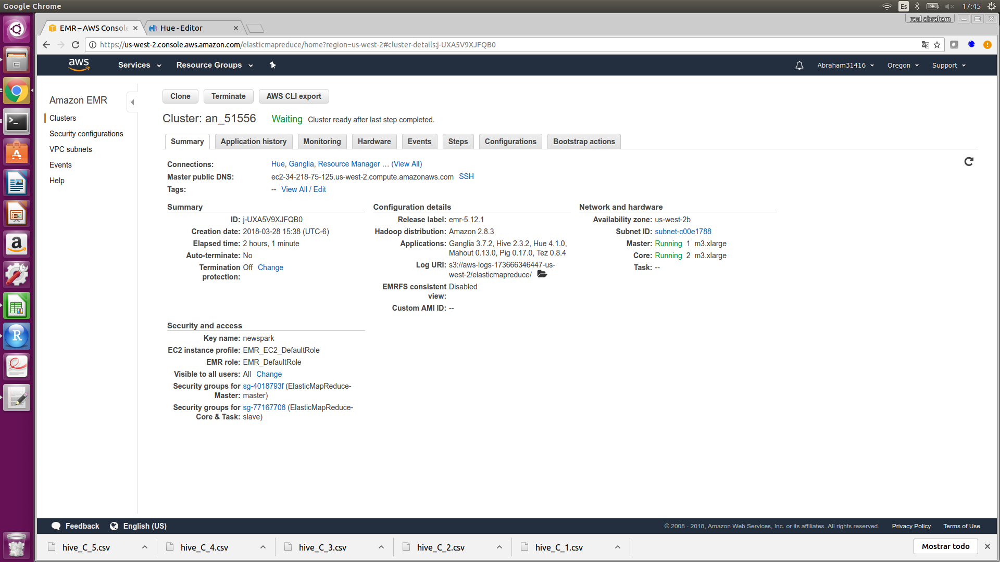


# MapReduce (A)

**Nota.- Para este ejercicio se procesaron los archivos contaminates_1986 a contaminantes_2017 por separado en cada carpeta de salidas existe archivo resultados.csv que concentra los resultados de las particiones.**

Incluye el conteo total y el conteo de nulos o vacíos

A.1 ¿Cuántas estaciones meteorológicas diferentes tienes por año?

```{r}
library(knitr)
library(readr)
respa1 <- read_csv('./MapReduce/mr_a_1.csv/resultados.csv',col_names=TRUE)
kable(respa1)
```

evidencia A1 AWS:

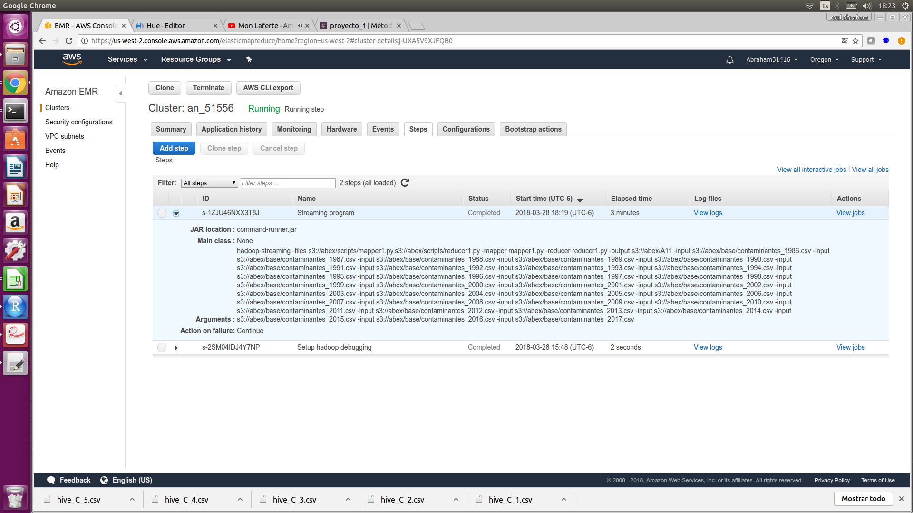

Archivo Mapper, Reducer: /MapReduce/mapper1.py, /MapReduce/reducer1.py
Archivo de salida(Particiones): /MapReduce/mr_a_1.csv (part-00000-part-00006)


A.2 ¿Cuántos registros hay por contaminante y estación meteorológica?

```{r}
library(readr)
respa2 <- read_csv('./MapReduce/mr_a_2.csv/resultado.csv',col_names=TRUE)
kable(respa2)
```

evidencia A2 AWS:

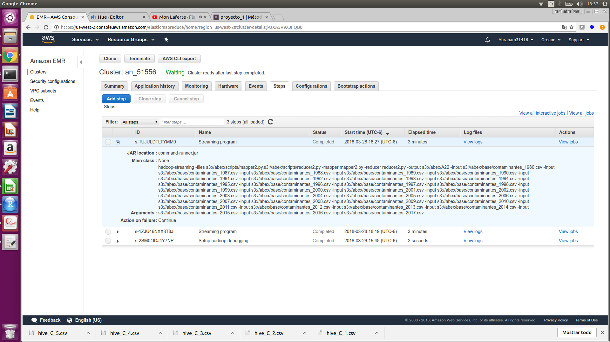

Archivo Mapper, Reducer: /MapReduce/mapper2.py, /MapReduce/reducer2.py
Archivo de salida(Particiones): /MapReduce/mr_a_2.csv (part-00000-part-00006)


A.3 ¿Cuántos registros hay por contaminante y año? 

```{r}
library(readr)
respa3 <- read_csv('./MapReduce/mr_a_3.csv/resultado.csv',col_names=TRUE)
kable(respa3)
```

evidencia A3 AWS:

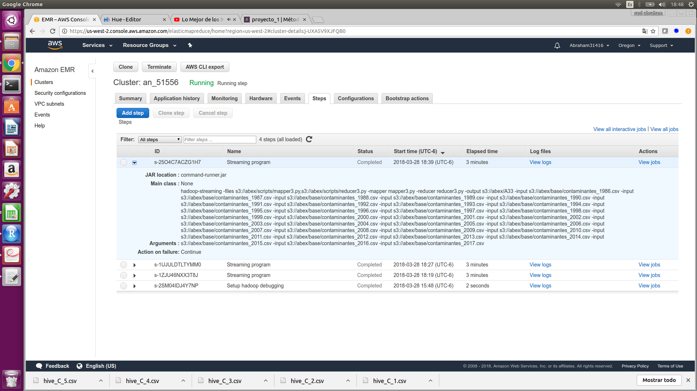

Archivo Mapper, Reducer: /MapReduce/mapper3.py, /MapReduce/reducer3.py
Archivo de salida(Particiones): /MapReduce/mr_a_3.csv (part-00000-part-00006)


A.4 ¿Cuántos registros hay por contaminante, año y estación meteorológica? 

```{r}
library(readr)
respa4 <- read_csv('./MapReduce/mr_a_4.csv/resultado.csv',col_names=TRUE)
kable(respa4)
```

evidencia A4 AWS:


Archivo Mapper, Reducer: /MapReduce/mapper4.py, /MapReduce/reducer4.py
Archivo de salida(Particiones): /MapReduce/mr_a_4.csv (part-00000-part-00006)


A.5 ¿Cuántos registros hay por estación meteorológica en el Estado de México?

```{r}
library(readr)
respa5 <- read_csv('./MapReduce/mr_a_5.csv/resultado.csv',col_names=TRUE)
kable(respa5)
```

evidencia A5 AWS:

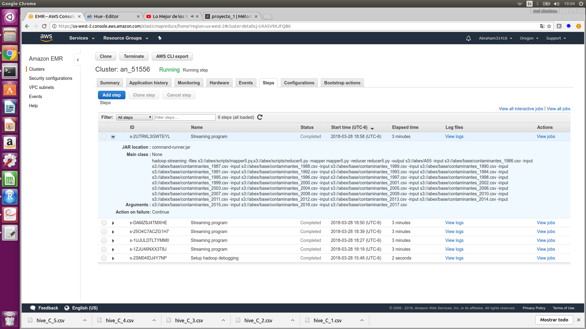

Archivo Mapper, Reducer: /MapReduce/mapper5.py, /MapReduce/reducer5.py
Archivo de salida(Particiones): /MapReduce/mr_a_5.csv (part-00000-part-00006)
 


# PIG

**Nota.- para estos ejercicios se tomaron en cuenta las fechas independientemente de si había hora 24**

### Preambulo
 - Para todos los ejercicios, se eliminaron los registros con mediciones nulas; lo anterior, en virtud de que al no tener valor, no se pueden utilizar ni interpretar adecuadamente.
 
 - Para las preguntas B.2 y B.3 se eliminaron lo siguientes contaminantes pues no tienen una ecuación de transformación a IMECA asociada y por lo tanto no fue posible compararlos con los demás contaminantes: NO, NOX y PMCO. 

### B.1
__¿Cuál es la estación meteorológica más "nueva"?__

La estación meteorológica más nueva es Milpa Alta (MPA) pues su primer registro es en enero 2016.

```{r}
library(readr)

respb1 <- read_csv('./pig/pig_b_1.csv',col_names=TRUE,col_types =cols(
  clave = col_character(),
  nombre = col_character(),
  delegacion_municipio = col_character(),
  entidad = col_character(),
  fecha_ingreso = col_character()
))

kable(respb1)
```


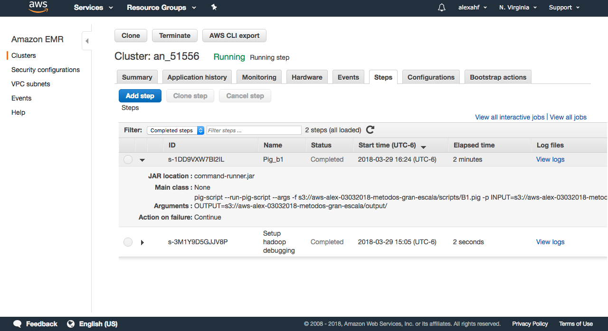

Archivo Script: pig/script_pig_B1.pig
Archivo de salida: pig/pig_b_1.csv

### B.2

__¿Cuál es el contaminante con la medición más alta? -ten cuidado con las unidades de cada contaminante!-, 
¿en qué fecha sucedió?, ¿qué estación metorológica la registró?__

El contaminante con la medicion más alta fue PM2.5 con un valor IMECA de 1319.52. La fecha en que sucedió fue el 16-04-2013 en al estación Xalostoc (XAL), en el Estado de México. 

```{r}
library(readr)
respb2 <- read_csv('./pig/pig_b_2.csv',col_names=TRUE)
kable(respb2)
```

Es importante destacar que aunque se obtuvo este valor de IMECA, probablemente exista algun problema con el "value" de el presente registro, pues en internet se indicaba que el valor máximo de IMECA es 500.


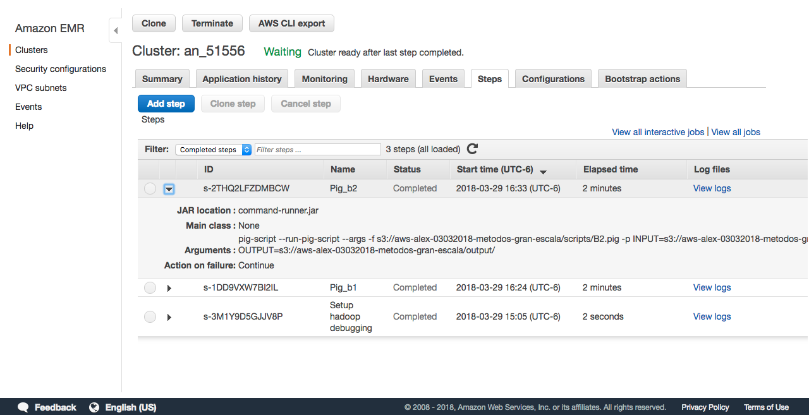

Archivo Script: pig/script_pig_B2.pig
Archivo de salida: pig/pig_b_2.csv


### B.3
__¿Cuál es el contaminante con la medición más baja? -ten cuidado con las unidades de cada contaminante!-, 
¿en qué fecha sucedió?, ¿qué estación metorológica la registró?__

```{r}
library(readr)
respb3 <- read_csv('./pig/pig_b_3.csv',col_names=TRUE)
kable(head(respb3,n=20))
```

No es posible determinar el contaminante con la medición más baja (tomando el IMECA como unidad para realizar la comparación entre variables); lo anterior, pues existen 328,277 mediciones con "value" cero y por lo tanto el valor IMECA que se calcula también es cero en dichas mediciones. En particular, lo anterior sucede con los siguientes contaminantes: CO, SO2, O3, PM2.5 y NO2.

No obstante, se anexa base con todas las mediciones cero, pues son las que constituirian las mediciones más bajas.


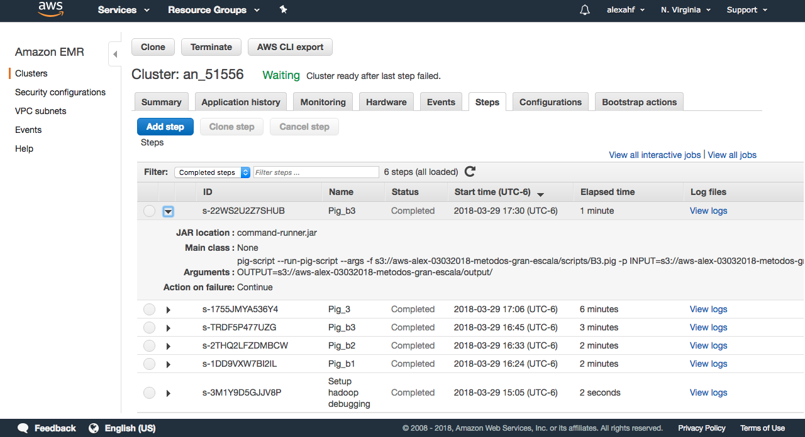

Archivo Script: pig/script_pig_B3.pig
Archivo de salida: pig/pig_b_3.csv


### B.4
__¿Cuál es el promedio de mediciones (número de observaciones) de cada estación meteorológica por día 
(redondeado a enteros)?__

El promedio de las mediciones se muestra en la última columna:

```{r,eval=FALSE}
estacion,nombre,num_dias,num_obs,promedio_mediciones
ACO,Acolman,3437,402274,117
AJM,Ajusco Medio,1076,217270,201
AJU,Ajusco,969,35792,36
ATI,Atizapán,8256,742320,89
BJU,Benito Juarez,7143,632556,88
CAM,Camarones,4914,500148,101
CCA,Centro de Ciencias de la Atmósfera,1212,182193,150
CHO,Chalco,3465,307018,88
CUA,Cuajimalpa,8155,464084,56
CUT,Cuautitlán,1995,253291,126
FAC,FES Acatlán,10743,1294628,120
GAM,Gustavo A. Madero,735,23477,31
HGM,Hospital General de México,2116,409780,193
INN,Investigaciones Nucleares,773,93932,121
IZT,Iztacalco,3738,591241,158
LLA,Los Laureles,8052,337647,41
LPR,La Presa,9358,347666,37
MER,Merced,11183,1657411,148
MGH,Miguel Hidalgo,1061,218803,206
MON,Montecillo,8241,381846,46
MPA,Milpa Alta,687,88220,128
NEZ,Nezahualcóyotl,2182,338819,155
PED,Pedregal,11341,1599425,141
SAG,San Agustín,9594,1349926,140
SFE,Santa Fe,1861,341822,183
TAH,Tláhuac,8539,690603,80
TLA,Tlalnepantla,11178,1641310,146
TLI,Tultitlán,8588,957095,111
UAX,UAM Xochimilco,2129,333794,156
UIZ,UAM Iztapalapa,9883,1278624,129
VIF,Villa de las Flores,8262,952891,115
XAL,Xalostoc,11082,1550022,139

```


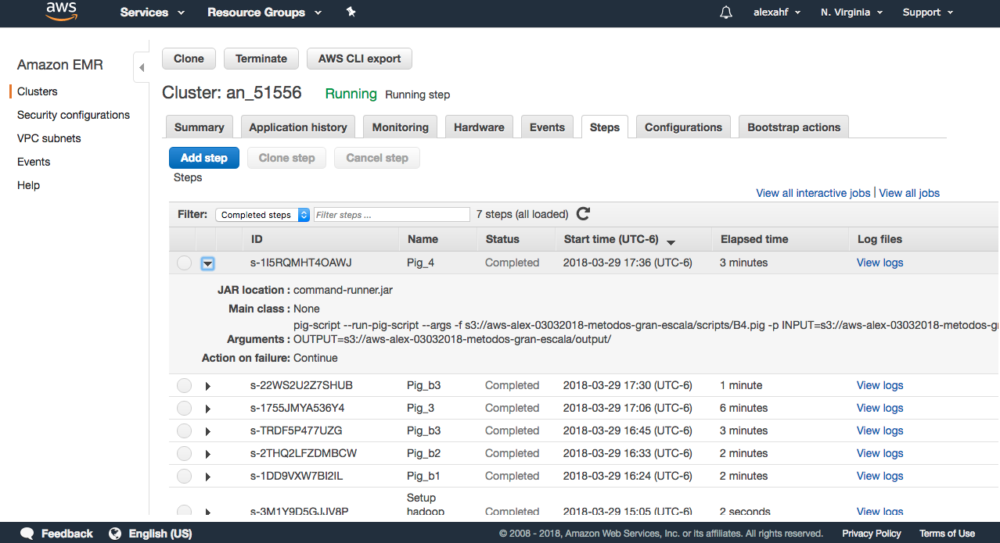

Archivo Script: pig/script_pig_B4.pig
Archivo de salida: pig/pig_b_4.csv


### B.5
__¿Cuántas veces por año hemos estado con $NO_{x}$ entre la Fase I y la Fase II de contingencia ambiental? (entre 191 y 239 -inclusive-) Promedia el contaminante por día__

Para este ejercicio se utilizó el contaminante $NO_X$ haciendo uso de la ecuación de transformación a IMECA de NO2, es decir; la ecuación simplificada: $0.001*C[NO_X]*100/0.21$, donde $C[NO_X]$ es la concentración de $NO_X$.

Por otro lado, utilizando el promedio del contaminante por día se obtienen cero resultados, razón por la cual se utilizó el máximo por dia.

Considerando lo anterior, se obtuvo que hemos estado entre la Fase I y Fase II el siguiente número de veces:

```{r,eval=FALSE}
year,fase1_fase2
1986,26
1987,28
1988,13
1989,23
1990,26
1991,16
1992,28
1993,79
1994,81
1995,89
1996,152
1997,145
1998,101
1999,69
2000,102
2001,45
2002,38
2003,35
2004,36
2005,46
2006,42
2007,28
2008,32
2009,26
2010,24
2011,29
2012,33
2013,39
2014,20
2015,14
2016,22
2017,26

```


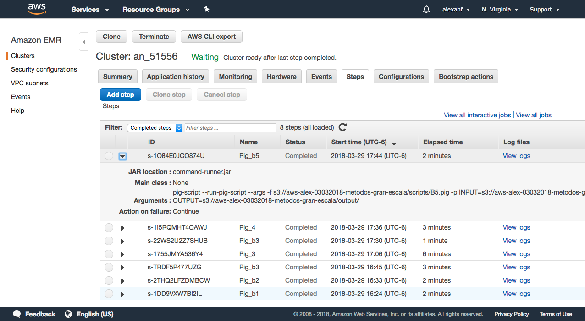

Archivo Script: pig/script_pig_B5.pig
Archivo de salida: pig/pig_b_5.csv


# Hive (C)

**Nota.- para estos ejercicios se procesa la información de la siguiente manera se juntan todos los** **archivos en 1 solo es decir contaminantes_1986 a contaminantes_2017 y este archivo se nombra como contaminantes.csv, posterior para los registros con fecha 31/12/2017 24:00 se eliminan dela base dado que estos registros en realidad pertenecen a la fecha 01/01/2018 entonces se eliminan 241 registros y se crea la base contaminantesf con este query:**

```{r eval=FALSE} 
create table contaminantesf as select*from contaminantes where year(from_unixtime(unix_timestamp(`date`,'dd/MM/yyyy HH:mm')))!=2018;

```

**y sobre esta base se hacen las consultas para responder las preguntas:**

C.1 ¿En qué hora (solo hora, en formato 0-23) del día normalmente hay picos por contaminante/mes? ¡Incluir la unidad del contaminante! (catálogo de unidades) Por ejemplo:
|contaminante|mes|hora|valor|unidad| |:-----|:-----|:------|:----| |CO|enero|8|0.8|partes por millon| |NO|enero|10|1|pates por billon|


```{r}
library(readr)
respc1 <- read_csv('./hive/hive_C_1.csv',col_names=TRUE)
kable(respc1)
```

evidencia C1 HUE:

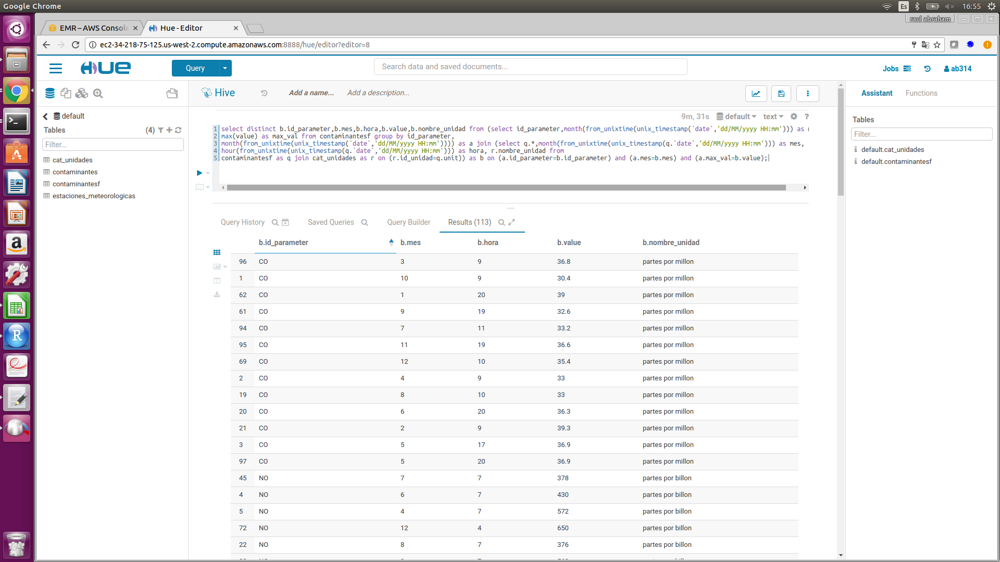

Archivo hql: /hive/script_hive_C1.hql
Archivo de salida: /hive/hive_C_1.csv


**Nota- para preguntas 2 y 3 se utilizó el máximo por dia en vez del promedio ya que este hace más sentido y además en datos el promedio no daba nada, además para promediar no se tomaron en cuenta los valres nulos**

C.2 ¿Cuántas veces por año hemos estado con $O_{3}$ entre la Fase I y la Fase II de contingencia ambiental? (entre 191 y 239 -inclusive-) Promedia el contaminante por día

**Fórmula de transformación a Imeca=O3*.001*100/.11**

```{r}
library(readr)
respc2 <- read_csv('./hive/hive_C_2.csv',col_names=TRUE)
kable(respc2)
```

evidencia C2 HUE:

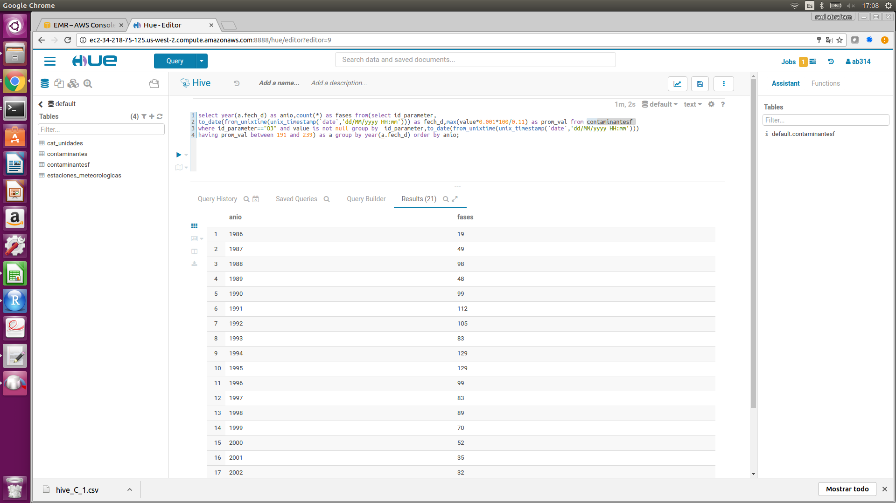

Archivo hql: /hive/script_hive_C2.hql
Archivo de salida: /hive/hive_C_2.csv


C.3 ¿Cuántas veces por año hemos estado con $SO_{2}$ entre la Fase I y la Fase II de contingencia ambiental? (entre 191 y 239 -inclusive-) Promedia el contaminante por día 

**Fórmula de transformación a Imeca=O3*.001*100/.13**

```{r}
library(readr)
respc3 <- read_csv('./hive/hive_C_3.csv',col_names=TRUE)
kable(respc3)
```

evidencia C3 HUE:

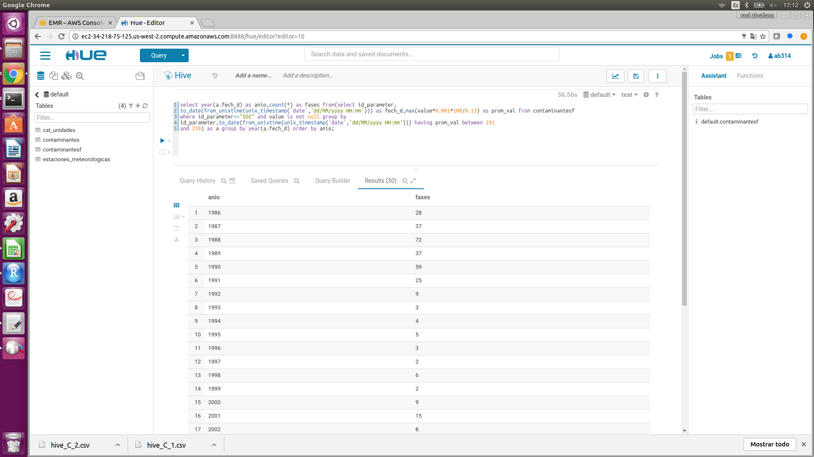

Archivo hql: /hive/script_hive_C3.hql
Archivo de salida: /hive/hive_C_3.csv


C.4 De acuerdo a la definición del índice IMECA (pag 6 pdf) ¿Cuántas veces y cuáles veces hemos estado en un nivel IMECA malo para $PM_{2.5}$? Promedia el contaminante por día

Para que $PM_{2.5}$ sea tomado como malo su valor debe estar entre 40.5 y 65.4 equivalente al rango de 101-150 imecas segun el pdf.
son 378 y son los sguientes:

```{r}
library(readr)
respc4 <- read_csv('./hive/hive_C_4.csv',col_names=TRUE,col_types =cols(
  id_parameter = col_character(),
  fech_d = col_character(),
  prom_val = col_double()
))
kable(respc4)
```

evidencia C4 HUE:

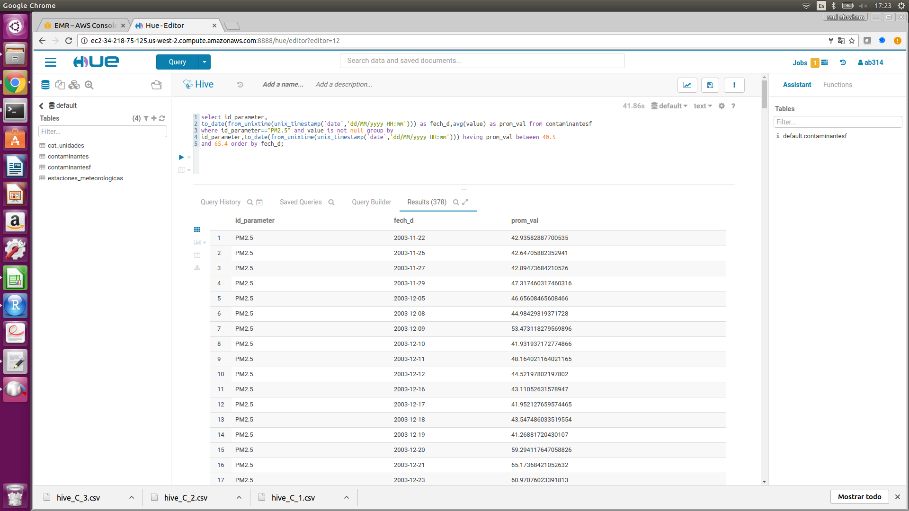

Archivo hql: /hive/script_hive_C4_cuantos.hql, /hive/script_hive_C4_cuales.hql
Archivo de salida: /hive/hive_C_4.csv


C.5 De acuerdo a la definición del índice IMECA (pag 6 pdf) ¿Cuántas veces y cuáles veces hemos estado en un nivel IMECA malo para $PM_{10}$? Promedia el contaminante por día 

han sido 72 veces, recordar que para que el nivel sea considerado malo debe ser entre los valores 121 y
220 para $PM_{10}$, equivalente al rango de 101-150 imecas segun el pdf.


```{r}
library(readr)
respc5 <- read_csv('./hive/hive_C_5.csv',col_names=TRUE,col_types =cols(
  id_parameter = col_character(),
  fech_d = col_character(),
  prom_val = col_double()
) )
kable(respc5)
```

evidencia C5 HUE:

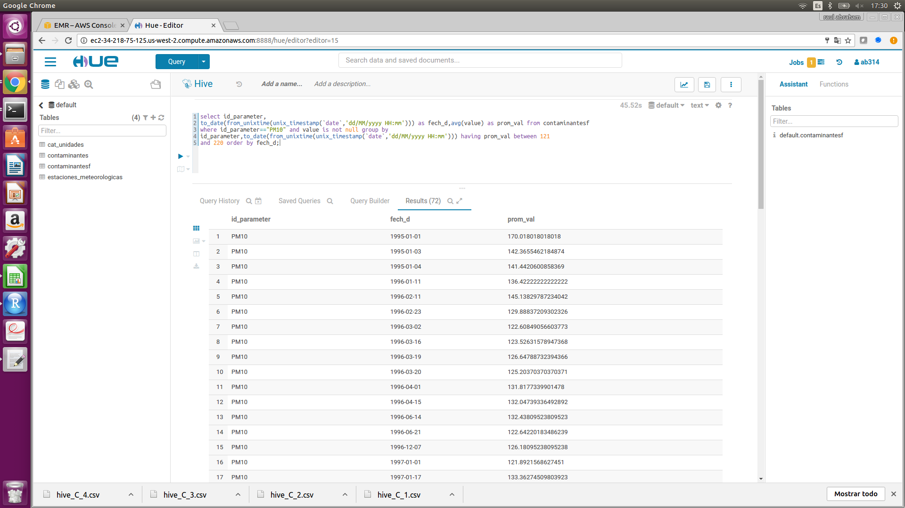


Archivo hql: /hive/script_hive_C5_cuantos.hql, /hive/script_hive_C5_cuales.hql
Archivo de salida: /hive/hive_C_5.csv


# SPARK

### Levantamiento de tecnologías

Para el presente ejercicio levantamos un cluster en AWS con 3 nodos. (Con Spark y Zeppelin por supuesto)

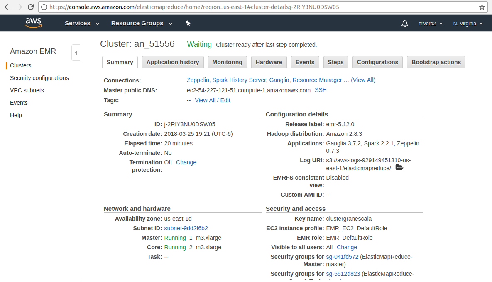


Y después montamos zeppelin desde nuestro navegador abriendo un "canal" vía la terminal.


Y cargamos los datos (vía S3 primero).

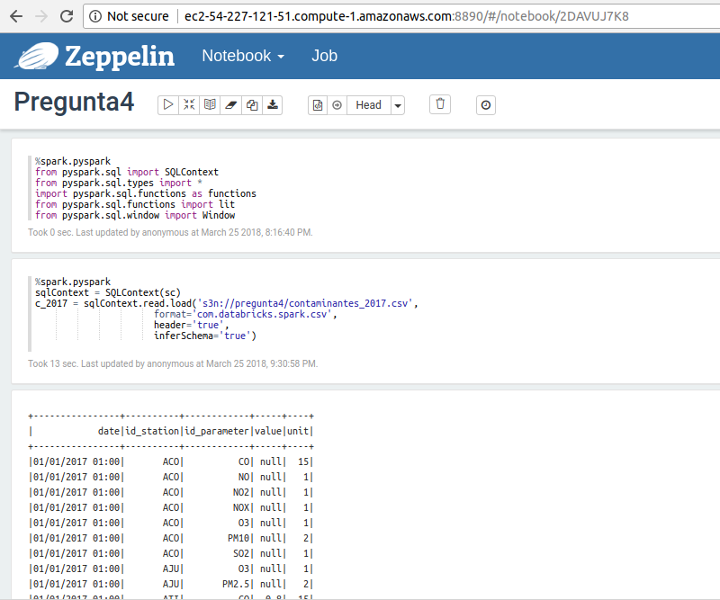


### D.1 Realiza un pequeño profiling a los datos por métrica/año indicando: min, max, mean, approximateQuantiles, desviación estándar, número de datos sin registro (nulos, vacíos). 

Para éste ejercicio, hicimos uso de la programación funcional y la recursión de Spark/Pyspark/Python y cargamos todo en una sola 'linea de comando' a un dataframe de pandas, ordenado primero por parámetro (métrica) y luego por año agregando minimo, maximo, media, cuantiles, desviación y nulos . Aquí la imagen preliminar del output:
**El código de la consulta está en el archivo 

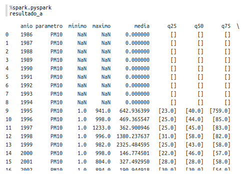

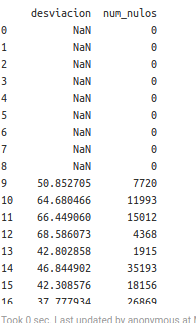


Y luego guardamos el output en archivos distribuídos:

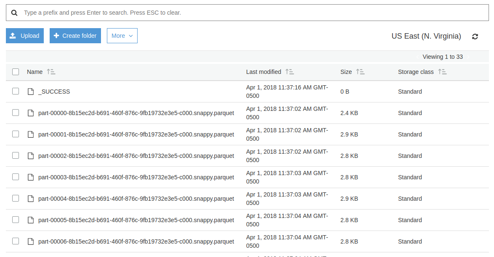

<br><br>
Archivo script: pyspark/script_spark_1.py<br>
Archivo de parquets de salida: pyspark/spark_d_1


### D.2 ¿Existe evidencia que sugiera que el metrobus ayudó a reducir contaminantes en ciertas estaciones meteorológicas? (No hace falta construir un modelo, qué nos dice la estadística descriptiva??)

Se corrió la consulta para almacenar los resultados por sucursal y contaminante en los años 2005, 2006 y 2007 para ver qué contaminantes bajaban en qué sucursales y así poder <b>sospechar</b> de alguna mejora, más no formular conclusiones todavía.

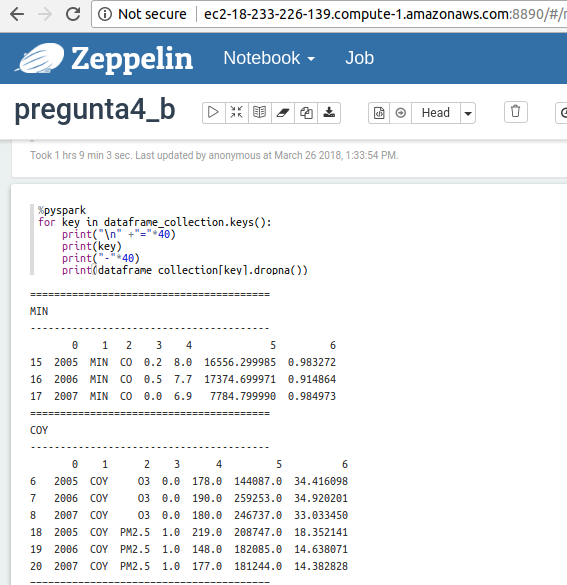

### Los resultados para cada estación fueron los siguientes:

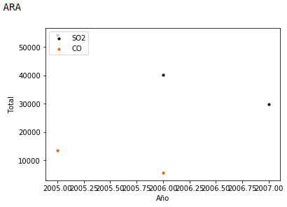

Podemos ver que SO2 y CO2 presentan evidencia de decrecimiento en estación: ARA.

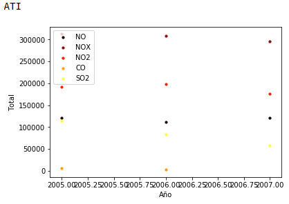

Podemos ver que SO2 presenta evidencia de decrecimiento en estación: **ATI**.

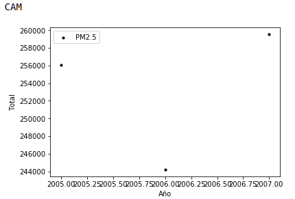

Podemos ver que no hay evidencia de decrecimiento en estación: **CAM**.

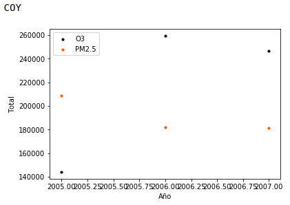

Podemos ver que hay evidencia de decrecimiento en PM2.5 en estación: **COY**.

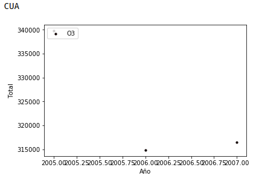

Podemos ver que hay evidencia de decrecimiento de O3 en estación: CUA.

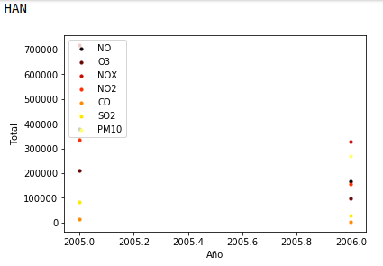

Podemos ver que hay evidencia de decrecimiento de PM10, NO2, O3 y NOX en estación: **HAN**.

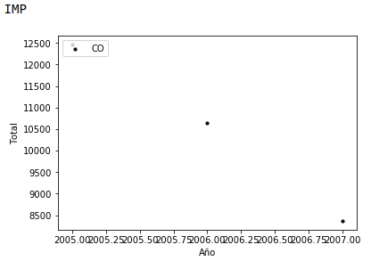

Podemos ver que hay evidencia de decrecimiento de CO en estación: **IMP**.

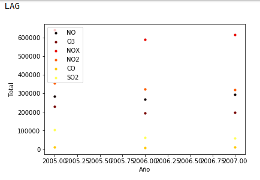

Podemos ver que No hay evidencia en estación: **LAG**.

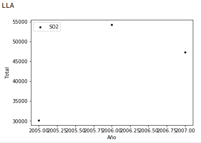

Podemos ver que no hay evidencia en estación: **LLA**.

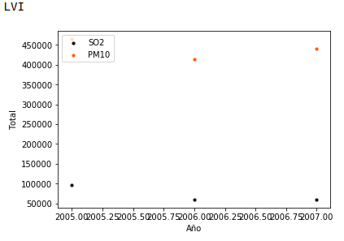

Podemos ver que hay ligera eviencia en SO2 en estación: **LVI**.

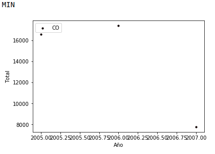

Podemos ver que no hay evidencia en estación: **MIN**.

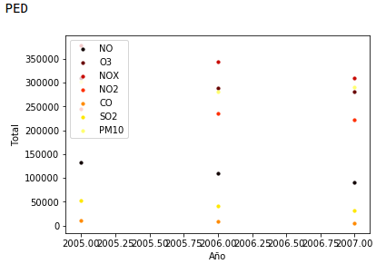

Podemos ver que hay ligera evidencia en NO y NO2 en estación: **PED**.

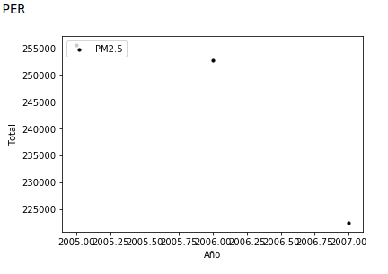

Podemos ver que hay ligera evidencia en PM2.5 en estación: **PER**.

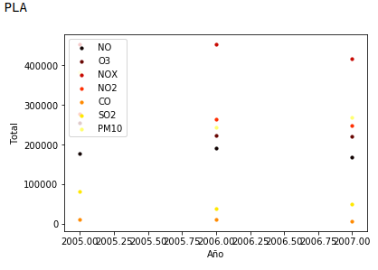

Podemos ver que hay ligera evidencia en NOX en estación: **PLA**.

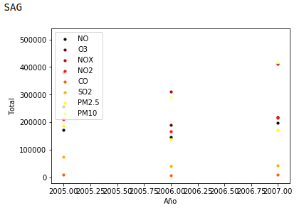

Podemos ver que hay ligera evidencia en NOX en estación: **SAG**.

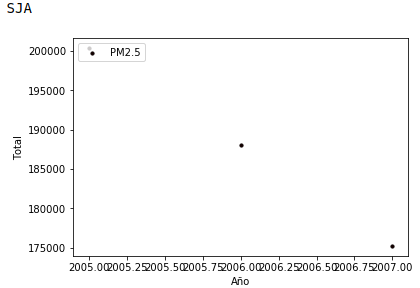

Podemos ver que hay clara evidencia en PM2.5 en estación: **SJA**.

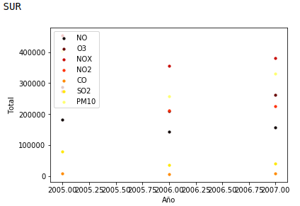

Podemos ver que no hay evidencia en estación: **SUR**.

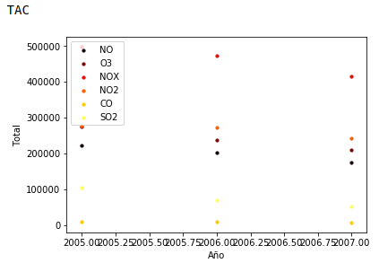

Podemos ver que hay ligera evidencia en todas excepto CO en estación: **TAC**.

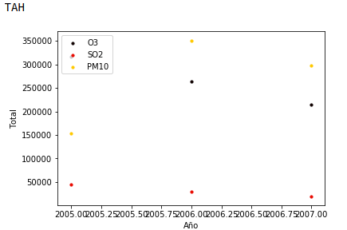

Podemos ver que hay ligera evidencia en O3 en estación: **TAH**.

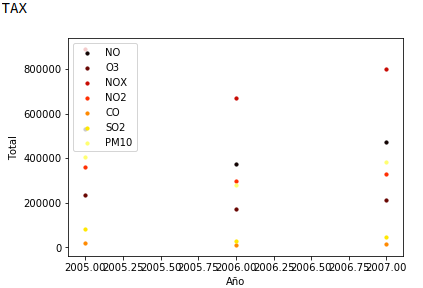


Podemos ver que no hay evidencia en estación: **TAX**.

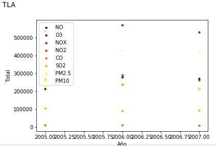


Podemos ver que No hay evidencia en estación: **TLA**.

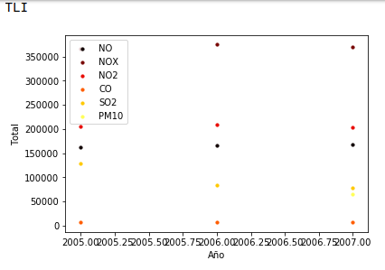


Podemos ver que hay ligera evidencia en SO2 y PM10 en estación: **TLI**.

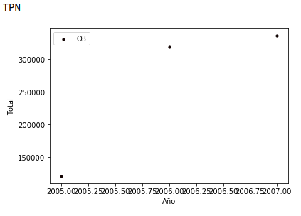


Podemos ver que NO hay  evidencia en estación: **TPN**.

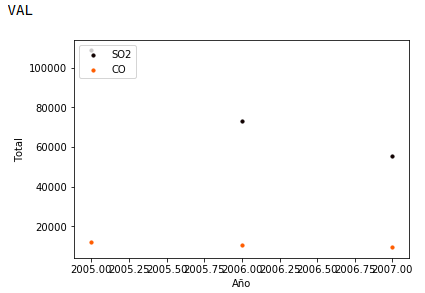


Podemos ver que hay ligera evidencia en SO2 en estación: **VAL.

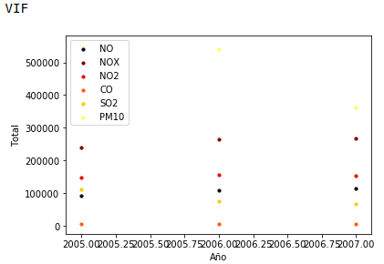


Podemos ver que hay ligera evidencia en PM10 en estación: **VIF**.
<br><br>
Archivo script: pyspark/script_spark_2.py<br>
Archivo parquets de salida: pyspark/spark_d_2
<br><br>
Se creó un parquet de salida para cada estación:
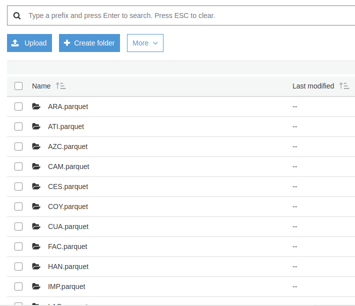
<br>
### Conclusión: 
Se sugiere un estudio más profundo en donde se encontró evidencia de que fué el metrobús. Lo primero sería descartar las estaciones que no son geográficamente relevantes. Después sería revisar por meses dónde fueron los cambios para comparar con aperturas de diferentes partes del metrobús. En principio parece que SI podría haber influencia del metrobús en algunas métricas para algunos parámetros.


### D.3 ¿Cuál es el contaminante que ha tenido mayor descenso con el paso del tiempo? Obtén el promedio por métrica del día (todas las estaciones), luego genera un lag por día, luego saca el promedio del lag por contaminante, selecciona el que tenga mayor lag.  →→  ordena de 1986 a 2017!

El contaminante con mayor descenso en el paso del tiempo es **NOX**:

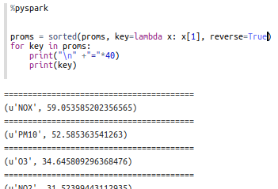

<br><br>
Archivo script: pyspark/script_spark_3.py<br>
Archivo parquets de salida:  pyspark/spark_d_3

### D.4 De acuerdo al histórico de PM2.5 ¿cuál es el mes del año en el que se pone peor?

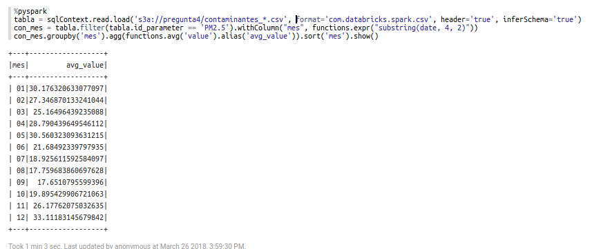


De acuerdo a su histórico, las temporadas del año cuando se pone peor son **Mayo*</b>** y **Diciembre/Enero**. Por un lado Diciembre es fácil de explicar por la alta cantidad de tráfico generada por consumo de fin de año, pero en Mayo es una interrogante que habría que investigar más a fondo. 
<br><br>
Archivo script: pyspark/script_spark_4.py<br>
Archivo parquets de salida: pyspark/spark_d_4

### D.5 ¿En qué horario/mes evitarías irte en Ecobici a cualquier lugar de acuerdo al histórico de mediciones de PM2.5?

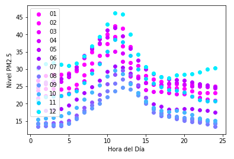

Definitivamente y sin lugar a futura discusión, a mediodía, esto es; entre 11:00 y 12:00 de la mañana, cualquier mes del año y cualquier horario entre más alejado de éste mejor. Los meses nos hablan de que Invierno es lo peor y verano-otoño lo menos grave.
<br><br>
Archivo script: pyspark/script_spark_5.py<br>
Archivo parquets de salida: pyspark/spark_d_5


**Reflexiones**

__¿Consideras que el programa "Hoy no circula" ha funcionado? Explica la evidencia que sustenta tu respuesta__

Exploración sobre programa de hoy no circula, para este estudio se reunieron los datos sobre el año de implementación (1989) y tres años antes y después, el comportamiento del Ozono (O3).
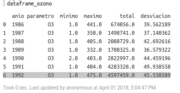
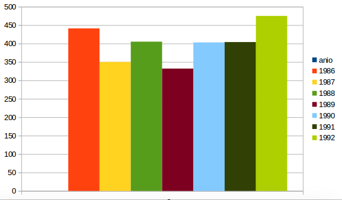

Podemos observar que no se puede concluír de esta información si ha funcionado o no, ya que no sabemos el cambio en número de automóviles, el cambio climático, la descentralización (o centralización) de la cdmx en los últimos 30 años, etc. 


__¿Agregarías restricciones más severas a la contingencia ambiental? ¿Los niveles de CDMX son adecuados de acuerdo a lo que sucede en otras partes del mundo para activación de contigencia ambiental? Explica la evidencia que sustenta tu respuesta__

De la tabla del ejercicio C.3 se aprecia el numero de veces que se detonó entre Fase I y Fase II de contingencia relativa a $SO_2$ ha disminuido con respecto a los años 90's. Asimismo, de acuerdo a la tabla del ejercicio C.3, para el $O_3$ desde el 2007 no se ha superado el umbral de los 194 puntos IMECA. Con la información que se cuenta no resulta claro este comportamiento. Po lo anterior, esbozaremos cómo se afectaría el numero de contingencias para $O_3$ y $PM10$ que de acuerdo a la información proporcionada, son los contaminantes que más detonan las contingencias. Lo anterior, bajo el escenario del límite actual (A) y considerando una disminución de 40 puntos IMECA en el límite (R). 

En el caso del ozono, una disminución de 40 puntos IMECA del limite de 191; es decir, quedando un límite de 151 puntos IMECA, incrementaría en un 108% el inicio de la Fase I de contingencia, lo anterior considerando el máximo del contaminante por día. 

```{r,eval=FALSE}

Ozono	A   R
1986	47	85
1987	71	147
1988	136	244
1989	59	166
1990	157	254
1991	233	302
1992	182	273
1993	126	253
1994	166	276
1995	167	269
1996	127	245
1997	100	230
1998	106	226
1999	80	206
2000	56	207
2001	37	156
2002	34	136
2003	7	76
2004	2	52
2005	1	45
2006	1	23
2007	0	20
2008	0	12
2009	0	10
2010	0	7
2011	0	7
2012	0	3
2013	0	5
2014	0	3
2015	0	3
2016	0	7
2017	0	5

```


Por su parte, la misma disminución en el caso de $PM10$ representaría un incremento del 754% en la activación de la Fase I de contingencia.

```{r,eval=FALSE}
PM10	A	  R
1995	19	110
1996	13	66
1997	24	104
1998	13	67
1999	8	82
2000	11	124
2001	16	116
2002	12	110
2003	18	117
2004	12	100
2005	11	96
2006	6	72
2007	2	51
2008	8	87
2009	10	90
2010	12	95
2011	6	100
2012	2	49
2013	8	83
2014	7	65
2015	5	55
2016	6	61
2017	4	91
```


En ambos casos vemos que el agregar restricciones más severas sin duda generaría un impacto positivo en el numero de contingencias que se activarían y por ende en la calidad de la aire; no obstante, más que agregar restricciones más severas a la contingencia ambiental, en nuestra opinión lo que se debe hacer es desincentivar el uso del automóvil y promover el uso de otros medios de transporte, lo cual debe ser un esfuerzo conjunto entre gobierno, inversión privada y ciudadanos. 
En primer lugar, el gobierno debe proveer un sistema de transporte robusto y eficiente, que tenga una mayor cobertura y alcance que el actual. Lo anterior, pues sin una opción viable de transporte colectivo, será muy difícil el modificar los habitos de transporte y por ende, los niveles de los contaminantes.
En cuanto a la inversión privada, también se tienen que tomar medidas para regular la presencia de taxis y automóviles utilizados como Uber, pues no existe un adecuado control sobre la flota vehicular y reglas de cirulación. Asimismo, las empresas deben garantizar el cumplimiento de la legislación en materia ambiental y en cuanto a emisiones. Con la nueva reforma energética tanto la CRE, ASEA y PROFEPA deben tener claros los lineamientos y sanciones en materia ambiental y que en todos los casos garanticen el cumplimiento de los mismos.
Finalmente, nosotros como ciudadanos tenemos que empezar a pensar en movilidad no sólo en términos de un atomóvil, así como evitar centrarnos en una visión consumista a corto plazo. Tenemos que comenzar a pensar en reusabilidad, en impacto ambiental y tratar de enfocarnos en energías limpias.

La ciudad de México no se encuentra entre las 10 ciudades con más contaminción del mundo, al menos en cuanto a niveles de ozono se refiere; no obstante, tiene niveles de contaminantes altos que indudablemente nos generan afecciones respiratorias. Otras ciudades en el mundo, como París y Los Ángeles, activan sus alarmas cuando los niveles IMECA sobrepasan los 100 puntos, por lo que se podrían endurecer los límites en nuestra ciudad. Sin embargo, el problema no se resuelve sólo con endurecer los límites, pues como mencionado con antelación, tiene que presentarse un cambio de raíz en todos los niveles y principalmente en el tema del uso del automóvil, pues de acuerdo al centro Mario Molina "La fuente que más contribuye a la contaminación en la Zona Metropolitana del Valle de México es el transporte; los vehículos particulares generan la mayor parte de los precursores de ozono y son la segunda fuente de emisión de partículas finas, sólo después del transporte pesado a diesel". Lo anterior, se complica debido a la orografía de la ciudad que al estar en una cuenca, rodeada de montañas, se dificulta la salidad "natural" de los contaminantes. 
En virtud lo anterior, consideramos que por las características únicas que tiene la Ciudad de México, se deben de endurecer los límites, pero también es fundamental tomar otro tipo de acciones para controlar la flota vehicular. Podríamos seguir el ejemplo de Tokyo y Singapur, que lograron un mejor control de la contaminación vía el manejo adecuado de la flota vehicular impulsada por impuestos a los vehículos, donde dicho impuesto refleja el costo real que el vehículo tiene para la sociedad y su calidad de vida.


__¿Consideras que la calidad de aire no es un peligro para los habitantes de esta ciudad? sobre todo para niños y adultos mayores. Justifica tu respuesta con evidencia__

Del planteamiento del proyecto se sabe que el $NO_2$ "...causa cambios irreversibles en la estructura y función de los pulmones en niños y personas asmáticas", dentro de los datos notamos que dicho contaminante no ha superado el umbral de los 100 puntos IMECA, que es el paso de una calidad del aire de regular a mala desde 2006. Cabe destacar que el límite de 100 puntos IMECA se utiliza en otros paises para detonar la fase de contingencia como abordaremos más adelante.

```{r,eval=FALSE}
year,fase1
1986,11
1987,35
1988,24
1989,16
1990,32
1991,12
1992,6
1993,28
1994,24
1995,32
1996,81
1997,35
1998,29
1999,17
2000,22
2001,1
2002,0
2003,5
2004,3
2005,3
2006,1
2007,0
2008,0
2009,0
2010,0
2011,0
2012,0
2013,0
2014,0

```


Este es el caso puntual de un contaminante que se indica tiene efectos en los pulmones de los niños y personas asmáticas; no obstante, todos los contaminantes impactan negativamente en la salud de los grupos más vulnerables y de acuerdo a la información del proyecto los niveles de $O_3$ y de de $PM10$ continúan disparando las alarmas de la Fase I y II de contingencia ambiental al superar los niveles permisibles.

En este sentido, la calidad del aire sí es un peligro, no sólo para los habitantes de la ciudad, sino también para animales y plantas y en general todo el ecosistema.

De acuerdo a World Health Organization, la contaminación ambiental afecta de formas distintas a los distintos grupos de la población, indica que los efectos más graves se producen en las personas que ya están enfermas; sin embargo, también afecta a los grupos más vulnerables como niños y ancianos y familias de escasos ingresos. Indican que en el mundo fallecen al año 1.3 millones de personas a causa de la contaminación atmosférica urbana y que los residentes de las ciudades donde hay niveles elevados de contaminación atmosférica, padecen más enfermedades cardiacas, problemas respiratorios y cánceres de pulmón.

En el caso puntual de la Ciudad de México, el peligro es inminente, no sólo por las características orográficas, el crecimiento poblacional, de la industria y de la flota vehícular, sino debido a que la implementación de las leyes y normas aplicables en materia medioambiental es muy laxa. No nos damos cuenta de que la afecciones respiratorias se está convirtiendo en un problema no solo de salud sino de política pública, pues el servicio médico que provee el estado resulta insuficiente para atender la creciente demanda.

El peligro que representa la contaminación ambiental para todos los seres vivos radica en el hecho de que es cancerígena, según lo determinó una evaluación de 2013 realizada por la Centro Internacional de Investigaciones sobre el Cáncer de la OMS, por lo tanto debemos de realizar todo lo que esté en nuestras manos disminuir los niveles de los contaminantes.

Hasta el momento, muchos de los problemas inherentes de la contaminación ambiental sólo nos han sido expuestos en forma de probabilidad, porcentajes y tendencias "la contaminación ambiental...esta estrechamente relacionada con el cáncer de pulmón; aumento de cancer en vías urinarias y vejiga; cardiopatías y neumopatías; está asociado al 72% de defunciones prematuras, entre otras", pero las afecciones perceptibles en la gran mayoría de los casos no ha pasado de "irritaciones oculares, falta de aire y cansancio"", lo que nos ha dado una falsa sensación de que el problema no es tan grave. Sin embargo, es un problema real y latente y sus afectaciones, en muchos casos no visibles, son graves para todo el ecosistema en su conjunto, por esto es de suma importancia que generemos conciencia sobre este problema y su solución.


**Conclusiones**

- En 2007 y 2015 son los años donde más estaciones meteorológicas han habido
La estación meteorológica con más  registros, en el Estado de México es FAC con  casi
1.5mill de registros aunque el 13% de estos son nulos o s no se tomo registro.

- En la segunda mitad de los 90's, la calidad del aire en la Ciudad de México era bastante mala, originando numerosas alertas de contingencia ambiental, a tal grado que en año 1996 se estuvo 152 veces entre la Fase I y Fase II de contingencia ambiental.

- El contaminante con la medición más alta fue el PM2.5 en Xalostoc Estado de México, lo que podría estar asociado al creciente desarrollo industrial de la zona y a la presencia de transporte de carga.

- Sería interasante evaluar si las 32 estaciones son suficientes para hacer un adecuado levantamiento de datos, o si se requiere el incluir alguna nueva estación, pues desde enero 2016 no se ha incluido ninguna estación de medición nueva.

- A las 7 Hrs. es cuando es mas frecuencia de picos encontramos y paticularmente estos son con Monóxido de nitrógeno y Óxidos de nitrógeno.
Eaño donde más veces hemos estado entre fase 1 y 2 de contingencia por Ozono fue 1994 y 95, análogamente para Dióxido de nitrógeno esto se presentó más veces en 1988.

- Existen algunas tendencias muy claras por ejemplo en invierno varios parámetros suben su nivel y lo incrementan de forma suave, por lo que más que parecer que es el "tráfico de navidad" lo que lo provoca, más bien sería interesante investigar la correlación positiva que tenga con la temperatura y la correlación negativa que tenga con las precipitaciones durante el año.

- Es muy probable que el programa de metrobús haya tenido una influencia positiva sobre la disminución en algunos parámetros, pero habría que investigar a fondo si realmente es la causa principal y si lo es, cuánto tiempo duró.


