se muestra el cluster en AWS:
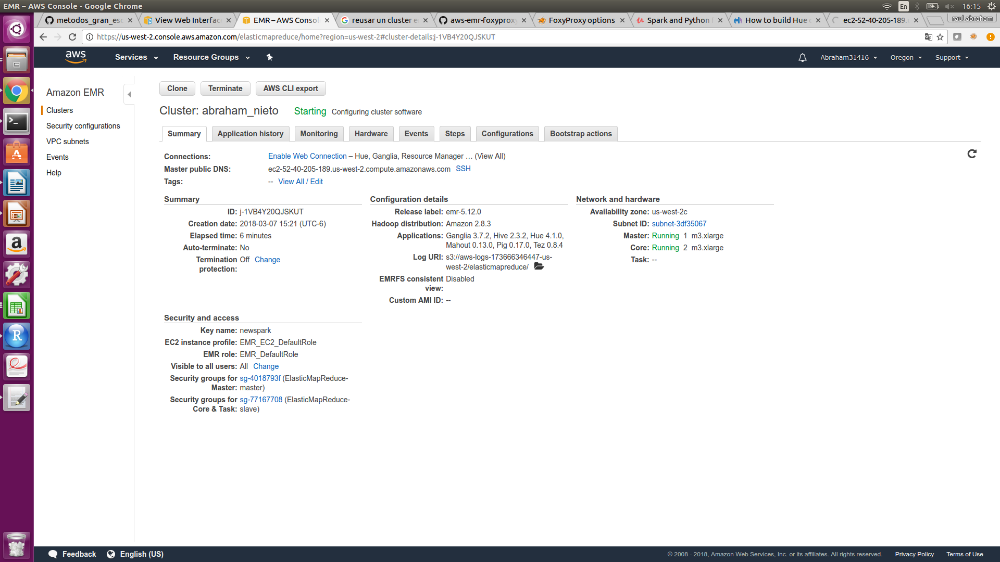


Ejercicio 1. Con la base de datos de northwind que se encuentran en el dropbox:

a. ¿Cuántos "jefes" hay en la tabla empleados? 

parte1 primero la tabla de los jefes son 2:

```{r, eval=FALSE} 
select b.*,a.sub from(select reportsto,collect_set(firstname) as sub from northwind.employees2 where reportsto is not null group by reportsto) as a join 
(select employeeid,lastname,firstname,title,birthdate,hiredate,city,country from northwind.employees2) as b on a.reportsto=b.employeeid;

```

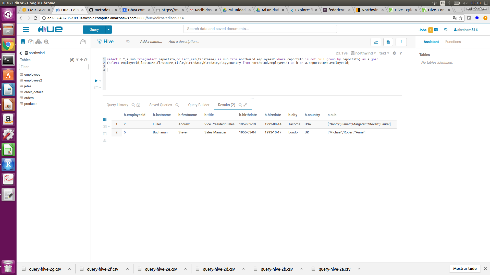

¿Cuáles son estos jefes: número de empleado, nombre, apellido, título, fecha de nacimiento, fecha en que iniciaron en la empresa, ciudad y país? (atributo reportsto, ocupa explode en tu respuesta)

```{r, eval=FALSE} 
select employeeid,lastname,firstname,title,birthdate,hiredate,city,country,subView.sub from (select b.*,a.sub from(select reportsto,collect_set(firstname) as sub from northwind.employees2 where reportsto is not null group by reportsto) as a join 
(select employeeid,lastname,firstname,title,birthdate,hiredate,city,country from northwind.employees2) as b on a.reportsto=b.employeeid) as t 
lateral view explode(sub) subView as sub;
```

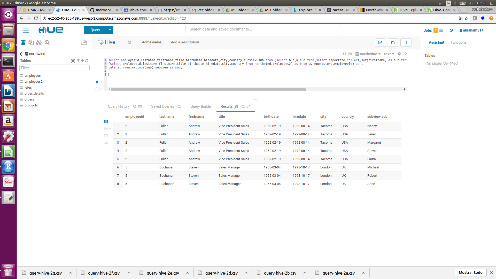

archivo de salida: query-hive-1a.csv

b. ¿Quién es el segundo "mejor" empleado que más órdenes ha generado? (nombre, apellido, título, cuándo entró a la compañía, número de órdenes generadas, número de órdenes generadas por el mejor empleado (número 1))


```{r, eval=FALSE} 
select a.employeeid,b.firstname,b.lastname,b.title,b.hiredate,a.num,lag(num,1,0) over (order by num desc) as ord_emp1 from (select employeeid,count(*) as num 
from orders2 group by employeeid order by num desc limit 2) as a join employees2 as b on a.employeeid=b.employeeid order by num limit 1;

```

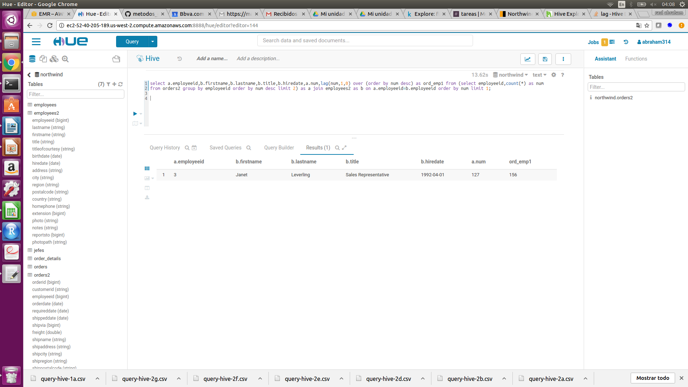

resultados: query-hive-1b.csv

c. ¿Cuál es el delta de tiempo más grande entre una orden y otra?

el máximo delta es 3.

```{r, eval=FALSE} 
select max(delta) as max_delta from (select DATEDIFF(orderdate,lag(orderdate,1) over (order by orderdate)) as delta from orders2) t; 
```

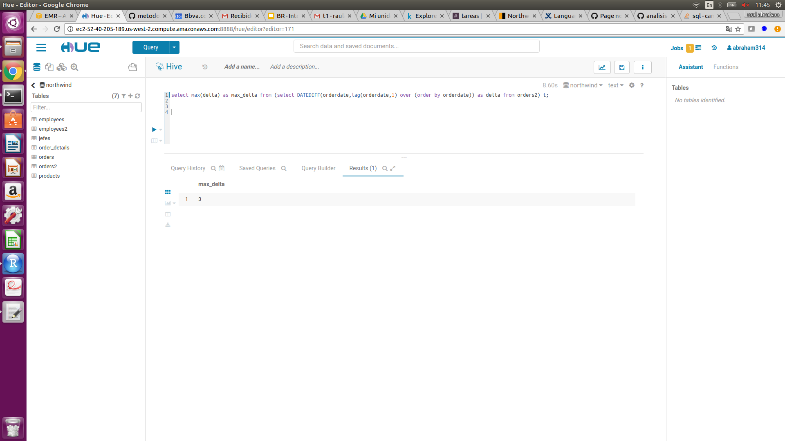
y si quisieramos saber cuales son esas órdenes posteriores a esos 3 días podemos verlo con este query

```{r, eval=FALSE} 
select y.orderid,y.orderdate,y.delta from (
select max(delta) as max from (select DATEDIFF(a.orderdate,lag(a.orderdate,1) over (order by a.orderdate)) as delta from orders as a) t 
) as x join 
(select a.*,DATEDIFF(a.orderdate,lag(a.orderdate,1) over (order by a.orderdate)) as delta
from orders as a  sort by a.orderdate) as y on x.max=y.delta;
```

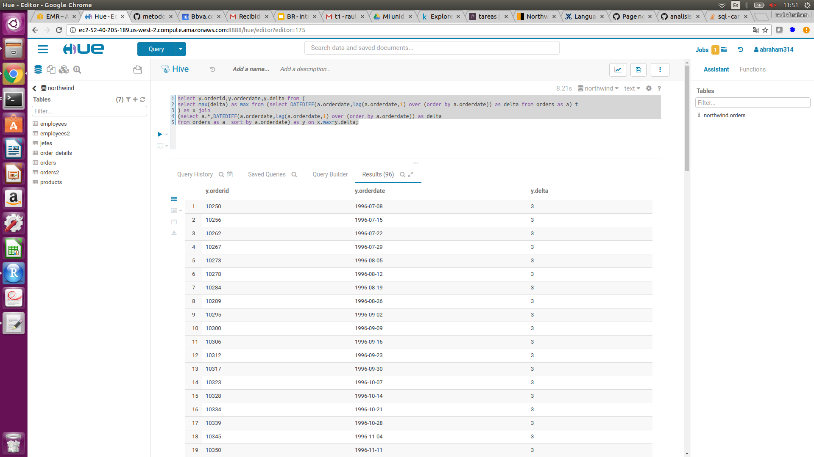

archivo: query-hive-1c.csv

Ejercicio 2. Con los archivos de vuelos, aeropuertos y aerolíneas que están en el dropbox

a. ¿Qué aerolíneas (nombres) llegan al aeropuerto "Honolulu International Airport"?

```{r, eval=FALSE} 
select distinct b.airline as nom_airline,c.airport as lleg_airport from flights.flights as a inner join flights.airlines as b on a.airline=b.iata_code inner join flights.airports as c on 
a.destination_airport=c.iata_code where c.airport=="Honolulu International Airport";
```

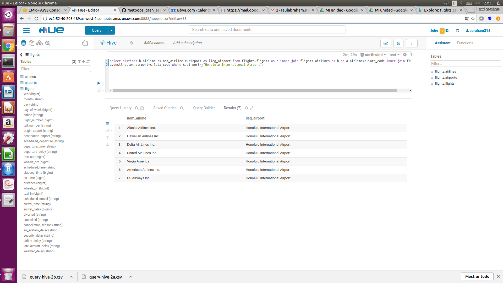

resultados: query-hive-2a.csv

b. ¿En qué horario (hora del día, no importan los minutos) hay salidas del aeropuerto de San Francisco ("SFO") a "Honolulu International Airport"?

```{r, eval=FALSE} 
select distinct substr(x.scheduled_departure,1,2) as hora_sal,x.origin_airport,
y.airport as orig_airport,x.destination_airport,x.lleg_airport  from(select a.*,b.airline as nom_airline,c.airport as lleg_airport from flights.flights as a inner join flights.airlines as b 
on a.airline=b.iata_code inner join flights.airports as c on 
a.destination_airport=c.iata_code  where c.airport=="Honolulu International Airport") as x inner join flights.airports as y 
on x.origin_airport=y.iata_code where y.airport=="San Francisco International Airport";
```

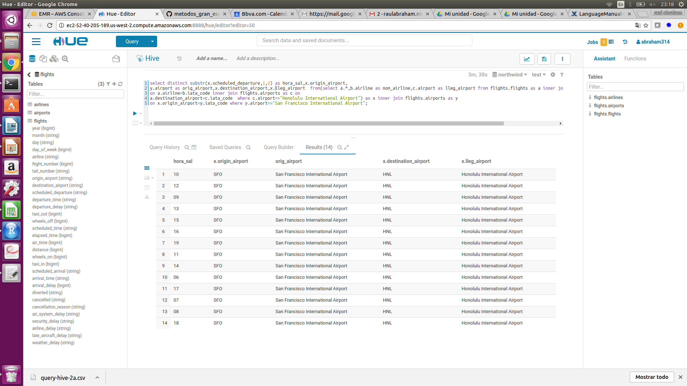


resultados: query-hive-2b.csv

c. ¿Qué día de la semana y en qué aerolínea nos conviene viajar a "Honolulu International Airport" para tener el menor retraso posible? 

**nota: se toma encuenta solo cuando hay retrasos(>0) de salida**, existen varias repuestas para esta pregunta ya que hay distintos dias y aerolineas con el menor retraso.

```{r, eval=FALSE} 
select r.* from (
/*tabla para saber el menor retraso posible de la base con destino honolulu*/
select min(m.departure_delay) as retraso from flights.flights as m join flights.airports as n on m.destination_airport=n.iata_code where departure_delay>0 
and n.airport=="Honolulu International Airport") as s inner join 
/*tabla para saber menores retrasos por dia de la semana y aerolineas*/
(select x.day_of_week,x.nom_airline,min(x.departure_delay) as retraso   
from(select a.*,b.airline as nom_airline,c.airport as lleg_airport from flights.flights as a inner join flights.airlines as b 
on a.airline=b.iata_code inner join flights.airports as c on 
a.destination_airport=c.iata_code  where c.airport=="Honolulu International Airport") as x inner join flights.airports as y on 
x.origin_airport=y.iata_code where x.departure_delay>0 group by x.day_of_week,x.nom_airline 
order by retraso desc) as r on s.retraso=r.retraso order by day_of_week;

```

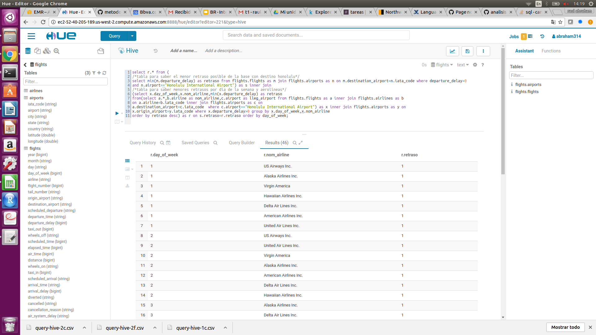


resultados: query-hive-2c.csv


 d. ¿Cuál es el aeropuerto con mayor tráfico de entrada? 

```{r, eval=FALSE} 
select a.destination_airport,b.airport as name,count(*) as trafico from flights.flights as a join flights.airports as b on a.destination_airport=b.iata_code 
group by a.destination_airport,b.airport order by trafico desc limit 1;
```

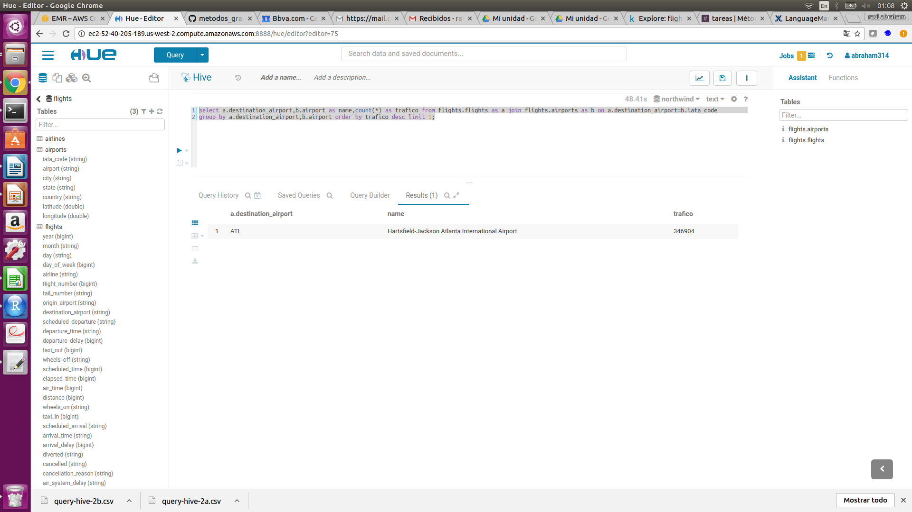

resultados: query-hive-2d.csv

e. ¿Cuál es la aerolínea con mayor retraso de salida por día de la semana?
American Airlines siempre

```{r, eval=FALSE} 
select x.* from(select b.airline, a.day_of_week,max(a.departure_delay) as mayor from flights.flights as a join flights.airlines as b on a.airline=b.iata_code group by b.airline,
a.day_of_week) as x inner join (select day_of_week,max(departure_delay) as mayord from flights.flights group by day_of_week) as y on x.day_of_week=y.day_of_week 
and x.mayor=y.mayord order by x.day_of_week;
```

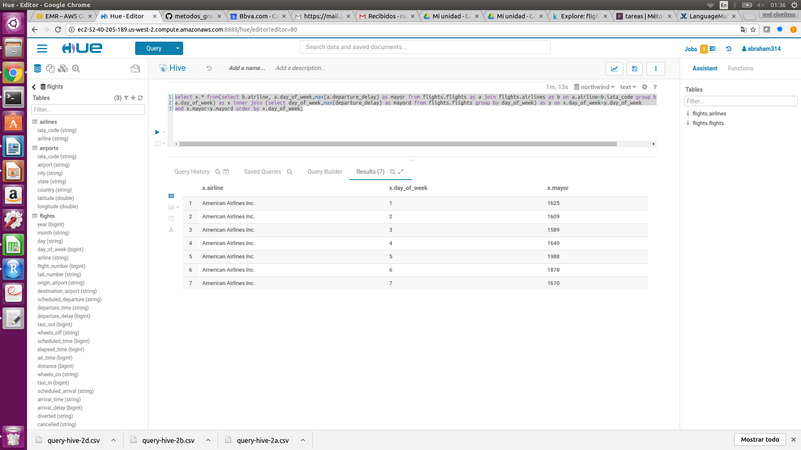

resultados: query-hive-2e.csv

 f. ¿Cuál es la tercer aerolínea con menor retraso de salida los lunes (day of week = 2)?
 
**nota: se toma encuenta solo cuando hay retrasos de salida**

en este caso hay muchos empates y no se puede distinguir el 3ero se deja evidencia comentada de como sería el código si sólo quisieramos de salida la 3er aerolínea.

```{r, eval=FALSE} 
select*from(select b.airline, a.day_of_week,min(a.departure_delay) as menor from flights.flights as a join flights.airlines as b on a.airline=b.iata_code 
where (a.day_of_week==2) and a.departure_delay>0 
group by b.airline,a.day_of_week  order by menor /*limit 3*/) as tb /*order by menor desc limit 1*/;
```

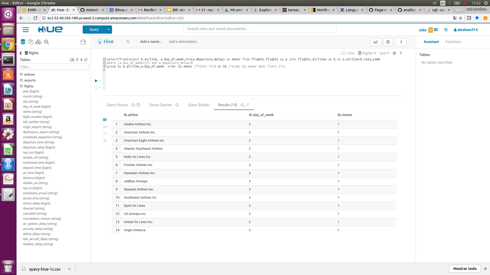

resultados: query-hive-2f.csv

g. ¿Cuál es el aeropuerto origen que llega a la mayor cantidad de aeropuertos destino diferentes?

```{r, eval=FALSE} 
select b.airport as name_airport,a.origin_airport,count(distinct a.destination_airport) as distintos from flights.flights as a 
join flights.airports as b on a.origin_airport=b.iata_code group by b.airport,a.origin_airport order by distintos desc limit 1;
```

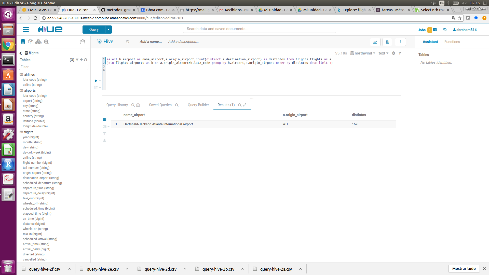

resultados: query-hive-2g.csv

