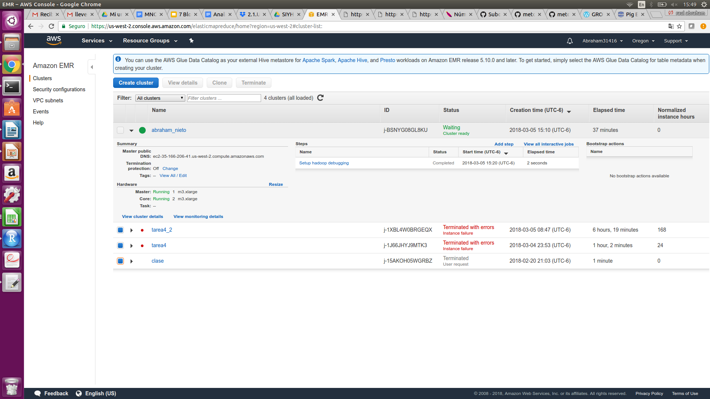
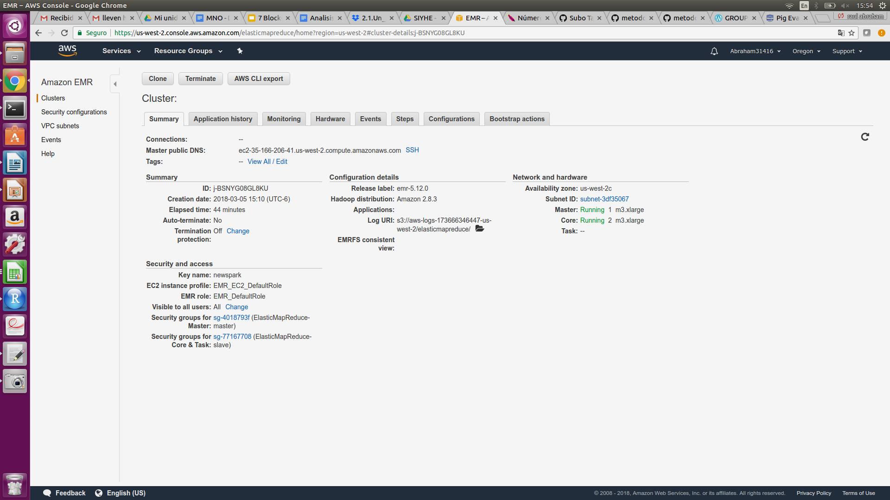
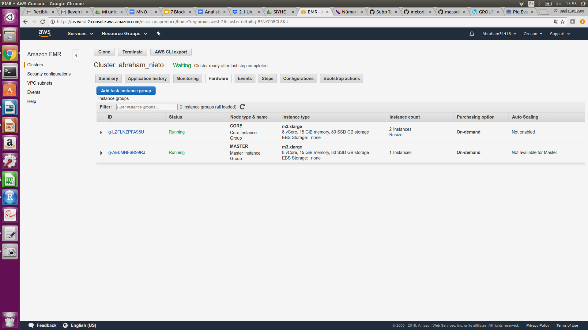
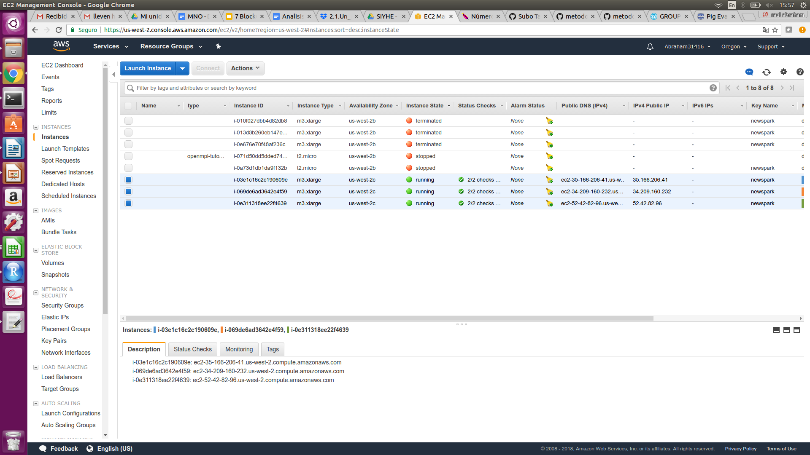

Foto de cluster en AWS 
 




 

Instancias....



A.

Modifica el ejercicio de Rank para que en lugar de obtener el id del producto con mejor rank obtengamos el nombre del producto -requieres un join- con el mejor rank.

**
products = load 's3://tarea4/bases/products.csv' using PigStorage(',') as (productid:chararray, productname:chararray, supplierid:chararray, categoryid:chararray, quantityperunit:int, unitprice:float, unitsinstock:int, unitsonorder:int, reorderlevel:int, discounted:int); 
order_details = load 's3://tarea4/bases/order_details.csv' using PigStorage(',') as (orderid:chararray, productid:chararray, unitprice:float, quantity:int, discount:float); 
order_grp = group order_details by productid; 
a = FOREACH order_grp GENERATE group as productid,COUNT($1) as total; 
ranking =  rank a by total DESC; 
join_products = JOIN ranking by productid, products by productid; 
por_nombre = FOREACH join_products generate productname,total; 
rank_name = rank por_nombre by total DESC;
winner = limit rank_name 1; 
STORE winner INTO 's3://tarea4/outputs/ejer_a' USING PigStorage(',');
**
 resultado: 1,Raclette Courdavault,54
 archivos: ejerpig_11.pig, output_ejera
 
 
 B
 1.-¿Cuántos vuelos existen en el dataset cuyo aeropuerto destino sea el "Honolulu International Airport"?
 
 **
flights = LOAD 's3://tarea4/bases/flights.csv' using PigStorage(',') as (year:float, month:int, day:int, day_of_week:int, airline:chararray, flight_number:float, tail_numer:chararray, origin_airport:chararray, destination_airport:chararray, scheduled_departure:chararray, departure_time: chararray, departure_delay:int, taxi_out:int, wheels_off:chararray, scheduled_time:float, elapsed_time:float, air_time:float, distance:float, wheels_on:chararray, taxi_in:int, scheduled_arrival:chararray, arrival_time:chararray, arrival_delay:int, diverted:int, cancelled:int, cancelation_reason:chararray, air_system_delay:chararray, security_delay:chararray, airline_delay:chararray, late_aircraft_delay:chararray, weather_delay:chararray);
airports = LOAD 's3://tarea4/bases/airports.csv' using PigStorage(',') as (iata_code:chararray, airport:chararray, city:chararray, state:chararray, country:chararray, latitud:float, longitude:float);

join_airports = JOIN flights by destination_airport, airports by iata_code;
hn = filter join_airports by (airport=='Honolulu International Airport');
hn_g = GROUP hn by airport;
hn_count= FOREACH hn_g generate group as airport,COUNT($1) as total;

STORE hn_count INTO 's3://tarea4/outputs/ejer_b1' USING PigStorage(',');
 **
 resultado: Honolulu International Airport,43157
 archivos: ejer_b1.pig, output_ejerb1
 
 2.-¿Cuál es el vuelo con más retraso? ¿De qué aerolínea es?

**
flights = LOAD 's3://tarea4/bases/flights.csv' using PigStorage(',') as (year:float, month:int, day:int, day_of_week:int, airline:chararray, flight_number:float, tail_numer:chararray, origin_airport:chararray, destination_airport:chararray, scheduled_departure:chararray, departure_time: chararray, departure_delay:int, taxi_out:int, wheels_off:chararray, scheduled_time:float, elapsed_time:float, air_time:float, distance:float, wheels_on:chararray, taxi_in:int, scheduled_arrival:chararray, arrival_time:chararray, arrival_delay:int, diverted:int, cancelled:int, cancelation_reason:chararray, air_system_delay:chararray, security_delay:chararray, airline_delay:chararray, late_aircraft_delay:chararray, weather_delay:chararray);

airlines = LOAD 's3://tarea4/bases/airlines.csv' using PigStorage(',') as (iata_code:chararray, airline:chararray);

join_airines = JOIN flights by airline, airlines by iata_code;
ranking = order join_airines by departure_delay DESC;
mas_ret = limit ranking 1;
selected = FOREACH mas_ret GENERATE flight_number,airlines::airline,departure_delay;

STORE selected INTO 's3://tarea4/outputs/ejer_b2' USING PigStorage(',');
**
resultado: 1322.0,American Airlines Inc.,1988
archivos: ejer_b2.pig,output_ejerb2 

3. ¿Qué día es en el que más vuelos cancelados hay?

**
flights = LOAD 's3://tarea4/bases/flights.csv' using PigStorage(',') as (year:float, month:int, day:int, day_of_week:int, airline:chararray, flight_number:float, tail_numer:chararray, origin_airport:chararray, destination_airport:chararray, scheduled_departure:chararray, departure_time: chararray, departure_delay:int, taxi_out:int, wheels_off:chararray, scheduled_time:float, elapsed_time:float, air_time:float, distance:float, wheels_on:chararray, taxi_in:int, scheduled_arrival:chararray, arrival_time:chararray, arrival_delay:int, diverted:int, cancelled:int, cancelation_reason:chararray, air_system_delay:chararray, security_delay:chararray, airline_delay:chararray, late_aircraft_delay:chararray, weather_delay:chararray);

cancel = filter flights by (cancelled==1);
cancel_grp = group cancel by day_of_week;
canday = FOREACH cancel_grp GENERATE group as day_of_week,COUNT($1) as total;
ranking =  order canday by total DESC;
top1 = limit ranking 1;
selected = FOREACH top1 GENERATE day_of_week,total;

STORE selected INTO 's3://tarea4/outputs/ejer_b3' USING PigStorage(',');

**
resultado: 1,21073
archivos: ejer_b3.pig, output_ejerb3


4. ¿Cuáles son los aeropuertos orígen con 17 cancelaciones?

**
flights = LOAD 's3://tarea4/bases/flights.csv' using PigStorage(',') as (year:float, month:int, day:int, day_of_week:int, airline:chararray, flight_number:float, tail_numer:chararray, origin_airport:chararray, destination_airport:chararray, scheduled_departure:chararray, departure_time: chararray, departure_delay:int, taxi_out:int, wheels_off:chararray, scheduled_time:float, elapsed_time:float, air_time:float, distance:float, wheels_on:chararray, taxi_in:int, scheduled_arrival:chararray, arrival_time:chararray, arrival_delay:int, diverted:int, cancelled:int, cancelation_reason:chararray, air_system_delay:chararray, security_delay:chararray, airline_delay:chararray, late_aircraft_delay:chararray, weather_delay:chararray);

airports = LOAD 's3://tarea4/bases/airports.csv' using PigStorage(',') as (iata_code:chararray, airport:chararray, city:chararray, state:chararray, country:chararray, latitud:float, longitude:float);

cancel = filter flights by (cancelled==1);

cancel_aigrp = group cancel by origin_airport; 

canaip = FOREACH cancel_aigrp GENERATE group as origin_airport,COUNT($1) as total; 
can17 = filter canaip by (total==17); 

join_airp = JOIN can17 by origin_airport, airports by iata_code; 

STORE join_airp INTO 's3://tarea4/outputs/ejer_b4' USING PigStorage(',');
**

resultado: DHN,17,DHN,Dothan Regional Airport,Dothan,AL,USA,31.32134,-85.44963
DIK,17,DIK,Dickinson Theodore Roosevelt Regional Airport,Dickinson,ND,USA,46.79739,-102.80195
ESC,17,ESC,Delta County Airport,Escanaba,MI,USA,45.72267,-87.09373

archivos: ejer_b4.pig, output_ejerb4

5. ¿Cuál es el aeropuerto origen con más vuelos cancelados?
 **
 flights = LOAD 's3://tarea4/bases/flights.csv' using PigStorage(',') as (year:float, month:int, day:int, day_of_week:int, airline:chararray, flight_number:float, tail_numer:chararray, origin_airport:chararray, destination_airport:chararray, scheduled_departure:chararray, departure_time: chararray, departure_delay:int, taxi_out:int, wheels_off:chararray, scheduled_time:float, elapsed_time:float, air_time:float, distance:float, wheels_on:chararray, taxi_in:int, scheduled_arrival:chararray, arrival_time:chararray, arrival_delay:int, diverted:int, cancelled:int, cancelation_reason:chararray, air_system_delay:chararray, security_delay:chararray, airline_delay:chararray, late_aircraft_delay:chararray, weather_delay:chararray);

airports = LOAD 's3://tarea4/bases/airports.csv' using PigStorage(',') as (iata_code:chararray, airport:chararray, city:chararray, state:chararray, country:chararray, latitud:float, longitude:float);

cancel = filter flights by (cancelled==1);
cancel_aigrp = group cancel by origin_airport; 
canaip = FOREACH cancel_aigrp GENERATE group as origin_airport,COUNT($1) as total; 
ranking =  order canaip by total DESC; 
top1 = limit ranking 1; 
join_top1 = JOIN top1 by origin_airport, airports by iata_code; 

STORE join_top1 INTO 's3://tarea4/outputs/ejer_b5' USING PigStorage(',');
 **
 resultado: ORD,8548,ORD,Chicago O'Hare International Airport,Chicago,IL,USA,41.9796,-87.90446
 archivos: ejer_b5.pig,output_ejerb5
 
 6. ¿Cuál es el vuelo (flight number) con mayor diversidad de aeropuertos destino, cuáles son estos destinos? (ocupar bag te ayudará en esta pregunta)
 
 **
 flights = LOAD 's3://tarea4/bases/flights.csv' using PigStorage(',') as (year:float, month:int, day:int, day_of_week:int, airline:chararray, flight_number:float, tail_numer:chararray, origin_airport:chararray, destination_airport:chararray, scheduled_departure:chararray, departure_time: chararray, departure_delay:int, taxi_out:int, wheels_off:chararray, scheduled_time:float, elapsed_time:float, air_time:float, distance:float, wheels_on:chararray, taxi_in:int, scheduled_arrival:chararray, arrival_time:chararray, arrival_delay:int, diverted:int, cancelled:int, cancelation_reason:chararray, air_system_delay:chararray, security_delay:chararray, airline_delay:chararray, late_aircraft_delay:chararray, weather_delay:chararray);

airports = LOAD 's3://tarea4/bases/airports.csv' using PigStorage(',') as (iata_code:chararray, airport:chararray, city:chararray, state:chararray, country:chararray, latitud:float, longitude:float);

grp_vuelos = group flights by flight_number; 


n_dest = foreach grp_vuelos { 
    unique_dest = DISTINCT flights.destination_airport;
    generate group, COUNT(unique_dest) as dest_cnt;
};

ranking =  order n_dest by dest_cnt DESC; 
top1 = limit ranking 1; 
join_top1 = JOIN flights by flight_number,top1 by group; 
aerotop = foreach join_top1 generate flight_number,destination_airport; 
aero_dist = DISTINCT aerotop; 
aero_desf = JOIN aero_dist by destination_airport, airports by iata_code;

STORE aero_desf INTO 's3://tarea4/outputs/ejer_b6' USING PigStorage(',');
 **

resultados: 
```{r, eval=FALSE} 
202.0,ATL,ATL,Hartsfield-Jackson Atlanta International Airport,Atlanta,GA,USA,33.64044,-84.42694
202.0,AUS,AUS,Austin-Bergstrom International Airport,Austin,TX,USA,30.19453,-97.66987
202.0,BDL,BDL,Bradley International Airport,Windsor Locks,CT,USA,41.93887,-72.68323
202.0,BNA,BNA,Nashville International Airport,Nashville,TN,USA,36.12448,-86.67818
202.0,BOS,BOS,Gen. Edward Lawrence Logan International Airport,Boston,MA,USA,42.36435,-71.00518
202.0,BWI,BWI,Baltimore-Washington International Airport,Baltimore,MD,USA,39.1754,-76.6682
202.0,CAK,CAK,Akron-Canton Regional Airport,Akron,OH,USA,40.91631,-81.44247
202.0,CLE,CLE,Cleveland Hopkins International Airport,Cleveland,OH,USA,41.41089,-81.8494
202.0,DCA,DCA,Ronald Reagan Washington National Airport,Arlington,VA,USA,38.85208,-77.03772
202.0,DEN,DEN,Denver International Airport,Denver,CO,USA,39.85841,-104.667
202.0,DTW,DTW,Detroit Metropolitan Airport,Detroit,MI,USA,42.21206,-83.34884
202.0,EWR,EWR,Newark Liberty International Airport,Newark,NJ,USA,40.6925,-74.16866
202.0,FLL,FLL,Fort Lauderdale-Hollywood International Airport,Ft. Lauderdale,FL,USA,26.07258,-80.15275
202.0,FNT,FNT,Bishop International Airport,Flint,MI,USA,42.9655,-83.74346
202.0,IAD,IAD,Washington Dulles International Airport,Chantilly,VA,USA,38.94453,-77.45581
202.0,IAH,IAH,George Bush Intercontinental Airport,Houston,TX,USA,29.98047,-95.33972
202.0,IND,IND,Indianapolis International Airport,Indianapolis,IN,USA,39.71733,-86.29438
202.0,ITO,ITO,Hilo International Airport,Hilo,HI,USA,19.72026,-155.04848
202.0,JFK,JFK,John F. Kennedy International Airport (New York International Airport),New York,NY,USA,40.63975,-73.77893
202.0,LAS,LAS,McCarran International Airport,Las Vegas,NV,USA,36.08036,-115.15233
202.0,LAX,LAX,Los Angeles International Airport,Los Angeles,CA,USA,33.94254,-118.40807
202.0,LGA,LGA,LaGuardia Airport (Marine Air Terminal),New York,NY,USA,40.77724,-73.87261
202.0,MCO,MCO,Orlando International Airport,Orlando,FL,USA,28.42889,-81.31603
202.0,MDW,MDW,Chicago Midway International Airport,Chicago,IL,USA,41.78598,-87.75242
202.0,MKE,MKE,General Mitchell International Airport,Milwaukee,WI,USA,42.94722,-87.89658
202.0,MSN,MSN,Dane County Regional Airport,Madison,WI,USA,43.13986,-89.33751
202.0,MSP,MSP,Minneapolis-Saint Paul International Airport,Minneapolis,MN,USA,44.88055,-93.21692
202.0,OAK,OAK,Oakland International Airport,Oakland,CA,USA,37.72129,-122.22072
202.0,OGG,OGG,Kahului Airport,Kahului,HI,USA,20.89865,-156.43047
202.0,OKC,OKC,Will Rogers World Airport,Oklahoma City,OK,USA,35.39309,-97.60073
202.0,ORD,ORD,Chicago O'Hare International Airport,Chicago,IL,USA,41.9796,-87.90446
202.0,PDX,PDX,Portland International Airport,Portland,OR,USA,45.58872,-122.5975
202.0,PHL,PHL,Philadelphia International Airport,Philadelphia,PA,USA,39.87195,-75.24114
202.0,PHX,PHX,Phoenix Sky Harbor International Airport,Phoenix,AZ,USA,33.43417,-112.00806
202.0,PIT,PIT,Pittsburgh International Airport,Pittsburgh,PA,USA,40.49147,-80.23287
202.0,RDU,RDU,Raleigh-Durham International Airport,Raleigh,NC,USA,35.87764,-78.78747
202.0,RNO,RNO,Reno/Tahoe International Airport,Reno,NV,USA,39.49858,-119.76806
202.0,RSW,RSW,Southwest Florida International Airport,Ft. Myers,FL,USA,26.53617,-81.75517
202.0,SAN,SAN,San Diego International Airport (Lindbergh Field),San Diego,CA,USA,32.73356,-117.18966
202.0,SAT,SAT,San Antonio International Airport,San Antonio,TX,USA,29.53369,-98.46978
202.0,SEA,SEA,Seattle-Tacoma International Airport,Seattle,WA,USA,47.44898,-122.30931
202.0,SFO,SFO,San Francisco International Airport,San Francisco,CA,USA,37.619,-122.37484
202.0,SLC,SLC,Salt Lake City International Airport,Salt Lake City,UT,USA,40.78839,-111.97777
202.0,SMF,SMF,Sacramento International Airport,Sacramento,CA,USA,38.69542,-121.59077
202.0,TPA,TPA,Tampa International Airport,Tampa,FL,USA,27.97547,-82.53325

```

archivos: ejer_b6.pig, output_ejerb6
