se muestra el cluster en AWS:
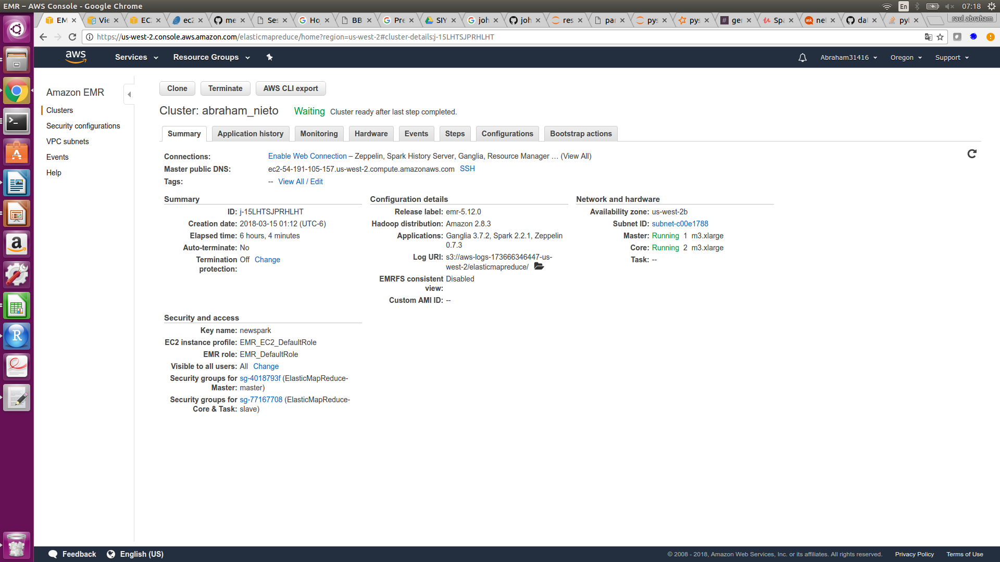


Ejercicio 1. Con la base de datos de northwind que se encuentran en el dropbox:

a. ¿Cuántos "jefes" hay en la tabla empleados? 

parte1 primero la tabla de los jefes son 2:

Primer codigo para ver a los jefes...
```{r, eval=FALSE} 
%pyspark 

from pyspark.sql import functions as F
jefes=employees.select(employees.reportsto,employees.firstname).filter(
employees.reportsto.isNotNull()).groupby(
'reportsto').agg(F.collect_set('firstname').alias('empleados'))

sd=employees.select(employees.employeeid,
employees.lastname,employees.firstname,employees.title,employees.birthdate,
employees.hiredate,employees.city,employees.country).join(jefes,jefes.reportsto==employees.employeeid)
sd.show()

```

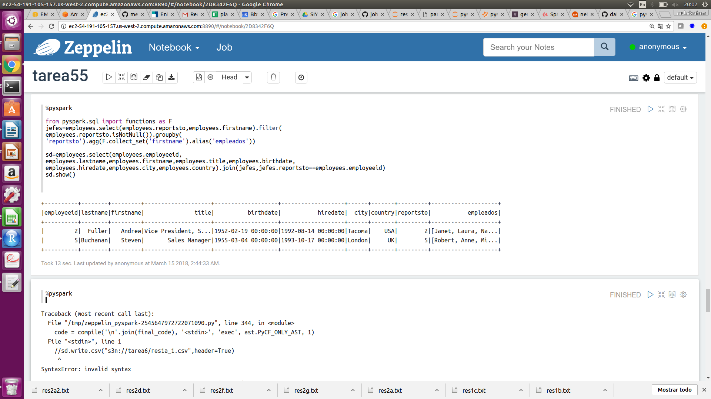


segundo codigo para usar el explode....¿Cuáles son estos jefes: número de empleado, nombre, apellido, título, fecha de nacimiento, fecha en que iniciaron en la empresa, ciudad y país? (atributo reportsto, ocupa explode en tu respuesta)

```{r, eval=FALSE} 
from pyspark.sql.functions import split, explode
sd.select('employeeid','lastname','firstname','title','birthdate','hiredate','city','country',
explode(sd.empleados)).show()

```

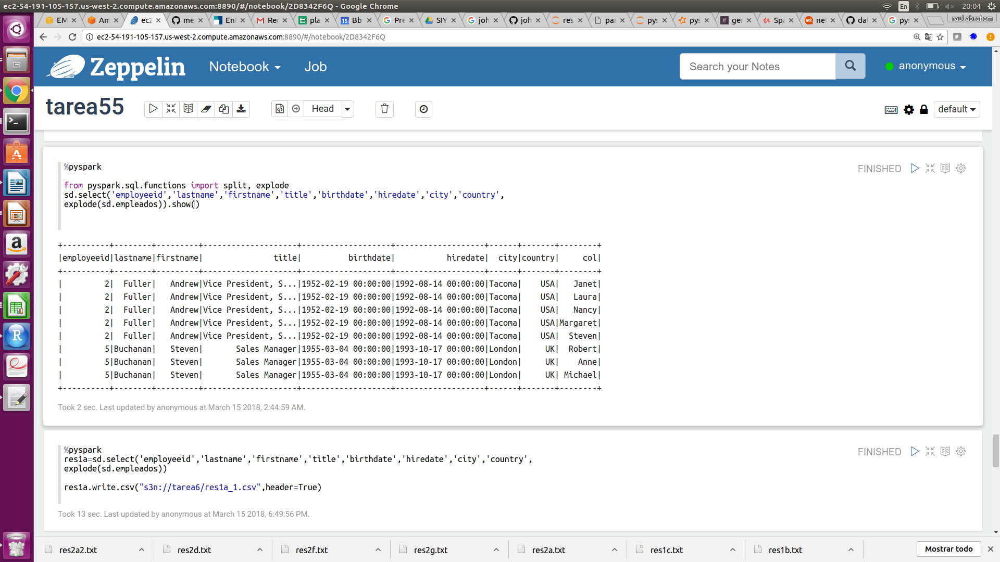


archivo de salida: res1a.txt

b. ¿Quién es el segundo "mejor" empleado que más órdenes ha generado? (nombre, apellido, título, cuándo entró a la compañía, número de órdenes generadas, número de órdenes generadas por el mejor empleado (número 1))


```{r, eval=FALSE} 
%pyspark

from pyspark.sql.window import Window
a=orders.select('employeeid').groupby('employeeid').count().sort(desc('count')).limit(2)
aa=a.withColumn('ord_emp1',F.lag(a['count'],1).over(Window.partitionBy().orderBy(desc("count"
)))).sort("count").limit(1)

aa.join(employees,employees.employeeid==aa.employeeid).select(aa.employeeid,employees.firstname,
employees.lastname,employees.title,employees.hiredate,"count","ord_emp1").show()

```

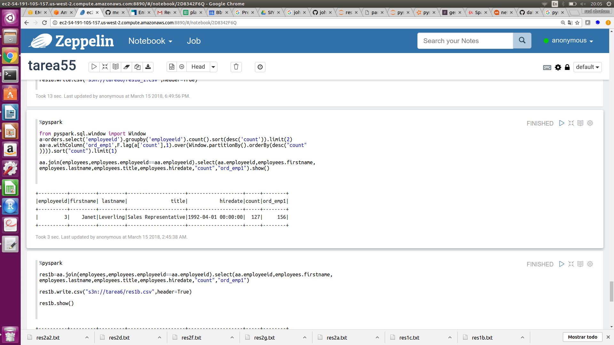

resultados: res1b.txt

c. ¿Cuál es el delta de tiempo más grande entre una orden y otra?

el máximo delta es 3.

```{r, eval=FALSE} 
%pyspark

w=orders.withColumn('delta',F.datediff(orders['orderdate'],F.lag(orders['orderdate'],
1).over(Window.partitionBy().orderBy("orderdate"))))

w.select(F.max('delta').alias('max_delta')).show() 
```

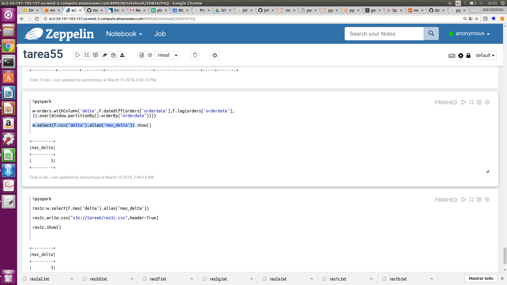


archivo: res1c.txt

Ejercicio 2. Con los archivos de vuelos, aeropuertos y aerolíneas que están en el dropbox

a. ¿Qué aerolíneas (nombres) llegan al aeropuerto "Honolulu International Airport"?

```{r, eval=FALSE} 
%pyspark
flights.select('AIRLINE',"DESTINATION_AIRPORT").join(airlines,flights.AIRLINE==
airlines.IATA_CODE).join(airports,flights.DESTINATION_AIRPORT==
airports.IATA_CODE).select(flights.DESTINATION_AIRPORT,airlines.AIRLINE,
airports.AIRPORT).filter(airports.AIRPORT=="Honolulu International Airport").distinct().show()
```

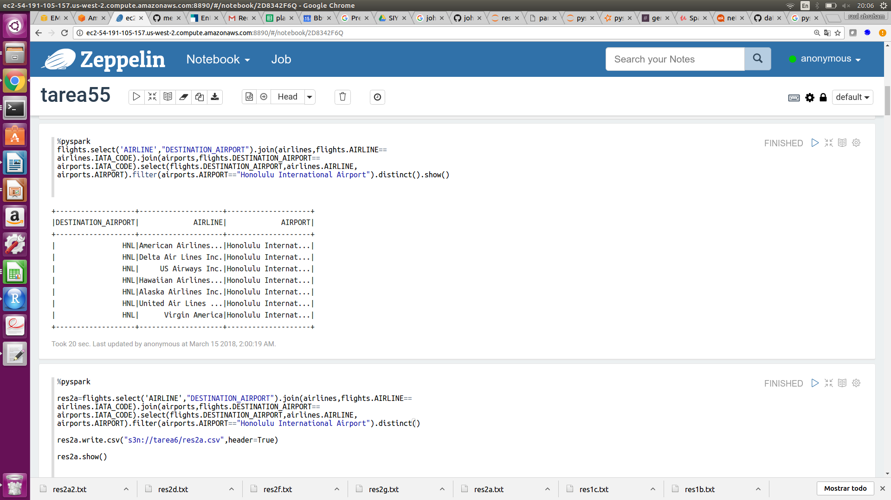

resultados: res2a.txt

b. ¿En qué horario (hora del día, no importan los minutos) hay salidas del aeropuerto de San Francisco ("SFO") a "Honolulu International Airport"?

```{r, eval=FALSE} 
%pyspark

flights.withColumn('hr',
              flights['SCHEDULED_DEPARTURE'].substr(1,2)
     ).join(airlines,flights.AIRLINE==
airlines.IATA_CODE).join(airports,flights.DESTINATION_AIRPORT==
airports.IATA_CODE).filter(airports.AIRPORT==
"Honolulu International Airport").filter(flights.ORIGIN_AIRPORT=="SFO").select('hr','ORIGIN_AIRPORT',
airports.AIRPORT).distinct().sort('hr').show()
```

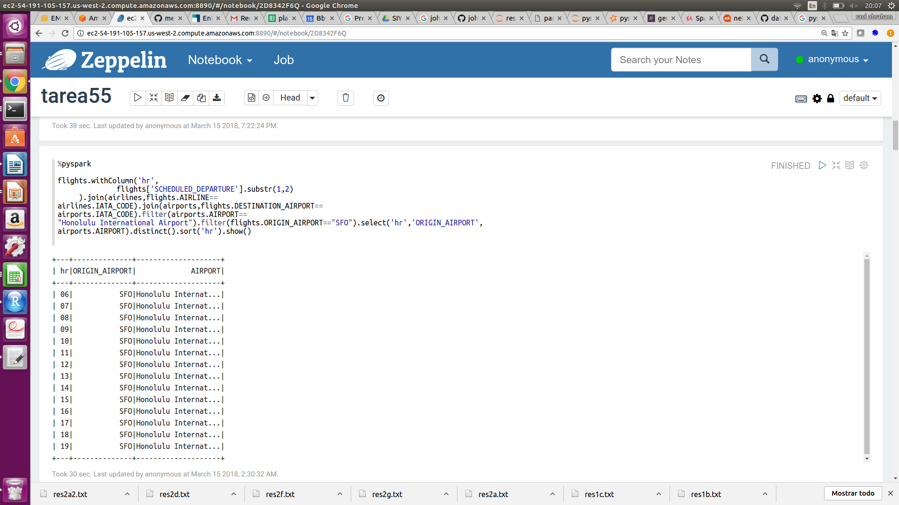


resultados: res2b.txt

c. ¿Qué día de la semana y en qué aerolínea nos conviene viajar a "Honolulu International Airport" para tener el menor retraso posible? 

**nota: se toma encuenta solo cuando hay retrasos(>0) de salida**, existen varias repuestas para esta pregunta ya que hay distintos dias y aerolineas con el menor retraso.

```{r, eval=FALSE} 
%pyspark
import pyspark.sql.functions as fn

dmins=flights.join(airlines,flights.AIRLINE==
airlines.IATA_CODE).join(airports,flights.DESTINATION_AIRPORT==
airports.IATA_CODE).filter(airports.AIRPORT==
"Honolulu International Airport").filter(flights.DEPARTURE_DELAY>0).select('DAY_OF_WEEK',
airlines.AIRLINE,flights.DEPARTURE_DELAY).groupby(['DAY_OF_WEEK',airlines.AIRLINE]
).agg(fn.min(flights.DEPARTURE_DELAY).alias('min_delay')).sort('DAY_OF_WEEK')

mins=flights.select('DAY_OF_WEEK',
'DEPARTURE_DELAY').filter(flights.DEPARTURE_DELAY
>0).groupby('DAY_OF_WEEK').agg(fn.min('DEPARTURE_DELAY').alias('min_delay'))

dmins.join(mins,(mins.DAY_OF_WEEK==dmins.DAY_OF_WEEK) & (mins.min_delay==dmins.min_delay)).select(
dmins.DAY_OF_WEEK,dmins.AIRLINE,dmins.min_delay).sort('DAY_OF_WEEK').show(50)

```

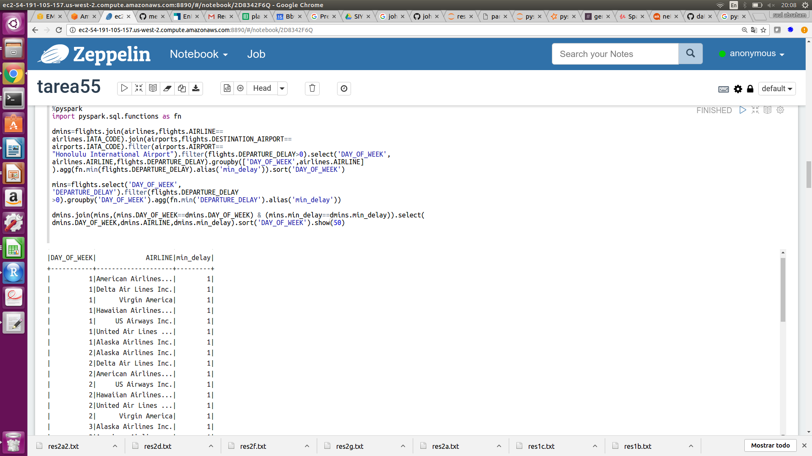


resultados: res2c.txt


 d. ¿Cuál es el aeropuerto con mayor tráfico de entrada? 

```{r, eval=FALSE} 
%pyspark

from pyspark.sql.functions import desc

flights.join(airports,airports.IATA_CODE==
flights.DESTINATION_AIRPORT).select(airports.AIRPORT).groupby('AIRPORT').count().sort(desc('count')).first()
```

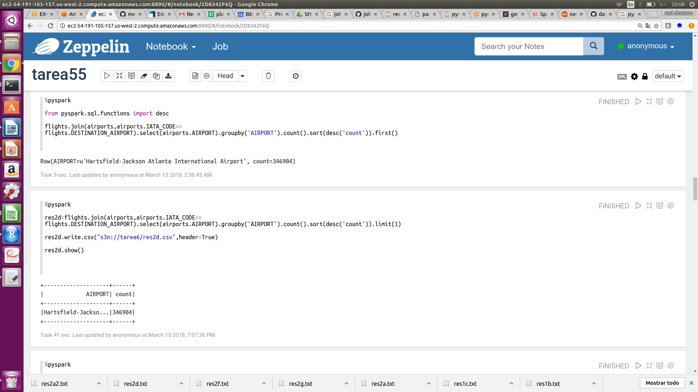

resultados: res2d.txt

e. ¿Cuál es la aerolínea con mayor retraso de salida por día de la semana?
American Airlines siempre

```{r, eval=FALSE} 
%pyspark

dmax=flights.join(airlines,flights.AIRLINE==
airlines.IATA_CODE).select('DAY_OF_WEEK',
airlines.AIRLINE,flights.DEPARTURE_DELAY).groupby(['DAY_OF_WEEK',airlines.AIRLINE]
).agg(fn.max(flights.DEPARTURE_DELAY).alias('max_delay'))

maxs=flights.select('DAY_OF_WEEK','DEPARTURE_DELAY').groupby('DAY_OF_WEEK').agg(fn.max('DEPARTURE_DELAY').alias('max_delay'))

dmax.join(maxs,(maxs.DAY_OF_WEEK==dmax.DAY_OF_WEEK) & (maxs.max_delay==dmax.max_delay)).select(
dmax.DAY_OF_WEEK,dmax.AIRLINE,dmax.max_delay).sort(desc('max_delay')).show()
```

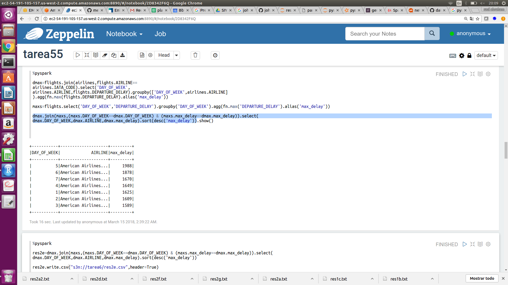

resultados: res2e.txt

 f. ¿Cuál es la tercer aerolínea con menor retraso de salida los lunes (day of week = 2)?
 
**nota: se toma encuenta solo cuando hay retrasos de salida**

en este caso hay muchos empates y no se puede distinguir el 3ero se deja evidencia comentada de como sería el código si sólo quisieramos de salida la 3er aerolínea.

```{r, eval=FALSE} 
%pyspark

flights.join(airlines,flights.AIRLINE==
airlines.IATA_CODE).filter((flights.DAY_OF_WEEK==2) & 
(flights.DEPARTURE_DELAY>0)).select(flights.DAY_OF_WEEK,airlines.AIRLINE,
flights.DEPARTURE_DELAY).groupby([flights.DAY_OF_WEEK,airlines.AIRLINE]).agg(fn.min(
flights.DEPARTURE_DELAY).alias('min_delay')).sort('min_delay').show()
#limit(3).sort(desc("min_delay")).limit(1).show()

```

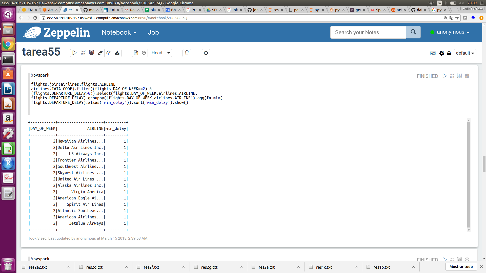

resultados: res2f.txt

g. ¿Cuál es el aeropuerto origen que llega a la mayor cantidad de aeropuertos destino diferentes?

```{r, eval=FALSE} 
%pyspark

from pyspark.sql.functions import countDistinct
flights.join(airports,airports.IATA_CODE==flights.ORIGIN_AIRPORT).select(airports.AIRPORT,
flights.DESTINATION_AIRPORT).groupby('AIRPORT').agg(
countDistinct('DESTINATION_AIRPORT').alias('num_destinos')).sort(desc('num_destinos')).take(1)
```

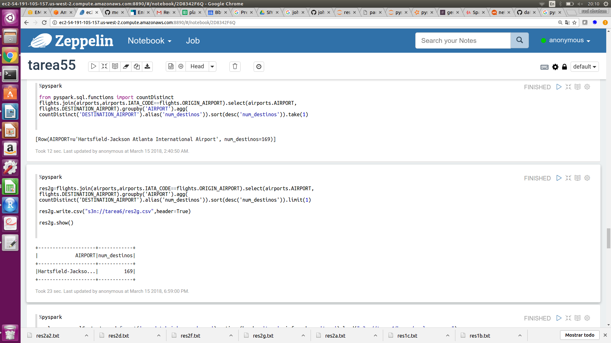

resultados: res2g.txt


