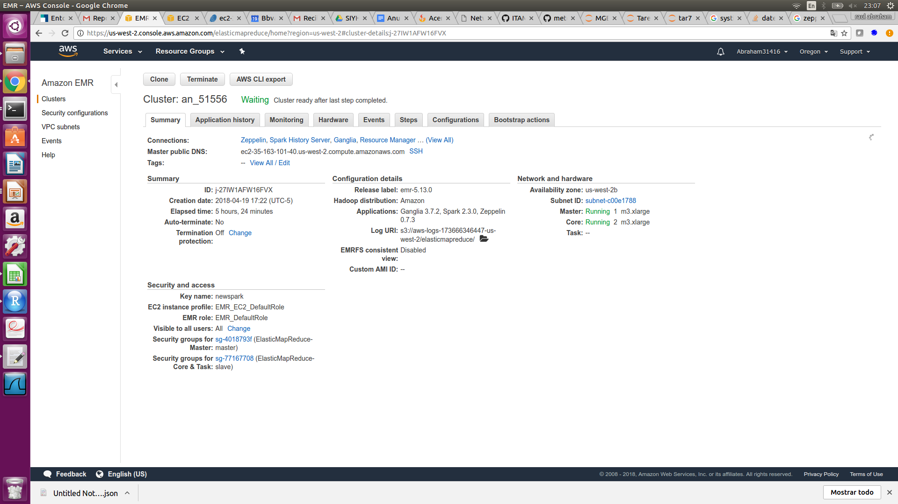
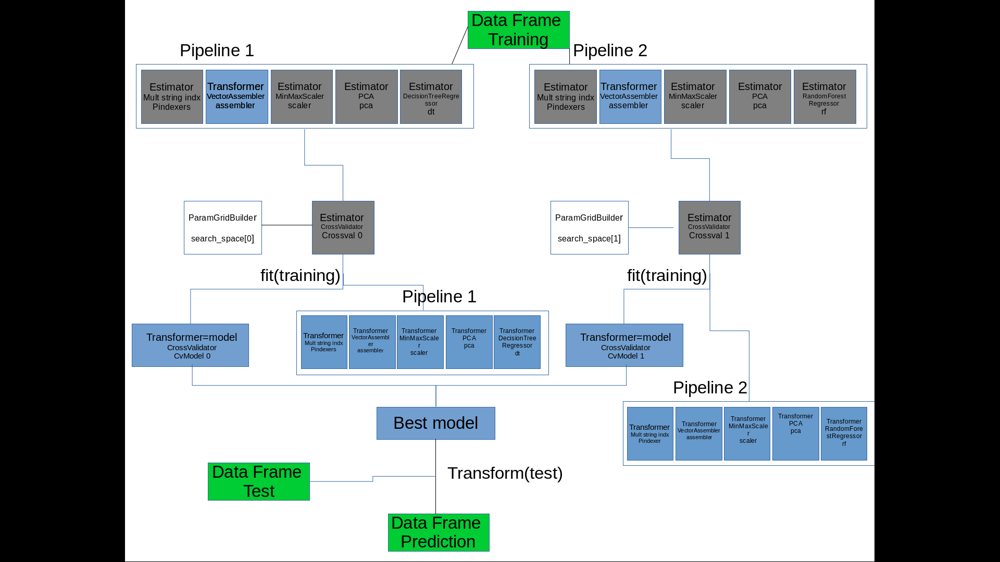
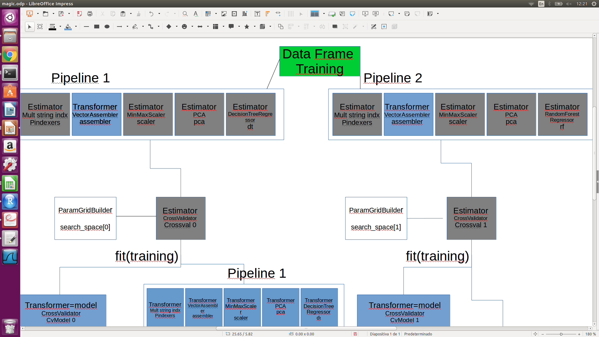
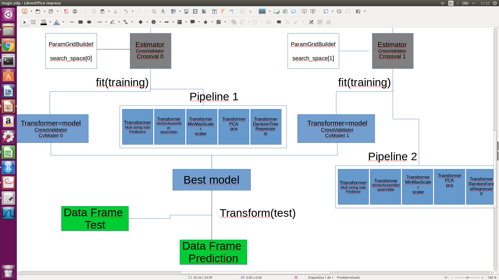
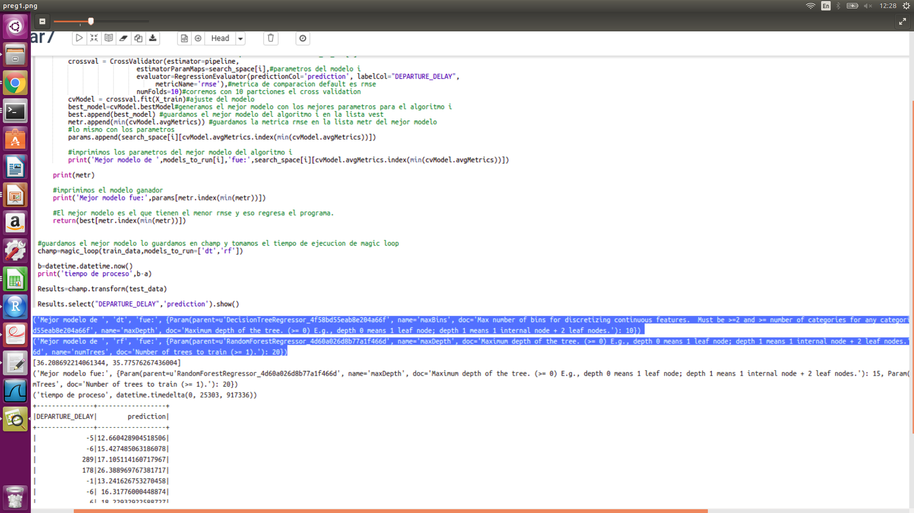
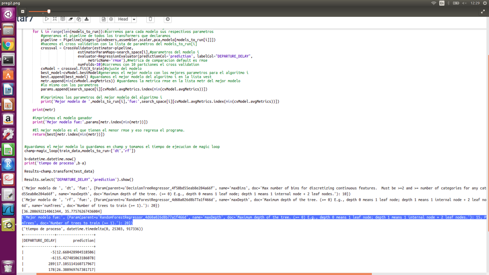
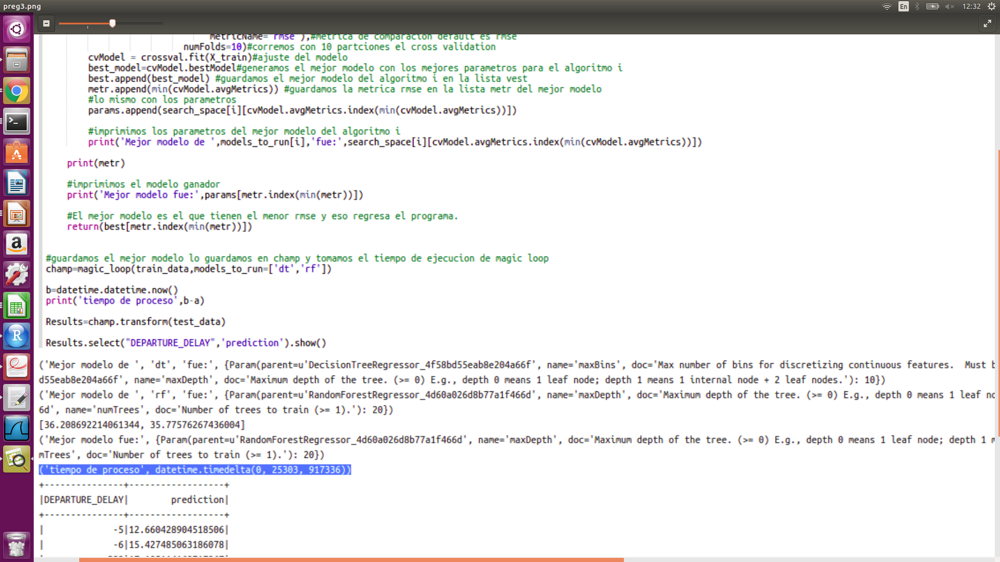

Se incluye luster

Diagrama de Elementos del magic loop, el diagram solo muestra el proceso de lo que sucede dentro del magic loop.

Loas algoritmos probados fueron un DecisionTreeRegressor y un RandomForestRegressor

Mas de cerca:

Preguntas:

¿Qué parametros resultaron mejor por algoritmo?

DecisionTreeRegressor el mejor modelo fue con parametros maxbins=20 y Maxdepth=10.
RandomForestRegressor el mejor modelo fue con parametros numTrees=20 y Maxdepth=15.

¿Qué algoritmo resultó el mejor, con qué parámetros?

RandomForestRegressor  con parametros numTrees=20 y Maxdepth=15.

Indicar el tiempo de ejecución de la función de magic loop 

7 hrs 2 mins 33 seg

