# Tarea 5: HIVE

Con base en las bases de datos de Northwind y Flights se realizan 2 ejercicios.
Previo a la resolución de estos se elabora un script de carga de datos, con el cual se construirán 2 bases de datos cargando en cada una las respectivas tablas que corresponden a Northwind y Flights.

## Imagen Docker
Para la resolución de la tarea se decidió utilizar la imagen de docker:
- nagasuga/docker-hive 

Con una carpeta volumen.

Las bases de datos de Northwind y Flights se descargan directamente de la carpeta de dropbox y se depositan en el volumen del contenedor:
- /Volume/

La carga de datos se hace mediante el script "Carga de Datos"
```
-- FLIGHTS

CREATE DATABASE flights_tarea;

USE flights_tarea;

CREATE EXTERNAL TABLE IF NOT EXISTS flights(YEAR INT,MONTH INT,DAY INT,DAY_OF_WEEK INT,AIRLINE STRING,FLIGHT_NUMBER INT,TAIL_NUMBER STRING,ORIGIN_AIRPORT STRING,DESTINATION_AIRPORT STRING,SCHEDULED_DEPARTURE INT,DEPARTURE_TIME INT,DEPARTURE_DELAY INT,TAXI_OUT INT,WHEELS_OFF INT,SCHEDULED_TIME INT,ELAPSED_TIME INT,AIR_TIME INT,DISTANCE INT,WHEELS_ON INT,TAXI_IN INT,SCHEDULED_ARRIVAL INT,ARRIVAL_TIME INT,ARRIVAL_DELAY INT,DIVERTED INT,CANCELLED INT,CANCELLATION_REASON INT,AIR_SYSTEM_DELAY INT,SECURITY_DELAY INT,AIRLINE_DELAY INT,LATE_AIRCRAFT_DELAY INT,WEATHER_DELAY INT)
COMMENT 'Vuelos transaccional'
ROW FORMAT DELIMITED
FIELDS TERMINATED BY ','
STORED AS TEXTFILE;

LOAD DATA LOCAL INPATH '/Volume/flights/flights.csv' INTO TABLE flights;


CREATE EXTERNAL TABLE IF NOT EXISTS airlines(IATA_CODE STRING,AIRLINE STRING)
COMMENT 'Líneas Aéreas'
ROW FORMAT DELIMITED
FIELDS TERMINATED BY ','
STORED AS TEXTFILE;

LOAD DATA LOCAL INPATH '/Volume/flights/airlines.csv' INTO TABLE airlines;


CREATE EXTERNAL TABLE IF NOT EXISTS airports(IATA_CODE STRING,AIRPORT STRING,CITY STRING,STATE STRING,COUNTRY STRING,LATITUDE FLOAT,LONGITUDE FLOAT)
COMMENT 'Aeropuertos'
ROW FORMAT DELIMITED
FIELDS TERMINATED BY ','
STORED AS TEXTFILE;

LOAD DATA LOCAL INPATH '/Volume/flights/airports.csv' INTO TABLE airports;

--NORTHWIND

CREATE DATABASE northwind_tarea;

USE northwind_tarea;

CREATE EXTERNAL TABLE IF NOT EXISTS customers(customerid STRING,companyname STRING,contactname STRING,contacttitle STRING,address STRING,city STRING,region STRING,postalcode STRING,country STRING,phone STRING,fax STRING)
COMMENT 'Clientes'
ROW FORMAT DELIMITED
FIELDS TERMINATED BY ','
STORED AS TEXTFILE;

LOAD DATA LOCAL INPATH '/Volume/northwind/customers.csv' INTO TABLE customers;


CREATE EXTERNAL TABLE IF NOT EXISTS employees(employeeid STRING, lastname STRING, firstname STRING, title STRING, titleofcourtesy STRING, birthdate STRING, hiredate STRING, address STRING, city STRING, region STRING, postalcode STRING, country STRING, homephone STRING, extension STRING, photo STRING, notes STRING, reportsto STRING, photopath STRING)
COMMENT 'Empleados'
ROW FORMAT DELIMITED
FIELDS TERMINATED BY ','
STORED AS TEXTFILE;

LOAD DATA LOCAL INPATH '/Volume/northwind/employees.csv' INTO TABLE employees;


CREATE EXTERNAL TABLE IF NOT EXISTS orderDetails(orderid INT, productid INT, unitprice INT, quantity INT, discount INT)
COMMENT 'Transaccional Ordenes'
ROW FORMAT DELIMITED
FIELDS TERMINATED BY ','
STORED AS TEXTFILE;

LOAD DATA LOCAL INPATH '/Volume/northwind/order_details.csv' INTO TABLE orderDetails;


CREATE EXTERNAL TABLE IF NOT EXISTS orders(orderid INT, customerid STRING, employeeid INT, orderdate STRING, requireddate STRING, shippeddate STRING, shipvia INT, freight FLOAT, shipname STRING, shipaddress STRING, shipcity STRING, shipregion STRING, shippostalcode STRING, shipcountry STRING)
COMMENT 'Ordenes'
ROW FORMAT DELIMITED
FIELDS TERMINATED BY ','
STORED AS TEXTFILE;

LOAD DATA LOCAL INPATH '/Volume/northwind/orders.csv' INTO TABLE orders;


CREATE EXTERNAL TABLE IF NOT EXISTS products(productid FLOAT, productname STRING, supplierid FLOAT, categoryid FLOAT, quantityperunit STRING, unitprice FLOAT, unitsinstock FLOAT, unitsonorder FLOAT, reorderlevel FLOAT, discontinued FLOAT)
COMMENT 'Productos'
ROW FORMAT DELIMITED
FIELDS TERMINATED BY ','
STORED AS TEXTFILE;

LOAD DATA LOCAL INPATH '/Volume/northwind/products.csv' INTO TABLE products;
```


## Ejercicio 1:

### a. ¿Cuántos "jefes" hay en la tabla empleados? ¿Cuáles son estos jefes: número de empleado, nombre, apellido, título, fecha de nacimiento, fecha en que iniciaron en la empresa, ciudad y país?

Ya que el estatus de jefe no está definido, se considera a jefes desde managers hasta vicepresidentes, con lo cual se ejecuta el query:
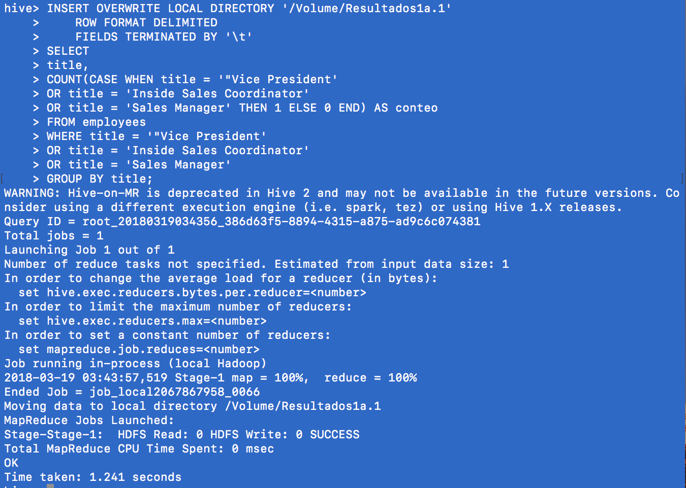

Con el output:
```
"Vice President	1
Inside Sales Coordinator	1
Sales Manager	1
```

Que determina los conteos de cada titulo.

Para encontrar cada caso se ejecuta:


con el output:
```
2	Andrew	Fuller	"Vice President	Dr.	1952-02-19	908 W. Capital Way	98401
5	Steven	Buchanan	Sales Manager	1955-03-04	1993-10-17	London	UK
8	Laura	Callahan	Inside Sales Coordinator	1958-01-09	1994-03-05	Seattle	USA
```

### b. ¿Quién es el segundo "mejor" empleado que más órdenes ha generado? (nombre, apellido, título, cuándo entró a la compañía, número de órdenes generadas, número de órdenes generadas por el mejor empleado (número 1)) 

Para esta pregunta se debe de perfeccionar el arte del subquery, ya que se debe de hacer una segunda capa de procesamiento sobre un query solicitado a un join:
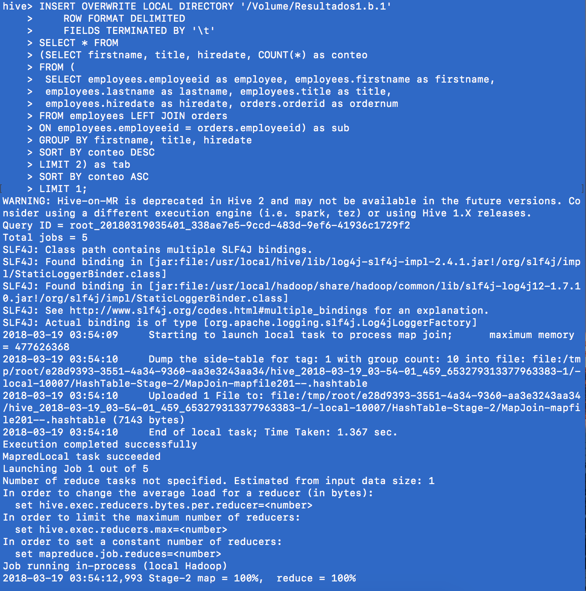
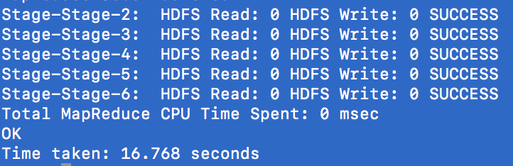

con el output:
```
Janet	Sales Representative	1992-04-01	508
```

y se ejecuta para el máximo número de órdenes:
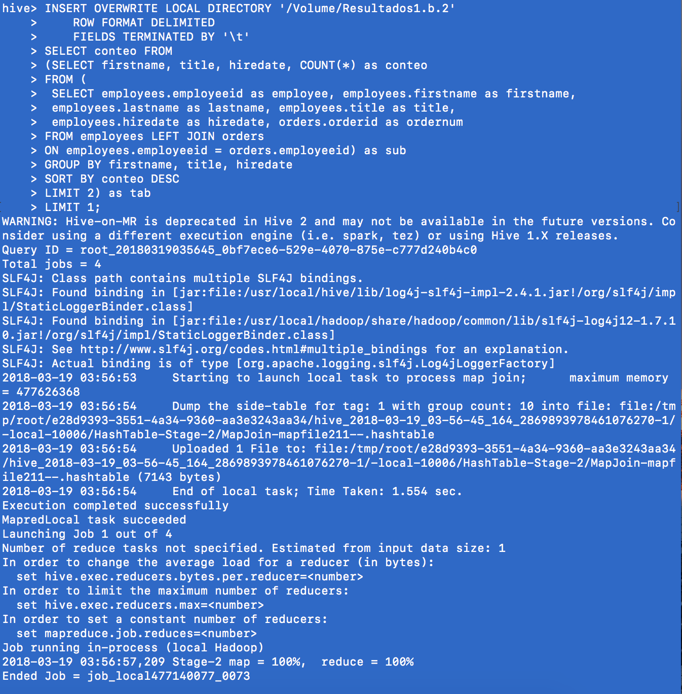
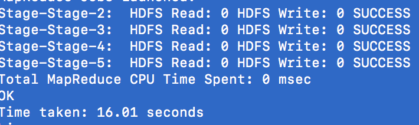

con el output:
```
624
```


### c. ¿Cuál es el delta de tiempo más grande entre una orden y otra?

Se ejecuta un query utilizando el operador LAG para establecer el subquery y posteriormente se hace un MAX obre el diferencial de fechas.

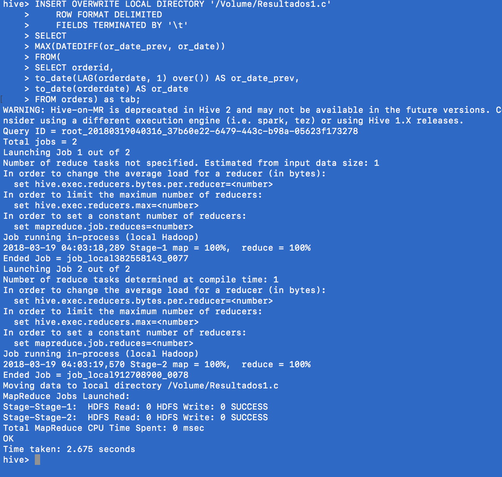

Con el output:
```
3
```

Que se refiere al número de días.


## Ejercicio 2:

### a. ¿Qué aerolíneas (nombres) llegan al aeropuerto "Honolulu International Airport"?

Se ejecuta el query:

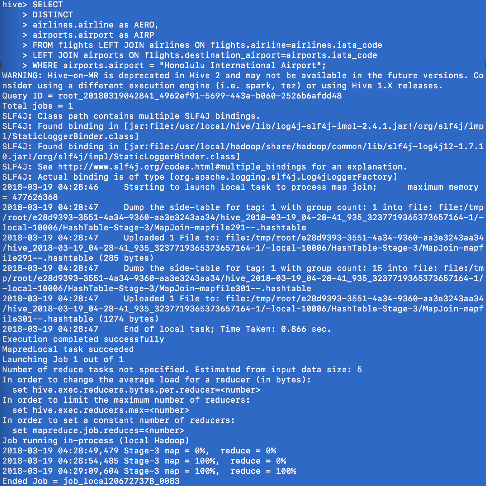

con el output:
```
United Air Lines Inc.	Honolulu International Airport
Virgin America	Honolulu International Airport
Hawaiian Airlines Inc.	Honolulu International Airport
US Airways Inc.	Honolulu International Airport
American Airlines Inc.	Honolulu International Airport
Delta Air Lines Inc.	Honolulu International Airport
Alaska Airlines Inc.	Honolulu International Airport
```

Donde se exponen las aerolíneas que tienen vuelos con destino al Honolulu International Airport

### b. ¿En qué horario (hora del día, no importan los minutos) hay salidas del aeropuerto de San Francisco ("SFO") a "Honolulu International Airport"? 

Para conseguir las horas enteras, primero se divide entre 100 a las horas agendadas (scheduled_departure), para luego redondear los valores mediante un cast a enteros.

Se ejecuta el query:

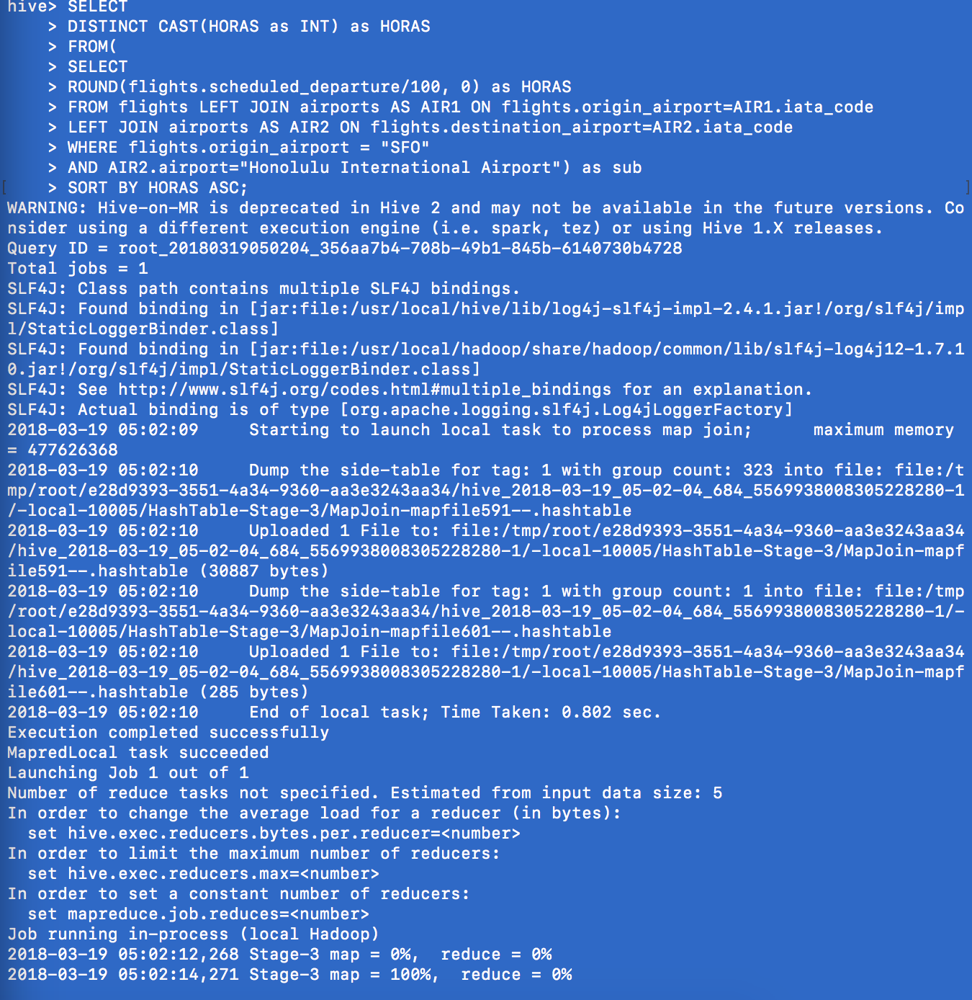

Con el output:
```
11
16
10
15
7
17
9
14
19
8
13
18
```


### c. ¿Qué día de la semana y en qué aerolínea nos conviene viajar a "Honolulu International Airport" para tener el menor retraso posible? 

Se hace la suma total de todos los delays para tener una variable de retraso.
Nos quedamos con el dato más pequeño (air_system_delay, flights.security_delay, flights.airline_delay, flights.late_aircraft_delay, flights.weather_delay)

Se hace el query que sumara todos los delays por semana-aerolinea y nos quedaremos por el primero ordenado de forma ascnedente

Se ejecuta el query:
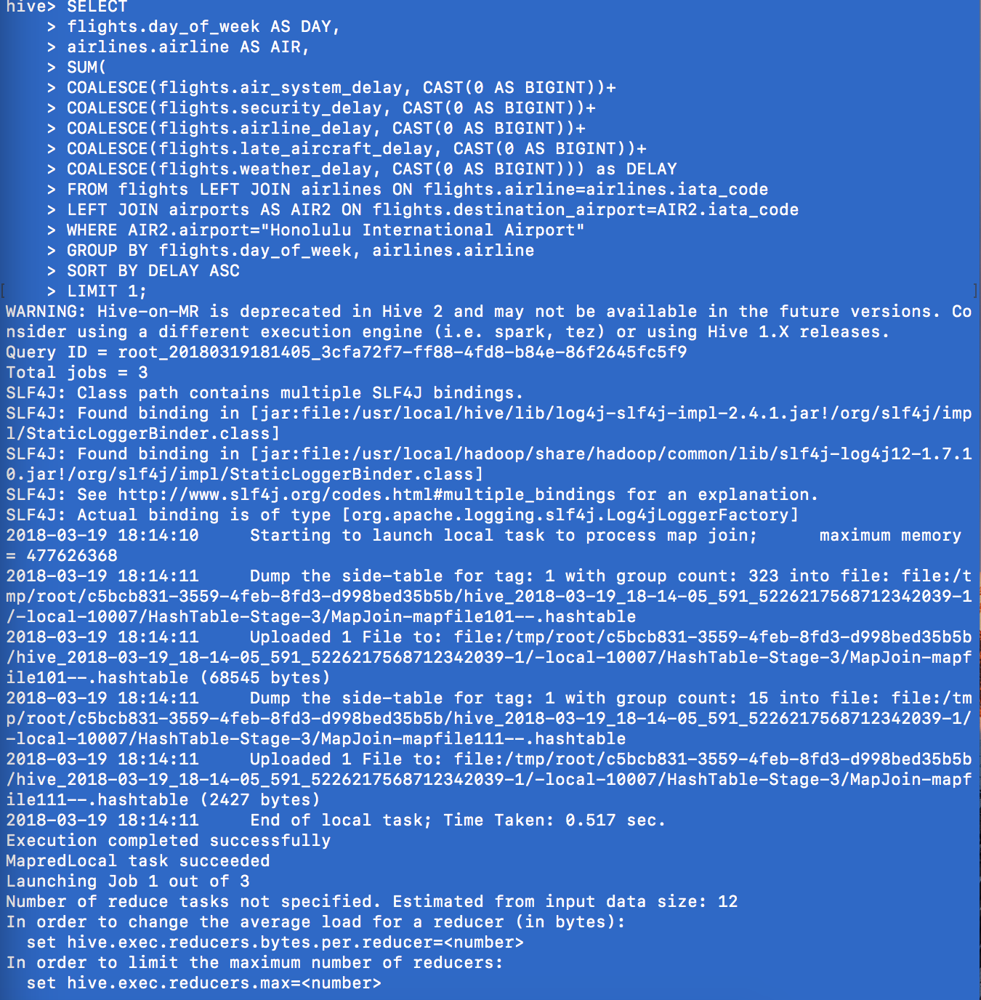

con el output:
```
1	Virgin America	0
```

### d. ¿Cuál es el aeropuerto con mayor tráfico de entrada?

Se hace la suma de registros sobre todos los aeropuertos:

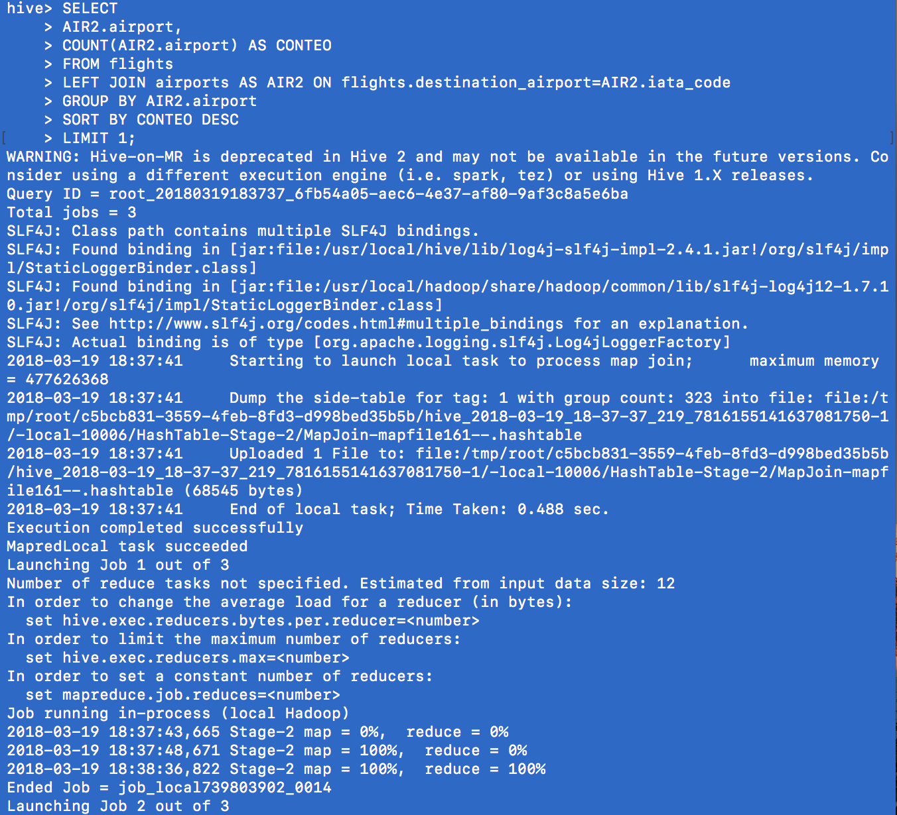
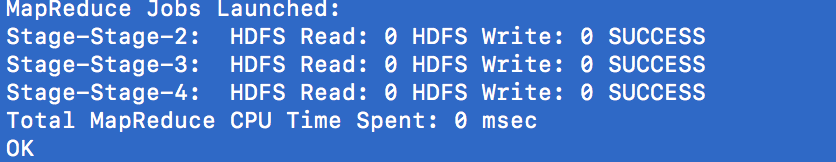

Con el output:

```
Hartsfield-Jackson Atlanta International Airport	8672600
```

### e. ¿Cuál es la aerolínea con mayor retraso de salida por día de la semana? 

Tomando en cuenta la variable DELAY construida,
Se ejecuta el query:

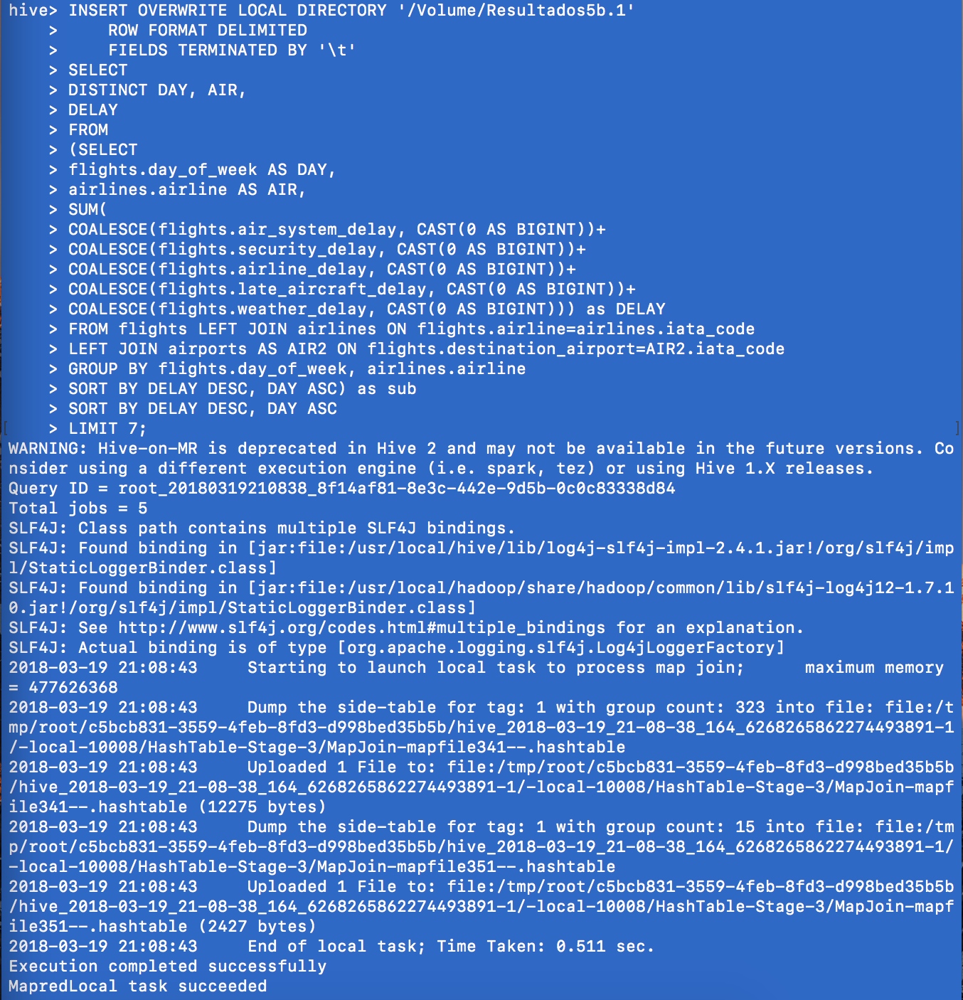

Con el output:
```
1	Southwest Airlines Co.	237544250
4	Southwest Airlines Co.	236297625
2	Southwest Airlines Co.	223730800
5	Southwest Airlines Co.	219906575
3	Southwest Airlines Co.	207991075
7	Southwest Airlines Co.	201046850
6	Southwest Airlines Co.	158176225
```

Es Curioso que Southwest acumule todos los mayores retrasos por día de la semana.

### f. ¿Cuál es la tercer aerolínea con menor retraso de salida los lunes (day of week = 2)?

Se filtra el dia de la semana para utilizar la variable DELAY que se ha fabricado con la suma de todos los retrasos.

Se ejecuta el query:
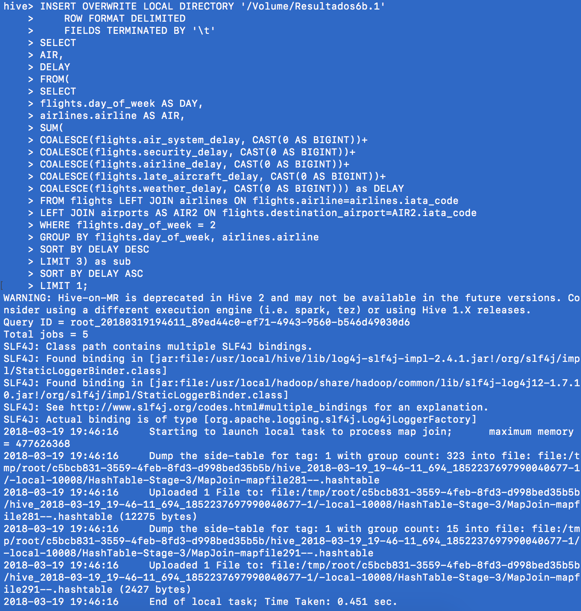

Con el output:
```
United Air Lines Inc.	130748700
```

### g. ¿Cuál es el aeropuerto origen que llega a la mayor cantidad de aeropuertos destino diferentes?

Se hace el conteo de los destinos, es curioso que se pueda identificar al aeropuerto de Atlanta como el de mayor tráfico y como el más diverso en cuanto a destinos.

Se realuza el query:

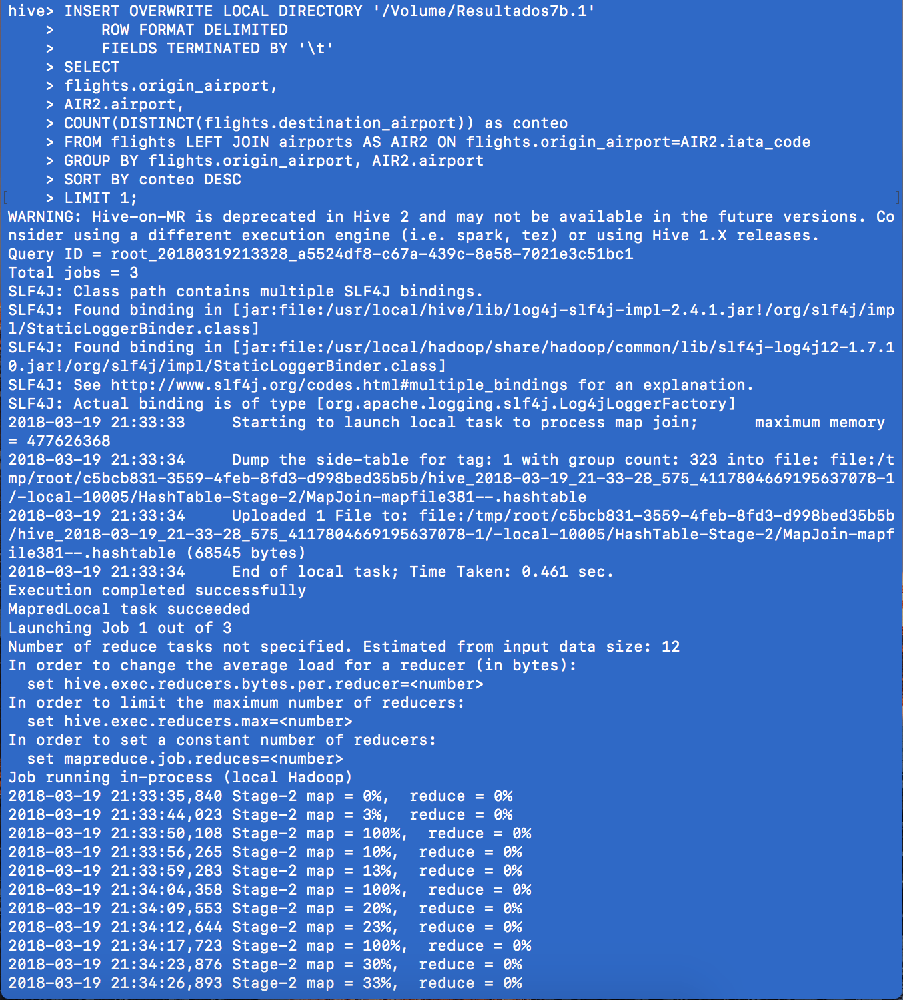

Con el ouput:
```
ATL	Hartsfield-Jackson Atlanta International Airport	169
```