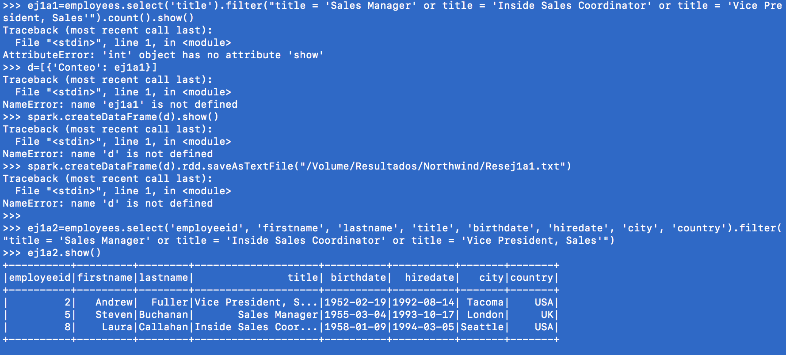
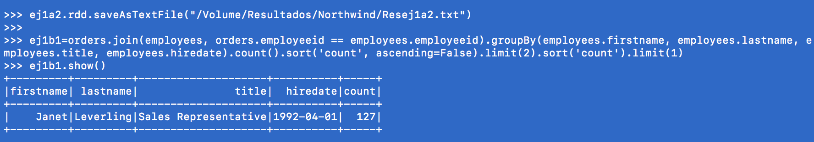
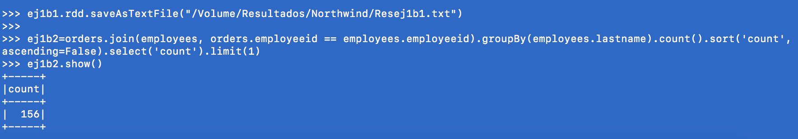
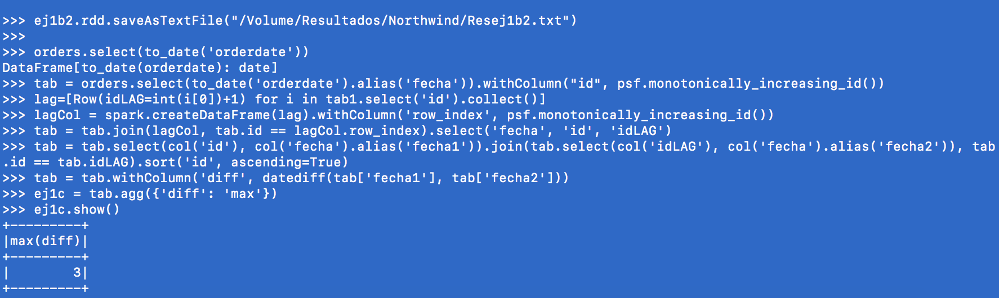

## SPARK: Northwind y Flights

Para reolver la misma serie de preguntas de la tarea anterior se sigue un procedimiento similar.

Se tendrán 2 archivos: Flights y Northwind para cargar cada base de datos y resolver las preguntas.

Inicialmente:
```
customers=spark.read.csv('/Volume/northwind/customers.csv', header=True)
employees=spark.read.csv('/Volume/northwind/employees.csv', header=True)
orderDet=spark.read.csv('/Volume/northwind/order_details.csv', header=True)
product=spark.read.csv('/Volume/northwind/products.csv', header=True)
orders=spark.read.csv('/Volume/northwind/orders.csv', header=True)
```

para Northwind y

```
airlines=spark.read.csv('/Volume/flights/airlines.csv', header=True)
airports=spark.read.csv('/Volume/flights/airports.csv', header=True)
flights=spark.read.csv('/Volume/flights/flights.csv', header=True)
```

para flights.

##Northwind

Se ejecutan los queries del script y se obtiene el resultado con un .show, además de mandarse a un archivo de output

### a. ¿Cuántos "jefes" hay en la tabla empleados? ¿Cuáles son estos jefes: número de empleado, nombre, apellido, título, fecha de nacimiento, fecha en que iniciaron en la empresa, ciudad y país?



### b. ¿Quién es el segundo "mejor" empleado que más órdenes ha generado? (nombre, apellido, título, cuándo entró a la compañía. 

 

### Número de órdenes generadas, número de órdenes generadas por el mejor empleado (número 1))

 

### c. ¿Cuál es el delta de tiempo más grande entre una orden y otra?

 

## Flights

### a. ¿Qué aerolíneas (nombres) llegan al aeropuerto "Honolulu International Airport"? 


### b. ¿En qué horario (hora del día, no importan los minutos) hay salidas del aeropuerto de San Francisco ("SFO") a "Honolulu International Airport"? 


### c. ¿Qué día de la semana y en qué aerolínea nos conviene viajar a "Honolulu International Airport" para tener el menor retraso posible? 


### d. ¿Cuál es el aeropuerto con mayor tráfico de entrada? 


### e. ¿Cuál es la aerolínea con mayor retraso de salida por día de la semana? 


### f. ¿Cuál es la tercer aerolínea con menor retraso de salida los lunes (day of week = 2)? 


### g. ¿Cuál es el aeropuerto origen que llega a la mayor cantidad de aeropuertos destino diferentes?

