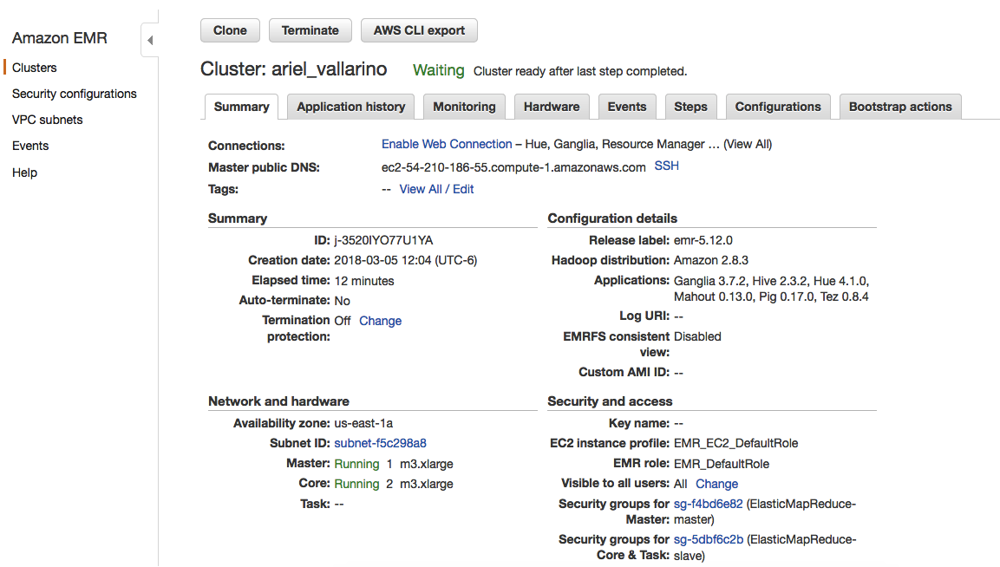
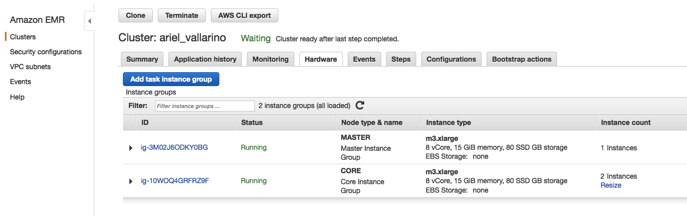

### Tarea 4 - Pig

---  

#### Cluster AWS:
##### Cluster:



##### Hardware:



#### Ejercicio A.

Obtener el  nombre del producto del producto con mejor rank:

```
-- Cargo datos de Products.csv
products = load 's3://basharino/northwind/products/products.csv' using PigStorage(',') as (productid:chararray, productname:chararray, supplierid:chararray, categoryid:chararray, quantityperunit:int, unitprice:float, unitsinstock:int, unitsonorder:int, reorderlevel:int, discounted:int);  

-- Cargo datos de order_details.csv
order_details = load 's3://basharino/northwind/order_details/order_details.csv' using PigStorage(',') as (orderid:chararray, productid:chararray, unitprice:float, quantity:int, discount:float);  

-- Agrupo por ID de Producto
group_orders = GROUP order_details BY productid;  

-- Para cada grupo cuento la cantidad
count_products = FOREACH group_orders GENERATE group as productid, COUNT($1) as n;  

-- JOIN entre Products y order_details para incluir productname  
products_jnd = JOIN count_products by productid, products by productid;

-- Armo Ranking  
ranked = RANK products_jnd BY n DESC;  

-- Tomo el 1er registro:
ranked_one = LIMIT ranked 1;  

-- Campos de salida:
limited_out = FOREACH ranked_one GENERATE $0 as ranking, $1 as productid, $4 as productname, $2 as cantidad;

-- Genero salida:
STORE limited_out INTO 's3://basharino/tarea_4/output/ejercicioA' using PigStorage(',', '-schema');
```

#### Output:
##### Header: 
```
ranking,productid,productname,cantidad
```
##### Data:
```
1,59,Raclette Courdavault,54
```
---  

#### Ejercicio B.
##### Con los datos de aerolíneas, vuelos y aeropuertos que se encuentran en el dropbox y utilizando Pig contesta las siguietnes preguntas:

#### 1.- ¿Cuántos vuelos existen en el dataset cuyo aeropuerto destino sea el "Honolulu International Airport"?
#### Script:
```
-- Cargo datos de Aeropuertos
airports = load 's3://basharino/flights/airports/airports.csv' using PigStorage(',') as (iata_code:chararray, airport:chararray, city:chararray, state:chararray, country:chararray, latitude:chararray, longitude:chararray);

-- Cargo datos de Vuelos
flights = load 's3://basharino/flights/flights/flights.csv' using PigStorage(',') as (year:chararray, month:int, day:int, day_of_week:int, airline:chararray, flight_number:chararray, tail_number:chararray, origin_airport:chararray, destination_airport:chararray, scheduled_departure:int, departure_time:int, departure_delay:int, taxi_out:int, wheels_off:int, scheduled_time:int, elapsed_time:int, air_time:int, distance:int, wheels_on:int, taxi_in:int, scheduled_arrival:int, arrival_time:int, arrival_delay:int, diverted:int, cancelled:int, cancellation_reason:chararray, air_system_delay:int, security_delay:int, airline_delay:int, late_aircraft_delay:int, weather_delay:int);

-- Obtengo solo las columnas necesarias:
airports_code = FOREACH airports GENERATE iata_code, airport;
flights_gen = FOREACH flights GENERATE destination_airport;

-- JOIN entre Vuelos y Aeropuertos:
flights_jnd = FOREACH (JOIN flights_gen by destination_airport, airports_code by iata_code) GENERATE $0 as destination_airport, $2 as airport;

-- Filtro por Aeropuerto Destino:
flights_hnl = GROUP (FILTER flights_jnd BY airport == 'Honolulu International Airport') ALL;

-- Cuento la cantidad de registros:
flights_cant = FOREACH flights_hnl GENERATE COUNT($1) as cant;

-- Genero salida:
STORE flights_cant INTO 's3://basharino/tarea_4/output/ejercicioB1' using PigStorage(',', '-schema');
```

#### Output:
##### Header: 
```
cant
```
##### Data:
```
43157
```
---  


#### 2.- ¿Cuál es el vuelo con más retraso? ¿De qué aerolínea es?
#### Script:
```
-- Cargo datos de Vuelos
flights = load 's3://basharino/flights/flights/flights.csv' using PigStorage(',') as (year:chararray, month:int, day:int, day_of_week:int, airline:chararray, flight_number:chararray, tail_number:chararray, origin_airport:chararray, destination_airport:chararray, scheduled_departure:int, departure_time:int, departure_delay:int, taxi_out:int, wheels_off:int, scheduled_time:int, elapsed_time:int, air_time:int, distance:int, wheels_on:int, taxi_in:int, scheduled_arrival:int, arrival_time:int, arrival_delay:int, diverted:int, cancelled:int, cancellation_reason:chararray, air_system_delay:int, security_delay:int, airline_delay:int, late_aircraft_delay:int, weather_delay:int);

-- Cargo datos de Aerolineas:
airlines = load 's3://basharino/flights/airports/airports.csv' using PigStorage(',') as (airline:chararray, airline_name:chararray);

-- Obtengo solo las columnas necesarias:
flights_gen = FOREACH flights GENERATE year, month, day, day_of_week, airline, flight_number, origin_airport, destination_airport, arrival_delay;

-- Calculo el tiempo maximo de retraso en arribo. Ordeno en forma descendente y tomo el 1er registro:
flights_gen = ORDER flights_gen by arrival_delay DESC;
max_delay = LIMIT flights_gen 1;

-- Selecciono el/los vuelo(s) con el mayor tiempo de retraso:
flights_max_delay = FOREACH (FILTER flights_gen BY arrival_delay == max_delay.arrival_delay) GENERATE year, month, day, day_of_week, airline, flight_number, origin_airport, destination_airport, arrival_delay;

-- JOIN entre los vuelos con mas retraso y las aerolineas para obtener el nombre de las mismas:
flights_delay_jnd = JOIN flights_max_delay by airline, airlines by airline;

-- Campos de salida:
flights_delay = FOREACH flights_delay_jnd GENERATE $0 as year, $1 as month, $2 as day, $3 as day_of_week, $4 as airline, $10 as airline_name, $5 as flight_number, $6 as origin_airport, $7 as destination_airport, $8 as arrival_delay;

-- Gener salida:
STORE flights_delay INTO 's3://basharino/tarea_4/output/ejercicioB2' using PigStorage(',', '-schema');
```

#### Output:
##### Header: 
```
year,month,day,day_of_week,airline,airline_name,flight_number,origin_airport,destination_airport,arrival_delay
```
##### Data:
```
2015,1,23,5,AA,American Airlines Inc.,1322,BHM,DFW,1971
```
---  


#### 3.- ¿Qué día es en el que más vuelos cancelados hay?
#### Script:
```
-- Cargo datos de Vuelos
flights = load 's3://basharino/flights/flights/flights.csv' using PigStorage(',') as (year:chararray, month:int, day:int, day_of_week:int, airline:chararray, flight_number:chararray, tail_number:chararray, origin_airport:chararray, destination_airport:chararray, scheduled_departure:int, departure_time:int, departure_delay:int, taxi_out:int, wheels_off:int, scheduled_time:int, elapsed_time:int, air_time:int, distance:int, wheels_on:int, taxi_in:int, scheduled_arrival:int, arrival_time:int, arrival_delay:int, diverted:int, cancelled:int, cancellation_reason:chararray, air_system_delay:int, security_delay:int, airline_delay:int, late_aircraft_delay:int, weather_delay:int);

-- Agrupo vuelos por dia de la semana:
flights_grp = GROUP flights BY day_of_week;

-- Cuento la cantida de vuelos cancelados por dia de la semana:
flights_day = FOREACH flights_grp GENERATE group as day_of_week, SUM(flights.cancelled) as cancelled;

-- Ordeno la cantidad de cancelaciones en forma descendente y tomo el 1er registro:
flights_day = LIMIT (ORDER flights_day by cancelled DESC) 1;

-- Genero salida:
STORE flights_day INTO 's3://basharino/tarea_4/output/ejercicioB3' using PigStorage(',', '-schema');
```

#### Output:
##### Header: 
```
day_of_week,cancelled
```
##### Data:
```
1,21073
```
---  


#### 4.- ¿Cuáles son los aeropuertos orígen con 17 cancelaciones?
#### Script:
```
-- Cargo datos de Vuelos
flights = load 's3://basharino/flights/flights/flights.csv' using PigStorage(',') as (year:chararray, month:int, day:int, day_of_week:int, airline:chararray, flight_number:chararray, tail_number:chararray, origin_airport:chararray, destination_airport:chararray, scheduled_departure:int, departure_time:int, departure_delay:int, taxi_out:int, wheels_off:int, scheduled_time:int, elapsed_time:int, air_time:int, distance:int, wheels_on:int, taxi_in:int, scheduled_arrival:int, arrival_time:int, arrival_delay:int, diverted:int, cancelled:int, cancellation_reason:chararray, air_system_delay:int, security_delay:int, airline_delay:int, late_aircraft_delay:int, weather_delay:int);

-- Cargo datos de Aeropuertos
airports = load 's3://basharino/flights/airports/airports.csv' using PigStorage(',') as (iata_code:chararray, airport:chararray, city:chararray, state:chararray, country:chararray, latitude:chararray, longitude:chararray);

-- Obtengo solo las columnas necesarias:
airports_code = FOREACH airports GENERATE iata_code, airport;
flights_gen = FOREACH flights GENERATE origin_airport, cancelled;

-- Agrupo vuelos por aeropuertos orígen:
flights_grp = GROUP flights_gen BY origin_airport;

-- Cuento la cantidad de vuelos cancelados:
flights_cancelled = FOREACH flights_grp GENERATE group as origin_airport, SUM(flights_gen.cancelled) as cancelled;

-- Filtro solo los vuelos con 17 cancelaciones:
cancelled_17 = FILTER flights_cancelled BY cancelled == 17; 

-- JOIN entre Vuelos y Aeropuertos para agregar el nombre de los mismos:
airports_17 = FOREACH (JOIN cancelled_17 by origin_airport, airports_code by iata_code) GENERATE $0 as airport, $3 as airport_name;

-- Genero salida:
STORE airports_17 INTO 's3://basharino/tarea_4/output/ejercicioB4' using PigStorage(',', '-schema');
```

#### Output:
##### Header: 
```
airport,airport_name
```
##### Data:
```
DHN,Dothan Regional Airport,DHN
DIK,Dickinson Theodore Roosevelt Regional Airport,DIK
ESC,Delta County Airport,ESC
```
---  


#### 5.- ¿Cuál es el aeropuerto origen con más vuelos cancelados?
#### Script:
```
-- Cargo datos de Vuelos
flights = load 's3://basharino/flights/flights/flights.csv' using PigStorage(',') as (year:chararray, month:int, day:int, day_of_week:int, airline:chararray, flight_number:chararray, tail_number:chararray, origin_airport:chararray, destination_airport:chararray, scheduled_departure:int, departure_time:int, departure_delay:int, taxi_out:int, wheels_off:int, scheduled_time:int, elapsed_time:int, air_time:int, distance:int, wheels_on:int, taxi_in:int, scheduled_arrival:int, arrival_time:int, arrival_delay:int, diverted:int, cancelled:int, cancellation_reason:chararray, air_system_delay:int, security_delay:int, airline_delay:int, late_aircraft_delay:int, weather_delay:int);

-- Cargo datos de Aeropuertos
airports = load 's3://basharino/flights/airports/airports.csv' using PigStorage(',') as (iata_code:chararray, airport:chararray, city:chararray, state:chararray, country:chararray, latitude:chararray, longitude:chararray);

-- Obtengo solo las columnas necesarias:
airports_code = FOREACH airports GENERATE iata_code, airport;
flights_gen = FOREACH flights GENERATE origin_airport, cancelled;

-- Agrupo datos por Aeropuerto Origen:
flights_gen = GROUP flights_gen BY origin_airport;

-- Para cada Aeropuerto Origen cuento la cantidad de vuelos cancelados:
flights_origin = FOREACH flights_gen GENERATE group as origin_airport, SUM(flights_gen.cancelled) as cancelled;

-- flights_cancelled = LIMIT (ORDER flights_origin by cancelled DESC) 1;

-- Calculo el tiempo maximo de retraso en arribo. Ordeno en forma descendente y tomo el 1er registro:
max_cancelled = LIMIT (ORDER flights_origin by cancelled DESC) 1;

-- Selecciono el/los vuelo(s) con el mayor cantidad de vuelos cancelados:
flights_cancelled = FILTER max_cancelled BY cancelled == max_cancelled.cancelled;

-- JOIN entre Vuelos y Aeropuertos para agregar el nombre de los mismos:
flights_jnd = FOREACH (JOIN flights_cancelled by origin_airport, airports_code by iata_code) GENERATE $0 as airport, $3 as airport_name, $1 as cancelaciones;

-- Genero salida:
STORE flights_jnd INTO 's3://basharino/tarea_4/output/ejercicioB5' using PigStorage(',', '-schema');
```

#### Output:
##### Header: 
```
airport,airport_name,cancelaciones
```
##### Data:
```
ORD,Chicago O'Hare International Airport,8548
```
---  


#### 6.- ¿Cuál es el vuelo (flight number) con mayor diversidad de aeropuertos destino, cuáles son estos destinos?
#### Script:
```
-- Cargo datos de Vuelos
flights = load 's3://basharino/flights/flights/flights.csv'  using PigStorage(',') as (year:chararray, month:int, day:int, day_of_week:int, airline:chararray, flight_number:chararray, tail_number:chararray, origin_airport:chararray, destination_airport:chararray, scheduled_departure:int, departure_time:int, departure_delay:int, taxi_out:int, wheels_off:int, scheduled_time:int, elapsed_time:int, air_time:int, distance:int, wheels_on:int, taxi_in:int, scheduled_arrival:int, arrival_time:int, arrival_delay:int, diverted:int, cancelled:int, cancellation_reason:chararray, air_system_delay:int, security_delay:int, airline_delay:int, late_aircraft_delay:int, weather_delay:int);

-- Cargo datos de Aeropuertos
airports = load 's3://basharino/flights/airports/airports.csv' using PigStorage(',') as (iata_code:chararray, airport:chararray, city:chararray, state:chararray, country:chararray, latitude:chararray, longitude:chararray);

-- Obtengo solo las columnas necesarias:
airports_code = FOREACH airports GENERATE iata_code, airport;
flights_gen = FOREACH flights GENERATE flight_number, destination_airport;

-- Elimino registros duplicados:
flights_dest = DISTINCT flights_gen;

-- Agrupo por Numero de vuelo:
flights_grp = GROUP flights_dest by flight_number;

-- Genero lista de vuelos y aeropuestros destino:
flights_unq = FOREACH flights_grp {
	destinos = flights_dest.destination_airport; 
	destinos_unq = distinct destinos; 
	GENERATE group as flight_number, COUNT(destinos_unq) as n;
};

-- Ordeno lista en forma descendente y tomo el 1er registro:
flights_unq_ord = ORDER flights_unq by n DESC;
flights_max = limit flights_unq_ord 1;

-- JOIN de vuelo y Aeropuertos para agregar el nombre de los mismos:
flights_nros = JOIN flights_max by flight_number, flights_dest by flight_number;
flights_output = FOREACH (JOIN flights_nros by destination_airport, airports_code by iata_code) GENERATE $0 as flight_number, $4 as airport, $5 as airport_name;

-- Genero salida:
STORE flights_output INTO 's3://basharino/tarea_4/output/ejercicioB6' using PigStorage(',', '-schema');
```

#### Output:
##### Header: 
```
flight_number,airport,airport_name
```
##### Data:
```
202,ATL,Hartsfield-Jackson Atlanta International Airport
202,AUS,Austin-Bergstrom International Airport
202,BDL,Bradley International Airport
202,BNA,Nashville International Airport
202,BOS,Gen. Edward Lawrence Logan International Airport
202,BWI,Baltimore-Washington International Airport
202,CAK,Akron-Canton Regional Airport
202,CLE,Cleveland Hopkins International Airport
202,DCA,Ronald Reagan Washington National Airport
202,DEN,Denver International Airport
202,DTW,Detroit Metropolitan Airport
202,EWR,Newark Liberty International Airport
202,FLL,Fort Lauderdale-Hollywood International Airport
202,FNT,Bishop International Airport
202,IAD,Washington Dulles International Airport
202,IAH,George Bush Intercontinental Airport
202,IND,Indianapolis International Airport
202,ITO,Hilo International Airport
202,JFK,John F. Kennedy International Airport (New York International Airport)
202,LAS,McCarran International Airport
202,LAX,Los Angeles International Airport
202,LGA,LaGuardia Airport (Marine Air Terminal)
202,MCO,Orlando International Airport
202,MDW,Chicago Midway International Airport
202,MKE,General Mitchell International Airport
202,MSN,Dane County Regional Airport
202,MSP,Minneapolis-Saint Paul International Airport
202,OAK,Oakland International Airport
202,OGG,Kahului Airport
202,OKC,Will Rogers World Airport
202,ORD,Chicago O'Hare International Airport
202,PDX,Portland International Airport
202,PHL,Philadelphia International Airport
202,PHX,Phoenix Sky Harbor International Airport
202,PIT,Pittsburgh International Airport
202,RDU,Raleigh-Durham International Airport
202,RNO,Reno/Tahoe International Airport
202,RSW,Southwest Florida International Airport
202,SAN,San Diego International Airport (Lindbergh Field)
202,SAT,San Antonio International Airport
202,SEA,Seattle-Tacoma International Airport
202,SFO,San Francisco International Airport
202,SLC,Salt Lake City International Airport
202,SMF,Sacramento International Airport
202,TPA,Tampa International Airport
```
---  
