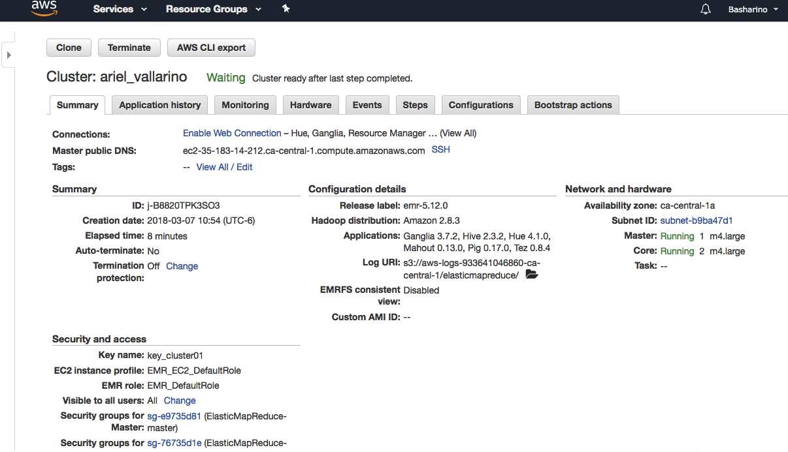
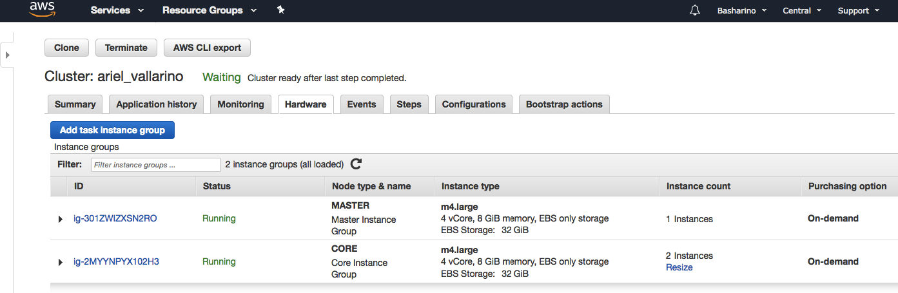

### Tarea 5 - HIVE / HUE  

+ Cluster AWS  
+ Creates  
+ Queries  

---  

### Cluster AWS:
##### Cluster:



##### Hardware:



---  

### Creates
#### Creates tablas Northwind:
Disponiendo de los datos en S3 (Ubiacción s3://basharino/northwind/) se procede a la creación de tablas.
```
drop database if exists northwind cascade;

create database if not exists northwind location "s3://basharino/hive/northwind/";

create external table if not exists northwind.products (productid smallint,
productname string,
supplierid smallint,
categoryid smallint,
quantityperunit string,
unitprice float,
unitsinstock smallint,
unitsonorder smallint,
reorderlevel smallint,
discontinued int)
ROW FORMAT SERDE 'org.apache.hadoop.hive.serde2.OpenCSVSerde'
WITH SERDEPROPERTIES (
   "separatorChar" = "\,",
   "quoteChar"     = "\"")
LOCATION 's3://basharino/northwind/products';	

create external table if not exists northwind.orders (
orderid smallint,
customerid string,
employeeid smallint,
orderdate date,
requireddate date,
shippeddate date,
shipvia smallint,
freight float,
shipname string,
shipaddress string,
shipcity string,
shipregion string,
shippostalcode string,
shipcountry string)
ROW FORMAT SERDE 'org.apache.hadoop.hive.serde2.OpenCSVSerde'
WITH SERDEPROPERTIES (
   "separatorChar" = "\,",
   "quoteChar"     = "\"")
LOCATION 's3://basharino/northwind/orders';


create external table if not exists northwind.orderdetails (orderid smallint,
productid smallint,
unitprice float,
quantity smallint,
discount float)
row format delimited fields terminated by ','
location 's3://basharino/northwind/orderdetails';

create external table if not exists northwind.employees (employeeid smallint,
lastname string,
firstname string,
title string,
titleofcourtesy string,
birthdate string,
hiredate string,
address string,
city string,
region string,
postalcode string,
country string,
homephone string,
extension string,
photo string,
notes string,
reportsto string,
photopath string)
ROW FORMAT SERDE 'org.apache.hadoop.hive.serde2.OpenCSVSerde'
WITH SERDEPROPERTIES (
   "separatorChar" = "\,",
   "quoteChar"     = "\"")
location 's3://basharino/northwind/employees';

create external table if not exists northwind.customers (customerid string,
companyname string,
contactname string,
contacttitle string,
address string,
city string,
region string,
postalcode string,
country string,
phone string,
fax string)
row format delimited fields terminated by ','
location 's3://basharino/northwind/customers';
```

#### Creates tablas Flights:
Disponiendo de los datos en S3 (Ubicación s3://basharino/flights/) se procede a la creación de tablas.
```
drop database if exists flights cascade;

create database if not exists flights location "s3://basharino/hive/flights/";

create external table if not exists flights.flights (year smallint,
month smallint,
day smallint,
day_of_week	smallint, 
airline string,
flight_number smallint,  
tail_number string,
origin_airport string,
destination_airport string,
scheduled_departure smallint,
departure_time smallint,
departure_delay smallint,    
taxi_out smallint,
wheels_off smallint,
scheduled_time smallint,
elapsed_time smallint,
air_time smallint,
distance smallint,           
wheels_on smallint,
taxi_in smallint,
scheduled_arrival smallint,
arrival_time smallint,
arrival_delay smallint,
diverted smallint,
cancelled smallint,
cancellation_reason string,
air_system_delay smallint,
security_delay smallint,
airline_delay smallint,
late_aircraft_delay smallint,
weather_delay smallint)
ROW FORMAT DELIMITED FIELDS TERMINATED BY ','
LOCATION 's3://basharino/flights/flights';	

create external table if not exists flights.airports (iata_code string,
airport string,
city string,
state string,
country string,
latitude string,
longitude string)  
ROW FORMAT DELIMITED FIELDS TERMINATED BY ','
LOCATION 's3://basharino/flights/airports';


create external table if not exists flights.airlines (iata_code string,
airline string)
ROW FORMAT DELIMITED FIELDS TERMINATED BY ','
LOCATION 's3://basharino/flights/airlines';

```
---  

### Queries
_Los Output se obtuvieron descargando el resultado del Query en formato .csv_  

#### Ejercicio 1 -  Base de datos de northwind.

#### a.1 ¿Cuántos "jefes" hay en la tabla empleados? 
#### Query:
```
-- En principio solo se cuenta la cantidad de jefes:
SELECT count(DISTINCT reportsto) as cant_jefes
    FROM northwind.employees
    WHERE reportsto > 0;
```

#### Output:
```
cant_jefes

2
```
---  

#### a.2 ¿Cuáles son estos jefes: número de empleado, nombre, apellido, título, fecha de nacimiento, fecha en que iniciaron en la empresa, ciudad y país?  
(atributo reportsto, ocupa explode en tu respuesta) 
#### Query:
```
-- Se obtiene información de los jefes:
SELECT DISTINCT jefe.employeeid as id, 
    jefe.firstname as nombre, 
    jefe.lastname as apellido,  
    jefe.title as titulo, 
    jefe.birthdate as fecha_nac, 
    jefe.hiredate as ingreso, 
    jefe.city as ciudad, 
    jefe.country as pais
    FROM northwind.employees jefe JOIN northwind.employees emp
        ON jefe.employeeid = emp.reportsto;	
```

#### Output:
```
id,nombre,apellido,titulo,fecha_nac,ingreso,ciudad,pais

2,Andrew,Fuller,"Vice President, Sales",1952-02-19,1992-08-14,Tacoma,USA
5,Steven,Buchanan,Sales Manager,1955-03-04,1993-10-17,London,UK
```

#### a.3 Jefes - Empleados _uso de explode()_
#### Query:

```
-- Se obtiene el nomrbe de los empleados que reportan a cada jefe:
SELECT  boss.employeeid as id, 
        boss.firstname as nombre, 
        boss.lastname as apellido,  
        boss.title as titulo, 
        boss.birthdate as fecha_nac, 
        boss.hiredate as ingreso, 
        boss.city as ciudad, 
        boss.country as pais,
        boss.empleado as empleado
FROM (SELECT jefe.employeeid, 
            jefe.firstname, 
            jefe.lastname,  
            jefe.title, 
            jefe.birthdate, 
            jefe.hiredate, 
            jefe.city, 
            jefe.country,
            emp.empleado as empleado
        FROM (SELECT reportsto, COLLECT_SET(lastname) as empleado
            FROM northwind.employees
            WHERE reportsto > 0
            GROUP BY reportsto) emp
            JOIN northwind.employees as jefe
            ON emp.reportsto = jefe.employeeid) boss
    LATERAL VIEW explode(boss.empleado) boss as empleado
    ORDER BY id;  
```

#### Output:
```
id,nombre,apellido,titulo,fecha_nac,ingreso,ciudad,pais,empleado

2,Andrew,Fuller,"Vice President, Sales",1952-02-19,1992-08-14,Tacoma,USA,Davolio
2,Andrew,Fuller,"Vice President, Sales",1952-02-19,1992-08-14,Tacoma,USA,Leverling
2,Andrew,Fuller,"Vice President, Sales",1952-02-19,1992-08-14,Tacoma,USA,Peacock
2,Andrew,Fuller,"Vice President, Sales",1952-02-19,1992-08-14,Tacoma,USA,Buchanan
2,Andrew,Fuller,"Vice President, Sales",1952-02-19,1992-08-14,Tacoma,USA,Callahan
5,Steven,Buchanan,Sales Manager,1955-03-04,1993-10-17,London,UK,Suyama
5,Steven,Buchanan,Sales Manager,1955-03-04,1993-10-17,London,UK,King
5,Steven,Buchanan,Sales Manager,1955-03-04,1993-10-17,London,UK,Dodsworth
```
---  

#### b. ¿Quién es el segundo "mejor" empleado que más órdenes ha generado?  
(nombre, apellido, título, cuándo entró a la compañía, número de órdenes generadas, número de órdenes generadas por el mejor empleado (número 1))  

#### Query:
```
SELECT ord.employeeid as id, 
        emp.firstname as nombre, 
        emp.lastname as apellido, 
        emp.title as titulo, 
        emp.hiredate as ingreso, 
        ord.cant as ord_generadas, 
        ord.top as top_ordenes
    FROM (SELECT * 
        FROM (SELECT orders.employeeid, orders.cant, 
                lead(orders.cant) over (partition by NULL) as top
            	FROM (SELECT DISTINCT employeeid, 
            	        count(*) over (partition by employeeid) as cant
                    	FROM northwind.orders
                    	ORDER BY cant ASC) orders
                ORDER BY cant DESC
            	LIMIT 2) as oc
            	ORDER BY cant ASC
            	LIMIT 1) ord
    	    JOIN (SELECT employeeid, firstname, lastname, title, hiredate
    	        FROM northwind.employees) emp
				ON ord.employeeid = emp.employeeid;
```

#### Output:
```
id,nombre,apellido,titulo,ingreso,ord_generadas,top_ordenes

3,Janet,Leverling,Sales Representative,1992-04-01,127,156

```
---  

#### c. ¿Cuál es el delta de tiempo más grande entre una orden y otra?
#### Query:
```
SELECT max(datediff(ord.orderdate, ord.ord_prev)) as max_delta 
    FROM (SELECT orderid, 
                 orderdate, 
                 lag(orderdate) OVER (partition by NULL) ord_prev
            FROM northwind.orders 
            ORDER BY orderdate) ord;
```

#### Output:
```
max_delta

3
```
---  

#### Ejercicio 2 - Con los archivos de vuelos, aeropuertos y aerolíneas:

#### a. ¿Qué aerolíneas (nombres) llegan al aeropuerto "Honolulu International Airport"?  
#### Query:
```
SELECT DISTINCT aril.iata_code as codigo, 
                aril.airline as aerolinea
    FROM flights fl JOIN airports arip
    ON fl.destination_airport = arip.iata_code
        JOIN airlines aril 
        ON fl.airline = aril.iata_code
    WHERE arip.airport = "Honolulu International Airport";
```

#### Output:
```
codigo,aerolinea

AS,Alaska Airlines Inc.
US,US Airways Inc.
AA,American Airlines Inc.
DL,Delta Air Lines Inc.
HA,Hawaiian Airlines Inc.
UA,United Air Lines Inc.
VX,Virgin America
```
---  


#### b. ¿En qué horario (hora del día, no importan los minutos) hay salidas del aeropuerto de San Francisco ("SFO") a "Honolulu International Airport"? 
#### Query:
```
SELECT DISTINCT CASE
    WHEN LENGTH(cast(fl.departure_time as string)) = "3" then cast(substr(fl.departure_time, 1, 1) as int) 
    WHEN LENGTH(cast(fl.departure_time as string)) = "4" then cast(substr(fl.departure_time, 1, 2) as int)
    ELSE 0
    END as hora_dia
FROM flights.flights fl
WHERE fl.origin_airport = "SFO"
  AND fl.destination_airport = "HNL"
  AND fl.departure_time IS NOT NULL
  ORDER BY hora_dia; 
  
 -- Se podría haber hecho un JOIN con airports.csv para acceder por nombre de aeropuerto!   
```

#### Output:
```
hora_dia

1
6
7
8
9
10
11
12
13
14
15
16
17
18
19
20
21
22
23
```
---    


#### c. ¿Qué día de la semana y en qué aerolínea nos conviene viajar a "Honolulu International Airport" para tener el menor retraso posible? 
#### Query:
```
SELECT DISTINCT fl.day_of_week as dia_semana, 
                fl.arrival_delay as retrato_arribo, 
                fl.airline as codigo, 
                arl.airline as aerolinea
    FROM flights fl JOIN airports arp
    ON fl.destination_airport = arp.iata_code
        JOIN airlines arl 
        ON fl.airline = arl.iata_code
    WHERE arp.airport = "Honolulu International Airport"
      AND fl.arrival_delay is not NULL
      ORDER BY fl.arrival_delay
      LIMIT 1;
```

#### Output:
```
dia_semana,retrato_arribo,codigo,aerolinea

7,-72,DL,Delta Air Lines Inc.
```
---  


#### d. ¿Cuál es el aeropuerto con mayor tráfico de entrada? 
#### Query:
```
SELECT fl.destination_airport as codigo, 
       airp.airport as aeropuerto,
       count(fl.destination_airport) as trafico_entrada
    FROM flights.flights fl
        JOIN flights.airports airp
        ON fl.destination_airport = airp.iata_code
    GROUP BY fl.destination_airport, airp.airport
    ORDER BY trafico_entrada DESC 
    LIMIT 1;
```

#### Output:
```
codigo,aeropuerto,trafico_entrada

ATL,Hartsfield-Jackson Atlanta International Airport,346904
```
---  

#### e. ¿Cuál es la aerolínea con mayor retraso de salida por día de la semana? 
#### Query:
```
SELECT fl_delay.dia_semana as dia_semana,
       fl_delay.max_delay as max_delay,  
       fl_delay.codigo as codigo,
       airl.airline as aerolinea
    FROM (SELECT fld.dia_semana,
                 fld.max_delay,
                 fl.airline as codigo
                 FROM (SELECT day_of_week as dia_semana, 
                             MAX(departure_delay) as max_delay
                        FROM flights.flights
                        GROUP BY day_of_week
                        ORDER BY dia_semana) fld
                        JOIN flights.flights fl
                        ON  fld.dia_semana = fl.day_of_week 
                        AND fld.max_delay  = fl.departure_delay) fl_delay
                JOIN flights.airlines airl 
                ON fl_delay.codigo = airl.iata_code;
```

#### Output:
```
dia_semana,max_delay,codigo,aerolinea

1,1625,AA,American Airlines Inc.
3,1589,AA,American Airlines Inc.
5,1988,AA,American Airlines Inc.
4,1649,AA,American Airlines Inc.
2,1609,AA,American Airlines Inc.
6,1878,AA,American Airlines Inc.
7,1670,AA,American Airlines Inc.
```
---  

#### f. ¿Cuál es la tercer aerolínea con menor retraso de salida los lunes (day of week = 2)? 
#### Query:
```
SELECT  ret.codigo as codigo,
        ret.airline as airline,
        ret.retraso as retraso, 
        ret.retraso_lunes as retraso_lunes
    FROM (SELECT fl2.airline as codigo,
                 airl.airline,
                 fl2.retraso,
        rank() OVER (ORDER BY fl2.retraso) as retraso_lunes
        FROM (SELECT fl.airline, 
                round(avg(fl.departure_delay),2) as retraso
                FROM flights.flights fl
                WHERE fl.day_of_week = 2
                  AND fl.departure_delay is not NULL
                GROUP BY fl.airline) fl2
        JOIN flights.airlines airl
        ON airl.iata_code = fl2.airline) ret
    WHERE retraso_lunes = 3;
    
-- Se podría haber ocupado row_number() en lugar de rank()
```

#### Output:
```
codigo,airline,retraso,retraso_lunes

US,US Airways Inc.,6.48,3
```
---  

#### g. ¿Cuál es el aeropuerto origen que llega a la mayor cantidad de aeropuertos destino diferentes?
#### Query:
```
SELECT  dest.origin_airport as codigo, 
        airp.airport as aeropuerto,
        dest.cant_destinos as cant_destinos
    FROM (SELECT  fl.origin_airport,
                COUNT (DISTINCT fl.destination_airport) as cant_destinos
        FROM flights.flights fl 
        GROUP BY fl.origin_airport
        ORDER BY cant_destinos DESC
        LIMIT 1) dest
        JOIN  flights.airports airp
            ON dest.origin_airport = airp.iata_code; 
```

#### Output:
```
codigo,aeropuerto,cant_destinos

ATL,Hartsfield-Jackson Atlanta International Airport,169
```
---  
