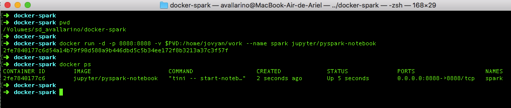
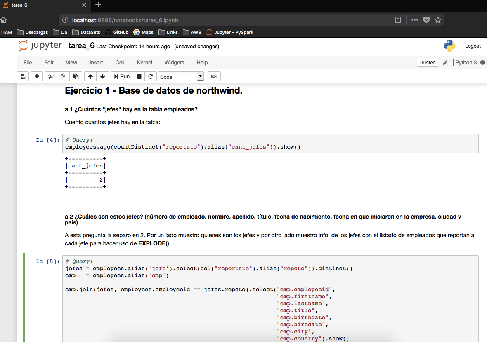

### Tarea 6 - Spark

+ Docker  
+ Jupyter    
+ Queries   

---  

### Docker  
La tarea fue llevada a cabo en un contenedor con Pyspak / Jupyter Notebook.  
A modo de prueba ejecuté algunas de estas queries desde Zeppelin a un cluster AWS y consultando los .CSV de S3, pero por practicidad utilicé Jupyter Notebook.  

##### Contenedor:


---  

### Jupyter


---  

### Queries

#### Cargo librerias:

```python
from pyspark import SparkContext 
from pyspark.sql import SQLContext 
from pyspark.sql.functions import *
from pyspark.sql.functions import lead, col
from pyspark.sql.window import Window

sc = SparkContext()
```

#### Ejercicio 1 -  Base de datos de northwind.

#### a.1 ¿Cuántos "jefes" hay en la tabla empleados? 
#### Query:
```python
employees.agg(countDistinct("reportsto").alias("cant_jefes")).show()
```

#### Output:  
    +----------+
    |cant_jefes|
    +----------+
    |         2|
    +----------+
    
---  

#### a.2 ¿Cuáles son estos jefes: número de empleado, nombre, apellido, título, fecha de nacimiento, fecha en que iniciaron en la empresa, ciudad y país?  
(atributo reportsto, ocupa explode en tu respuesta) 

A esta pregunta la separo en 2. Por un lado muestro quienes son los jefes y por otro lado muestro info. de los jefes con el listado de empleados que reportan a cada jefe para hacer uso de **EXPLODE()**

#### Query:
```python
jefes = employees.alias('jefe').select(col("reportsto").alias("repsto")).distinct()
emp   = employees.alias('emp')

emp.join(jefes, employees.employeeid == jefes.repsto).select("emp.employeeid", 
                                                             "emp.firstname", 
                                                             "emp.lastname", 
                                                             "emp.title", 
                                                             "emp.birthdate", 
                                                             "emp.hiredate", 
                                                             "emp.city", 
                                                             "emp.country").show()
```

#### Output:
    +----------+---------+--------+--------------------+----------+----------+------+-------+
    |employeeid|firstname|lastname|               title| birthdate|  hiredate|  city|country|
    +----------+---------+--------+--------------------+----------+----------+------+-------+
    |         2|   Andrew|  Fuller|Vice President, S...|1952-02-19|1992-08-14|Tacoma|    USA|
    |         5|   Steven|Buchanan|       Sales Manager|1955-03-04|1993-10-17|London|     UK|
    +----------+---------+--------+--------------------+----------+----------+------+-------+

#### a.3 Jefes - Empleados _uso de explode()_
#### Query:
```python
emp_list = employees.groupby(col("reportsto").alias("jefe")) \
    .agg(collect_set("firstname").alias("empleados")) \
    .filter(employees.reportsto > 0) \
    .orderBy("reportsto")
    

emp_list = emp_list.join(employees, employees.employeeid == emp_list.jefe) \
    .select( "employeeid", 
             "firstname", 
             "lastname", 
             "title", 
             "birthdate", 
             "hiredate", 
             "city", 
             "country",
             "empleados")
    

emp_list.select("employeeid", 
                "firstname", 
                "lastname", 
                "title", 
                "birthdate", 
                "hiredate", 
                "city", 
                "country",
                explode("empleados").alias("empleado")).show()
```

#### Output:
    +----------+---------+--------+--------------------+----------+----------+------+-------+--------+
    |employeeid|firstname|lastname|               title| birthdate|  hiredate|  city|country|empleado|
    +----------+---------+--------+--------------------+----------+----------+------+-------+--------+
    |         2|   Andrew|  Fuller|Vice President, S...|1952-02-19|1992-08-14|Tacoma|    USA|   Janet|
    |         2|   Andrew|  Fuller|Vice President, S...|1952-02-19|1992-08-14|Tacoma|    USA|   Laura|
    |         2|   Andrew|  Fuller|Vice President, S...|1952-02-19|1992-08-14|Tacoma|    USA|   Nancy|
    |         2|   Andrew|  Fuller|Vice President, S...|1952-02-19|1992-08-14|Tacoma|    USA|Margaret|
    |         2|   Andrew|  Fuller|Vice President, S...|1952-02-19|1992-08-14|Tacoma|    USA|  Steven|
    |         5|   Steven|Buchanan|       Sales Manager|1955-03-04|1993-10-17|London|     UK|  Robert|
    |         5|   Steven|Buchanan|       Sales Manager|1955-03-04|1993-10-17|London|     UK|    Anne|
    |         5|   Steven|Buchanan|       Sales Manager|1955-03-04|1993-10-17|London|     UK| Michael|
    +----------+---------+--------+--------------------+----------+----------+------+-------+--------+

---  

#### b. ¿Quién es el segundo "mejor" empleado que más órdenes ha generado?  
(nombre, apellido, título, cuándo entró a la compañía, número de órdenes generadas, número de órdenes generadas por el mejor empleado (número 1))  

#### Query:
```python
nro_orders = orders.groupby("employeeid") \
    .count() \
    .orderBy(desc("count")) \
    .limit(2)

nro_orders.withColumn('cant_mejor_emp', 
                      lag(nro_orders["count"]).over(Window.orderBy(desc("count")))) \
    .orderBy("count") \
    .limit(1) \
    .join(employees, "employeeid") \
    .select("employeeid", 
            "firstname", 
            "lastname", 
            "title",            
            "hiredate", 
            "count",
            "cant_mejor_emp") \
    .show()
```

#### Output:
    +----------+---------+---------+--------------------+----------+-----+--------------+
    |employeeid|firstname| lastname|               title|  hiredate|count|cant_mejor_emp|
    +----------+---------+---------+--------------------+----------+-----+--------------+
    |         3|    Janet|Leverling|Sales Representative|1992-04-01|  127|           156|
    +----------+---------+---------+--------------------+----------+-----+--------------+

---  

#### c. ¿Cuál es el delta de tiempo más grande entre una orden y otra?
#### Query:
```python
orders \
    .select("orderid", "orderdate") \
    .withColumn('ord_prev', lag(orders["orderdate"]).over(Window.orderBy("orderdate"))) \
    .withColumn("delta_dias", datediff("orderdate", "ord_prev")) \
    .orderBy(desc("delta_dias")) \
    .select("delta_dias") \
    .limit(1) \
    .show()
```

#### Output:
    +----------+
    |delta_dias|
    +----------+
    |         3|
    +----------+
---  

#### Ejercicio 2 - Con los archivos de vuelos, aeropuertos y aerolíneas:

#### a. ¿Qué aerolíneas (nombres) llegan al aeropuerto "Honolulu International Airport"?  
#### Query:
```python
airports.filter("airport = 'Honolulu International Airport'") \
    .join(flights, airports.iata_code == flights["destination_airport"]) \
    .join(airlines.select(col("iata_code"), col("airline").alias("airline_name")), 
          airlines.iata_code == flights.AIRLINE) \
    .select("airline_name") \
    .distinct() \
    .orderBy("airline_name") \
    .show()
```

#### Output:
    +--------------------+
    |        airline_name|
    +--------------------+
    |Alaska Airlines Inc.|
    |American Airlines...|
    |Delta Air Lines Inc.|
    |Hawaiian Airlines...|
    |     US Airways Inc.|
    |United Air Lines ...|
    |      Virgin America|
    +--------------------+

---  


#### b. ¿En qué horario (hora del día, no importan los minutos) hay salidas del aeropuerto de San Francisco ("SFO") a "Honolulu International Airport"? 
#### Query:
```python
flights.filter("destination_airport = 'HNL' and origin_airport = 'SFO' and departure_time is not NULL") \
    .select(flights["departure_time"].substr(1, 2).alias("hora_salida")) \
    .distinct() \
    .orderBy("hora_salida") \
    .show()
    
# Se pordíar agregar JOIN al .CSV de Airlines para obtener las aerolineas a partir del nombre.
```

#### Output:
    +-----------+
    |hora_salida|
    +-----------+
    |         01|
    |         06|
    |         07|
    |         08|
    |         09|
    |         10|
    |         11|
    |         12|
    |         13|
    |         14|
    |         15|
    |         16|
    |         17|
    |         18|
    |         19|
    |         20|
    |         21|
    |         22|
    |         23|
    +-----------+

---    


#### c. ¿Qué día de la semana y en qué aerolínea nos conviene viajar a "Honolulu International Airport" para tener el menor retraso posible?  

#### Query:
```python
flights.groupBy("day_of_week", "airline") \
    .agg(round(avg("arrival_delay"),2).alias("retrato_arribo")) \
    .orderBy("retrato_arribo") \
    .limit(1) \
    .join(airlines.select(col("iata_code"), col("airline").alias("airline_name")), 
          airlines.iata_code == flights["airline"]) \
    .select("day_of_week", "airline", "airline_name", "retrato_arribo") \
    .show()
```
Calculo el promedio de los retaso de arribo y tomo el registro con el menor retraso.  

#### Output:
    +-----------+-------+--------------------+--------------+
    |day_of_week|airline|        airline_name|retrato_arribo|
    +-----------+-------+--------------------+--------------+
    |          6|     AS|Alaska Airlines Inc.|         -2.73|
    +-----------+-------+--------------------+--------------+

---  


#### d. ¿Cuál es el aeropuerto con mayor tráfico de entrada? 
#### Query:
```python
flights.select("destination_airport") \
    .groupBy("destination_airport") \
    .count() \
    .join(airports, airports.iata_code ==  flights["destination_airport"]) \
    .select("iata_code", "airport", "count") \
    .orderBy(desc("count")) \
    .limit(1) \
    .show()
```

#### Output:
    +---------+--------------------+------+
    |iata_code|             airport| count|
    +---------+--------------------+------+
    |      ATL|Hartsfield-Jackso...|346904|
    +---------+--------------------+------+


---  

#### e. ¿Cuál es la aerolínea con mayor retraso de salida por día de la semana? 
#### Query:
```python
flights.groupBy("day_of_week", "airline") \
    .agg(round(avg("departure_delay"),2).alias("retrato_salida")) \
    .select("day_of_week", "airline", "retrato_salida", 
            rank().over(Window().partitionBy("day_of_week").orderBy(col("retrato_salida").desc())).alias("rank")) \
    .filter("rank = '1'") \
    .join(airlines.select(col("iata_code"), col("airline").alias("airline_name")), 
          airlines.iata_code == flights["airline"]) \
    .select("day_of_week", "airline", "airline_name", "retrato_salida") \
    .orderBy("day_of_week") \
    .show()
```

Calculo el retraso promedio por aerolinea por día y tomo el maximo.  

#### Output:
    +-----------+-------+--------------------+--------------+
    |day_of_week|airline|        airline_name|retrato_salida|
    +-----------+-------+--------------------+--------------+
    |          1|     NK|    Spirit Air Lines|          18.8|
    |          2|     NK|    Spirit Air Lines|         15.71|
    |          3|     UA|United Air Lines ...|         14.28|
    |          4|     UA|United Air Lines ...|         14.89|
    |          5|     NK|    Spirit Air Lines|         15.79|
    |          6|     NK|    Spirit Air Lines|         15.78|
    |          7|     NK|    Spirit Air Lines|         17.15|
    +-----------+-------+--------------------+--------------+


---  

#### f. ¿Cuál es la tercer aerolínea con menor retraso de salida los lunes (day of week = 2)? 
#### Query:
```python
flights.filter("day_of_week = 2") \
    .groupBy("day_of_week", "airline") \
    .agg(round(avg("departure_delay"),2).alias("retrato_salida")) \
    .orderBy("retrato_salida") \
    .withColumn("row_number", row_number().over(Window.orderBy("retrato_salida"))) \
    .filter("row_number = 3") \
    .join(airlines.select(col("iata_code"), col("airline").alias("airline_name")), 
          airlines.iata_code == flights["airline"]) \
    .select("day_of_week", "airline", "airline_name", "retrato_salida") \
    .show()
```

Calculo el retraso promedio por aerolinea para el día 2 y tomo el menor:

#### Output:
    +-----------+-------+---------------+--------------+
    |day_of_week|airline|   airline_name|retrato_salida|
    +-----------+-------+---------------+--------------+
    |          2|     US|US Airways Inc.|          6.48|
    +-----------+-------+---------------+--------------+


---  

#### g. ¿Cuál es el aeropuerto origen que llega a la mayor cantidad de aeropuertos destino diferentes?
#### Query:
```python
flights.select("origin_airport", "destination_airport") \
    .distinct() \
    .groupBy("origin_airport") \
    .count() \
    .join(airports, 
          airports.iata_code ==  flights["origin_airport"]) \
    .select("iata_code", "airport", "count") \
    .orderBy(desc("count")) \
    .limit(1) \
    .show()
```

#### Output:
    +---------+--------------------+-----+
    |iata_code|             airport|count|
    +---------+--------------------+-----+
    |      ATL|Hartsfield-Jackso...|  169|
    +---------+--------------------+-----+

---  
