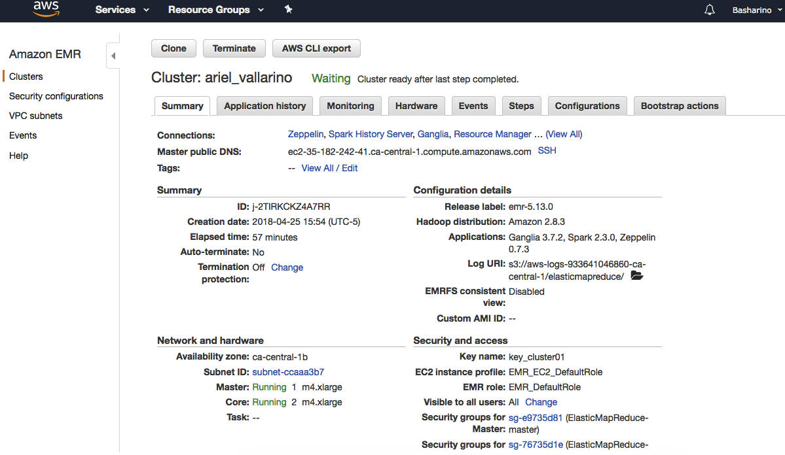
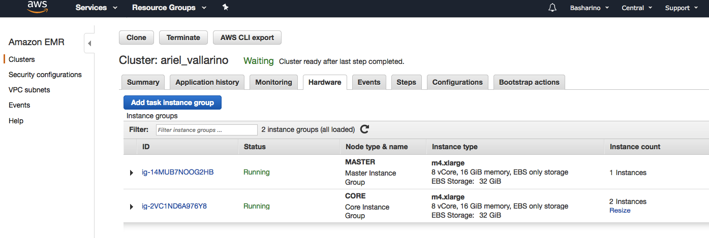
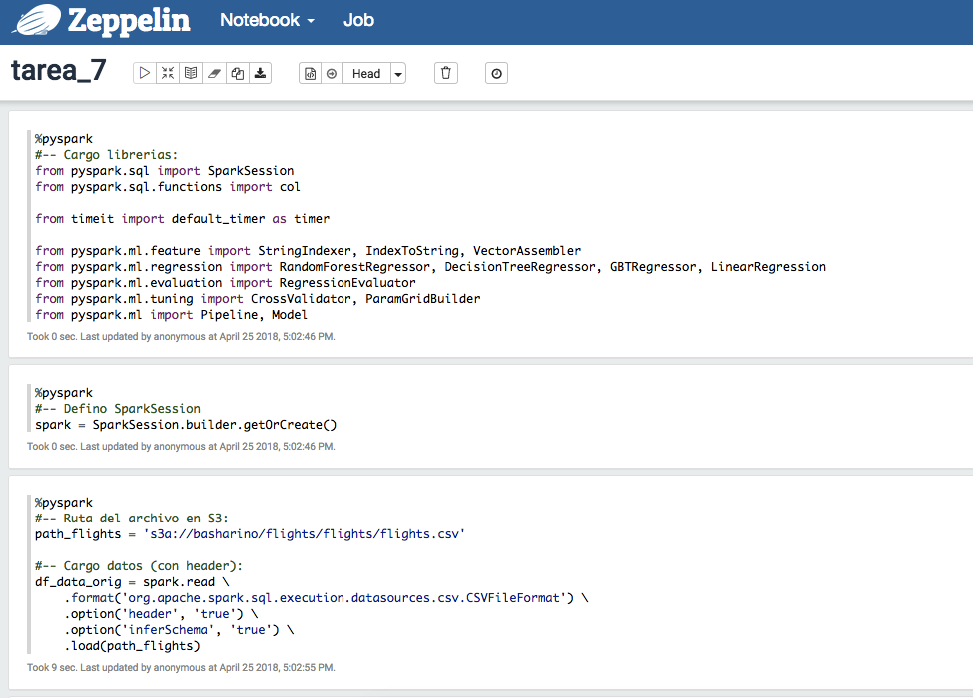
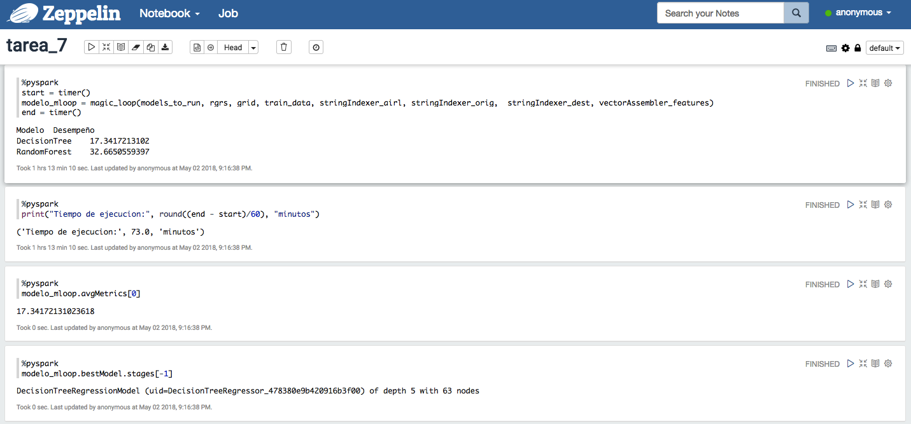
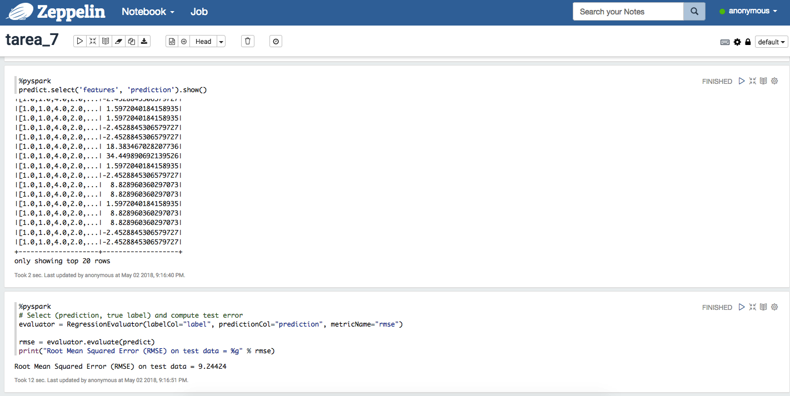
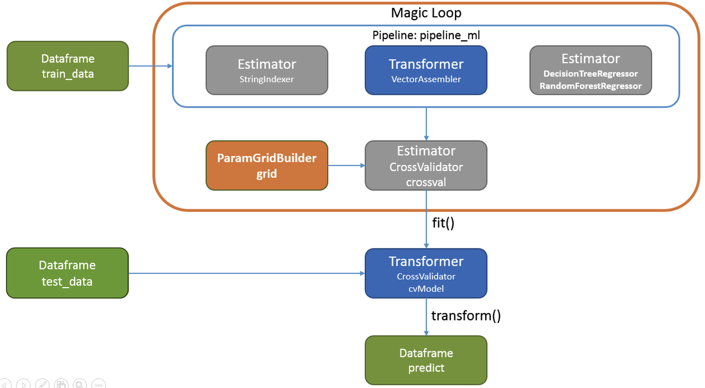

### Tarea 7


---  

### Enunciado  
Con los datos que tenemos de flights queremos predecir el tiempo de retraso de salida DEPARTURE_DELAY

+ Si requieres de hacer transformaciones a los datos, feature selection y/o feature engineering tendrás que hacerlos como parte de un pipeline
+ Deberás dividir el set en entrenamiento y pruebas (70 y 30)
+ Deberás ocupar 10 como valor de k en cross validation
+ Deberás seleccionar 2 algoritmos de tu preferencia para realizar la predicción
+ Necesitas generar un gridParamMap para modificar los parámetros de los algoritmos que seleccionaste, al menos deberás de tener 3 valores diferentes en 2 de los parámetros. Por ejemplo: si seleccionaste un random forest puedes modificar el número de árboles y el número de elementos mínimo para no seguir dividiendo (con 3 valores diferentes)
+ Necesitas generar un magic loop para probar probar tus dos diferentes algoritmos
+ Deberás seleccionar los mejores parámetros por algoritmo a través de un evaluador (como lo vimos en el ejemplo)
+ ¿Qué parametros resultaron mejor por algoritmo? (ver el método bestModel)
+ ¿Qué algoritmo resultó el mejor, con qué parámetros?
+ Indicar el tiempo de ejecución de la función de magic loop (ocupa python directo con la librería timeit)

---  

### Cluster


---  

#### Hardware


---  

#### Zeppelin:



---  

#### Zeppelin Metricas:



---  

#### Zeppelin Predict:



---  

### Diagrama


---  

### Script:

#### Cargo librerias:

```python
%pyspark
#-- Cargo librerias:
from pyspark.sql import SparkSession
from pyspark.sql.functions import col

from timeit import default_timer as timer

from pyspark.ml.feature import StringIndexer, IndexToString, VectorAssembler
from pyspark.ml.regression import RandomForestRegressor, DecisionTreeRegressor, GBTRegressor, LinearRegression
from pyspark.ml.evaluation import RegressionEvaluator
from pyspark.ml.tuning import CrossValidator, ParamGridBuilder
from pyspark.ml import Pipeline, Model
```


```python
%pyspark
#-- Defino SparkSession
spark = SparkSession.builder.getOrCreate()
```

#### Cargo datos:
```python
%pyspark
#-- Ruta del archivo en S3:
path_flights = 's3a://basharino/flights/flights/flights.csv'

#-- Cargo datos (con header):
df_data_orig = spark.read \
    .format('org.apache.spark.sql.execution.datasources.csv.CSVFileFormat') \
    .option('header', 'true') \
    .option('inferSchema', 'true') \
    .load(path_flights)
```


#### Selecciono columnas de interes:
Varios de los features se descartaron luego de analizar los datos.
Por ej. la hora de llegada no se consideró relevante y además se encuentran 
en diferentes usos horarios, dependiendo del aeropuerto.
```python
%pyspark
#-- Selecciono columnas de interes:
#-- DEPARTURE_DELAY es la variable a predecir. Se renombra como label
df_data = df_data_orig.filter("CANCELLED = 0") \
    .select("MONTH",
            "DAY",
            "DAY_OF_WEEK",
            "AIRLINE",
            "ORIGIN_AIRPORT",
            "DESTINATION_AIRPORT", 
            "SCHEDULED_DEPARTURE", 
            "TAXI_OUT", 
            "SCHEDULED_TIME", 
            "ELAPSED_TIME", 
            "AIR_TIME", 
            "DISTANCE", 
            "TAXI_IN",
            "ARRIVAL_DELAY", 
            col("DEPARTURE_DELAY").alias("label")) 
# WEATHER_DELAY    
```


```python
%pyspark
#-- cantidad de registros:
df_data.count()
```
##### - Output:
```
5729195
```
---  

```python
%pyspark
#-- Visualizo 1ros. registros:
df_data.show(10)
```

##### - Output:
```python
+-----+---+-----------+-------+--------------+-------------------+-------------------+--------+--------------+------------+--------+--------+-------+-------------+-----+
|MONTH|DAY|DAY_OF_WEEK|AIRLINE|ORIGIN_AIRPORT|DESTINATION_AIRPORT|SCHEDULED_DEPARTURE|TAXI_OUT|SCHEDULED_TIME|ELAPSED_TIME|AIR_TIME|DISTANCE|TAXI_IN|ARRIVAL_DELAY|label|
+-----+---+-----------+-------+--------------+-------------------+-------------------+--------+--------------+------------+--------+--------+-------+-------------+-----+
|    1|  1|          4|     AS|           ANC|                SEA|                  5|      21|           205|         194|     169|    1448|      4|          -22|  -11|
|    1|  1|          4|     AA|           LAX|                PBI|                 10|      12|           280|         279|     263|    2330|      4|           -9|   -8|
|    1|  1|          4|     US|           SFO|                CLT|                 20|      16|           286|         293|     266|    2296|     11|            5|   -2|
|    1|  1|          4|     AA|           LAX|                MIA|                 20|      15|           285|         281|     258|    2342|      8|           -9|   -5|
|    1|  1|          4|     AS|           SEA|                ANC|                 25|      11|           235|         215|     199|    1448|      5|          -21|   -1|
|    1|  1|          4|     DL|           SFO|                MSP|                 25|      18|           217|         230|     206|    1589|      6|            8|   -5|
|    1|  1|          4|     NK|           LAS|                MSP|                 25|      11|           181|         170|     154|    1299|      5|          -17|   -6|
|    1|  1|          4|     US|           LAX|                CLT|                 30|      13|           273|         249|     228|    2125|      8|          -10|   14|
|    1|  1|          4|     AA|           SFO|                DFW|                 30|      17|           195|         193|     173|    1464|      3|          -13|  -11|
|    1|  1|          4|     DL|           LAS|                ATL|                 30|      12|           221|         203|     186|    1747|      5|          -15|    3|
+-----+---+-----------+-------+--------------+-------------------+-------------------+--------+--------------+------------+--------+--------+-------+-------------+-----+
```
---  


```python
%pyspark
#-- Elimino registros con nulos:
df_data = df_data.na.drop(subset=["MONTH", 
                                  "DAY",
                                  "DAY_OF_WEEK",
                                  "AIRLINE",
                                  "ORIGIN_AIRPORT",
                                  "DESTINATION_AIRPORT",
                                  "SCHEDULED_DEPARTURE",
                                  "TAXI_OUT",
                                  "SCHEDULED_TIME",
                                  "ELAPSED_TIME",
                                  "AIR_TIME",
                                  "DISTANCE",
                                  "TAXI_IN",
                                  "ARRIVAL_DELAY",
                                  "label"])
```                                  

```python
%pyspark
#-- Visualizo esquema:
df_data.printSchema()
```

##### - Output:
```
root
 |-- MONTH: integer (nullable = true)
 |-- DAY: integer (nullable = true)
 |-- DAY_OF_WEEK: integer (nullable = true)
 |-- AIRLINE: string (nullable = true)
 |-- ORIGIN_AIRPORT: string (nullable = true)
 |-- DESTINATION_AIRPORT: string (nullable = true)
 |-- SCHEDULED_DEPARTURE: integer (nullable = true)
 |-- TAXI_OUT: integer (nullable = true)
 |-- SCHEDULED_TIME: integer (nullable = true)
 |-- ELAPSED_TIME: integer (nullable = true)
 |-- AIR_TIME: integer (nullable = true)
 |-- DISTANCE: integer (nullable = true)
 |-- TAXI_IN: integer (nullable = true)
 |-- ARRIVAL_DELAY: integer (nullable = true)
 |-- label: integer (nullable = true)
```

---  

#### Separo datos en Entrenamiento y Prueba:
```python
%pyspark
#-- Separo datos en Entrenamiento y Prueba (70%, 30%)
train_data, test_data = df_data.randomSplit([0.7, 0.3])

print("Cant. de registros de Entrenamiento: " + str(train_data.count()))
print("Cant. de registros de Prueba       : " + str(test_data.count()))
```

##### - Output:
```
Cant. de registros de Entrenamiento: 3999994
Cant. de registros de Prueba       : 1714014
```

---  


```python
%pyspark
#-- Convierto los campos que son de tipo String a numericos utilizando StringIndexer:
stringIndexer_airl = StringIndexer(inputCol="AIRLINE", outputCol="AIRLINE_IX").setHandleInvalid("skip")
stringIndexer_orig = StringIndexer(inputCol="ORIGIN_AIRPORT", outputCol="ORIGIN_AIRPORT_IX").setHandleInvalid("skip")
stringIndexer_dest = StringIndexer(inputCol="DESTINATION_AIRPORT", outputCol="DESTINATION_AIRPORT_IX").setHandleInvalid("skip")
```


```python
%pyspark
#-- Creo Feature Vector:
vectorAssembler_features = VectorAssembler(inputCols=["MONTH",
                                                      "DAY",
                                                      "DAY_OF_WEEK",
                                                      "AIRLINE_IX",
                                                      "ORIGIN_AIRPORT_IX",
                                                      "DESTINATION_AIRPORT_IX",
                                                      "SCHEDULED_DEPARTURE",
                                                      "TAXI_OUT",
                                                      "SCHEDULED_TIME",
                                                      "ELAPSED_TIME",
                                                      "AIR_TIME",
                                                      "DISTANCE",
                                                      "TAXI_IN",
                                                      "ARRIVAL_DELAY"], 
                                            outputCol='features')
```

#### Defino diccionarios con configuración para ejecutar los modelos en el Magic Loop:
En este caso los parámetros **no** son los mejores para cada modelo. Se seleccionaron valores que permitieran correr varias veces la función Magic Loop ya que requirió de varios aujstes. 
```python
%pyspark
#-- Crea diccionarios con los parametros de los modelos a probar:

#-- Regressors --:
rgrs = {
    'RandomForest': RandomForestRegressor(featuresCol='features', labelCol='label', maxBins=650),
    'DecisionTree': DecisionTreeRegressor(featuresCol='features', labelCol='label', maxBins=650), 
    'GradientBoosted': GBTRegressor(featuresCol='features', labelCol='label', maxBins=650),
    'LinearRegression': LinearRegression(featuresCol='features', labelCol='label'),
}

#-- Parámetros --:
grid = {
    'RandomForest': ParamGridBuilder() \
        .addGrid(rgrs['RandomForest'].numTrees, [3, 5, 10]) \
        .addGrid(rgrs['RandomForest'].maxDepth, [2, 3, 5]) \
        .build(),
    
    'DecisionTree': ParamGridBuilder() \
        .addGrid(rgrs['DecisionTree'].minInfoGain, [0.0, 0.3, 0.5]) \
        .addGrid(rgrs['DecisionTree'].maxDepth, [2, 3, 5]) \
        .build(),

    'LinearRegression': ParamGridBuilder() \
        .addGrid(rgrs['LinearRegression'].regParam, [0.2, 0.5, 0.8]) \
        .addGrid(rgrs['LinearRegression'].maxIter, [2, 3, 5]) \
        .build(),

    'GradientBoosted': ParamGridBuilder() \
        .addGrid(rgrs['GradientBoosted'].maxDepth, [3, 5, 8]) \
        .addGrid(rgrs['GradientBoosted'].maxIter, [2, 3, 5]) \
        .build(), 
}       

#-- Modelos a correr --:
models_to_run=['DecisionTree','RandomForest'] 
```


### MAGIC LOOP
Funcion que pueba varios modelos y retorna el mejor.
```python
%pyspark
#-- Funcion: MAGIC LOOP:
def magic_loop(models_to_run, regrs, grid, train, stIndexer_airl, stIndexer_orig, stIndexer_dest, vectorAssembler):
    # Parametros:
    ## models_to_run: Lista de modelos a ejecutar
    ## regrs: Modelos
    ## grid: ParamGrid con los parametros de los modelos
    ## train: datos de entrenamiento
    ## stIndexer_airl, stIndexer_orig, stIndexer_dest: indexer de columnas String
    ## --- Se deberia cambiar a una lista para que sea mas dinamico.
    ## vectorAssembler: features
    
    best_score = 0
    best_model = ''
    
    print("Modelo\tDesempeño")
    
    #-- Reccorro lista de modelos a correr: 
    for index, rgr in enumerate([rgrs[x] for x in models_to_run]):

        #-- Defino Pipeline:     
        pipeline_ml = Pipeline(stages=[stIndexer_airl,                                      
                                       stIndexer_orig,
                                       stIndexer_dest,
                                       vectorAssembler,
                                       rgr])
        
        #-- Cross Validation:
        crossval = CrossValidator(estimator=pipeline_ml,
                                  estimatorParamMaps=grid[models_to_run[index]],
                                  evaluator=RegressionEvaluator(),  # metricName por defecto: "rmse"
                                  numFolds=10)       

        #-- Cross validation tambien es un estimador, le hacemos fit
        cvModel = crossval.fit(train)

        #-- Imprimo info. para analizar ejecuciones:
        print("{}\t{}".format(models_to_run[index], cvModel.avgMetrics[0]))
    
        #-- El Cross-Validation con el ParamGrid retorna el mejor modelo 
        ## luego de ejecutar toda las combinaciones de hiperparametros
        #-- Valido el error obtenido para retornar el mejor entre los modelos probados:
        if (best_score == 0) or (cvModel.avgMetrics[0] < best_score):
            best_score = cvModel.avgMetrics[0]
            best_model = cvModel
            
    return best_model
```

#### Ejecuto _magic loop_ y mido tiempo de ejecución:
Los modelos seleccionados son:  

+ DecisionTree  
+ RandomForest

```python
%pyspark
start = timer()
modelo_mloop = magic_loop(models_to_run, rgrs, grid, train_data, stringIndexer_airl, stringIndexer_orig,  stringIndexer_dest, vectorAssembler_features)
end = timer() 
```


```python
%pyspark
print("Tiempo de ejecucion:", round((end - start)/60), "minutos")
```
##### - Output:
Este valor es solo del tiempo de ejecucicón del _DecisionTree_
```
('Tiempo de ejecucion:', 73.0, 'minutos')
```
---  

#### Desempeño:
```python
%pyspark
modelo_mloop.avgMetrics[0]
```

##### - Output:
```
17.30373067432393 (RMSE)
```
---  

#### Best Model:
Hasta el momento no encontré una buena forma de obtener los parámetros del modelo "ganador."
```python
%pyspark
modelo_mloop.bestModel.stages[-1]
```

##### - Output
```
DecisionTreeRegressionModel (uid=DecisionTreeRegressor_40a6a7e13784a5bf4f5f) of depth 5 with 63 nodes
```
---  

#### Predict:
```python
%pyspark
predict = modelo_mloop.transform(test_data)
```

#### Selecciono features y prediction:
```python
%pyspark
predict.select('features', 'prediction').show()
```

###### - Output:
```python
  +--------------------+------------------+
  |            features|        prediction|
  +--------------------+------------------+
  |[1.0,1.0,4.0,2.0,...|0.8187222475826866|
  |[1.0,1.0,4.0,2.0,...|-2.335236704543833|
  |[1.0,1.0,4.0,2.0,...|-2.335236704543833|
  |[1.0,1.0,4.0,2.0,...|-0.832768979972054|
  |[1.0,1.0,4.0,2.0,...|-2.335236704543833|
  |[1.0,1.0,4.0,2.0,...|-2.335236704543833|
  |[1.0,1.0,4.0,2.0,...| 35.83558050611415|
  |[1.0,1.0,4.0,2.0,...|-0.832768979972054|
  |[1.0,1.0,4.0,2.0,...| 18.83305713768469|
  |[1.0,1.0,4.0,2.0,...|-0.832768979972054|
  |[1.0,1.0,4.0,2.0,...| 34.59394716088328|
  |[1.0,1.0,4.0,2.0,...| 6.209897282447023|
  |[1.0,1.0,4.0,2.0,...| 9.447717339744033|
  |[1.0,1.0,4.0,2.0,...|-2.335236704543833|
  |[1.0,1.0,4.0,2.0,...|-0.832768979972054|
  |[1.0,1.0,4.0,2.0,...|-2.335236704543833|
  |[1.0,1.0,4.0,2.0,...| 35.83558050611415|
  |[1.0,1.0,4.0,2.0,...|-2.335236704543833|
  |[1.0,1.0,4.0,2.0,...|55.154132372858655|
  |[1.0,1.0,4.0,2.0,...|-2.335236704543833|
  +--------------------+------------------+
  only showing top 20 rows
```

```python
# Select (prediction, true label) and compute test error
evaluator = RegressionEvaluator(labelCol="label", predictionCol="prediction", metricName="rmse")

rmse = evaluator.evaluate(predict)
print("Root Mean Squared Error (RMSE) on test data = %g" % rmse)
```

---  
