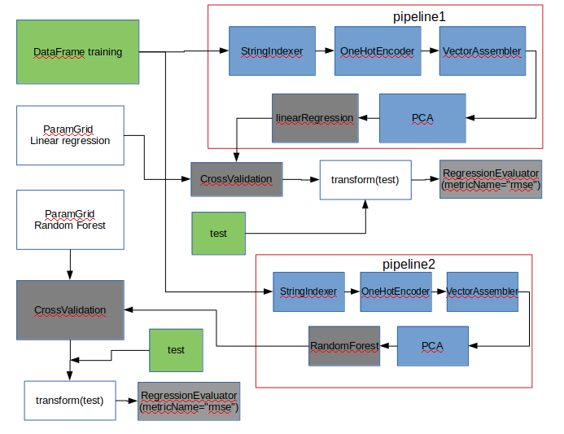

```{r setup, include=FALSE}
knitr::opts_chunk$set(echo = TRUE)
```

#### Lista de clusters


#### Nodos


#### Resumen 


#### Diagrama



#### Procedimiento
En esta tarea predije el retraso de salida del dataset de flights. Probe con dos modelos de regresión mediante un magic loop. Adjunto código de pyspark (Tarea7.py) y código de zeppelin(Tarea7.json).

Escogí los parámetros siguientes:

Regresión lineal:
* lr.maxIter = [5,10,15]
* lr.regParam = [0.0,0.5,1.0]
* Root-mean-square error = 36.551177318


Random Forest:
* rf.numTrees = [3,5,7])
* rf.maxBins = [20,25,32]
* Root-mean-square error = 36.4089766457

De los resultados del magic loop, podemos ver que el error es bastante grande en ambos algoritmos lo que implica que los parámetros definidos en los grids no son los adecuados, ante esto se sugeriría realizar el mismo loop pero modificando los hiperparámetros de los métodos utilizados o probando con distintos algoritmos.


Tiempo de ejecución: El tiempo de ejecución fue: 208.065182483 minutos = 3 horas 28 minutos con un cluster de 4 computadoras r4.xlarge de emr

#### Referencias

* https://spark.apache.org/docs/2.1.1/ml-pipeline.html
* https://spark.apache.org/docs/2.1.1/ml-tuning.html
* http://apache-spark-user-list.1001560.n3.nabble.com/StringIndexer-on-several-columns-in-a-DataFrame-with-Scala-td29842.html
* https://spark.apache.org/docs/2.1.0/mllib-ensembles.html
* Notas de clase de Liliana Millan 