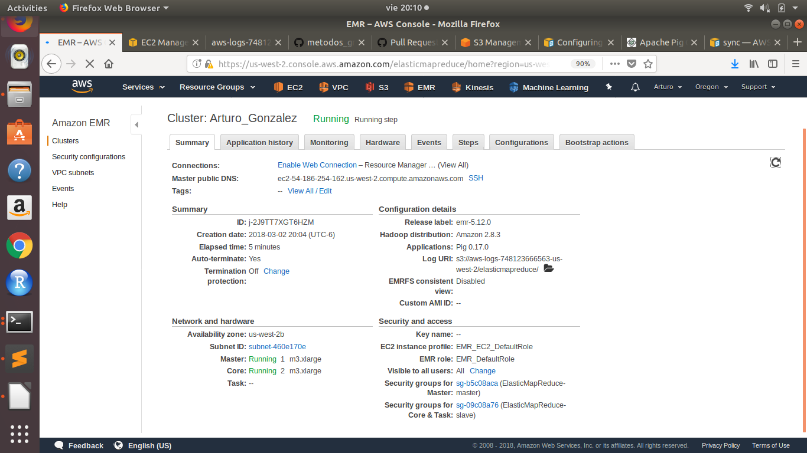

```{r setup, include=FALSE}
knitr::opts_chunk$set(echo = TRUE)
```

### Fotografía del cluster


### Resumen del cluster



### Fotografía de los nodos


### Fotografía de los steps en ejecución


### Fotografía de los steps completados


Para esta tarea cree dentro de la bucket al102964-bucket1/tarea4/ dos carpetas correspondientes a los ejercicios A y B. Dentro de estas carpetas subí los archivos csv así como los script de pig de cada ejercicio. Las salidas se escribieron a las carpetas correspondientes.

Para los ejercicios donde se pedían los máximos o mínimos propuse el top 10 para tener un mejor contexto del análisis.

Investigando sobre los encabezados, encontré que la mejor práctica es guardarlos en un archivo separado llamado .pig_header y se logra con la sentencia PigStorage(',', '-schema');


### Ejercicio A.

Los datos de northwind se encuentran en dropbox

Modifica el ejercicio de Rank para que en lugar de obtener el id del producto con mejor rank obtengamos el nombre del producto -requieres un join- con el mejor rank

Código:
```{r, eval=FALSE}
/******************  Ejercicio A   ************************/
/******************  Cargamos datasets de s3 **************/
products = load 's3://al102964-bucket1/tarea4/ejercicio_a/products.csv' using PigStorage(',') as (productid:chararray, productname:chararray, supplierid:chararray, categoryid:chararray, quantityperunit:int, unitprice:float, unitsinstock:int, unitsonorder:int, reorderlevel:int, discounted:int);
orders = load 's3://al102964-bucket1/tarea4/ejercicio_a/order_details.csv' using PigStorage(',') as (orderid:chararray,productid:chararray,unitprice:float,quantity:int,	discount:float);

/*Hacemos operaciones*/
group_orders = group orders by productid;
count_products = FOREACH group_orders GENERATE group as productid,COUNT($1) as n;
join_products_orders = JOIN count_products by productid, products by productid;
ranked = rank join_products_orders by n DESC;
limited_rank = limit ranked 10;
output_data = FOREACH limited_rank generate $0 as ranking, $1 as pid, $4 as name, $2 as total_orders;

/*Escribimos a s3*/
store output_data into 's3://al102964-bucket1/tarea4/ejercicio_a/output/' using PigStorage(',', '-schema');
```

Salida de ejercicio A:
```{r, eval=FALSE}
1,59,Raclette Courdavault,54
2,31,Gorgonzola Telino,51
2,24,Guaraná Fantástica,51
2,60,Camembert Pierrot,51
5,56,Gnocchi di nonna Alice,50
6,62,Tarte au sucre,48
7,41,Jacks New England Clam Chowder,47
8,75,Rhönbräu Klosterbier,46
9,2,Chang,44
10,16,Pavlova,43
```
El archivo esta disponible a modo de lectura en: https://s3-us-west-2.amazonaws.com/al102964-bucket1/tarea4/ejercicio_a/output/part-v010-o000-r-00000


### Ejercicio B.

Con los datos de aerolíneas, vuelos y aeropuertos que se encuentran en el dropbox y utilizando Pig contesta las siguientes preguntas:

Englobe todo el ejercicio B en un solo archivo de pig con distintas secciones. En la primera sección se leen los datasets.

```{r, eval=FALSE}
/******************  Ejercicio B   ************************/
/******************  Cargamos datasets de s3 **************/
airlines = load 's3://al102964-bucket1/tarea4/ejercicio_b/airlines.csv'  using PigStorage(',') as (iata_code:chararray,airline:chararray);

airports = load 's3://al102964-bucket1/tarea4/ejercicio_b/airports.csv' using PigStorage(',') as (iata_code:chararray,	airport:chararray,	city:chararray,	state:chararray,	country:chararray,	latitude:float,	longitude:float); 

flights = load 's3://al102964-bucket1/tarea4/ejercicio_b/flights.csv' using PigStorage(',') as (year:int, month:int, day:int,	day_of_week:int,	airline:chararray,	flight_number:int,	tail_number:chararray,	origin_airport:chararray,	destination_airport:chararray,	scheduled_departure:int,	departure_time:int,	departure_delay:int, taxi_out:int,	wheels_off:int,	scheduled_time:int,	elapsed_time:int,	air_time:int,	distance:int,	wheels_on:int,	taxi_in:int,	scheduled_arrival:int, arrival_time:int,	arrival_delay:int,	diverted:int,	cancelled:int,	cancellation_reason:chararray,	air_system_delay:chararray,	security_delay:chararray,	airline_delay:chararray,	late_aircraft_delay:chararray,	weather_delay:chararray);
```


1. ¿Cuántos vuelos existen en el dataset cuyo aeropuerto destino sea el "Honolulu International Airport"?

Código:     
```{r,eval=FALSE}
/* Ejercicio 1 */
/*¿Cuantos vuelos existen en el dataset cuyo aeropuerto destino sea el "Honolulu International Airport"? */
honolulu = filter airports by airport in ('Honolulu International Airport');
honolulu_format = FOREACH honolulu generate iata_code, airport;
honolulu_flights = JOIN flights BY destination_airport, honolulu_format BY iata_code;
honolulu_flights_group = GROUP honolulu_flights ALL;
hlf_count = FOREACH honolulu_flights_group GENERATE COUNT(honolulu_flights);
store hlf_count into 's3://al102964-bucket1/tarea4/ejercicio_b/output_ej1/' using PigStorage(',', '-schema');
```

Salida:
```{r,eval=FALSE}
43157
```
El archivo esta disponible a modo de lectura en: https://s3-us-west-2.amazonaws.com/al102964-bucket1/tarea4/ejercicio_b/output_ej1/part-v006-o000-r-00000
 
2. ¿Cuál es el vuelo con más retraso? ¿De qué aerolínea es?
Código:    
```{r,eval=FALSE}
/* Ejercicio 2*/
/*¿Cuál es el vuelo con más retraso? ¿De qué aerolínea es?*/
flights_arrival_delay = ORDER flights BY arrival_delay DESC;
flights_summary = FOREACH flights_arrival_delay GENERATE airline as airline_code, flight_number, arrival_delay;
flights_summary_top = limit flights_summary 10;
flights_summary_complete = JOIN flights_summary_top by airline_code,airlines by iata_code;
store flights_summary_complete into 's3://al102964-bucket1/tarea4/ejercicio_b/output_ej2/' using PigStorage(',', '-schema');
```
Salida:
```{r,eval=FALSE}
AA,1322,1971,AA,American Airlines Inc.
AA,96,1898,AA,American Airlines Inc.
AA,1063,1665,AA,American Airlines Inc.
AA,2559,1638,AA,American Airlines Inc.
AA,2214,1636,AA,American Airlines Inc.
AA,1319,1636,AA,American Airlines Inc.
AA,1312,1627,AA,American Airlines Inc.
AA,1279,1598,AA,American Airlines Inc.
AA,224,1593,AA,American Airlines Inc.
AA,270,1576,AA,American Airlines Inc.
```
El archivo esta disponible a modo de lectura en: https://s3-us-west-2.amazonaws.com/al102964-bucket1/tarea4/ejercicio_b/output_ej2/part-v010-o000-r-00000
    
    
    
3. ¿Qué día es en el que más vuelos cancelados hay?
Código:    
```{r,eval=FALSE}
/*Ejercicio 3*/
/*¿Qué día es en el que más vuelos cancelados hay?*/
cancelados = filter flights by cancelled == 1;
cancelados_reduced = FOREACH cancelados GENERATE day_of_week, cancelled;
dia_mas_group = GROUP cancelados_reduced by day_of_week;
dia_count = FOREACH dia_mas_group GENERATE group as day_of_week, COUNT($1) as n;
ranked = rank dia_count by n DESC;
store ranked into 's3://al102964-bucket1/tarea4/ejercicio_b/output_ej3/' using PigStorage(',', '-schema');
```
Salida:
```{r,eval=FALSE}
1,1,21073
2,2,15072
3,7,13165
4,4,12291
5,3,10729
6,5,8805
7,6,8749
```
El archivo esta disponible a modo de lectura en: https://s3-us-west-2.amazonaws.com/al102964-bucket1/tarea4/ejercicio_b/output_ej3/part-v020-o000-r-00000

    
#### 4. ¿Cuáles son los aeropuertos orígen con 17 cancelaciones?
Código
```{r,eval=FALSE}
/*Ejercicio 4*/
/*¿Cuáles son los aeropuertos orígen con 17 cancelaciones?*/
cancelados_airports_reduced = FOREACH cancelados GENERATE origin_airport, cancelled;
cancelados_airports_group = GROUP cancelados_airports_reduced by origin_airport;
cancelados_airports_sum = FOREACH cancelados_airports_group GENERATE group as origin_airport, COUNT($1) as n;
cancelled_17 = filter cancelados_airports_sum by n == 17;
cancelled_17_join = JOIN cancelled_17 by origin_airport, airports by iata_code;
cancelled_17_out = FOREACH cancelled_17_join GENERATE iata_code, airport, n;
store cancelled_17_out into 's3://al102964-bucket1/tarea4/ejercicio_b/output_ej4/' using PigStorage(',', '-schema');
```
Salida
```{r,eval=FALSE}
DHN,Dothan Regional Airport,17
DIK,Dickinson Theodore Roosevelt Regional Airport,17
ESC,Delta County Airport,17
```
El archivo esta disponible a modo de lectura en:
https://s3-us-west-2.amazonaws.com/al102964-bucket1/tarea4/ejercicio_b/output_ej4/part-v024-o000-r-00000

    
#### 5. ¿Cuál es el aeropuerto origen con más vuelos cancelados?
Código
```{r,eval=FALSE}
/*Ejercicio 5*/
/*¿Cuál es el aeropuerto origen con más vuelos cancelados?*/
cancelled_airports_join = JOIN cancelados_airports_sum by origin_airport, airports by iata_code;
rank_ap_mas_cancelados = ORDER cancelled_airports_join by n DESC;
rank_ap_mas_cancelados_top = limit rank_ap_mas_cancelados 10;
store rank_ap_mas_cancelados_top into 's3://al102964-bucket1/tarea4/ejercicio_b/output_ej5/' using PigStorage(',', '-schema');
```
Salida:
```{r,eval=FALSE}
ORD,8548,ORD,Chicago OHare International Airport,Chicago,IL,USA,41.9796,-87.90446
DFW,6254,DFW,Dallas/Fort Worth International Airport,Dallas-Fort Worth,TX,USA,32.89595,-97.0372
LGA,4531,LGA,LaGuardia Airport (Marine Air Terminal),New York,NY,USA,40.77724,-73.87261
EWR,3110,EWR,Newark Liberty International Airport,Newark,NJ,USA,40.6925,-74.16866
BOS,2654,BOS,Gen. Edward Lawrence Logan International Airport,Boston,MA,USA,42.36435,-71.00518
ATL,2557,ATL,Hartsfield-Jackson Atlanta International Airport,Atlanta,GA,USA,33.64044,-84.42694
LAX,2164,LAX,Los Angeles International Airport,Los Angeles,CA,USA,33.94254,-118.40807
SFO,2148,SFO,San Francisco International Airport,San Francisco,CA,USA,37.619,-122.37484
IAH,2130,IAH,George Bush Intercontinental Airport,Houston,TX,USA,29.98047,-95.33972
DEN,2123,DEN,Denver International Airport,Denver,CO,USA,39.85841,-104.667
```
El archivo esta disponible a modo de lectura en:
https://s3-us-west-2.amazonaws.com/al102964-bucket1/tarea4/ejercicio_b/output_ej5/part-v023-o000-r-00000

#### 6. ¿Cuál es el vuelo (flight number) con mayor diversidad de aeropuertos destino, cuáles son estos destinos? (ocupar bag te ayudará en esta pregunta)
Código
```{r, eval=FALSE}
/*Ejercicio 6*/
/*¿Cuál es el vuelo (flight number) con mayor diversidad de aeropuertos */
flights_destinations = FOREACH flights GENERATE flight_number, destination_airport;
distinct_flights_destinations = distinct flights_destinations;
airports_data = FOREACH airports GENERATE iata_code,airport;
flights_grouping = GROUP flights_destinations by flight_number;
airports_unique = FOREACH flights_grouping {dst = flights_destinations.destination_airport; unique_airport = distinct dst; GENERATE group as flight_number, COUNT(unique_airport) as n;};
top_destinies = ORDER airports_unique by n DESC;
top_destiny = limit top_destinies 1;
top_flight_destinies_iata = JOIN top_destiny by flight_number,distinct_flights_destinations by flight_number; 
top_flight_destinies_full = JOIN top_flight_destinies_iata by $3,airports by iata_code;
final = FOREACH top_flight_destinies_full GENERATE $0 as flightnumber,$1 as flights_quantity,$3 as iata_code, $5 as airline; 
store final into 's3://al102964-bucket1/tarea4/ejercicio_b/output_ej6/' using PigStorage(',', '-schema');
```
Salida
```{r,eval=FALSE}
202,68,ATL,Hartsfield-Jackson Atlanta International Airport
202,68,AUS,Austin-Bergstrom International Airport
202,68,BDL,Bradley International Airport
202,68,BNA,Nashville International Airport
202,68,BOS,Gen. Edward Lawrence Logan International Airport
202,68,BWI,Baltimore-Washington International Airport
202,68,CAK,Akron-Canton Regional Airport
202,68,CLE,Cleveland Hopkins International Airport
202,68,DCA,Ronald Reagan Washington National Airport
202,68,DEN,Denver International Airport
202,68,DTW,Detroit Metropolitan Airport
202,68,EWR,Newark Liberty International Airport
202,68,FLL,Fort Lauderdale-Hollywood International Airport
202,68,FNT,Bishop International Airport
202,68,IAD,Washington Dulles International Airport
202,68,IAH,George Bush Intercontinental Airport
202,68,IND,Indianapolis International Airport
202,68,ITO,Hilo International Airport
202,68,JFK,John F. Kennedy International Airport (New York International Airport)
202,68,LAS,McCarran International Airport
202,68,LAX,Los Angeles International Airport
202,68,LGA,LaGuardia Airport (Marine Air Terminal)
202,68,MCO,Orlando International Airport
202,68,MDW,Chicago Midway International Airport
202,68,MKE,General Mitchell International Airport
202,68,MSN,Dane County Regional Airport
202,68,MSP,Minneapolis-Saint Paul International Airport
202,68,OAK,Oakland International Airport
202,68,OGG,Kahului Airport
202,68,OKC,Will Rogers World Airport
202,68,ORD,Chicago OHare International Airport
202,68,PDX,Portland International Airport
202,68,PHL,Philadelphia International Airport
202,68,PHX,Phoenix Sky Harbor International Airport
202,68,PIT,Pittsburgh International Airport
202,68,RDU,Raleigh-Durham International Airport
202,68,RNO,Reno/Tahoe International Airport
202,68,RSW,Southwest Florida International Airport
202,68,SAN,San Diego International Airport (Lindbergh Field)
202,68,SAT,San Antonio International Airport
202,68,SEA,Seattle-Tacoma International Airport
202,68,SFO,San Francisco International Airport
202,68,SLC,Salt Lake City International Airport
202,68,SMF,Sacramento International Airport
202,68,TPA,Tampa International Airport
```
El archivo esta disponible a modo de lectura en:
https://s3-us-west-2.amazonaws.com/al102964-bucket1/tarea4/ejercicio_b/output_ej6/part-v031-o000-r-00000


### Referencias:
https://docs.aws.amazon.com/emr/latest/ReleaseGuide/emr-pig.html
Programming Pig - Allan Gates -2011 - Oreilly 
Notas de profesora Liliana Millan 