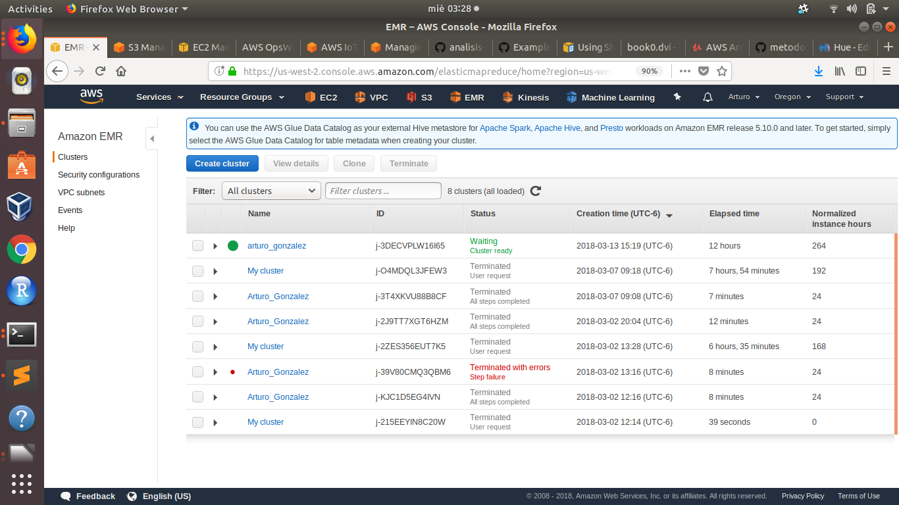
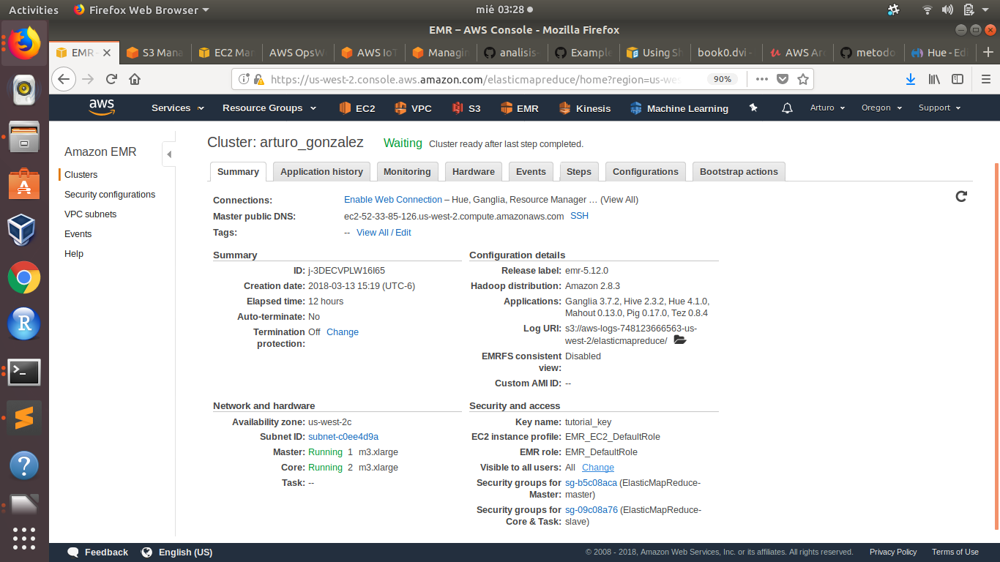
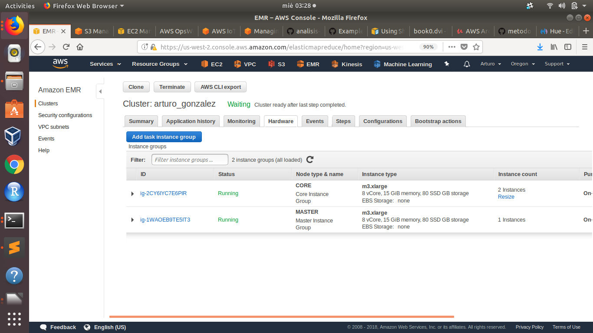
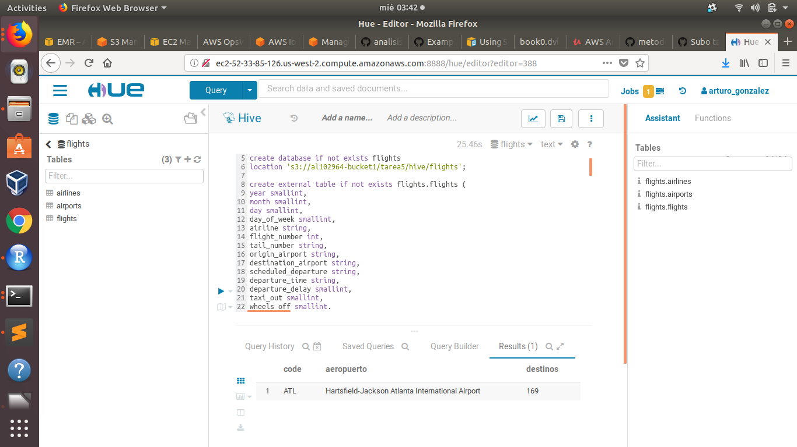

```{r setup, include=FALSE}
knitr::opts_chunk$set(echo = TRUE)
```

### Fotografía del cluster




### Resumen del cluster



### Fotografía de los nodos



### Fotografía de hue



Para esta tarea cree dentro de la bucket al102964-bucket1/tarea5/ carpetas correspondientes a los ejercicios a cada csv para el manejo con hive. Se incluye los archivos de salida de cada consulta y el archivo completo .hql

#### Ejercicio 1

#### Cargamos los archivos en hive
```{r eval=FALSE}
drop database if exists northwind cascade;
DROP TABLE IF EXISTS northwind.order_details

create database if not exists northwind 
location 's3://al102964-bucket1/tarea5/hive/northwind';

--Cargamos datasets para ejercicio1
create external table if not exists northwind.orders (
orderid smallint,
customerid string,
employeeid smallint,
orderdate timestamp,
requireddate timestamp,
shippeddate timestamp,
shipvia smallint,
freight float,
shipname string,
shipaddress string,
shipcity string,
shipregion string,
shippostalcode string,
shipcountry string)
ROW FORMAT DELIMITED FIELDS TERMINATED BY ','
LOCATION 's3://al102964-bucket1/tarea5/orders/'
TBLPROPERTIES ("skip.header.line.count"="1");

create external table if not exists northwind.employees (employeeid smallint,
lastname string,
firstname string,
title string,
titleofcourtesy string,
birthdate string,
hiredate string,
address string,
city string,
region string,
postalcode string,
country string,
homephone string,
extension string,
photo string,
notes string,
reportsto string,
photopath string)
row format delimited fields terminated by ','
LOCATION 's3://al102964-bucket1/tarea5/employees/';
TBLPROPERTIES ("skip.header.line.count"="1");
```


1a. ¿Cuántos "jefes" hay en la tabla empleados? ¿Cuáles son estos jefes: número de empleado, nombre, apellido, título, fecha de nacimiento, fecha en que iniciaron en la empresa, ciudad y país?

Código:
```{r eval=FALSE}
select count(distinct reportsto) as numero_jefes from northwind.employees where reportsto > 0;
select employeeid,firstname,lastname,title,birthdate,hiredate,city,country,r.empleado from northwind.employees e join (select salida.reportsto,empleado from (select reportsto,collect_set(firstname) as empleados from northwind.employees where reportsto > 0 group by reportsto) salida lateral view explode(salida.empleados) name as empleado) r on e.employeeid = r.reportsto;
```

Resultado: 1a.csv
```{r eval=FALSE}
employeeid,firstname,lastname,title,birthdate,hiredate,city,country,r.empleado
5,Steven,Buchanan,Sales Manager,1955-03-04,1993-10-17,London,UK,Michael
5,Steven,Buchanan,Sales Manager,1955-03-04,1993-10-17,London,UK,Robert
5,Steven,Buchanan,Sales Manager,1955-03-04,1993-10-17,London,UK,Anne
2,Andrew,Fuller,Vice President; Sales,1952-02-19,1992-08-14,Tacoma,USA,Nancy
2,Andrew,Fuller,Vice President; Sales,1952-02-19,1992-08-14,Tacoma,USA,Janet
2,Andrew,Fuller,Vice President; Sales,1952-02-19,1992-08-14,Tacoma,USA,Margaret
2,Andrew,Fuller,Vice President; Sales,1952-02-19,1992-08-14,Tacoma,USA,Steven
```

1b: ¿Quién es el segundo "mejor" empleado que más órdenes ha generado? (nombre, apellido, título, cuándo entró a la compañía, número de órdenes generadas, número de órdenes generadas por el mejor empleado (número 1))

Código:
```{r eval=FALSE}
select salida1.employeeid as employeeid, salida1.no_ordenes as no_ordenes, lag(no_ordenes) over(order by no_ordenes desc) as ordenes_maximas from (select employeeid, count(orderid) as no_ordenes from northwind.orders group by employeeid order by no_ordenes desc limit 2) salida1 order by no_ordenes asc limit 1;
```

Resultado: 1b.csv
```{r eval=FALSE}
employeeid,no_ordenes,ordenes_maximas
3,127,156
```

1c: ¿Cuál es el delta de tiempo más grande entre una orden y otra?
Código:
```{r eval=FALSE}
select a.orderid, datediff(a.orderdate,a.laggeada) as delta from (select orderid,orderdate,lag(orderdate,1) over (order by orderdate ASC) as laggeada from northwind.orders) a order by delta desc limit 1;
```

Resultado: 1c.csv
```{r eval=FALSE}
a.orderid,delta
10250,3
```

#### Ejercicio 2

#### Cargamos los archivos en hive
```{r eval=FALSE}
create database if not exists flights
location 's3://al102964-bucket1/tarea5/hive/flights';

create external table if not exists flights.flights (
year smallint,
month smallint,
day smallint,
day_of_week smallint,
airline string,
flight_number int,
tail_number string,
origin_airport string,
destination_airport string,
scheduled_departure string,
departure_time string,
departure_delay smallint,
taxi_out smallint,
wheels_off smallint,
scheduled_time int,
elapsed_time smallint,
air_time smallint,
distance int,
wheels_on int,
taxi_in smallint,
scheduled_arrival smallint,
arrival_time smallint,
arrival_delay smallint,
diverted smallint,
cancelled smallint,
cancellation_reason string,
air_system_delay smallint,
security_delay smallint,
airline_delay smallint,
late_aircraft_delay smallint,
weather_delay smallint)
ROW FORMAT DELIMITED FIELDS TERMINATED BY ','
LOCATION 's3://al102964-bucket1/tarea5/flights/'
TBLPROPERTIES ("skip.header.line.count"="1",'serialization.null.format'='NULL');
--TBLPROPERTIES('serialization.null.format'='NULL');

create external table if not exists flights.airlines (
iata_code string,
airline string)
ROW FORMAT DELIMITED FIELDS TERMINATED BY ','
LOCATION 's3://al102964-bucket1/tarea5/airlines/';
TBLPROPERTIES ("skip.header.line.count"="1");

create external table if not exists flights.airports (
iata_code string,
airport string,
state string,
country string,
latitude string,
longitude string
)
ROW FORMAT DELIMITED FIELDS TERMINATED BY ','
LOCATION 's3://al102964-bucket1/tarea5/airports/';
TBLPROPERTIES ("skip.header.line.count"="1")
```


2a) ¿Qué aerolíneas (nombres) llegan al aeropuerto "Honolulu International Airport"?
Código:
```{r eval=FALSE}
select airline from flights.airlines a join (select distinct(airline) as iata_code from flights.flights a join (select iata_code from flights.airports where airport = 'Honolulu International Airport') b where a.destination_airport = b.iata_code) b where a.iata_code = b.iata_code;
```

Resultado: 2a.csv
```{r eval=FALSE}
airline
American Airlines Inc.
Hawaiian Airlines Inc.
Alaska Airlines Inc.
United Air Lines Inc.
US Airways Inc.
Virgin America
Delta Air Lines Inc.
```

2b) ¿En qué horario (hora del día, no importan los minutos) hay salidas del aeropuerto de San Francisco ("SFO") a "Honolulu International Airport"? 
Código:
```{r eval=FALSE}
select distinct(cast(substr(departure_time,1,2) as int)) as hora, origin_airport,destination_airport from flights.flights a join (select iata_code from flights.airports where airport = 'Honolulu International Airport') b where a.destination_airport = b.iata_code and a.origin_airport = 'SFO' order by hora asc; 
```

Resultado: 2b.csv
```{r eval=FALSE}
hora,origin_airport,destination_airport
NULL,SFO,HNL
1,SFO,HNL
6,SFO,HNL
7,SFO,HNL
8,SFO,HNL
9,SFO,HNL
10,SFO,HNL
11,SFO,HNL
12,SFO,HNL
13,SFO,HNL
14,SFO,HNL
15,SFO,HNL
16,SFO,HNL
17,SFO,HNL
18,SFO,HNL
19,SFO,HNL
20,SFO,HNL
21,SFO,HNL
22,SFO,HNL
23,SFO,HNL
```
2c) ¿Qué día de la semana y en qué aerolínea nos conviene viajar a "Honolulu International Airport" para tener el menor retraso posible?
Código:
```{r eval=FALSE}
select * from (select d.day_of_week as day_of_week, d.iata_code as iata_code, avg(d.departure_delay) as promedio_retraso, d.airline as airline_code_clean from (select departure_delay,day_of_week,iata_code,destination_airport,airline from flights.flights a join (select iata_code from flights.airports where airport = 'Honolulu International Airport') b where a.destination_airport = b.iata_code) d group by d.day_of_week,d.iata_code,d.airline order by promedio_retraso asc limit 1) g join flights.airlines m on g.airline_code_clean = m.iata_code;
```

Resultado: 2c.csv
```{r eval=FALSE}
g.day_of_week,g.iata_code,g.promedio_retraso,g.airline_code_clean,m.iata_code,m.airline
3,HNL,-1.8235294117647058,AS,AS,Alaska Airlines Inc.
```

2d) ¿Cuál es el aeropuerto con mayor tráfico de entrada?
Código:
```{r eval=FALSE}
select a.destination_airport as code,b.airport as aeropuerto,a.conteo as conteo from (select destination_airport, count(*) as conteo from flights.flights group by destination_airport order by conteo desc limit 1) a join flights.airports b on a.destination_airport = b.iata_code;
```

Resultado: 2d.csv
```{r eval=FALSE}
code,aeropuerto,conteo
ATL,Hartsfield-Jackson Atlanta International Airport,346904
```

2e) ¿Cuál es la aerolínea con mayor retraso de salida por día de la semana?
Código:
```{r eval=FALSE}
select b.day_of_week, max(b.retraso) from (select day_of_week, airline, avg(departure_delay) as retraso from flights.flights group by day_of_week, airline order by retraso limit 10) b group by b.day_of_week;
```

Resultado: 2e.csv
```{r eval=FALSE}
1,0.6279500231374364
2,0.7757525430766037
3,0.709695973705834
4,2.1735618597320725
6,1.1895597377160863
7,0.13823908638791674
```

2f) ¿Cuál es la tercer aerolínea con menor retraso de salida los lunes (day of week = 2)?
Código:
```{r eval=FALSE}
select c.airline,b.airline,c.retraso from (select day_of_week, airline, avg(departure_delay) as retraso from flights.flights where day_of_week = '2' group by day_of_week, airline order by retraso asc limit 3) c join flights.airlines b on c.airline = b.iata_code order by c.retraso desc limit 1;
```

Resultado: 2f.csv
```{r eval=FALSE}
c.airline,b.airline,c.retraso
US,US Airways Inc.,6.475248598806726
```

2g) ¿Cuál es el aeropuerto origen que llega a la mayor cantidad de aeropuertos destino diferentes?
Código:
```{r eval=FALSE}
select a.aeropuerto_origen as code,b.airport as aeropuerto,a.destinos as destinos from (select origin_airport as aeropuerto_origen, count(distinct(destination_airport)) as destinos from flights.flights group by origin_airport order by destinos desc limit 1) a join flights.airports b on a.aeropuerto_origen = b.iata_code;
```

Resultado: 2g.csv
```{r eval=FALSE}
code,aeropuerto,destinos
ATL,Hartsfield-Jackson Atlanta International Airport,169
```
