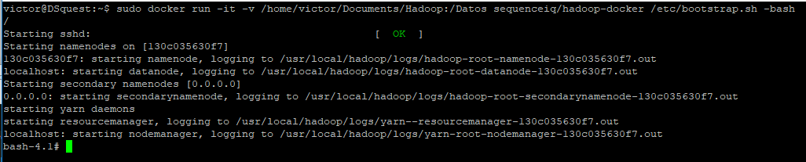
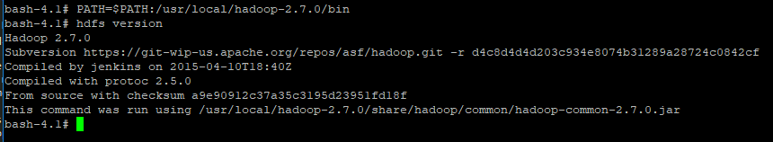
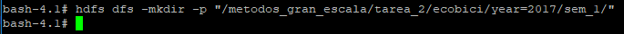
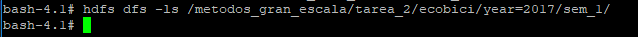
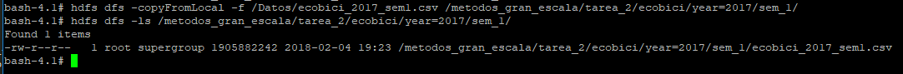
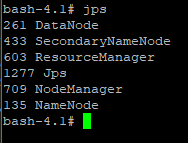
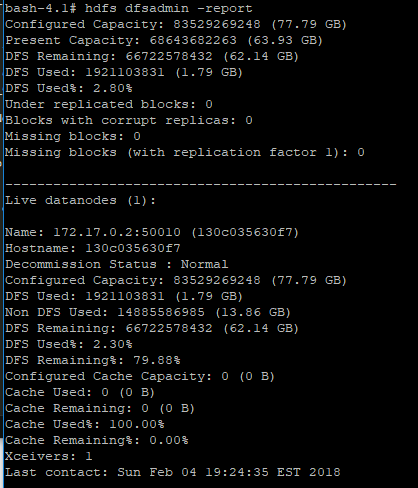

# Tarea 2

## Imagen de Docker

La versión de Hadoop que se utilizó en esta Tarea fue la 2.7.0 que obtuvimos del contendor sequenceiq que se encuentra en https://hub.docker.com/r/sequenceiq/hadoop-docker/

El comando en shell que se usó para descargar la imagen fue:

```{bash, eval=FALSE}
sudo docker pull sequenceiq/hadoop-docker:latest
```

Después, procedimos a montar el contenedor de Hadoop. En este codigo se asumió que la carpeta "origen" es /home/victor/Documents/Hadoop" y es ahí donde se encuentra el archivo ecobici_2017_sem1.csv.


El comando en shell que se usó para generar el contenedor fue:

```{bash, eval=FALSE}
sudo docker run -it -v /home/victor/Documents/Hadoop:/Datos sequenceiq/hadoop-docker /etc/bootstrap.sh -bash
```



## Creando el directorio

Con el objetivo de ahorrar escritura al momento de ejecutar los comandos de hadoop, agregamos la ruta de hdfs al PATH:

```{bash, eval=FALSE}
PATH=$PATH:/usr/local/hadoop-2.7.0/bin
```

Y verificamos que shell ya reconoce el comando hdfs

```{bash, eval=FALSE}
hdfs version
```



Ahora, procedemos a crear la carpeta solicitada, "/metodos_gran_escala/tarea_2/ecobici/year=2017/sem_1/":

```{bash, eval=FALSE}
hdfs dfs -mkdir -p "/metodos_gran_escala/tarea_2/ecobici/year=2017/sem_1/"
```



Y procedemos a ejecutar el comando que nos muestra el contenido de la carpeta con el objetivo de comprobar que en estos momentos la carpeta está vacía:

```{bash, eval=FALSE}
hdfs dfs -ls /metodos_gran_escala/tarea_2/ecobici/year=2017/sem_1/
```



## Carga de datos

Una ves contamos con la carpeta, procedemos a copiar los datos de ecobici a la carpeta creada:

```{bash, eval=FALSE}
hdfs dfs -copyFromLocal -f /Datos/ecobici_2017_sem1.csv /metodos_gran_escala/tarea_2/ecobici/year=2017/sem_1/
```

Y verificamos que en este caso la carpeta ya cuenta con un archivo, en este caso, el de ecobici:

```{bash, eval=FALSE}
hdfs dfs -ls /metodos_gran_escala/tarea_2/ecobici/year=2017/sem_1/
```



## JPS

El siguiente paso fue verificar que el NameNode, DataNode, ResourceManager y el NodeManager están activos en tu cluster de Hadoop:

```{bash, eval=FALSE}
jps
```



## Reporte DFS

Por último, le solicitamos a Hadoop que generará el reporte de los datos:

```{bash, eval=FALSE}
hdfs dfsadmin -report
```



De este reporte, podemos observar que el **DFS usado es de 2.80%.**