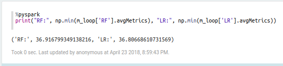

### Cluster
A continuacion se muestra el summary del cluster:

### Diagrama

A continuacion se muestra el diagrama:

### Tiempo de ejecucion

A continuacion se muestra el tiempo de ejecucion del magic loop:

### Parametros de mejor modelo por algoritmo

A continuacion se muestran los mejores hiperparametros para cada algoritmo propuesto:

### Mejor modelo

Se comparo el rmse para el mejor Random Forest y para la mejore regresion lineal:

Se observa que el mejor modelo fue la regresion lineal con los parametros anteriores. Seguramente es posible mejorar el desempeño de los modelos considerando variables adicionales que en este caso no fueron utilizadas, como por ejemplo la hora de partida programada o el tail number.

### Desempeno en Tests

A continuacion se muestra el desempeno del mejor modelo de cada algoritmo en el test:
