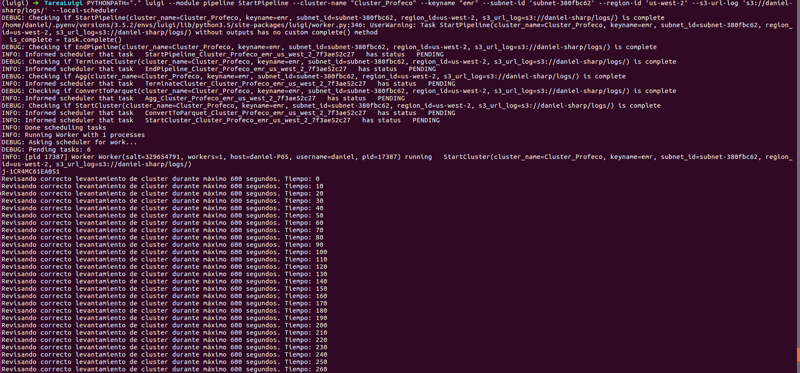
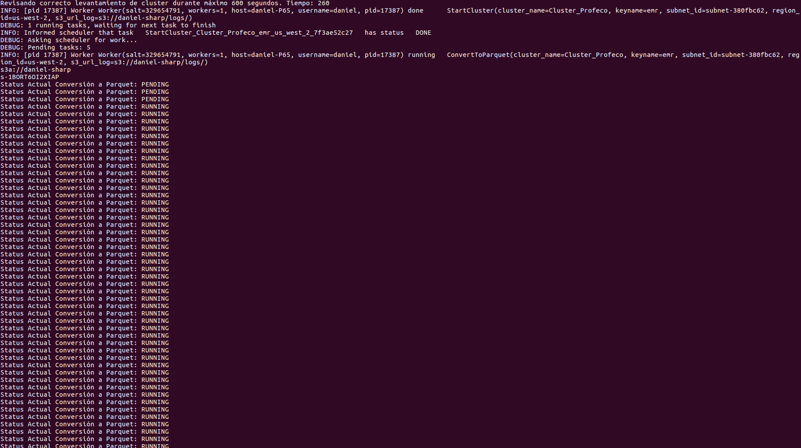
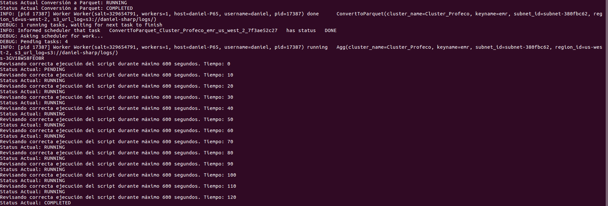
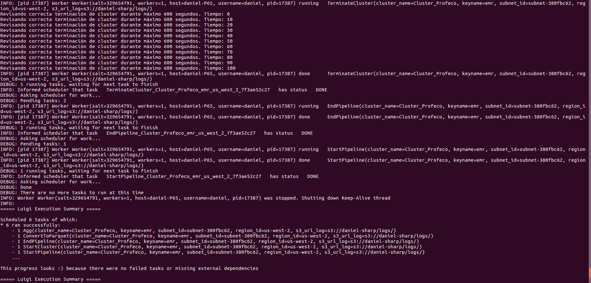
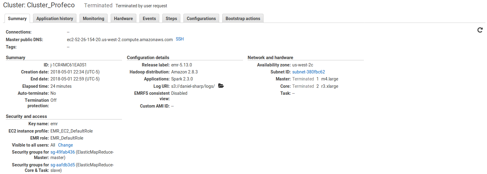
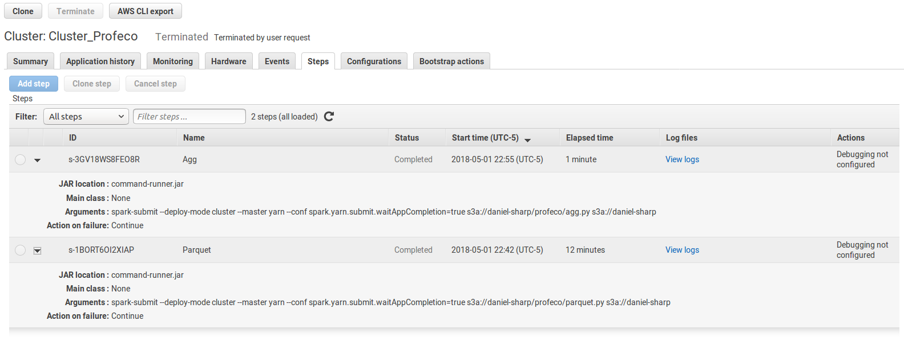
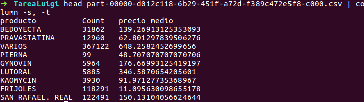

### Pipeline Luigi para análisis de Quien es Quien en los Precios  
#### Francisco Bahena, Cristian Challu, Eduardo Hidalgo, Daniel Sharp  

Para ejecutar el script es necesario instalar la librería contenidas en el requirements.txt, que únicamente es la de luigi. Posteriormente se requiere de correr el comando resaltado a continuación en la terminal.  
  
Se presupone que el usuario de este pipeline ya tiene los archivos requeridos en S3 (profeco.csv, parquet.py y agg.py) en una carpeta dentro de su S3 llamada profeco, es decir: s3://la-cubeta/profeco/, y que es la misma cubeta que se proporciona como argumento para los logs. La terminal desde la que se ejecute debe estar configurada con AWSCLI y poder modificar la cubeta de S3.  

```
PYTHONPATH="." luigi --module pipeline StartPipeline --cluster-name "Cluster_Profeco" --keyname "<Llave_para_cluster>" --subnet-id '<Subnet_id>' --region-id '<Región_de_servidores>' --s3-url-log '<Dirección_en_S3_para_logs>' --local-scheduler
```  

Especificamente, para la ejecución en nuestro equipo, se utilizó el siguiente comando:  

```
PYTHONPATH="." luigi --module pipeline StartPipeline --cluster-name "Cluster_Profeco" --keyname "emr" --subnet-id 'subnet-380fbc62' --region-id 'us-west-2' --s3-url-log 's3://daniel-sharp/logs/' --local-scheduler
```  

Para dar seguimiento a la ejecución de las tareas, en la misma terminal, posterior a correr la instrucción de ejecución, se imprime el progreso en cada uno de los pasos del pipeline.  

Para una correcta ejecución del script, es necesario tener la carpeta de configs con el archivo 'emr-config.json' en la carpeta del proyecto.  

El paso de agg genera una tabla con la cuenta de número de articulos por tipo de artículo y su precio promedio. El nombre del archivo descargado al final con esta información tendrá un nombre que comenzará con 'part' y será del tipo csv. Un resumen de esto se muestra a continuación:  

#### Visualización del proceso  

**Alza de cluster**  
  
  
**Convierte a Parquet**  
  
  
**Hace agregación**
  
  
**Cierre del cluster**  
  
  
**Muestra en AWS**
   
**Steps en AWS**
   

**Archivo Final**  
