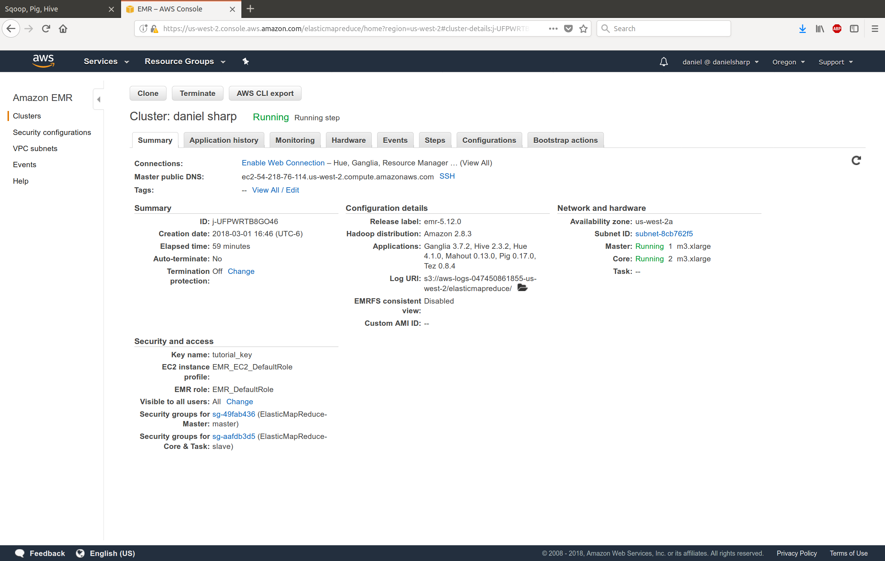
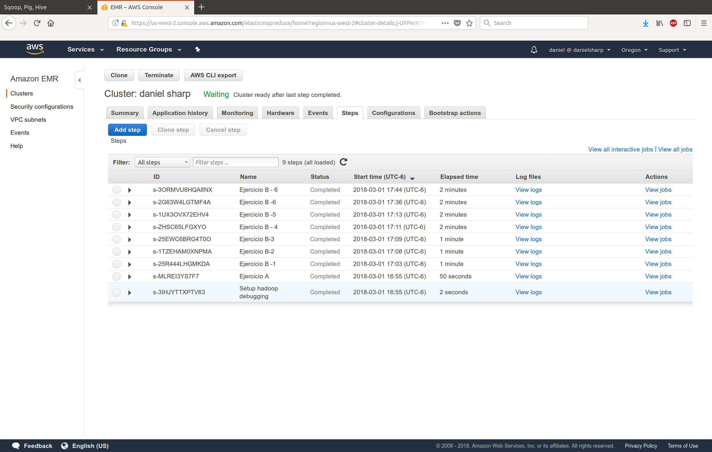
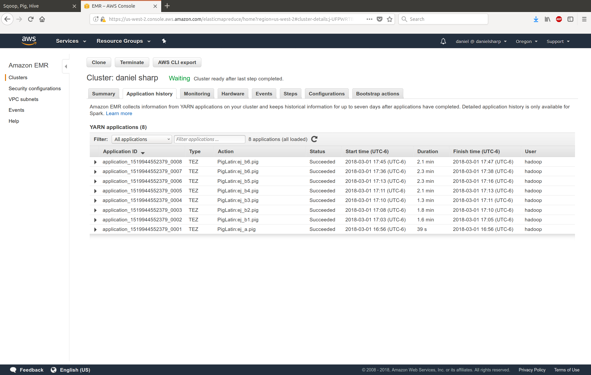

```{r setup, include=FALSE}
knitr::opts_chunk$set(echo = TRUE)
```

### Ejercicio A
Modifica el ejercicio de Rank para que en lugar de obtener el id del producto con mejor rank obtengamos el nombre del producto -requieres un join- con el mejor rank

```{sql eval=FALSE}
-- Se cargan ambas tablas a Pig
order_details = load 's3://daniel-sharp/t4ej_a/inputs/order_details.csv' using PigStorage(',') as (orderid:chararray, productid:chararray, unitprice:float, quantity:int, discount:float);

products = load 's3://daniel-sharp/t4ej_a/inputs/products.csv' using PigStorage(',') as (productid:chararray, productname:chararray, supplierid:chararray, categoryid:chararray, quantityperunit:int, unitprice:float, unitsinstock:int, unitsonorder:int, reorderlevel:int, discounted:int);

-- Se hace el join para poder crear la lista rankeada por el nombre
order_details_pname = JOIN order_details BY productid, products BY productid; 

-- Se agrupan por nombre de product
group_orders = GROUP order_details_pname BY productname;

-- Se lleva a cabo la cuenta de ocurrencias de cada producto
count_products_res = FOREACH group_orders GENERATE GROUP AS productname, COUNT($1) AS c;

-- Se ordenan de mayor a menor 
ranked = RANK count_products_res BY c DESC;

-- Se seleccionan las 10 primeras
limited_ranked = LIMIT ranked 10;

-- Se guarda el archivo resultante
STORE limited_ranked INTO's3://daniel-sharp/t4ej_a/output/';
```
  
  El scipt anterior genera el siguiente output:  
  
```{bash}
cat ej4a/ej4a
```
  
### Ejercicio B  
  
#### 1. ¿Cuántos vuelos existen en el dataset cuyo aeropuerto destino sea el “Honolulu International Airport”?  

*Código*  
```{sql eval=FALSE}
-- Carga de las tablas
flights = load 's3://daniel-sharp/t4ej_b/inputs/flights.csv' using PigStorage(',') as (year,month,day,day_of_week,airline,flight_number,tail_number,origin_airport,destination_airport,
scheduled_departure,departure_time,departure_delay,taxi_out,wheels_off,scheduled_time,elapsed_time,
air_time,distance,wheels_on,taxi_in,scheduled_arrival,arrival_time,arrival_delay,diverted,cancelled,
cancellation_reason,air_system_delay,security_delay,airline_delay,late_aircraft_delay,weather_delay);

airports = load 's3://daniel-sharp/t4ej_b/inputs/airports.csv' using PigStorage(',') as (iata_code,airport,city,state,country,latitude,longitude);

-- Join entre las tablas a traves del codigo de aeropuerto para obtener su nombre
flights_airname = join flights by destination_airport, airports by iata_code; 

-- Filtramos las observaciones para tomar solamente las de Honolulu
filtered = FILTER flights_airname BY airport == 'Honolulu International Airport';

-- Agrupamos las observaciones para poder tomar el COUNT
grouped = group filtered all;

-- Tomamos el COUNT de registros
count = foreach grouped generate COUNT(filtered) as n;

-- Guardamos el resultado en S3
store count into 's3://daniel-sharp/t4ej_b/out_b1';
```
  
*Resultado*
```{bash}
cat ej4b/outputs/out_1
```
Se encontraron 43,157 vuelos cuyo destino es el aeropuerto de Honolulu.  

#### 2. ¿Cuál es el vuelo con más retraso? ¿De qué aerolínea es?  

*Código*  
```{sql eval=FALSE}
-- Carga de las tablas
flights = LOAD 's3://daniel-sharp/t4ej_b/inputs/flights.csv' USING PigStorage(',') AS (year,month,day,day_of_week,airline,flight_number,tail_number,origin_airport,destination_airport,
scheduled_departure,departure_time,departure_delay,taxi_out,wheels_off,scheduled_time,elapsed_time,
air_time,distance,wheels_on,taxi_in,scheduled_arrival,arrival_time,arrival_delay,diverted,cancelled,
cancellation_reason,air_system_delay,security_delay,airline_delay,late_aircraft_delay,weather_delay);

airlines = LOAD 's3://daniel-sharp/t4ej_b/inputs/airlines.csv' USING PigStorage(',') AS (iata_code,airline_name);

--Union de las tablas a traves del codigo de aerolinea para obtener el nombre de la aerolinea
flights_airname = JOIN flights BY airline, airlines BY iata_code; 

-- Ordenamos los datos de manera descendente de acuerdo a su retraso de arribo
ordered = ORDER flights_airname BY arrival_delay DESC;

-- Seleccionamos únicamente las columnas de interés
selected = FOREACH ordered GENERATE flight_number, tail_number, airline_name, arrival_delay;

-- Limitamos a las primeras 5 observaciones
limited = LIMIT selected 5;

-- Guardamos resultado en s3
store limited into 's3://daniel-sharp/t4ej_b/out_b2';
```
  
*Resultado*
```{bash}
cat ej4b/outputs/out_2
```
Hubieron dos vuelos con el tiempo de retraso de arribo máximo en los datos, ambos arribando a su destino con 998 minutos (o 16.63 horas) de retraso:    
* El vuelo número 1977 con número de cola N969DL de la aerolinea Delta Air Lines.  
* El vuelo número 2284 con número de cola N333NB de la aerolinea Delta Air Lines.  

#### 3. ¿Qué día es en el que más vuelos cancelados hay?  

*Código*  
```{sql eval=FALSE}
-- Carga de la tabla de datos
flights = LOAD 's3://daniel-sharp/t4ej_b/inputs/flights.csv' USING PigStorage(',') AS (year,month,day,day_of_week:int,airline,flight_number,tail_number,origin_airport,destination_airport,
scheduled_departure,departure_time,departure_delay,taxi_out,wheels_off,scheduled_time,elapsed_time,
air_time,distance,wheels_on,taxi_in,scheduled_arrival,arrival_time,arrival_delay,diverted,cancelled:int,
cancellation_reason,air_system_delay,security_delay,airline_delay,late_aircraft_delay,weather_delay);

-- Seleccion de las columnas de interes
selected = FOREACH flights GENERATE day_of_week, cancelled;

-- Agrupamos los datos por dia de la semana (va del 1 al 7)
grouped = GROUP selected BY day_of_week;

-- Resumimos los datos con la suma de vuelos cancelados para cada día
cancelled = FOREACH grouped GENERATE group as day_of_week, SUM(selected.cancelled) as suma;

-- Guardamos resultado en S3
STORE cancelled INTO 's3://daniel-sharp/t4ej_b/out_b3';
```
  
*Resultado*
```{bash}
cat ej4b/outputs/out_3
```  
Tomando el número 1 como lunes, podemos ver que la mayoría de las cancelaciones de vuelos suceden en este día, seguidos por el martes. Los días con menor número de cancelaciones son en viernes y sábados.  

#### 4. ¿Cuáles son los aeropuertos orígen con 17 cancelaciones? 

*Código*  
```{sql eval=FALSE}
-- Carga de los datos
flights = LOAD 's3://daniel-sharp/t4ej_b/inputs/flights.csv' USING PigStorage(',') AS (year,month,day,day_of_week:int,airline,flight_number,tail_number,origin_airport,destination_airport,
scheduled_departure,departure_time,departure_delay,taxi_out,wheels_off,scheduled_time,elapsed_time,
air_time,distance,wheels_on,taxi_in,scheduled_arrival,arrival_time,arrival_delay,diverted,cancelled:int,
cancellation_reason,air_system_delay,security_delay,airline_delay,late_aircraft_delay,weather_delay);

airports = load 's3://daniel-sharp/t4ej_b/inputs/airports.csv' using PigStorage(',') as (iata_code,airport,city,state,country,latitude,longitude);

-- Union de las tablas para obtener el nombre de los aeropuertos
joined = JOIN flights BY origin_airport, airports BY iata_code;

-- Agrupacion de los datos por aeropuerto
grouped = GROUP joined BY airport;

-- Calculo de las cancelaciones (dado que la variable de cancelled es booleana solo es necesario hacer la suma)
cancelled = FOREACH grouped GENERATE group as airport, SUM(joined.cancelled) as suma;

-- Selecciona unicamente los registros con 17 cancelaciones
filtered = FILTER cancelled BY suma == 17;

-- Seleccion de las columnas de interes
result = FOREACH filtered GENERATE airport, suma;

--Guardar los datos en S3
STORE result INTO 's3://daniel-sharp/t4ej_b/out_b4';
```
  
*Resultado*
```{bash}
cat ej4b/outputs/out_4
```  
#### 5. ¿Cuál es el aeropuerto origen con más vuelos cancelados?

*Código*  
```{sql eval=FALSE}
-- Carga de los datos
flights = LOAD 's3://daniel-sharp/t4ej_b/inputs/flights.csv' USING PigStorage(',') AS (year,month,day,day_of_week:int,airline,flight_number,tail_number,origin_airport,destination_airport,
scheduled_departure,departure_time,departure_delay,taxi_out,wheels_off,scheduled_time,elapsed_time,
air_time,distance,wheels_on,taxi_in,scheduled_arrival,arrival_time,arrival_delay,diverted,cancelled:int,
cancellation_reason,air_system_delay,security_delay,airline_delay,late_aircraft_delay,weather_delay);

airports = LOAD 's3://daniel-sharp/t4ej_b/inputs/airports.csv' USING PigStorage(',') AS (iata_code,airport,city,state,country,latitude,longitude);

-- Union de las tablas para obtener el nombre del aeropuerto de origen
joined = JOIN flights BY origin_airport, airports BY iata_code;

-- Agrupacion de los datos por aeropuerto
grouped = GROUP joined BY airport;

-- Suma de los vuelos cancelados por aeropuerto
cancelled = FOREACH grouped GENERATE group as airport, SUM(joined.cancelled) as suma;

-- Seleccion de variables de interes
selected = FOREACH cancelled GENERATE airport, suma;

-- Ordenamiento de los datos de acuerdo al numero de cancelaciones
ordered = ORDER selected BY suma DESC;

-- Seleccion de las primeras 5
limited = LIMIT ordered 5;

-- Guarda datos en S3
STORE limited INTO 's3://daniel-sharp/t4ej_b/out_b5';
```
  
*Resultado*
```{bash}
cat ej4b/outputs/out_5
```  

  El aeropuerto con mayor número de cancelaciones es el de Chicago, seguido por Dallas, los tres y cuatro están en Nueva York.  
  
#### 6. ¿Cuál es el vuelo (flight number) con mayor diversidad de aeropuertos destino, cuáles son estos destinos? (ocupar bag te ayudará en esta pregunta)

*Código*  
```{sql eval=FALSE}
-- Carga de las tablas
flights = LOAD 's3://daniel-sharp/t4ej_b/inputs/flights.csv' USING PigStorage(',') AS (year,month,day,day_of_week:int,airline,flight_number,tail_number,origin_airport,destination_airport,
scheduled_departure,departure_time,departure_delay,taxi_out,wheels_off,scheduled_time,elapsed_time,
air_time,distance,wheels_on,taxi_in,scheduled_arrival,arrival_time,arrival_delay,diverted,cancelled:int,
cancellation_reason,air_system_delay,security_delay,airline_delay,late_aircraft_delay,weather_delay);

airports = LOAD 's3://daniel-sharp/t4ej_b/inputs/airports.csv' USING PigStorage(',') AS (iata_code,airport,city,state,country,latitude,longitude);

-- Union entre tablas para obtener el nombre del aeropuerto destino
joined = JOIN flights BY destination_airport, airports BY iata_code;

-- Agrupar datos por numero de vuelo
grouped = GROUP joined BY flight_number;

-- Para cada numero de vuelo se obtienen los distintos aeropuertos que hay y se obtiene la cuenta de aeropuertos distintos que hay por numero de vuelo junto con la lista completa de ellos
counted = FOREACH grouped { unique_airports = DISTINCT joined.airport; GENERATE group as flight_number, COUNT(unique_airports) as destinations, unique_airports;};

-- Se ordenan los registros de acuerdo al numero de distintos aeropuertos destino de cada vuelo
ordered = ORDER counted BY destinations DESC;

-- Se seleccionan los primeros 5 registros
limited = LIMIT ordered 5;

-- Se guardan resultados en S3
STORE limited INTO 's3://daniel-sharp/t4ej_b/out_b6';
```
  
*Resultado*
```{bash}
cat ej4b/outputs/out_6
```  
  
El número de vuelo con mayor número de aeropuertos destino es el 4988 con 54 destinos. En el recuadro anterior se muestran los primeros 5 registros.  

#### Anexo: Fotos del cluster EMR en AWS  
*El proceso del Ejercicio B -6 aparece dos veces por un error en su primera ejecución*  
  
  

  

