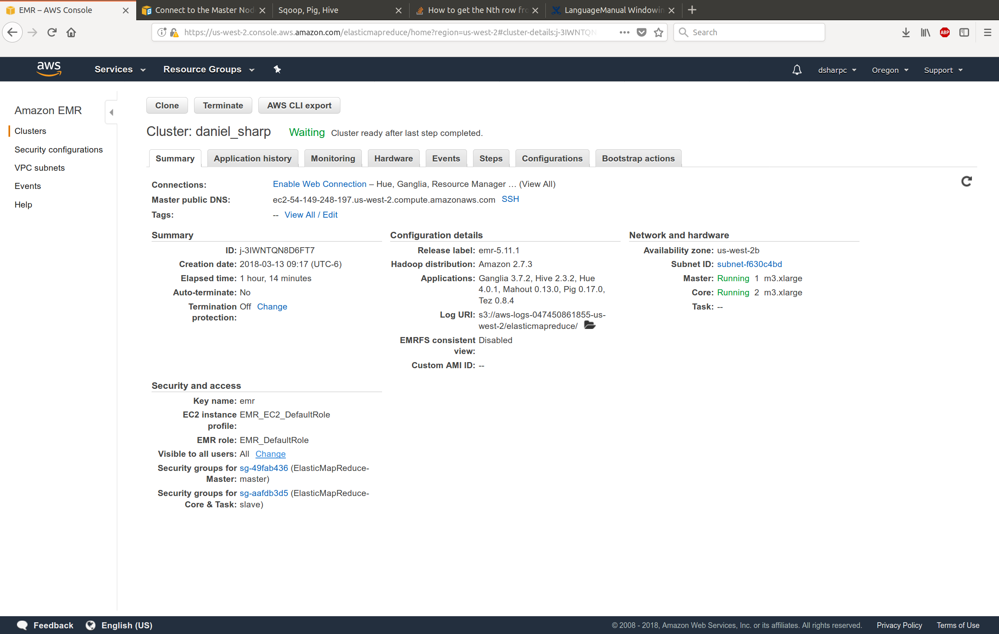
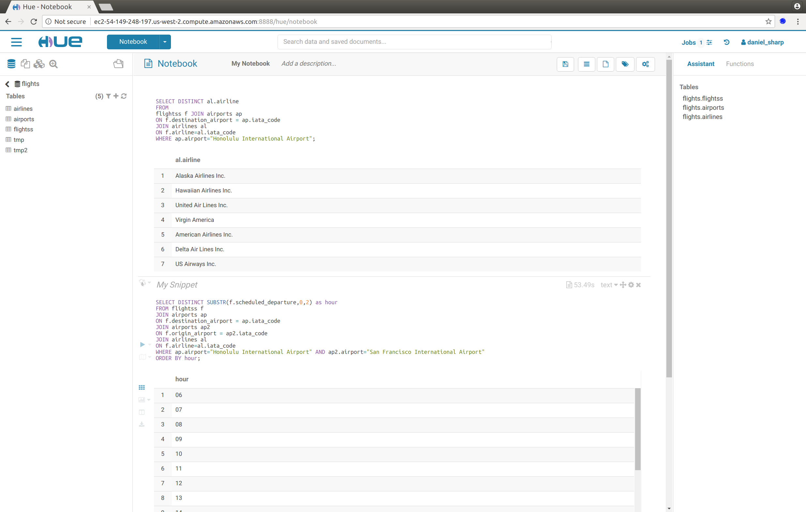

### Ejercicio 1

**Carga de base de Northwind**

```{sql eval=FALSE}
drop database if exists northwind cascade;

create database if not exists northwind location "s3://daniel-sharp/t5ej_1/northwind_db/";

create external table if not exists northwind.products (productid smallint,
productname string,
supplierid smallint,
categoryid smallint,
quantityperunit string,
unitprice float,
unitsinstock smallint,
unitsonorder smallint,
reorderlevel smallint,
discontinued int)
ROW FORMAT SERDE 'org.apache.hadoop.hive.serde2.OpenCSVSerde'
LOCATION 's3://daniel-sharp/t5ej_1/northwind_db/products'
tblproperties ("skip.header.line.count"="1");

LOAD DATA INPATH 's3://daniel-sharp/t5ej_1/inputs/products.csv' INTO table northwind.products;

create external table if not exists northwind.orders (
orderid smallint,
customerid string,
employeeid smallint,
orderdate timestamp,
requireddate timestamp,
shippeddate timestamp,
shipvia smallint,
freight float,
shipname string,
shipaddress string,
shipcity string,
shipregion string,
shippostalcode string,
shipcountry string)
ROW FORMAT SERDE 'org.apache.hadoop.hive.serde2.OpenCSVSerde'
LOCATION 's3://daniel-sharp/t5ej_1/northwind_db/orders'
tblproperties ("skip.header.line.count"="1");


LOAD DATA INPATH 's3://daniel-sharp/t5ej_1/inputs/orders.csv'
INTO table northwind.orders;

create external table if not exists northwind.order_details (orderid smallint,
productid smallint,
unitprice float,
quantity smallint,
discount float)
ROW FORMAT SERDE 'org.apache.hadoop.hive.serde2.OpenCSVSerde'
location 's3://daniel-sharp/t5ej_1/northwind_db/orderdetails'
tblproperties ("skip.header.line.count"="1");

LOAD DATA INPATH 's3://daniel-sharp/t5ej_1/inputs/order_details.csv'
INTO table northwind.order_details;


create external table if not exists northwind.customers (
customerid string,
companyname string,
contactname string,
contacttitle string ,
address string,
city string,
region string,
postalcode string,
country string,
phone string,
fax string)
ROW FORMAT SERDE 'org.apache.hadoop.hive.serde2.OpenCSVSerde'
location 's3://daniel-sharp/t5ej_1/northwind_db/customers'
tblproperties ("skip.header.line.count"="1");

LOAD DATA INPATH 's3://daniel-sharp/t5ej_1/inputs/customers.csv'
INTO table northwind.customers;

create external table if not exists northwind.employees (
employeeid smallint,
lastname string,
firstname string,
title string,
titleofcourtesy string,
birthdate string,
hiredate string,
address string,
city string,
region string,
postalcode string,
country string,
homephone string,
extension string,
photo string,
notes string,
reportsto smallint,
photopath string)
ROW FORMAT SERDE 'org.apache.hadoop.hive.serde2.OpenCSVSerde'
location 's3://daniel-sharp/t5ej_1/northwind_db/employees'
tblproperties ("skip.header.line.count"="1");

LOAD DATA INPATH 's3://daniel-sharp/t5ej_1/inputs/employees.csv'
INTO table northwind.employees;

```


a ) ¿Cuántos “jefes” hay en la tabla empleados? ¿Cuáles son estos jefes: número de empleado, nombre, apellido, título, fecha de nacimiento, fecha en que iniciaron en la empresa, ciudad y país? (atributo reportsto, ocupa explode en tu respuesta)  

```{sql eval=FALSE}
-- Regresa el número de jefes
SELECT COUNT(DISTINCT reportsto)
FROM employees
WHERE reportsto <> '';


-- Cuales son estos jefes
CREATE TEMPORARY TABLE tmp1a AS
SELECT * FROM (SELECT employeeid, firstname, lastname, title, birthdate, hiredate, city, country
FROM employees) a
JOIN
(SELECT reportsto, collect_list(firstname) as subs
FROM employees
WHERE reportsto <> ''
GROUP BY reportsto) b 
ON a.employeeid=b.reportsto;

SELECT employeeid, firstname, lastname, title, birthdate, hiredate, city, country, sub
FROM tmp1a
LATERAL VIEW explode(subs) subView AS sub;

```
  
**Salida**
```{bash}
cat ej1_a1.csv

```
  Hay dos jefes en la empresa.  
  
```{bash}
cat ej1_a2.csv | sed 's/, / /' | column -t -s ','
```
  

b) ¿Quién es el segundo “mejor” empleado que más órdenes ha generado? (nombre, apellido, título, cuándo entró a la compañía, número de órdenes generadas, número de órdenes generadas por el mejor empleado (número 1))  
```{sql eval=FALSE}
CREATE TEMPORARY TABLE tmp1b AS
SELECT b.firstname, b.lastname, b.title, b.hiredate, a.sales, LEAD(sales) OVER(ORDER BY sales) max
FROM (SELECT employeeid, COUNT(*) as sales
FROM orders
GROUP BY employeeid) a
JOIN
(SELECT employeeid as e2, firstname, lastname, title, hiredate
FROM employees) b
ON a.employeeid=b.e2
GROUP BY b.firstname, b.lastname, b.title, b.hiredate, a.sales
ORDER BY sales DESC;

SELECT * FROM 
(SELECT row_number() OVER (partition by 1) rn, d.* FROM tmp1b d) q 
WHERE q.rn = 2;
```  

**Salida**
```{bash}
cat ej1_b.csv | column -t -s ','
```

c) ¿Cuál es el delta de tiempo más grande entre una orden y otra?
```{sql eval=FALSE}
CREATE TEMPORARY TABLE tmp1c AS
SELECT orderid, cast(to_date(from_unixtime(unix_timestamp(orderdate, 'yyyy-MM-dd'))) as date) as dateorder
FROM orders;

SELECT t.orderid, datediff(t.dateorder, t.dif) as delta
FROM(
SELECT orderid, dateorder, (LAG(dateorder) OVER(ORDER BY orderid)) as dif
FROM tmp1c) t
ORDER BY delta DESC
LIMIT 10;

```
**Salida**
```{bash}
cat ej1_c.csv | column -t -s ','
```
El delta máximo entre dos órdenes es de 3 días y se repite en varias ordenes.

### Ejercicio 2

**Carga de base de flights**

```{sql eval=FALSE}
drop database if exists flights cascade;

create database if not exists flights location "s3://daniel-sharp/t5ej_2/flights_db/";

create external table if not exists flights.airlines (
iata_code string,
airline string)
ROW FORMAT SERDE 'org.apache.hadoop.hive.serde2.OpenCSVSerde'
LOCATION 's3://daniel-sharp/t5ej_2/flights_db/airlines'
tblproperties ("skip.header.line.count"="1");

LOAD DATA INPATH 's3://daniel-sharp/t5ej_2/inputs/airlines.csv' INTO table flights.airlines;

create external table if not exists flights.airports (
iata_code string,
airport string,
city string,
state string,
country string,
latitude double,
longitude double)
ROW FORMAT SERDE 'org.apache.hadoop.hive.serde2.OpenCSVSerde'
LOCATION 's3://daniel-sharp/t5ej_2/flights_db/airports'
tblproperties ("skip.header.line.count"="1");


LOAD DATA INPATH 's3://daniel-sharp/t5ej_2/inputs/airports.csv'
INTO table flights.airports;

create external table if not exists flights.flightss (
year smallint,
month smallint,
day smallint,
day_of_week smallint,
airline string,
flight_number smallint,
tail_number string,
origin_airport string,
destination_airport string,
scheduled_departure smallint,
departure_time smallint,
departure_delay smallint,
taxi_out smallint,
wheels_off smallint,
scheduled_time smallint,
elapsed_time smallint,
air_time smallint,
distance smallint,
wheels_on smallint,
taxi_in smallint,
scheduled_arrival smallint,
arrival_time smallint,
arrival_delay smallint,
diverted smallint,
cancelled smallint,
cancellation_reason string,
air_system_delay string,
security_delay string,
airline_delay string,
late_aircraft_delay string,
weather_delay string
)
ROW FORMAT SERDE 'org.apache.hadoop.hive.serde2.OpenCSVSerde'
location 's3://daniel-sharp/t5ej_2/flights_db/flightss'
tblproperties ("skip.header.line.count"="1");

LOAD DATA INPATH 's3://daniel-sharp/t5ej_2/inputs/flights.csv'
INTO table flights.flightss;

```


a) ¿Qué aerolíneas (nombres) llegan al aeropuerto “Honolulu International Airport”?  
```{sql eval=FALSE}
SELECT DISTINCT al.airline
FROM
flightss f JOIN airports ap
ON f.destination_airport = ap.iata_code
JOIN airlines al
ON f.airline=al.iata_code
WHERE ap.airport="Honolulu International Airport";
```  

**Salida**
```{bash}
cat ej2_a.csv | column -t -s ','
```

b) ¿En qué horario (hora del día, no importan los minutos) hay salidas del aeropuerto de San Francisco (“SFO”) a “Honolulu International Airport”?  
```{sql eval=FALSE}
SELECT DISTINCT SUBSTR(f.scheduled_departure,0,2) as hour
FROM flightss f 
JOIN airports ap 
ON f.destination_airport = ap.iata_code
JOIN airports ap2
ON f.origin_airport = ap2.iata_code
JOIN airlines al
ON f.airline=al.iata_code
WHERE ap.airport="Honolulu International Airport" AND ap2.airport="San Francisco International Airport"
ORDER BY hour;
```  
**Salida**
```{bash}
cat ej2_b.csv
```
  

c) ¿Qué día de la semana y en qué aerolínea nos conviene viajar a “Honolulu International Airport” para tener el menor retraso posible?  
```{sql eval=FALSE}
SELECT al.airline, f.day_of_week, AVG(f.departure_delay) as fdelay
FROM
flightss f JOIN airports ap
ON f.destination_airport = ap.iata_code
JOIN airlines al
ON f.airline=al.iata_code
WHERE ap.airport="Honolulu International Airport"
GROUP BY al.airline, f.day_of_week
HAVING fdelay > 0
ORDER BY fdelay
LIMIT 10;
```  
**Salida**
```{bash}
cat ej2_c.csv | column -t -s ','
```
El mejor día es el viernes en Hawaian Airlines.

d) ¿Cuál es el aeropuerto con mayor tráfico de entrada?  
```{sql eval=FALSE}
SELECT ap.airport, COUNT(*) as traffic
FROM
flightss f JOIN airports ap
ON f.destination_airport = ap.iata_code
GROUP BY ap.airport
ORDER BY traffic DESC
LIMIT 10;
```  
**Salida**  
```{bash}
cat ej2_d.csv | column -t -s ','
```
El aeropuerto de Atlanta tuvo 346,904 vuelos de entrada en el periodo que consideran los datos.  

e) ¿Cuál es la aerolínea con mayor retraso de salida por día de la semana?  
```{sql eval=FALSE}
CREATE TEMPORARY TABLE tmp AS
SELECT al.airline, f.day_of_week, AVG(f.departure_delay) as fdelay
FROM
flightss f JOIN airlines al
ON f.airline=al.iata_code
GROUP BY al.airline, f.day_of_week;

CREATE TEMPORARY TABLE tmp2 AS
SELECT day_of_week, MAX(fdelay) as mdelay
FROM tmp
GROUP BY day_of_week;

SELECT a.airline, a.day_of_week, b.mdelay
FROM tmp a 
JOIN tmp2 b 
ON a.fdelay = b.mdelay
ORDER BY a.day_of_week;

```  
**Salida**  
```{bash}
cat ej2_e.csv | column -t -s ','
```
Spirit Air Lines es la aerolínea que en promedio tiene más retraso por día excepto en martes y miercoles, donde es superada por United.  

f) ¿Cuál es la tercer aerolínea con menor retraso de salida los lunes (day of week = 2)?  
```{sql eval=FALSE}
SELECT al.airline, f.day_of_week, AVG(f.departure_delay) as fdelay
FROM
flightss f 
JOIN airlines al
ON f.airline=al.iata_code
WHERE f.day_of_week = 2
GROUP BY al.airline, f.day_of_week
HAVING fdelay > 0
ORDER BY fdelay
LIMIT 3;
```  
**Salida**  
```{bash}
cat ej2_f.csv | column -t -s ','
```
La tercera aerolínea con menor retraso los lunes es American Airlines, con un promedio de 6.75 minutos.  

g) ¿Cuál es el aeropuerto origen que llega a la mayor cantidad de aeropuertos destino diferentes?  
```{sql eval=FALSE}
SELECT ap.airport, COUNT( DISTINCT f.destination_airport) as dests
FROM
flightss f JOIN airports ap
ON f.origin_airport = ap.iata_code
GROUP BY ap.airport
ORDER BY dests DESC
LIMIT 10;
```  
**Salida**
```{bash}
cat ej2_g.csv | column -t -s ','
```
El aeropuerto con mayor número de destinos distintos es el de Atlanta con 169.  

### Foto del Cluster

  


