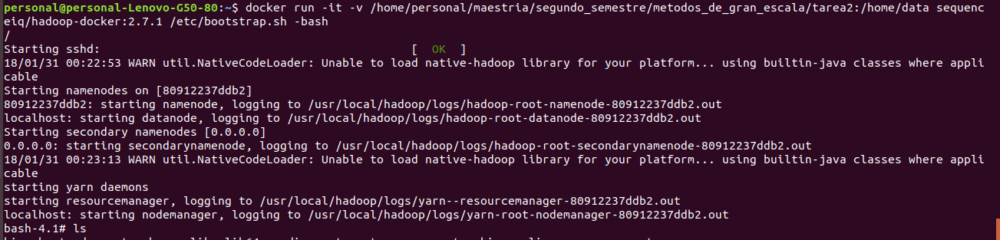
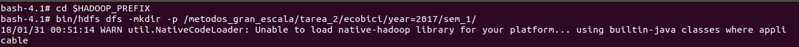
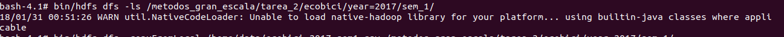
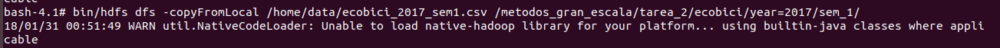
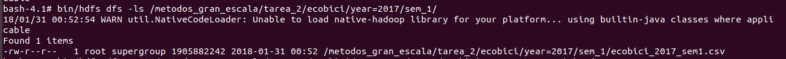
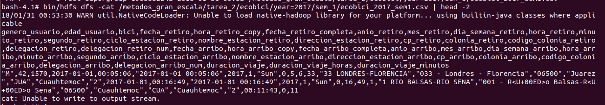
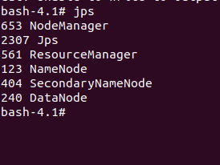
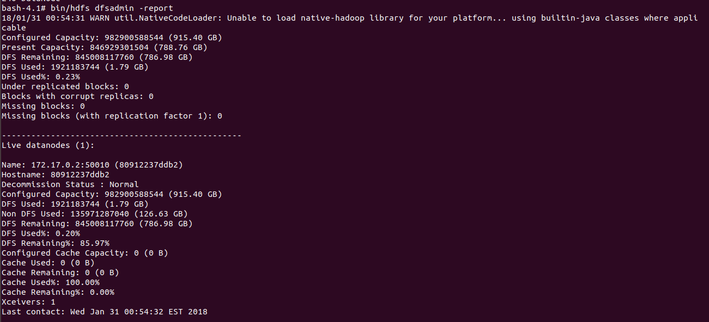

```{r setup, include=FALSE}
knitr::opts_chunk$set(echo = TRUE)
```

Tarea 2:

Paso 1. Se descarga el archivo csv de la carpeta de dropbox ubicado en el url:  https://www.dropbox.com/sh/u0g3g378xfdyxot/AACN77EAFN1rjNkPemkX-PWZa?dl=0

Paso 2: Se descarga  la imagen de sequenceiq del url con hadoop 2.7.1: 
https://hub.docker.com/r/sequenceiq/hadoop-docker/
Mediante el comando en bash: docker pull sequenceiq/hadoop-docker:2.7.1 

Paso 3: Se crea el contenedor con el volumen mapeado para tener archivo de ecobici visible dentro del contenedor:
docker run -it -v /home/personal/maestria/segundo_semestre/metodos_de_gran_escala/tarea2:/home/data sequenceiq/hadoop-docker:2.7.1 /etc/bootstrap.sh -bash





Paso 4: Se crea el directorio dentro de hadoop 
bash-4.1# cd $HADOOP_PREFIX
bash-4.1# bin/hdfs dfs -mkdir -p /metodos_gran_escala/tarea_2/ecobici/year=2017/sem_1/



Paso 5: Se verifica que este construido el directorio y que no haya nada
bash-4.1# bin/hdfs dfs -ls /metodos_gran_escala/tarea_2/ecobici/year=2017/sem_1/



Paso 6. Se copia el archivo de datos de ecobici (mapeado-volumen) dentro de hdfs:
bash-4.1# bin/hdfs dfs -copyFromLocal /home/data/ecobici_2017_sem1.csv /metodos_gran_escala/tarea_2/ecobici/year=2017/sem_1/



Paso 7: Se verifica que el archivo de ecobici este dentro de hadoop:
bash-4.1# bin/hdfs dfs -ls /metodos_gran_escala/tarea_2/ecobici/year=2017/sem_1/



Paso 8: Se verifica el  contenido de archivo ecobici dentro de hadoop imprimir primeras 2 lineas:
bash-4.1# bin/hdfs dfs -cat /metodos_gran_escala/tarea_2/ecobici/year=2017/sem_1/ecobici_2017_sem1.csv | head -2



Paso 9: Se verifica que estén corriendo NameNode-DataNode(Hadoop) y ResourceManager-Manager(Yarn) con jps
bash-4.1# jps


Paso 10: 
bash-4.1# bin/hdfs dfsadmin -report


¿Cuál es el % de DFS utilizado una vez que ya subiste los datos?
DFS used%: 0.20% 