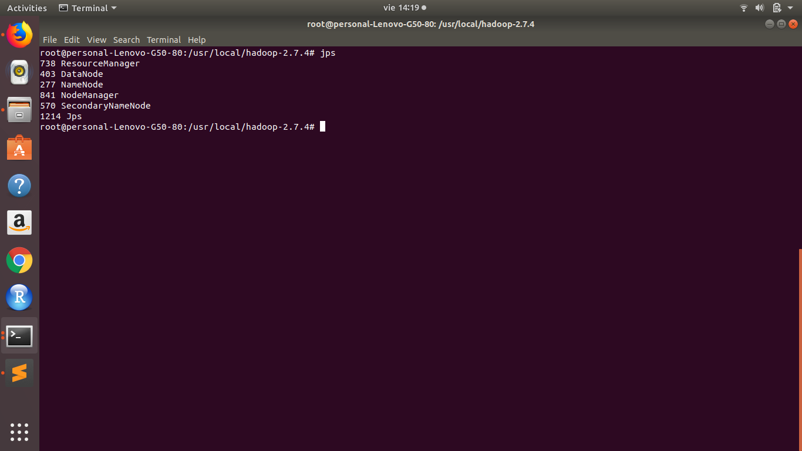
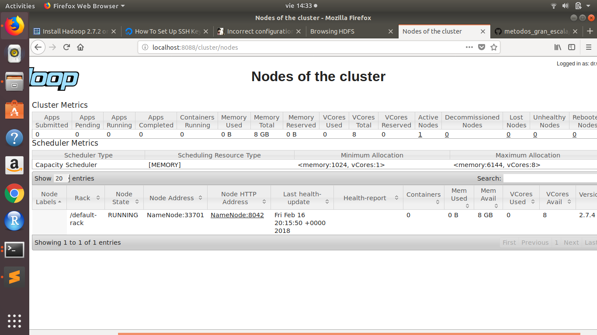
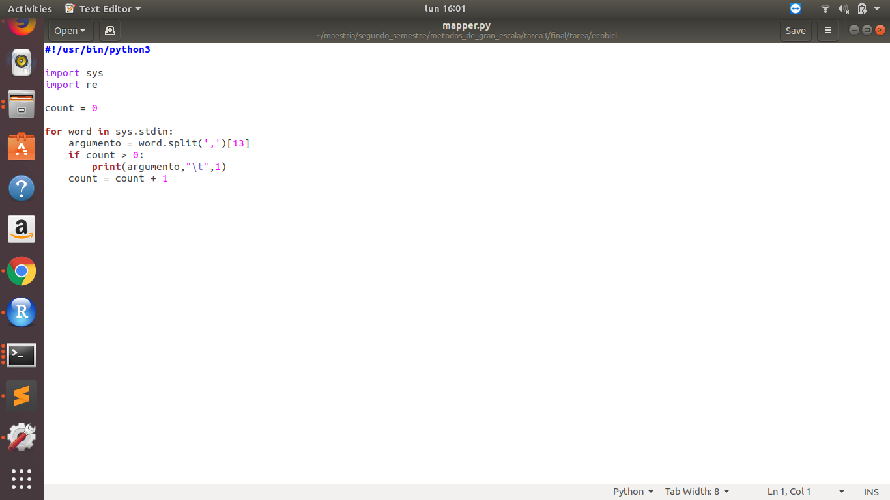
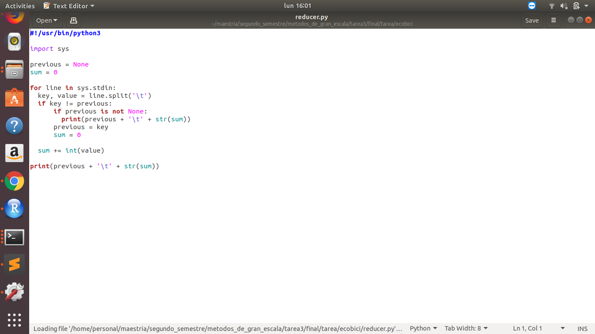
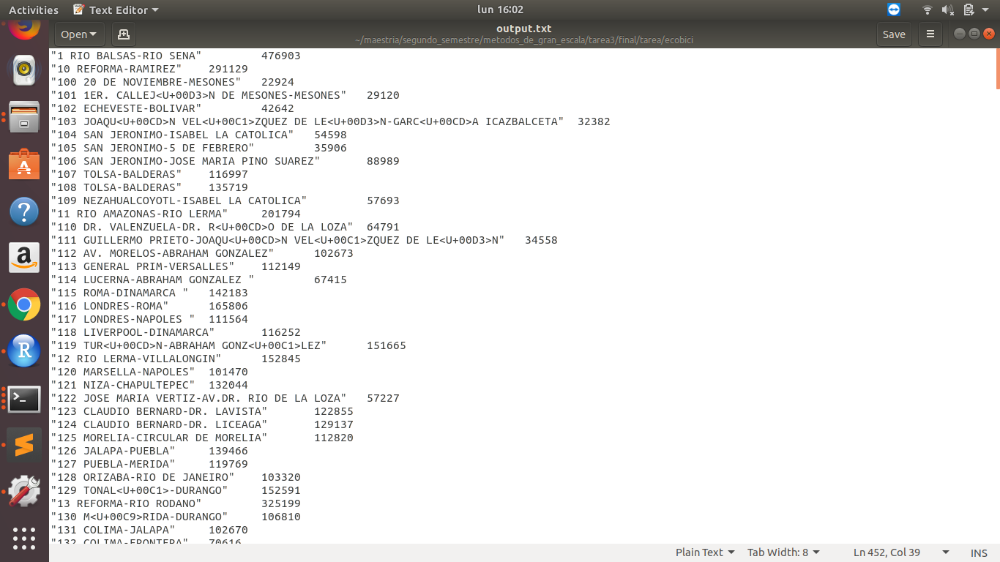
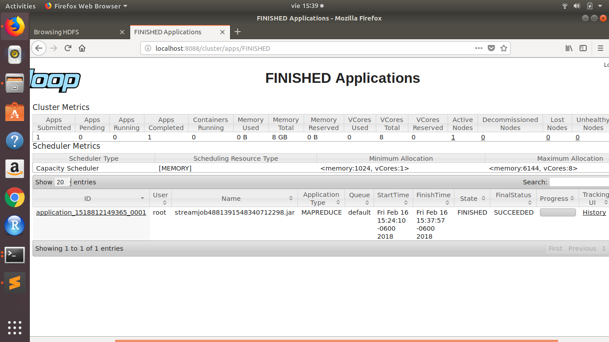
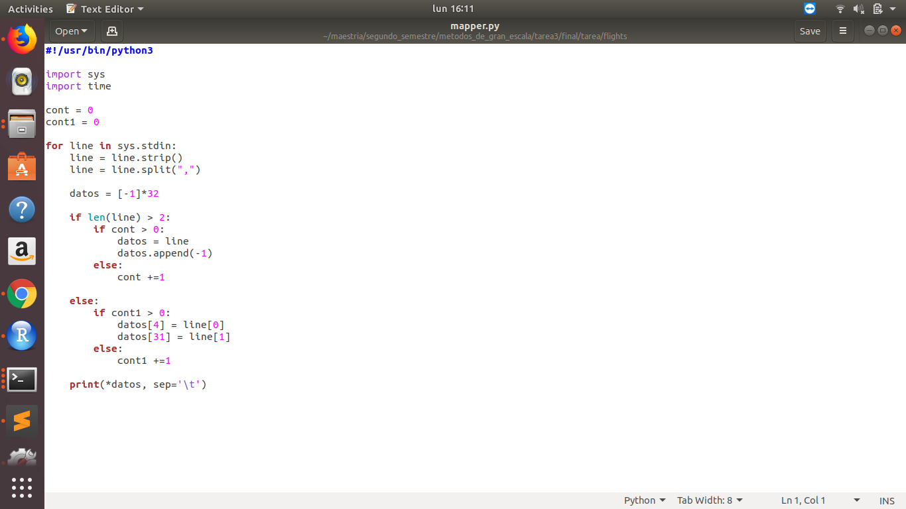
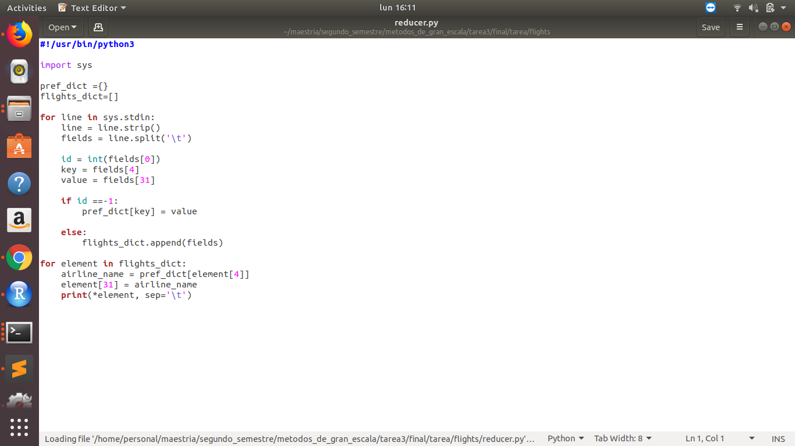
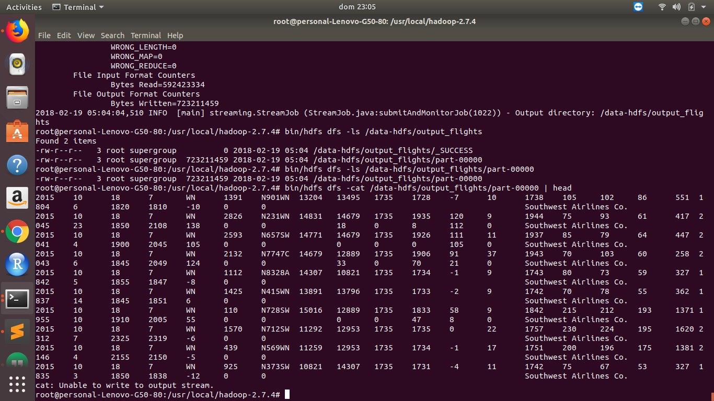
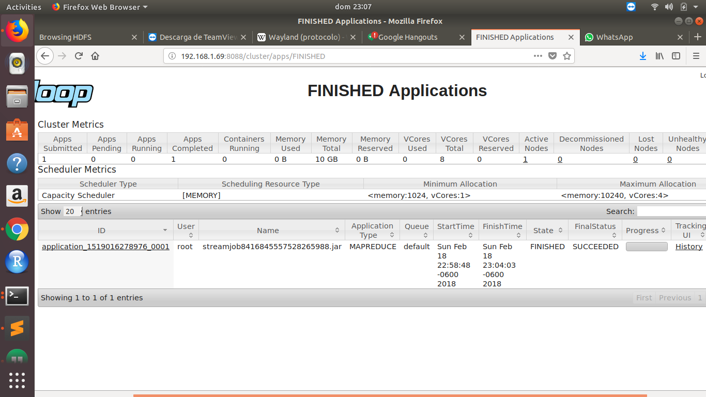

```{r setup, include=FALSE}
knitr::opts_chunk$set(echo = TRUE)
```

### Parte 1

En un Rmd poner la imagen que obtengan de jps una vez que todos los miembros del equipo se han podido conectar al clúster de hadoop



En el mismo Rmd poner la imagen de localhost:8088 seleccionando la opción Nodes




### Parte 2

ejericio 1: El mapper.py, reducer.py y output.txt del conteo del # de registros por cicloestación

    Imágen del jps del clúster
    Imágen de localhost:8088 seleccionando la opción Nodes
    Imágen de localhost:8088 seleccionando la opción FINISHED para ver que los jobs corrieron existosamente









Ejercicio 2: El mapper.py, reducer.py y output.txt del join del lado del mapper

    Imágen del jps del clúster
    Imágen de localhost:8088 seleccionando la opción Nodes
    Imágen de localhost:8088 seleccionando la opción FINISHED para ver que los jobs corrieron existosamente










