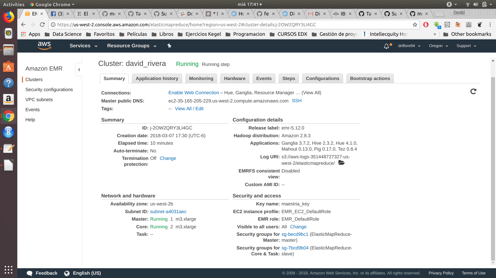
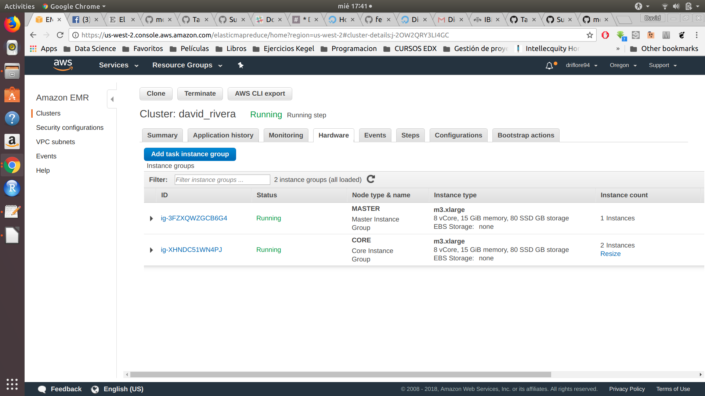

## CLUSTER





## Ejercicio A

```{r, eval=FALSE}
/* *EJERCICIO A* */

/* Datos */

products = load 's3://driflore94maestria/data/products.csv' using PigStorage(',') as (productid:chararray, productname:chararray, supplierid:chararray, categoryid:chararray, quantityperunit:int, unitprice:float, unitsinstock:int, unitsonorder:int, reorderlevel:int, discounted:int);

order_details = load 's3://driflore94maestria/data/order_details.csv' using PigStorage(',') as (orderid:chararray, productid:chararray, unitprice:float, quantity:int, discount:float);

group_orders = group order_details by productid;

/* Codigo */

count_products = FOREACH group_orders GENERATE group as productid,COUNT($1) as n;

join_products_orders = JOIN count_products by productid, products by productid;

ranked = rank join_products_orders by n DESC;

limited_rank = limit ranked 10;

result_data = FOREACH limited_rank generate $0 as ranking, $4 as product_name, $2 as total_orders;
```

Output:

```{r,eval=FALSE}
1,Raclette Courdavault,54
2,Gorgonzola Telino,51
2,Guaraná Fantástica,51
2,Camembert Pierrot,51
5,Gnocchi di nonna Alice,50
6,Tarte au sucre,48
7,Jack's New England Clam Chowder,47
8,Rhönbräu Klosterbier,46
9,Chang,44
10,Pavlova,43
```

## Ejercicio B
```{r, eval=FALSE}
/* Datos */ 

airlines = load 's3://driflore94maestria/data/airlines.csv'  using PigStorage(',') as (iata_code:chararray,airline:chararray);

airports = load 's3://driflore94maestria/data/airports.csv' using PigStorage(',') as (iata_code:chararray,	airport:chararray,	city:chararray,	state:chararray,	country:chararray,	latitude:float,	longitude:float); 

flights = load 's3://driflore94maestria/data/flights.csv' using PigStorage(',') as (year:int, month:int, day:int,	day_of_week:int,	airline:chararray,	flight_number:int,	tail_number:chararray,	origin_airport:chararray,	destination_airport:chararray,	scheduled_departure:int,	departure_time:int,	departure_delay:int, taxi_out:int,	wheels_off:int,	scheduled_time:int,	elapsed_time:int,	air_time:int,	distance:int,	wheels_on:int,	taxi_in:int,	scheduled_arrival:int, arrival_time:int,	arrival_delay:int,	diverted:int,	cancelled:int,	cancellation_reason:chararray,	air_system_delay:chararray,	security_delay:chararray,	airline_delay:chararray,	late_aircraft_delay:chararray,	weather_delay:chararray);


```

1. ¿Cuántos vuelos existen en el dataset cuyo aeropuerto destino sea el "Honolulu International Airport"?

```{r, eval=FALSE}
code_airport = FOREACH airports generate iata_code, airport;
dest = FOREACH flights generate destination_airport;
g_dest = GROUP dest BY destination_airport;
dest_count = FOREACH g_dest GENERATE group as destination_airport, COUNT($1) as n;
count_code_airport = JOIN dest_count BY destination_airport, code_airport by iata_code;
flights_honolulu = FILTER count_code_airport by airport in ('Honolulu International Airport');
result_data = FOREACH flights_honolulu generate $3 as airport, $1 as flights;
store result_data into 's3://driflore94maestria/ej1b' using PigStorage(',', '-schema');
```

Output:

```{r, eval=FALSE}
Honolulu International Airport,43157
```


2.- ¿Cuál es el vuelo con más retraso? ¿De qué aerolínea es?

```{r, eval=FALSE}
delay = ORDER flights BY arrival_delay DESC;
flights_delay = FOREACH delay GENERATE airline as airline_code, flight_number, arrival_delay;
flights_delay_1 = limit flights_delay 1;
result_data = JOIN flights_delay_1 by airline_code, airlines by iata_code;
store result_data into 's3://driflore94maestria/ej2b' using PigStorage(',', '-schema');
```

Output:

```{r,eval=FALSE}
AA,1322,1971,AA,American Airlines Inc.
```

3.- ¿Qué día es en el que más vuelos cancelados hay?

```{r, eval = FALSE}
flights_canceled = FOREACH flights GENERATE day_of_week, cancelled;
flights_cfilter = FILTER flights_canceled BY cancelled == 1;
group_cancelled = GROUP flights_cfilter BY day_of_week;
count_day = FOREACH group_cancelled GENERATE group as day_of_week, COUNT($1) as n;
ranked = rank count_day by n DESC;
result_data = limit ranked 1;
store result_data into 's3://driflore94maestria/ej3b' using PigStorage(',', '-schema');
```

Output:

```{r, eval=FALSE}
1,1,21073
```


4.- ¿Cuáles son los aeropuertos orígen con 17 cancelaciones?

```{r,eval=FALSE}
code_airport = FOREACH airports GENERATE iata_code, airport;
cancelled_f = FILTER flights BY cancelled == 1;
origen_cancelled = FOREACH cancelled_f GENERATE origin_airport, cancelled;
group_origen_cancelled = GROUP origen_cancelled BY origin_airport;
sum_cancelled = FOREACH group_origen_cancelled GENERATE group as origin_airport, COUNT($1) as total;
cancelled_17 = FILTER sum_cancelled BY total == 17;
join_cancelled_17 = JOIN cancelled_17 by origin_airport, code_airport by iata_code;
result_data = FOREACH join_cancelled_17 GENERATE airport, total;
store result_data into 's3://driflore94maestria/ej4b' using PigStorage(',', '-schema');
```

Output:

```{r, eval=FALSE}
Dothan Regional Airport,17
Dickinson Theodore Roosevelt Regional Airport,17
Delta County Airport,17
```


5.-¿Cuál es el aeropuerto origen con más vuelos cancelados?

```{r,eval=FALSE}
cancelled_f = FILTER flights BY cancelled == 1;
origen_cancelled = FOREACH cancelled_f GENERATE origin_airport, cancelled;
code_airport = FOREACH airports GENERATE iata_code, airport;
group_origen_cancelled = GROUP origen_cancelled BY origin_airport;
sum_cancelled = FOREACH group_origen_cancelled GENERATE group as origin_airport, COUNT($1) as n;
join_more_cancelled = JOIN sum_cancelled by origin_airport, code_airport by iata_code;
ranked_join = RANK join_more_cancelled by n DESC;
limited_rank = LIMIT ranked_join 1;
result_data = FOREACH limited_rank generate airport as airport, n as total_cancellations;
store result_data into 's3://driflore94maestria/ej5b' using PigStorage(',', '-schema');
```

```{r, eval=FALSE}
Chicago O'Hare International Airport,8548
```


6.-¿Cuál es el vuelo (flight number) con mayor diversidad de aeropuertos destino, cuáles son estos destinos? (ocupar bag te ayudará en esta pregunta)

```{r, eval=FALSE}
destinos = FOREACH flights GENERATE flight_number, destination_airport;
destinos_distintos = DISTINCT destinos;
code_airport = FOREACH airports GENERATE iata_code, airport;
group_destinos = GROUP destinos by flight_number;
unique_airports = FOREACH group_destinos {arpdest= destinos.destination_airport; unique_arpdes=tdiestinct arpdest; GENERATE group as flight_number, COUNT (unique_arpdes) as n}
rank_destinos = ORDER unique_airports by n DESC;
limit_rank = LIMIT rank_destinos 1;
join_limit_rank = JOIN limit_rank BY flight_number, destinos_distintos by flight_number;
join_limit_codeairport = JOIN join_limit_rank by $3, code_airport BY iata_code;
result_data = FOREACH join_limit_codeairport GENERATE $0 as vuelo, $1 as qty, $5 as aeropuerto;
store result_data into 's3://driflore94maestria/ej6b' using PigStorage(',', '-schema');
```

Output:

```{r, eval=FALSE}
202,68,Hartsfield-Jackson Atlanta International Airport
202,68,Austin-Bergstrom International Airport
202,68,Bradley International Airport
202,68,Nashville International Airport
202,68,Gen. Edward Lawrence Logan International Airport
202,68,Baltimore-Washington International Airport
202,68,Akron-Canton Regional Airport
202,68,Cleveland Hopkins International Airport
202,68,Ronald Reagan Washington National Airport
202,68,Denver International Airport
202,68,Detroit Metropolitan Airport
202,68,Newark Liberty International Airport
202,68,Fort Lauderdale-Hollywood International Airport
202,68,Bishop International Airport
202,68,Washington Dulles International Airport
202,68,George Bush Intercontinental Airport
202,68,Indianapolis International Airport
202,68,Hilo International Airport
202,68,John F. Kennedy International Airport (New York International Airport)
202,68,McCarran International Airport
202,68,Los Angeles International Airport
202,68,LaGuardia Airport (Marine Air Terminal)
202,68,Orlando International Airport
202,68,Chicago Midway International Airport
202,68,General Mitchell International Airport
202,68,Dane County Regional Airport
202,68,Minneapolis-Saint Paul International Airport
202,68,Oakland International Airport
202,68,Kahului Airport
202,68,Will Rogers World Airport
202,68,Chicago O'Hare International Airport
202,68,Portland International Airport
202,68,Philadelphia International Airport
202,68,Phoenix Sky Harbor International Airport
202,68,Pittsburgh International Airport
202,68,Raleigh-Durham International Airport
202,68,Reno/Tahoe International Airport
202,68,Southwest Florida International Airport
202,68,San Diego International Airport (Lindbergh Field)
202,68,San Antonio International Airport
202,68,Seattle-Tacoma International Airport
202,68,San Francisco International Airport
202,68,Salt Lake City International Airport
202,68,Sacramento International Airport
202,68,Tampa International Airport
```

