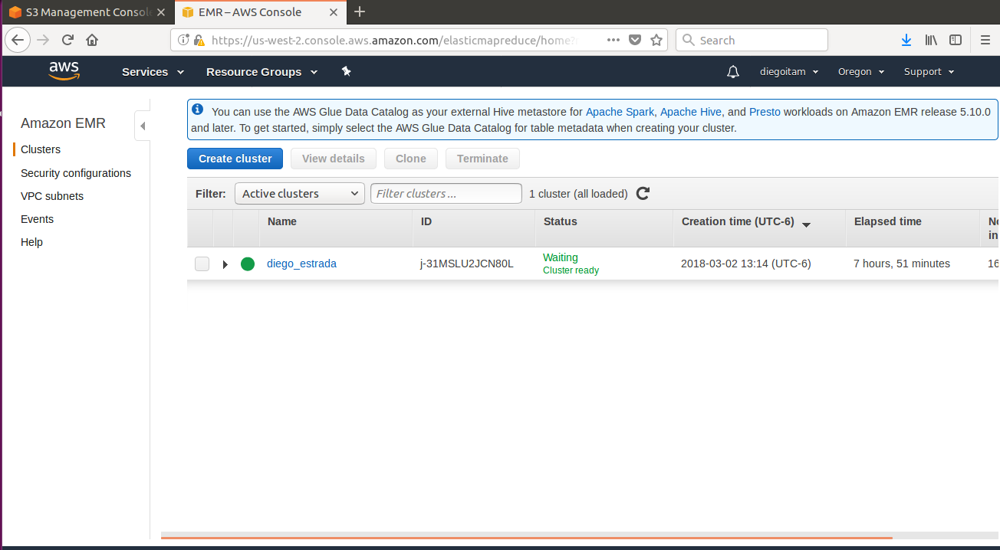
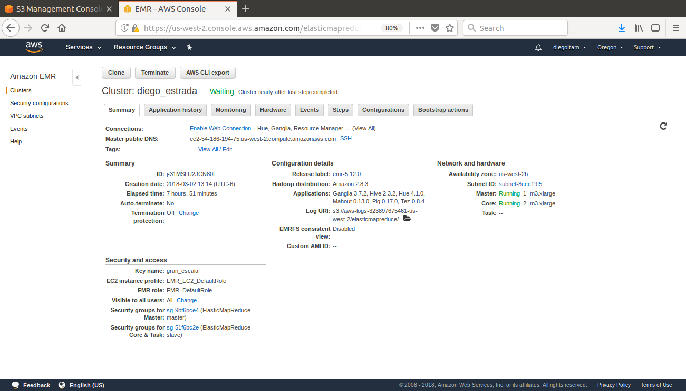
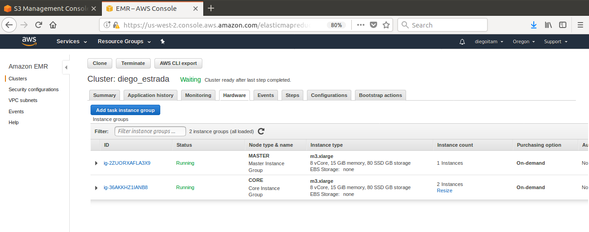

##Tarea 4
####Ejercicio Pig  

#### Estrada Rivera Diego Alejandro 165352  
##### 5/03/2018

-------------------------------------------------

Se creó un clúster en AWS utilizando 2 nodos de slave y 1 master, a continuación se presentan las fotos de evidencia:
  

  

  

A continuación, los queries de cada pregunta junto con los resultados obtenidos:  

##### **Ejercicio A**

**Modifica el ejercicio de Rank para que en lugar de obtener el id del producto con mejor rank obtengamos el nombre del producto -requieres un join- con el mejor rank**

**QUERY**  

products = load 's3://mat34710/tarea4/datos/products.csv' using PigStorage(',') as (productid:chararray, productname:chararray, supplierid:chararray, categoryid:chararray, quantityperunit:int, unitprice:float, unitsinstock:int, unitsonorder:int, reorderlevel:int, discounted:int);  
order_details = load 's3://mat34710/tarea4/datos/order_details.csv' using PigStorage(',') as (orderid:chararray, productid:chararray, unitprice:float, quantity:int, discount:float);  
group_orders = group order_details by productid;  
count_products = FOREACH group_orders GENERATE group as productid, COUNT($1) as n;  
ranked = rank count_products by n DESC;  
limited_rank = limit ranked 1;  
resultado = JOIN limited_rank by productid, products by productid;  
respuesta = FOREACH resultado generate $1 as productid, productname as productname, n as n_orders;  
STORE respuesta INTO 's3://mat34710/tarea4/outputs/preguntaA' USING org.apache.pig.piggybank.storage.CSVExcelStorage(',', 'NO_MULTILINE', 'UNIX', 'WRITE_OUTPUT_HEADER');  

**OUTPUT**

productid,productname,n_orders  
59,Raclette Courdavault,54

##### **Ejercicio B**

**1. ¿Cuántos vuelos existen en el dataset cuyo aeropuerto destino sea el "Honolulu International Airport"?**

**QUERY**

flights = LOAD 's3://mat34710/tarea4/datos/flights.csv' using PigStorage(',') as (year:int, month:int, day:int, day_of_week:int, airline:chararray, flight_number:int, tail_number:chararray, origin_airport:chararray, destination_airport:chararray, scheduled_departure:chararray, departure_time:chararray, departure_delay:int, taxi_out:int, wheels_off:chararray, scheduled_time:chararray, elapsed_time:int, air_time:int, distance:int, wheels_on:chararray, taxi_in:int, scheduled_arrival:chararray, arrival_time:chararray, arrival_delay:int, diverted:chararray, cancelled:chararray, cancellation_reason:chararray, air_system_delay:chararray, security_delay:chararray, airline_delay:chararray, late_aircraft_delay:chararray, weather_delay:chararray);  
airports = LOAD 's3://mat34710/tarea4/datos/airports.csv' using PigStorage(',') as (iata_code:chararray, airport:chararray, city:chararray, state:chararray, country:chararray, latitude:float, longitude:float);  
flights_airports = JOIN flights by destination_airport LEFT OUTER, airports by iata_code;  
flights_airports_filtrado = FILTER flights_airports by airport in ('Honolulu International Airport');  
grouped_honolulu = GROUP flights_airports_filtrado by airport;  
counted_honolulu = FOREACH grouped_honolulu GENERATE group as airport,COUNT(flights_airports_filtrado) as cnt;  
result = FOREACH counted_honolulu GENERATE airport, cnt;  
STORE result INTO 's3://mat34710/tarea4/outputs/preguntaB1' USING org.apache.pig.piggybank.storage.CSVExcelStorage(',', 'NO_MULTILINE', 'UNIX', 'WRITE_OUTPUT_HEADER');

**OUTPUT**

airport,cnt  
Honolulu International Airport,43157

**2. ¿Cuál es el vuelo con más retraso? ¿De qué aerolínea es?**  

**QUERY**

flights = LOAD 's3://mat34710/tarea4/datos/flights.csv' using PigStorage(',') as (year:int, month:int, day:int, day_of_week:int, airline_code:chararray, flight_number:int, tail_number:chararray, origin_airport:chararray, destination_airport:chararray, scheduled_departure:chararray, departure_time:chararray, departure_delay:int, taxi_out:int, wheels_off:chararray, scheduled_time:chararray, elapsed_time:int, air_time:int, distance:int, wheels_on:chararray, taxi_in:int, scheduled_arrival:chararray, arrival_time:chararray, arrival_delay:int, diverted:chararray, cancelled:chararray, cancellation_reason:chararray, air_system_delay:chararray, security_delay:chararray, airline_delay:chararray, late_aircraft_delay:chararray, weather_delay:chararray);  
airlines = LOAD 's3://mat34710/tarea4/datos/airlines.csv' using PigStorage(',') as (iata_code:chararray, airline:chararray);  
flights_airlines = JOIN flights by airline_code left outer, airlines by iata_code;  
arrival_delays = ORDER flights_airlines by arrival_delay DESC;  
worst_delay = limit arrival_delays 1;  
only_interest = FOREACH worst_delay GENERATE iata_code, airline, flight_number, arrival_delay;  
STORE only_interest INTO 's3://mat34710/tarea4/outputs/preguntaB2' USING org.apache.pig.piggybank.storage.CSVExcelStorage(',', 'NO_MULTILINE', 'UNIX', 'WRITE_OUTPUT_HEADER');

**OUTPUT**

airlines::iata_code,airlines::airline,flights::flight_number,flights::arrival_delay  
AA,American Airlines Inc.,1322,1971

**3. ¿Qué día es en el que más vuelos cancelados hay?**  

**QUERY**

flights = LOAD 's3://mat34710/tarea4/datos/flights.csv' using PigStorage(',') as (year:int, month:int, day:int, day_of_week:chararray, airline:chararray, flight_number:int, tail_number:chararray, origin_airport:chararray, destination_airport:chararray, scheduled_departure:chararray, departure_time:chararray, departure_delay:int, taxi_out:int, wheels_off:chararray, scheduled_time:chararray, elapsed_time:int, air_time:int, distance:int, wheels_on:chararray, taxi_in:int, scheduled_arrival:chararray, arrival_time:chararray, arrival_delay:int, diverted:chararray, cancelled:chararray, cancellation_reason:chararray, air_system_delay:chararray, security_delay:chararray, airline_delay:chararray, late_aircraft_delay:chararray, weather_delay:chararray);  
flights_cancelados = FILTER flights by cancelled in ('1');  
cancelados_dayofweek = GROUP flights_cancelados by day_of_week;  
totales_dayofweek = FOREACH cancelados_dayofweek GENERATE group as day_of_week, COUNT($1) as total_cancelaciones;  
cancellations_order = ORDER totales_dayofweek by total_cancelaciones DESC;  
cancellations_limit = limit cancellations_order 1;  
STORE cancellations_limit INTO 's3://mat34710/tarea4/outputs/preguntaB3' USING org.apache.pig.piggybank.storage.CSVExcelStorage(',', 'NO_MULTILINE', 'UNIX', 'WRITE_OUTPUT_HEADER');  

**OUTPUT**

day_of_week,total_cancelaciones  
1,21073  

**4. ¿Cuáles son los aeropuertos orígen con 17 cancelaciones?**  

**QUERY**

flights = LOAD 's3://mat34710/tarea4/datos/flights.csv' using PigStorage(',') as (year:int, month:int, day:int, day_of_week:int, airline:chararray, flight_number:int, tail_number:chararray, origin_airport:chararray, destination_airport:chararray, scheduled_departure:chararray, departure_time:chararray, departure_delay:int, taxi_out:int, wheels_off:chararray, scheduled_time:chararray, elapsed_time:int, air_time:int, distance:int, wheels_on:chararray, taxi_in:int, scheduled_arrival:chararray, arrival_time:chararray, arrival_delay:int, diverted:chararray, cancelled:chararray, cancellation_reason:chararray, air_system_delay:chararray, security_delay:chararray, airline_delay:chararray, late_aircraft_delay:chararray, weather_delay:chararray);  
airports = LOAD 's3://mat34710/tarea4/datos/airports.csv' using PigStorage(',') as (iata_code:chararray, airport:chararray, city:chararray, state:chararray, country:chararray, latitude:float, longitude:float);  
flights_airports = JOIN flights by origin_airport LEFT OUTER, airports by iata_code;  
airports_cancelled = FILTER flights_airports by cancelled in ('1');  
airports_cancelaciones = GROUP airports_cancelled by airport;  
total_cancelaciones = FOREACH airports_cancelaciones GENERATE group as airport, COUNT($1) as cancelaciones;  
respuesta = FILTER total_cancelaciones by cancelaciones == 17;  
STORE respuesta INTO 's3://mat34710/tarea4/outputs/preguntaB4' USING org.apache.pig.piggybank.storage.CSVExcelStorage(',', 'NO_MULTILINE', 'UNIX', 'WRITE_OUTPUT_HEADER');  

**OUTPUT**

airport,cancelaciones  
Delta County Airport,17  
Dothan Regional Airport,17  
Dickinson Theodore Roosevelt Regional Airport,17  

**5. ¿Cuál es el aeropuerto origen con más vuelos cancelados?**  

**QUERY**

flights = LOAD 's3://mat34710/tarea4/datos/flights.csv' using PigStorage(',') as (year:int, month:int, day:int, day_of_week:int, airline:chararray, flight_number:int, tail_number:chararray, origin_airport:chararray, destination_airport:chararray, scheduled_departure:chararray, departure_time:chararray, departure_delay:int, taxi_out:int, wheels_off:chararray, scheduled_time:chararray, elapsed_time:int, air_time:int, distance:int, wheels_on:chararray, taxi_in:int, scheduled_arrival:chararray, arrival_time:chararray, arrival_delay:int, diverted:chararray, cancelled:chararray, cancellation_reason:chararray, air_system_delay:chararray, security_delay:chararray, airline_delay:chararray, late_aircraft_delay:chararray, weather_delay:chararray);  
airports = LOAD 's3://mat34710/tarea4/datos/airports.csv' using PigStorage(',') as (iata_code:chararray, airport:chararray, city:chararray, state:chararray, country:chararray, latitude:float, longitude:float);  
flights_airports = JOIN flights by origin_airport LEFT OUTER, airports by iata_code;  
airports_cancelled = FILTER flights_airports by cancelled in ('1');  
airports_cancelaciones = GROUP airports_cancelled by airport;  
total_cancelaciones = FOREACH airports_cancelaciones GENERATE group as airport, COUNT($1) as cancelaciones;  
respuesta = ORDER total_cancelaciones by cancelaciones DESC;  
respuesta_final = limit respuesta 1;  
STORE respuesta_final INTO 's3://mat34710/tarea4/outputs/preguntaB5' USING org.apache.pig.piggybank.storage.CSVExcelStorage(',', 'NO_MULTILINE', 'UNIX', 'WRITE_OUTPUT_HEADER');  

**OUTPUT**

airport,cancelaciones  
Chicago O'Hare International Airport,8548  

**6. ¿Cuál es el vuelo (flight number) con mayor diversidad de aeropuertos destino, cuáles son estos destinos? (ocupar bag te ayudará en esta pregunta)**  

**QUERY**

flights = LOAD 's3://mat34710/tarea4/datos/flights.csv' using PigStorage(',') as (year:int, month:int, day:int, day_of_week:int, airline:chararray, flight_number:int, tail_number:chararray, origin_airport:chararray, destination_airport:chararray, scheduled_departure:chararray, departure_time:chararray, departure_delay:int, taxi_out:int, wheels_off:chararray, scheduled_time:chararray, elapsed_time:int, air_time:int, distance:int, wheels_on:chararray, taxi_in:int, scheduled_arrival:chararray, arrival_time:chararray, arrival_delay:int, diverted:chararray, cancelled:int, cancellation_reason:chararray, air_system_delay:chararray, security_delay:chararray, airline_delay:chararray, late_aircraft_delay:chararray, weather_delay:chararray);  
airports = LOAD 's3://mat34710/tarea4/datos/airports.csv' using PigStorage(',') as (iata_code:chararray, airport:chararray, city:chararray, state:chararray, country:chararray, latitude:float, longitude:float);  
flights_airports = JOIN flights by destination_airport LEFT OUTER, airports by iata_code;  
group_flights = GROUP flights_airports by flight_number;  
list_nested_each = FOREACH group_flights
				{
					list_inner_each = FOREACH flights_airports GENERATE destination_airport;
					list_inner_dist = DISTINCT list_inner_each;
					GENERATE flatten(group) as flight_number, COUNT(list_inner_dist) as uniq_destination_airport;
				};  
				
list_nested_ordered = ORDER list_nested_each by uniq_destination_airport DESC;
winner = limit list_nested_ordered 1;  
flights_fields = FOREACH flights generate flight_number, destination_airport;  
airports_fields = FOREACH airports generate iata_code, airport;  
destinos_unicos = distinct flights_fields;  
winner_with_flights = join winner by flight_number, destinos_unicos by flight_number;  
result = join winner_with_flights by destination_airport LEFT OUTER, airports_fields by iata_code;  
STORE result INTO 's3://mat34710/tarea4/outputs/preguntaB6' USING org.apache.pig.piggybank.storage.CSVExcelStorage(',', 'NO_MULTILINE', 'UNIX', 'WRITE_OUTPUT_HEADER');  

**OUTPUT**

winner_with_flights::winner::flight_number,winner_with_flights::winner::uniq_destination_airport,winner_with_flights::destinos_unicos::flight_number,winner_with_flights::destinos_unicos::destination_airport,airports_fields::iata_code,airports_fields::airport  
202,68,202,10140,,
202,68,202,10397,,
202,68,202,10423,,
202,68,202,10693,,
202,68,202,10721,,
202,68,202,10821,,
202,68,202,11292,,
202,68,202,11433,,
202,68,202,11986,,
202,68,202,12266,,
202,68,202,12402,,
202,68,202,12478,,
202,68,202,13232,,
202,68,202,13487,,
202,68,202,13830,,
202,68,202,13930,,
202,68,202,14057,,
202,68,202,14100,,
202,68,202,14107,,
202,68,202,14122,,
202,68,202,14683,,
202,68,202,14747,,
202,68,202,14831,,
202,68,202,ATL,ATL,Hartsfield-Jackson Atlanta International Airport
202,68,202,AUS,AUS,Austin-Bergstrom International Airport
202,68,202,BDL,BDL,Bradley International Airport
202,68,202,BNA,BNA,Nashville International Airport
202,68,202,BOS,BOS,Gen. Edward Lawrence Logan International Airport
202,68,202,BWI,BWI,Baltimore-Washington International Airport
202,68,202,CAK,CAK,Akron-Canton Regional Airport
202,68,202,CLE,CLE,Cleveland Hopkins International Airport
202,68,202,DCA,DCA,Ronald Reagan Washington National Airport
202,68,202,DEN,DEN,Denver International Airport
202,68,202,DTW,DTW,Detroit Metropolitan Airport
202,68,202,EWR,EWR,Newark Liberty International Airport
202,68,202,FLL,FLL,Fort Lauderdale-Hollywood International Airport
202,68,202,FNT,FNT,Bishop International Airport
202,68,202,IAD,IAD,Washington Dulles International Airport
202,68,202,IAH,IAH,George Bush Intercontinental Airport
202,68,202,IND,IND,Indianapolis International Airport
202,68,202,ITO,ITO,Hilo International Airport
202,68,202,JFK,JFK,John F. Kennedy International Airport (New York International Airport)
202,68,202,LAS,LAS,McCarran International Airport
202,68,202,LAX,LAX,Los Angeles International Airport
202,68,202,LGA,LGA,LaGuardia Airport (Marine Air Terminal)
202,68,202,MCO,MCO,Orlando International Airport
202,68,202,MDW,MDW,Chicago Midway International Airport
202,68,202,MKE,MKE,General Mitchell International Airport
202,68,202,MSN,MSN,Dane County Regional Airport
202,68,202,MSP,MSP,Minneapolis-Saint Paul International Airport
202,68,202,OAK,OAK,Oakland International Airport
202,68,202,OGG,OGG,Kahului Airport
202,68,202,OKC,OKC,Will Rogers World Airport
202,68,202,ORD,ORD,Chicago O'Hare International Airport
202,68,202,PDX,PDX,Portland International Airport
202,68,202,PHL,PHL,Philadelphia International Airport
202,68,202,PHX,PHX,Phoenix Sky Harbor International Airport
202,68,202,PIT,PIT,Pittsburgh International Airport
202,68,202,RDU,RDU,Raleigh-Durham International Airport
202,68,202,RNO,RNO,Reno/Tahoe International Airport
202,68,202,RSW,RSW,Southwest Florida International Airport
202,68,202,SAN,SAN,San Diego International Airport (Lindbergh Field)
202,68,202,SAT,SAT,San Antonio International Airport
202,68,202,SEA,SEA,Seattle-Tacoma International Airport
202,68,202,SFO,SFO,San Francisco International Airport
202,68,202,SLC,SLC,Salt Lake City International Airport
202,68,202,SMF,SMF,Sacramento International Airport
202,68,202,TPA,TPA,Tampa International Airport

