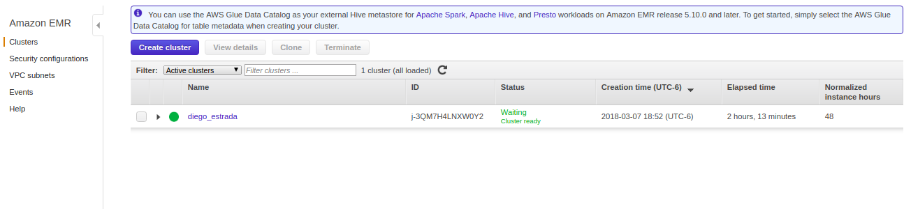
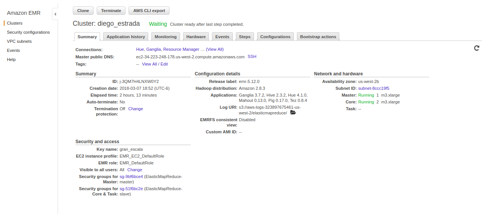
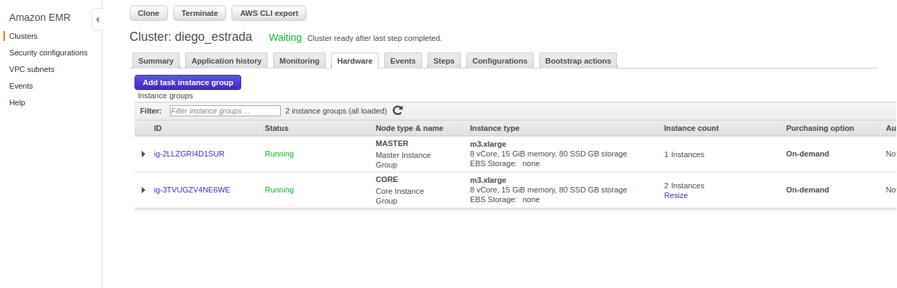

##Tarea 5
####Ejercicio HIve  

#### Estrada Rivera Diego Alejandro 165352  
##### 12/03/2018

-------------------------------------------------

Se creó un clúster en AWS utilizando 2 nodos de slave y 1 master, a continuación se presentan las fotos de evidencia:

**Cluster**  

**Summary**  

**Hardware**  

  

Ahora se presentan, por ejercicio e inciso, los queries ejecutados para obtener las respuestas. Los archivos .csv de cada respuesta, se incluyeron en la carpeta de la tarea.

**1a)  ¿Cuántos "jefes" hay en la tabla empleados? ¿Cuáles son estos jefes: número de empleado, nombre, apellido, título, fecha de nacimiento, fecha en que iniciaron en la empresa, ciudad y país? (atributo reportsto, ocupa explode en tu respuesta)**  

create table respuesta as 
select *
from 
    (select employeeid, firstname, lastname, title, birthdate, hiredate, city, count(*) over () totalJefes 
from employees where employeeid
in (select distinct reportsto from employees)) t1
left join (select reportsto, collect_set(firstname) as subordinados from employees group by reportsto) t2 
on  t1.employeeid = t2.reportsto;

SELECT * FROM respuesta 
LATERAL VIEW explode(subordinados) subordinadosarray as subordinadoselement;

**1b) ¿Quién es el segundo "mejor" empleado que más órdenes ha generado? (nombre, apellido, título, cuándo entró a la compañía, número de órdenes generadas, número de órdenes generadas por el mejor empleado (número 1))**  

create table respuesta as select employeeid, count(*) as ordenes from orders 
group by employeeid order by ordenes desc limit 2;

create table datosordenes as select employeeid, ordenes, lag(ordenes, 1, 0) over() as nummaxordenes 
from respuesta order by ordenes asc limit 1;

SELECT A.employeeid as employeeid, A.firstname as nombre, A.lastname as apellido, A.title as titulo, A.hiredate as contratacion, B.nummaxordenes as primerlugarordenes, B.ordenes as ordenes 
FROM employees A  
JOIN datosordenes B 
ON (A.employeeid=B.employeeid);

**1c) ¿Cuál es el delta de tiempo más grande entre una orden y otra?**  

create table laggeada as SELECT orderid, orderdate, lag(orderdate) OVER(ORDER BY orderid) as laggazo FROM orders;

select orderid, orderdate, datediff(orderdate, laggazo) as tiempoalasigiente from laggeada order by tiempoalasigiente desc limit 1;

**2a) ¿Qué aerolíneas (nombres) llegan al aeropuerto "Honolulu International Airport"?**  

CREATE TABLE vuelosaerolineas AS SELECT A.destination_airport as iatadestino, B.airline as aerolinea
FROM flights A
LEFT OUTER JOIN airlines B ON (A.airline = B.iata_code);

select distinct A.aerolinea as aerolinea FROM vuelosaerolineas A 
LEFT OUTER JOIN airports B 
on (A.iatadestino = B.iata_code) 
WHERE B.airport IN ("Honolulu International Airport");

**2b) ¿En qué horario (hora del día, no importan los minutos) hay salidas del aeropuerto de San Francisco ("SFO") a "Honolulu International Airport"?**  

CREATE TABLE vuelosaeropuertosD AS 
SELECT A.origin_airport, A.destination_airport, A.scheduled_departure, B.airport AS nombredestino
FROM flights A
LEFT OUTER JOIN airports B ON (A.destination_airport = B.iata_code);

CREATE TABLE vuelosaeropuertosDO AS 
SELECT A.*, B.airport AS nombreorigen
FROM vuelosaeropuertosD A
LEFT OUTER JOIN airports B ON (A.origin_airport = B.iata_code);

select distinct (substr(scheduled_departure, 1, 2)) as horassalida from vuelosaeropuertosDO 
WHERE nombredestino IN ("Honolulu International Airport") 
AND nombreorigen IN ("San Francisco International Airport");  

**2c) ¿Qué día de la semana y en qué aerolínea nos conviene viajar a "Honolulu International Airport" para tener el menor retraso posible?**  

create table vuelosretraso as select day_of_week, airline, destination_airport, (departure_delay + arrival_delay) as retrasototal from flights;

CREATE TABLE retrasoaeropuerto AS SELECT A.destination_airport as iatadestino, A.airline, A.day_of_week, A.retrasototal, B.airport as airport
FROM vuelosretraso A
LEFT OUTER JOIN airports B ON (A.destination_airport = B.iata_code);

CREATE TABLE retrasopyl AS SELECT A.*, B.airline as airlinename 
FROM retrasoaeropuerto A
LEFT OUTER JOIN airlines B ON (A.airline = B.iata_code);

select avg(retrasototal) as retrasopromedio, day_of_week, airlinename 
from retrasopyl
where airport in ("Honolulu International Airport")
group by day_of_week, airlinename
order by retrasopromedio asc
limit 1;  

**2d) ¿Cuál es el aeropuerto con mayor tráfico de entrada?**  

CREATE table destinovuelos as 
SELECT destination_airport, count(destination_airport) as trafico FROM flights
GROUP BY destination_airport
ORDER BY trafico DESC
LIMIT 1;

select B.airport FROM destinovuelos A 
LEFT OUTER JOIN airports B 
on (A.destination_airport = B.iata_code);  

**2e) ¿Cuál es la aerolínea con mayor retraso de salida por día de la semana?**  

CREATE TABLE vuelosaerolinea AS 
SELECT A.*, B.airline AS airlinename 
FROM flights A
LEFT OUTER JOIN airlines B ON (A.airline = B.iata_code);

create table retrasosprom as
select day_of_week, airlinename, avg(departure_delay) as retrasollegadaprom 
from vuelosaerolinea
group by airlinename, day_of_week
ORDER BY retrasollegadaprom desc;

create table resultado as 
select day_of_week, airlinename, max(retrasollegadaprom) as retraso 
from retrasosprom
group by day_of_week, airlinename
order by retraso desc;

SELECT a.day_of_week, a.retrasomax, b.airlinename FROM
(SELECT day_of_week, MAX(retraso) as retrasomax FROM resultado
GROUP BY day_of_week) a
LEFT OUTER JOIN
retrasosprom b ON
a.retrasomax = b.retrasollegadaprom;

**2f) ¿Cuál es la tercer aerolínea con menor retraso de salida los lunes (day of week = 2)?**  

CREATE TABLE vuelosaerolinea AS 
SELECT A.*, B.airline AS airlinename 
FROM flights A
LEFT OUTER JOIN airlines B ON (A.airline = B.iata_code);

create table retrasosprom as
select day_of_week, airlinename, avg(departure_delay) as retrasollegadaprom 
from vuelosaerolinea
group by airlinename, day_of_week;

create table resultado as 
select day_of_week, airlinename, retrasollegadaprom 
from retrasosprom
where day_of_week in ("2")
order by retrasollegadaprom asc
limit 3;

select * 
from resultado
order by retrasollegadaprom desc
limit 1;  

**2g) ¿Cuál es el aeropuerto origen que llega a la mayor cantidad de aeropuertos destino diferentes?**  

create table respuesta as
SELECT origin_airport, count(DISTINCT(destination_airport)) as destinos FROM flights
GROUP BY origin_airport
ORDER BY destinos DESC
LIMIT 1;

select a.destinos, b.airport as origen 
from respuesta A
LEFT OUTER JOIN
airports b
ON (a.origin_airport = b.iata_code)
LIMIT 1;  