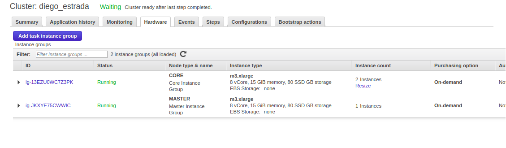
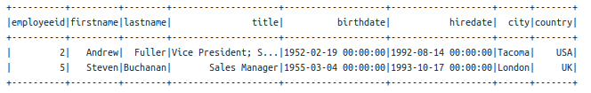

##Tarea 6
####Ejercicio Spark  

#### Estrada Rivera Diego Alejandro 165352  
##### 19/03/2018

-------------------------------------------------

Se creó un clúster en AWS utilizando 2 nodos de slave y 1 master, a continuación se presentan las fotos de evidencia:

**Cluster**  

**Summary**  

**Hardware**  

Ahora se presentan, por ejercicio e inciso, los queries ejecutados en Zeppelin para obtener las respuestas correspondientes. En la carpeta también se incluyen cada query e imagen-respuesta por separado.  

**Importamos los datos de Northwind**  

%pyspark

productos = spark.read.csv("s3://mat34710/tareas/datos/products.csv", header = True, inferSchema = True, nullValue = 'nulo')  
empleados = spark.read.csv("s3://mat34710/tareas/datos/employees.csv", header = True, inferSchema = True, nullValue = 'nulo')  
detalles = spark.read.csv("s3://mat34710/tareas/datos/order_details.csv", header = True, inferSchema = True, nullValue = 'nulo')  
clientes = spark.read.csv("s3://mat34710/tareas/datos/customers.csv", header = True, inferSchema = True, nullValue = 'nulo')  
ordenes = spark.read.csv("s3://mat34710/tareas/datos/orders.csv", header = True, inferSchema = True, nullValue = 'nulo')  

**1a) ¿Cuántos "jefes" hay en la tabla empleados? ¿Cuáles son estos jefes: número de empleado, nombre, apellido, título, fecha de nacimiento, fecha en que iniciaron en la empresa, ciudad y país?**  

%pyspark  

id_jefes = empleados.select("reportsto").distinct().select("reportsto").rdd.flatMap(lambda x: x).collect()  

jefes = empleados.filter(empleados.employeeid.isin(id_jefes))  

jefes.select('employeeid','firstname','lastname','title','birthdate','hiredate','city','country').show()  

**1b) ¿Quién es el segundo "mejor" empleado que más órdenes ha generado? (nombre, apellido, título, cuándo entró a la compañía, número de órdenes generadas, número de órdenes generadas por el mejor empleado (número 1))**  

%pyspark  

from pyspark.sql.functions import lag, col, lead, expr, lit  
from pyspark.sql.window import Window  

ordenes_empleado = ordenes.groupBy('employeeid').count().orderBy('count', ascending = False).limit(2)  

ordenes_empleado = ordenes_empleado.join(empleados, ordenes_empleado.employeeid == empleados.employeeid, 'left_outer').select('firstname','lastname','title','hiredate','count').orderBy('count', ascending = True)  

w = Window().partitionBy().orderBy(col("count"))
resultado = ordenes_empleado.select("*", lead("count").over(w).alias("ordenes_del_mejor")).na.drop()  

resultado = resultado.withColumnRenamed('count', 'numero_de_ordenes')  
resultado.show()  

**1c) ¿Cuál es el delta de tiempo más grande entre una orden y otra?**  

%pyspark  

from pyspark.sql import functions as F  

w = Window().partitionBy().orderBy(col("orderid"))  

ordenes_laggeadas = ordenes.select("orderid", "orderdate", lag("orderdate").over(w).alias("lag_orderdate")).na.drop()  

timeFmt = "yyyy-MM-dd'T'HH:mm:ss.SSS"  

timeDiff = (F.unix_timestamp('orderdate', format=timeFmt) - F.unix_timestamp('lag_orderdate', format=timeFmt))  

ordenes_laggeadas = ordenes_laggeadas.withColumn("Tiempo_a_la_siguiente", timeDiff)  

ordenes_laggeadas = ordenes_laggeadas.orderBy('Tiempo_a_la_siguiente', ascending = False)  

ordenes_laggeadas = ordenes_laggeadas.select('orderid', 'orderdate', 'lag_orderdate', 'Tiempo_a_la_siguiente', lit(86400))  

ordenes_laggeadas = ordenes_laggeadas.withColumn("Delta_mas_grande_dias", (F.col("Tiempo_a_la_siguiente") / F.col("86400"))).drop("86400", "Tiempo_a_la_siguiente")  

ordenes_laggeadas.select("Delta_mas_grande_dias").limit(1).show()  

  

**Importamos los datos de flights, airlines y airports**  

aerolineas = spark.read.csv("s3://mat34710/tareas/datos/airlines.csv", header = True, inferSchema = True, nullValue = 'nulo')  
aeropuertos = spark.read.csv("s3://mat34710/tareas/datos/airports.csv", header = True, inferSchema = True, nullValue = 'nulo')  
vuelos = spark.read.csv("s3://mat34710/tareas/datos/flights.csv", header = True, inferSchema = True, nullValue = 'nulo')  

**2a) ¿Qué aerolíneas (nombres) llegan al aeropuerto "Honolulu International Airport"?**  

%pyspark  

vuelos_aerolineas = vuelos.join(aerolineas, vuelos.AIRLINE == aerolineas.IATA_CODE, 'left_outer').select(vuelos.DESTINATION_AIRPORT, aerolineas.AIRLINE)  

vuelos_aerolineas_puertos = vuelos_aerolineas.join(aeropuertos, vuelos_aerolineas.DESTINATION_AIRPORT == aeropuertos.IATA_CODE, "left_outer").select(vuelos_aerolineas.DESTINATION_AIRPORT, vuelos_aerolineas.AIRLINE, aeropuertos.AIRPORT)  

vuelos_aerolineas_puertos.where(vuelos_aerolineas_puertos.AIRPORT == "Honolulu International Airport").select('AIRLINE').distinct().show()  

  

**2b) ¿En qué horario (hora del día, no importan los minutos) hay salidas del aeropuerto de San Francisco ("SFO") a "Honolulu International Airport"?**  

%pyspark  

from pyspark.sql import functions as F  

from pyspark.sql.functions import floor, lit  

vuelosaeropuertosD = vuelos.join(aeropuertos, vuelos.DESTINATION_AIRPORT == aeropuertos.IATA_CODE, "left_outer").select(vuelos.ORIGIN_AIRPORT, vuelos.DESTINATION_AIRPORT, vuelos.SCHEDULED_DEPARTURE, aeropuertos.AIRPORT)  

vuelosaeropuertosD = vuelosaeropuertosD.withColumnRenamed('AIRPORT', 'NOMBREDESTINO')  

vuelosaeropuertosDO = vuelosaeropuertosD.join(aeropuertos, vuelosaeropuertosD.ORIGIN_AIRPORT == aeropuertos.IATA_CODE).select(vuelosaeropuertosD.ORIGIN_AIRPORT, vuelosaeropuertosD.DESTINATION_AIRPORT, vuelosaeropuertosD.SCHEDULED_DEPARTURE, vuelosaeropuertosD.NOMBREDESTINO, aeropuertos.AIRPORT)  

vuelosaeropuertosDO = vuelosaeropuertosDO.withColumnRenamed('AIRPORT', 'NOMBREORIGEN')  

vuelosaeropuertosDO = vuelosaeropuertosDO.where(vuelosaeropuertosDO.NOMBREDESTINO == "Honolulu International Airport")  

vuelosaeropuertosDO = vuelosaeropuertosDO.where(vuelosaeropuertosDO.NOMBREORIGEN == "San Francisco International Airport")  

vuelosaeropuertosDO = vuelosaeropuertosDO.select('ORIGIN_AIRPORT', 'DESTINATION_AIRPORT', 'SCHEDULED_DEPARTURE', 'NOMBREDESTINO', 'NOMBREORIGEN', lit(100))  

vuelosaeropuertosDO = vuelosaeropuertosDO.withColumn("HORAS", (F.col("SCHEDULED_DEPARTURE") / F.col("100"))).drop("SCHEDULED_DEPARTURE", "100")  

horarios = vuelosaeropuertosDO.select(floor("HORAS").alias("HORARIOS")).distinct().orderBy('HORARIOS', ascending = False)  

horarios.show()  

  

**2c) ¿Qué día de la semana y en qué aerolínea nos conviene viajar a "Honolulu International Airport" para tener el menor retraso posible?**  

%pyspark  

vuelosretraso = vuelos.select('DAY_OF_WEEK', 'AIRLINE', 'DESTINATION_AIRPORT', 'DEPARTURE_DELAY', 'ARRIVAL_DELAY')  

vuelosretraso = vuelosretraso.withColumn("RETRASO", (F.col("DEPARTURE_DELAY") + F.col("ARRIVAL_DELAY")))  

vuelosretraso = vuelosretraso.join(aeropuertos, vuelosretraso.DESTINATION_AIRPORT == aeropuertos.IATA_CODE, 'left_outer').select(vuelosretraso.DESTINATION_AIRPORT, vuelosretraso.AIRLINE, vuelosretraso.DAY_OF_WEEK, vuelosretraso.RETRASO, aeropuertos.AIRPORT)  

vuelosretraso = vuelosretraso.withColumnRenamed('AIRLINE', 'IATA_CODE')  

vuelosretraso = vuelosretraso.join(aerolineas, vuelosretraso.IATA_CODE == aerolineas.IATA_CODE, "left_outer").select(vuelosretraso.DAY_OF_WEEK, vuelosretraso.RETRASO, vuelosretraso.AIRPORT, aerolineas.AIRLINE)  

vuelosretraso = vuelosretraso.where(vuelosretraso.AIRPORT == "Honolulu International Airport")  

vuelosretraso.groupBy("DAY_OF_WEEK", "AIRLINE").avg("RETRASO").orderBy('avg(RETRASO)', ascending = True).limit(1).show()  

  

**2d) ¿Cuál es el aeropuerto con mayor tráfico de entrada?**  

%pyspark  

destinovuelos = vuelos.groupBy('DESTINATION_AIRPORT').count().orderBy('count', ascending = False).limit(1)  

destinovuelos.join(aeropuertos, destinovuelos.DESTINATION_AIRPORT == aeropuertos.IATA_CODE, "left_outer").select(aeropuertos.AIRPORT).show()  

  

**2e) ¿Cuál es la aerolínea con mayor retraso de salida por día de la semana?**  

%pyspark  

vuelos = vuelos.withColumnRenamed('AIRLINE', 'IATA_CODE')  

vuelosaerolinea = vuelos.join(aerolineas, vuelos.IATA_CODE == aerolineas.IATA_CODE, 'left_outer').select(vuelos.DAY_OF_WEEK, vuelos.DEPARTURE_DELAY, aerolineas.AIRLINE)  

retrasosprom = vuelosaerolinea.groupBy("AIRLINE", "DAY_OF_WEEK").avg("DEPARTURE_DELAY").orderBy('avg(DEPARTURE_DELAY)', ascending = False)  

resultado = retrasosprom.groupBy("DAY_OF_WEEK", "AIRLINE").max("avg(DEPARTURE_DELAY)").orderBy('max(avg(DEPARTURE_DELAY))', ascending = False)  
resultado1 = resultado.groupBy("DAY_OF_WEEK").max("max(avg(DEPARTURE_DELAY))")  

resultado1 = resultado1.withColumnRenamed('max(max(avg(DEPARTURE_DELAY)))', 'retraso_prom_max')  
retrasosprom = retrasosprom.withColumnRenamed('avg(DEPARTURE_DELAY)', 'retraso_prom')  

resultado_final = resultado1.join(retrasosprom, resultado1.retraso_prom_max == retrasosprom.retraso_prom, 'left_outer').select(resultado1.DAY_OF_WEEK, resultado1.retraso_prom_max, retrasosprom.AIRLINE).orderBy("DAY_OF_WEEK", ascending = True).show()  

  

**2f) ¿Cuál es la tercer aerolínea con menor retraso de salida los lunes (day of week = 2)?**  

%pyspark  

vuelosaerolinea = vuelos.join(aerolineas, vuelos.IATA_CODE == aerolineas.IATA_CODE, 'left_outer').select(vuelos.DAY_OF_WEEK, vuelos.DEPARTURE_DELAY, aerolineas.AIRLINE)  

retrasosprom = vuelosaerolinea.groupBy("AIRLINE", "DAY_OF_WEEK").avg("DEPARTURE_DELAY")  

retrasosprom = retrasosprom.withColumnRenamed('avg(DEPARTURE_DELAY)', 'RETRASO_PROM')  

resultado = retrasosprom.where(retrasosprom.DAY_OF_WEEK == 2).orderBy('RETRASO_PROM', ascending = True).limit(3)  

resultado.orderBy('RETRASO_PROM', ascending = False).limit(1).show()   

  

**2g) ¿Cuál es el aeropuerto origen que llega a la mayor cantidad de aeropuertos destino diferentes?**  

%pyspark  

from pyspark.sql.functions import countDistinct  

resultado = vuelos.groupBy('ORIGIN_AIRPORT').agg(countDistinct('DESTINATION_AIRPORT'))  

resultado = resultado.withColumnRenamed('count(DISTINCT DESTINATION_AIRPORT)', 'DESTINOS')  

resultado = resultado.orderBy('DESTINOS', ascending = False).limit(1)  

resultado.join(aeropuertos, resultado.ORIGIN_AIRPORT == aeropuertos.IATA_CODE, 'left_outer').select(resultado.DESTINOS, aeropuertos.AIRPORT).show()  

  

