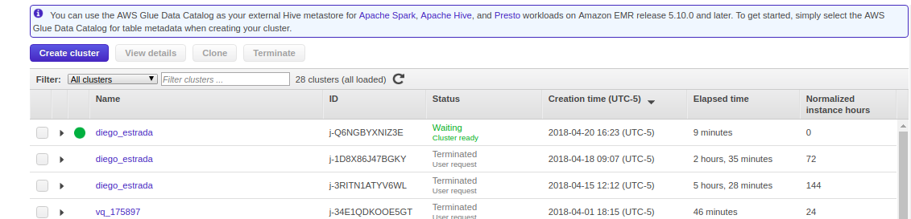
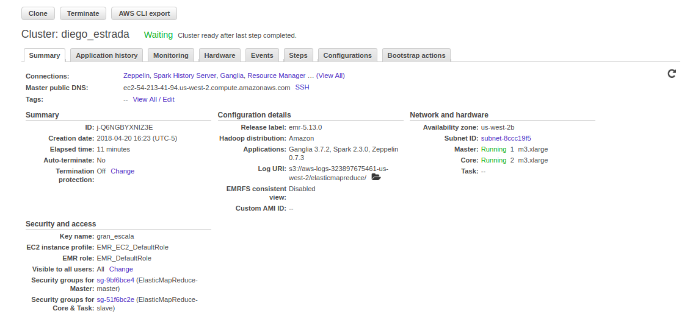
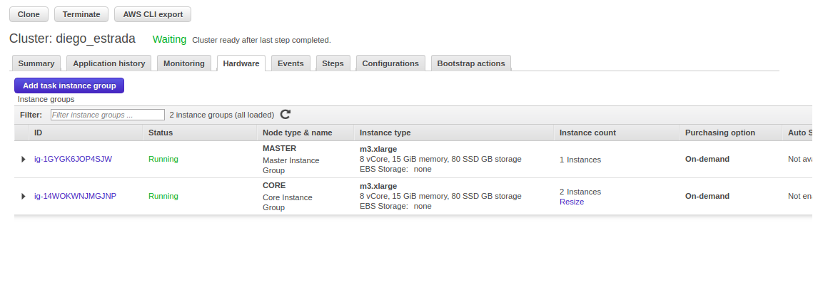
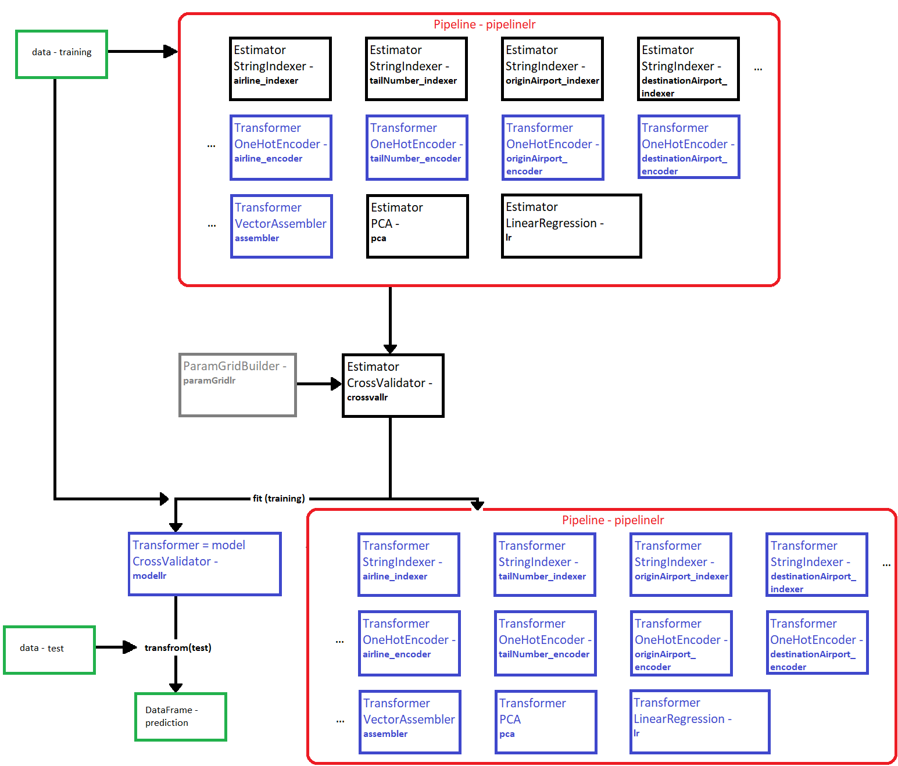

##Tarea 7
####Ejercicio Pyspark.ml  

#### Estrada Rivera Diego Alejandro 165352  
##### 23/04/2018

-------------------------------------------------

Se creó un clúster en AWS utilizando 2 nodos de slave y 1 master, a continuación se presentan las fotos de evidencia:  

 

**Cluster** 

 

  

 

**Summary** 

 

  

 

**Hardware**  

 

  

 

El script y el zeppelin desarrollados se entregan como archivos por separado que se encuentran en la carpeta. Se seleccionaron 2 algoritmos para entrenar los datos, una regresión lineal y un árbol de decisión. Idealmente se planeaba usar un RandomForest, pero deseando que el proceso fuera lo más rápido posible, se opto por intentar con estos dos algoritmos.  

 

####**Regresión Lineal**  

**El modelo seleccionado para regresión lineal es:**PipelineModel_48759639964729a17ca5  

**Al cual le tomó:**1 hr 18 min

  

 

####**Árbol de decisión** 

**El modelo seleccionado para árbol de decisión es:**PipelineModel_4361b04d2e2d2853cfca 

**Al cual le tomó:**5 hrs 13 min 4 sec 

  
 

