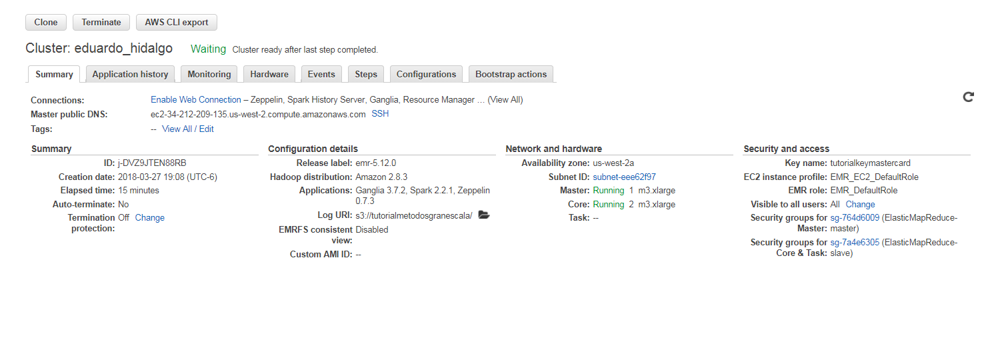

```{r setup, include=FALSE}
knitr::opts_chunk$set(echo = TRUE)
library(data.table)
library(formattable)
library(knitr)
library(haven)
library(readr)
library(tidyverse)
library(ggplot2)
library(xlsx)
library(stringr)
library(dplyr)
library(tidyr)
library(gridExtra)
setwd("~/Metodos de Gran Escala AWS/Tarea5/data_output")
OutputPregunta1_1 <- read_csv("~/Metodos de Gran Escala AWS/Tarea5/data_output/Pregunta 1/OutputPregunta1.1.csv")
OutputPregunta1_2 <- read_csv("~/Metodos de Gran Escala AWS/Tarea5/data_output/Pregunta 1/OutputPregunta1.2.csv")
OutputPregunta1_3 <- read_csv("~/Metodos de Gran Escala AWS/Tarea5/data_output/Pregunta 1/OutputPregunta1.3.csv")
OutputPregunta1_4 <- read_csv("~/Metodos de Gran Escala AWS/Tarea5/data_output/Pregunta 1/OutputPregunta1.4.csv")
Pregunta2_1 <- read_csv("~/Metodos de Gran Escala AWS/Tarea5/data_output/Pregunta 2/Pregunta2.1.csv")
Pregunta2_2 <- read_csv("~/Metodos de Gran Escala AWS/Tarea5/data_output/Pregunta 2/Pregunta2.2.csv")
Pregunta2_3 <- read_csv("~/Metodos de Gran Escala AWS/Tarea5/data_output/Pregunta 2/Pregunta2.3.csv")
Pregunta2_4 <- read_csv("~/Metodos de Gran Escala AWS/Tarea5/data_output/Pregunta 2/Pregunta2.4.csv")
Pregunta2_5 <- read_csv("~/Metodos de Gran Escala AWS/Tarea5/data_output/Pregunta 2/Pregunta2.5.csv")
Pregunta2_6 <- read_csv("~/Metodos de Gran Escala AWS/Tarea5/data_output/Pregunta 2/Pregunta2.6.csv")


```



## Tarea 5  {.tabset .tabset-fade .tabset-pills}

### Pregunta 1

#### a.1) ¿Cuántos "jefes" hay en la tabla empleados? 


```{sql,eval=FALSE}
SELECT COUNT(DISTINCT reportsto) as cantidad_jefes
FROM employees
WHERE reportsto > 0;
```

```{r base1,echo=FALSE, warnings=FALSE}

knitr::kable(OutputPregunta1_1, caption = "Resultado 1: Numero de jefes",align = c('c'))
```


#### a.2) ¿Cuáles son estos jefes: número de empleado, nombre, apellido, título, fecha de nacimiento, fecha en que iniciaron en la empresa, ciudad y país? (atributo reportsto, ocupa explode en tu respuesta)


```{sql, eval=FALSE}
CREATE TEMPORARY TABLE tabla_1 as
SELECT reportsto, collect_list(firstname) as trabajadores
FROM employees
WHERE reportsto <> ''
GROUP BY reportsto;

CREATE TEMPORARY TABLE tabla_2 AS
SELECT emp.employeeid, emp.firstname, emp.lastname, emp.title, emp.hierdate, emp.city, emp.country, trabajadores
FROM employees emp
JOIN collect ON emp.employeeid=collect.reportsto;

SELECT employeeid, firstname, lastname, title, hiredate,city,country,empleado
FROM tabla_2
LATERAL VIEW explode(trabajadores) subView AS trabajador;
```

```{r base2,echo=FALSE, warnings=FALSE}

  knitr::kable(OutputPregunta1_2, caption = "Resultado 2: Informacion de jefes",align = c('c','l','l','l','c','l','c','l'))
```


#### b) ¿Quién es el segundo "mejor" empleado que más órdenes ha generado? (nombre, apellido, título, cuándo entró a la compañía, número de órdenes generadas, número de órdenes generadas por el mejor empleado (número 1))

```{sql, eval=FALSE}
SELECT res.firstname, res.lastname, res.title, res.hiredate, res.cant, LEAD(cantidad) OVER(ORDER BY cant) maximo
FROM( SELECT emp.firstname, emp.lastname, emp.title, emp.hiredate,
count(*) as cantidad
FROM northwind.orders orders
JOIN  northwind.employees emp on orders.employeeid=emp.employeeid
GROUP BY emp.firstname, emp.lastname,emp.title,emp.hiredate
ORDER BY cantidad DESC
LIMIT 2 ) res
LIMIT 1;
```


```{r base3,echo=FALSE, warnings=FALSE}

knitr::kable(OutputPregunta1_3, caption = "Resultado 3: Informacion del segundo mejor",align = c('l','l','l','c','r','r'))
```


#### c) ¿Cuál es el delta de tiempo más grande entre una orden y otra?

```{sql,eval=FALSE}
SELECT res.delta as tiempo_maximo
FROM( SELECT orderid, from_utc_timestamp(date_format(orderdate,'yyyy-mm-dd'),'UTC') fecha_pedido, datediff(orderdate,from_utc_timestamp(date_format(lag(orderdate) OVER(ORDER BY orderid),'yyyy-mm-dd'),'UTC')) delta
FROM orders
ORDER BY delta DESC) res
LIMIT 1;

```


```{r base4,echo=FALSE, warnings=FALSE}

knitr::kable(OutputPregunta1_4, caption = "Resultado 4: Tiempo Maximo entre solicitudes",align = c('c'))
```


### Pregunta 2

#### a) ¿Qué aerolíneas (nombres) llegan al aeropuerto "Honolulu International Airport"? 

```{sql,eval=FALSE}
SELECT DISTINCT airlines.airline
FROM vuelos 
JOIN airports ON vuelos.destination_airport=airports.iata_code
JOIN airlines ON vuelos.airline=airlines.iata_code
WHERE airlines.airport="Honolulu International Airport";
```


```{r base5,echo=FALSE, warnings=FALSE}

knitr::kable(Pregunta2_1, caption = "Resultado 5: Aerolineas con destino Honolulu Intl Airport",align = c('c'))
```

#### b) ¿En qué horario (hora del día, no importan los minutos) hay salidas del aeropuerto de San Francisco ("SFO") a "Honolulu International Airport"? 

```{sql,eval=FALSE}
SELECT DISTINCT SUBSTR(vuelos.scheduled_departure,0,2) as hora
FROM vuelos
JOIN airports portsorig ON vuelos.origin_airport = portsorig.iata_code
JOIN airports portsdest ON vuelos.destination_airport=portsdest.iata_code
WHERE portsorig.airport="Honolulu International Airport" AND portsdest.airport="San Francisco International Airport";

```

```{r base6,echo=FALSE, warnings=FALSE}

knitr::kable(Pregunta2_2, caption = "Resultado 6: Rutas San Francisco a Honolulu Intl",align = c('c'))
```

#### c) ¿Qué día de la semana y en qué aerolínea nos conviene viajar a "Honolulu International Airport" para tener el menor retraso posible? 

<p>Para responder a esta pregunta se presenta el promedio del tiempo de retraso agrupado a nivel día, la recomendación es viajar el día de la semana cuyo promedio de retraso es el menor.</p>

```{sql,eval=FALSE}
SELECT vuelos.day_of_week, vuelos.airline,lines.airline, AVG(vuelos.departure_delay) as retraso
FROM vuelos
JOIN airlines ON vuelos.airline=airlines.iata_code
JOIN airports ON vuelos.destination_airport=airports.iata_code
WHERE airports.airport="Honolulu International Airport" AND vuelos.departure_delay>0
GROUP BY vuelos.day_of_week,vuelos.airline,airlines.airline
ORDER BY delay ASC
LIMIT 1;
```


```{r base7,echo=FALSE, warnings=FALSE}

knitr::kable(Pregunta2_3, caption = "Resultado 7: Recomendación de vuelo a Honolulu Intl",align = c('l','c','l','c'))
```

#### d) ¿Cuál es el aeropuerto con mayor tráfico de entrada? 

```{sql,eval=FALSE}
SELECT airports.airport, count(*) as trafico
FROM vuelos
JOIN airports ON vuelos.destination_airport = airports.iata_code
GROUP BY airports.airport
ORDER BY trafico DESC
LIMIT 1;
```


```{r base8,echo=FALSE, warnings=FALSE}

knitr::kable(Pregunta2_4, caption = "Resultado 8: Aeropuerto con mas trafico de entrada",align = c('l','c'))
```

#### e) ¿Cuál es la aerolínea con mayor retraso de salida por día de la semana?

```{sql,eval=FALSE}
SELECT aux.day_of_week,aux.maximo,vuelos_2.airline,airlines.airline
FROM (SELECT vuelos.day_of_week,MAX(departure_delay) as maximo_retraso
FROM vuelos
GROUP BY
vuelos.day_of_week) auxiliar
LEFT JOIN vuelos vuelos_2 ON vuelos_2.day_of_week=auxiliar.day_of_week AND vuelos_2.departure_delay=auxiliar.maximo_retraso
JOIN airlines ON vuelos_2.airline=airlines.iata_code
ORDER BY auxiliar.day_of_week;
```

```{r base9,echo=FALSE, warnings=FALSE}

knitr::kable(Pregunta2_5, caption = "Resultado 9: Aerolineas con mayor atraso por dia",align = c('c','c','c','l'))
```


#### f) ¿Cuál es la tercer aerolínea con menor retraso de salida los lunes (day of week = 2)?

```{sql,eval=FALSE}
SELECT vuelos.origin_airport, airports.airport,count(DISTINCT vuelos.destination_airport) as destinos
FROM vuelos
JOIN airports ON vuelos.origin_airport=airports.iata_code
GROUP BY vuelos.origin_airport, airport.airport
ORDER BY destinos DESC
LIMIT 1;
```


```{r base10,echo=FALSE, warnings=FALSE}

knitr::kable(Pregunta2_6, caption = "Resultado 9: Aerolineas con mayor atraso por dia",align = c('c','l','c'))
```

