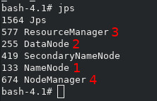

_Jorge III Altamirano Astorga - 175904_

_Eduardo Selim Martinez Mayorga - 175921_

_Ariel Ernesto Vallarino Maritorena - 175875_

## Tarea 2: Hadoop, HDFS {.tabset}

Utilizamos la imagen de [docker.io/sequenceiq/hadoop-docker](https://store.docker.com/community/images/sequenceiq/ha) con el comando:

`docker run -it --rm -p 8088:8088 -v /tmp:/root/tarea_2 sequenceiq/hadoop-docker:2.7.0 /etc/bootstrap.sh -bash`

_Aquí se muestra dicho inicio del container de Docker, esta contiene Hadoop 2.7 en Centos 6.6:_

_La opción_ `-v` _es para tener un volumen dentro del container donde descargamos los datos de Dropbox._

_El Dockerfile está en el penúltimo tab._

###Creación del directorio

Crear el directorio `/metodos_gran_escala/tarea_2/ecobici/year=2017/sem_1/` con `mkdir` verifica la opción `-p`

_Aquí mostramos la ejecución del comando_ `hdfs dfs -mkdir -p '/metodos_gran_escala/tarea_2/ecobici/year=2017/sem_1/'` _y su resultado (no muestra error)_

_Respecto a la sección_ `$HADOOP_PREFIX/bin` _es para evitar tenernos que mover de directorio y teclear todo, pues el shell acepta autocompletar con la tecla "tabulador" las variables de ambiente :-)_

### Listado del directorio

Muestra que el directorio está vacío -no hay datos cargados- con ls

_Aquí mostramos la ejecución de todo el arbol de directorios, *resaltando* en color rojo lo que se pidió; esto con el comando_ `hdfs dfs -ls /metodos_gran_escala/tarea_2/ecobici/year=2017/sem_1/`. 

_Hemos puesto todo el árbol para mostrar de manera explícita el árbol de directorios._

###Carga de datos

Carga los datos a este directorio que creaste ocupando copyFromLocal

_Aquí se muestra la ejecución del comando_ 
`$HADOOP_PREFIX/bin/hdfs dfs -copyFromLocal /root/tarea_2/ecobici_2017_sem1.csv '/metodos_gran_escala/tarea_2/ecobici/year=2017/sem_1/'`

_Salida sin errores. Los datos los cargamos desde la carpeta `/root/tarea_2`, _ que viene del volumen mapeado en la creación del container, con la opción:_ `-v /tmp:/root/tarea_2`. _Los datos fueron descargados con browser y no se pudo con curl o wget, dado que requiere la sesión, al menos por lo que intentamos._

### Mostrar datos cargados

Muestra que los datos están cargados haciendo un ls

_Aquí se muestra la ejecución del comando sin y con la opción -h para mostrarlo en Gigas en vez de bytes. Esto puede ser cómodo para el operador, pero engañoso, pues pueden no coincidir los bytes. Pero para darnos una idea rápida es útil._
`$HADOOP_PREFIX/bin/hdfs dfs -ls -h '/metodos_gran_escala/tarea_2/ecobici/year=2017/sem_1/'`

_Salida sin errores con el tamaño de 1.8 GB (1905882242 bytes) al igual que el archivo original._

### Mostrar elementos del HDFS 

Muestra que el NameNode, DataNode, ResourceManager y el NodeManager están activos en tu clúster de Hadoop con jps

_Se muestra la salida del comando_ `jps` _con los NameNode (1), DataNode (2), ResourceManager(3) y el NodeManager (4). Hemos marcado con número rojo (GIMP) cada uno de los elementos sólo con fines informativos, no es parte de la salida del comando._

### Reporte de dfsadmin

Muestra la salida del reporte generado con dfsadmin report

_Mostramos la salida del reporte con el comando_ `hdfs dfsadmin -report`

### % de Utilización del DFS

¿Cuál es el % de DFS utilizado una vez que ya subiste los datos?

_Pasó de 0.01% a 50.16%; estos porcentajes son de 354.04 KB a tener 1.79 GB con el archivo de Ecobici._

_Aquí mostramos en color rojo la salida que responde la pregunta de esta tarea._

### Dockerfile

_Fuente [https://store.docker.com/community/images/sequenceiq/hadoop-docker/dockerfile](https://store.docker.com/community/images/sequenceiq/hadoop-docker/dockerfile)_

<pre><code>
# Creates pseudo distributed hadoop 2.7.0
#
# docker build -t sequenceiq/hadoop .

FROM sequenceiq/pam:centos-6.5
MAINTAINER SequenceIQ

USER root

# install dev tools
RUN yum clean all; \
rpm --rebuilddb; \
yum install -y curl which tar sudo openssh-server openssh-clients rsync
# update libselinux. see https://github.com/sequenceiq/hadoop-docker/issues/14
RUN yum update -y libselinux

# passwordless ssh
RUN ssh-keygen -q -N "" -t dsa -f /etc/ssh/ssh_host_dsa_key
RUN ssh-keygen -q -N "" -t rsa -f /etc/ssh/ssh_host_rsa_key
RUN ssh-keygen -q -N "" -t rsa -f /root/.ssh/id_rsa
RUN cp /root/.ssh/id_rsa.pub /root/.ssh/authorized_keys

# java
RUN curl -LO 'http://download.oracle.com/otn-pub/java/jdk/7u71-b14/jdk-7u71-linux-x64.rpm' -H 'Cookie: oraclelicense=accept-securebackup-cookie'
RUN rpm -i jdk-7u71-linux-x64.rpm
RUN rm jdk-7u71-linux-x64.rpm

ENV JAVA_HOME /usr/java/default
ENV PATH $PATH:$JAVA_HOME/bin

# download native support
RUN mkdir -p /tmp/native
RUN curl -Ls http://dl.bintray.com/sequenceiq/sequenceiq-bin/hadoop-native-64-2.7.0.tar | tar -x -C /tmp/native

# hadoop
RUN curl -s http://www.eu.apache.org/dist/hadoop/common/hadoop-2.7.0/hadoop-2.7.0.tar.gz | tar -xz -C /usr/local/
RUN cd /usr/local && ln -s ./hadoop-2.7.0 hadoop

ENV HADOOP_PREFIX /usr/local/hadoop
ENV HADOOP_COMMON_HOME /usr/local/hadoop
ENV HADOOP_HDFS_HOME /usr/local/hadoop
ENV HADOOP_MAPRED_HOME /usr/local/hadoop
ENV HADOOP_YARN_HOME /usr/local/hadoop
ENV HADOOP_CONF_DIR /usr/local/hadoop/etc/hadoop
ENV YARN_CONF_DIR $HADOOP_PREFIX/etc/hadoop

RUN sed -i '/^export JAVA_HOME/ s:.*:export JAVA_HOME=/usr/java/default\nexport HADOOP_PREFIX=/usr/local/hadoop\nexport HADOOP_HOME=/usr/local/hadoop\n:' $HADOOP_PREFIX/etc/hadoop/hadoop-env.sh
RUN sed -i '/^export HADOOP_CONF_DIR/ s:.*:export HADOOP_CONF_DIR=/usr/local/hadoop/etc/hadoop/:' $HADOOP_PREFIX/etc/hadoop/hadoop-env.sh
#RUN . $HADOOP_PREFIX/etc/hadoop/hadoop-env.sh

RUN mkdir $HADOOP_PREFIX/input
RUN cp $HADOOP_PREFIX/etc/hadoop/*.xml $HADOOP_PREFIX/input

# pseudo distributed
ADD core-site.xml.template $HADOOP_PREFIX/etc/hadoop/core-site.xml.template
RUN sed s/HOSTNAME/localhost/ /usr/local/hadoop/etc/hadoop/core-site.xml.template > /usr/local/hadoop/etc/hadoop/core-site.xml
ADD hdfs-site.xml $HADOOP_PREFIX/etc/hadoop/hdfs-site.xml

ADD mapred-site.xml $HADOOP_PREFIX/etc/hadoop/mapred-site.xml
ADD yarn-site.xml $HADOOP_PREFIX/etc/hadoop/yarn-site.xml

RUN $HADOOP_PREFIX/bin/hdfs namenode -format

# fixing the libhadoop.so like a boss
RUN rm -rf /usr/local/hadoop/lib/native
RUN mv /tmp/native /usr/local/hadoop/lib

ADD ssh_config /root/.ssh/config
RUN chmod 600 /root/.ssh/config
RUN chown root:root /root/.ssh/config

# # installing supervisord
# RUN yum install -y python-setuptools
# RUN easy_install pip
# RUN curl https://bitbucket.org/pypa/setuptools/raw/bootstrap/ez_setup.py -o - | python
# RUN pip install supervisor
#
# ADD supervisord.conf /etc/supervisord.conf

ADD bootstrap.sh /etc/bootstrap.sh
RUN chown root:root /etc/bootstrap.sh
RUN chmod 700 /etc/bootstrap.sh

ENV BOOTSTRAP /etc/bootstrap.sh

# workingaround docker.io build error
RUN ls -la /usr/local/hadoop/etc/hadoop/*-env.sh
RUN chmod +x /usr/local/hadoop/etc/hadoop/*-env.sh
RUN ls -la /usr/local/hadoop/etc/hadoop/*-env.sh

# fix the 254 error code
RUN sed -i "/^[^#]*UsePAM/ s/.*/#&/" /etc/ssh/sshd_config
RUN echo "UsePAM no" >> /etc/ssh/sshd_config
RUN echo "Port 2122" >> /etc/ssh/sshd_config

RUN service sshd start && $HADOOP_PREFIX/etc/hadoop/hadoop-env.sh && $HADOOP_PREFIX/sbin/start-dfs.sh && $HADOOP_PREFIX/bin/hdfs dfs -mkdir -p /user/root
RUN service sshd start && $HADOOP_PREFIX/etc/hadoop/hadoop-env.sh && $HADOOP_PREFIX/sbin/start-dfs.sh && $HADOOP_PREFIX/bin/hdfs dfs -put $HADOOP_PREFIX/etc/hadoop/ input

CMD ["/etc/bootstrap.sh", "-d"]

# Hdfs ports
EXPOSE 50010 50020 50070 50075 50090
# Mapred ports
EXPOSE 19888
#Yarn ports
EXPOSE 8030 8031 8032 8033 8040 8042 8088
#Other ports
EXPOSE 49707 2122
</code></pre>

### Referencias

* [github.com/silil/metodos_gran_escala/hadoop.html](https://github.com/silil/metodos_gran_escala/blob/master/hadoop.html)