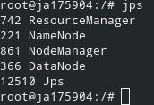
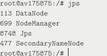
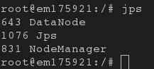
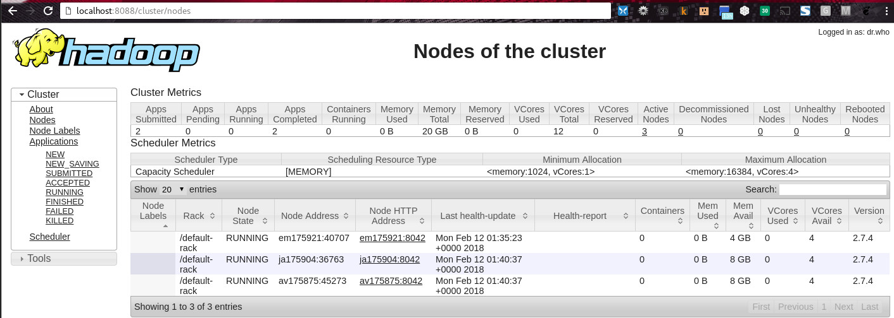

_Jorge III Altamirano Astorga - 175904_

_Eduardo Selim Martinez Mayorga - 175921_

_Ariel Ernesto Vallarino Maritorena - 175875_

## Tarea 3 - Parte 1: Hadoop Cluster {.tabset}

Le presentamos la siguiente parte 1 de la tarea 3.

### Dockerfile

Este es el Dockerfile que utilizamos. Para compilarlo lo hicimos con el siguiente comando:
`docker build --rm=true -v /sys/fs/cgroup:/sys/fs/cgroup -t local/xenial-hadoop-base .`

Requiriendo antes ejecutar del siguiente [script](https://github.com/philwebsurfer/metodos_gran_escala/blob/master/alumnos/jorge_altamirano/tarea_3/parte_1/run-first.sh) que descarga la distribución de Hadoop, dado que no se puede poner en GitHub.

<code><pre>
FROM ubuntu:16.04
LABEL name="Ubuntu 16.04 - Hadoop 27" \
    vendor="philwebsurfer" \
    license="GPLv2" 

USER root

ENV DEBIAN_FRONTEND noninteractive

#Change mirrrors ad hoc, for speed
RUN sed -i 's!\(archive\|security\)\.ubuntu\.com/!mirror.cogentco.com/pub/linux/!g'\
 /etc/apt/sources.list

RUN apt-get update; \
 apt-get upgrade -y; \
 apt-get install -y --no-install-recommends apt-utils locales
RUN apt-get install -y --no-install-recommends bash-completion \
 openjdk-8-jre-headless screen openssh-server openssh-client rsync \
 vim openjdk-8-jdk-headless net-tools python telnet traceroute \
 iputils-ping dnsutils python3 curl wget less
# Taken from https://github.com/docker-library/docs/tree/master/ubuntu
RUN rm -rf /var/lib/apt/lists/* && \
 localedef -i en_US -c -f UTF-8 -A /usr/share/locale/locale.alias en_US.UTF-8
ENV LANG en_US.utf8
RUN systemctl enable ssh

#Do the Java things 
ENV JAVA_HOME /usr/lib/jvm/java-8-openjdk-amd64

#Hadoop things
#https://www-us.apache.org/dist/hadoop/common/hadoop-2.7.4/hadoop-2.7.4.tar.gz
ADD hadoop-2.7.4.tar.gz /usr/local
ADD hadoop-etc.tar.gz /
RUN ln -sf /usr/local/hadoop-2.7.4 /usr/local/hadoop

#passwordless ssh (from
#https://store.docker.com/community/images/sequenceiq/hadoop-docker/dockerfile)
RUN rm -rf /etc/ssh/ssh_host_dsa_key /etc/ssh/ssh_host_rsa_key\
 /root/.ssh/id_rsa /root/.ssh/id_rsa.pub /root/.ssh/authorized_keys
RUN ssh-keygen -q -N "" -t dsa -f /etc/ssh/ssh_host_dsa_key; \
 ssh-keygen -q -N "" -t rsa -f /etc/ssh/ssh_host_rsa_key; \
 ssh-keygen -q -N "" -t rsa -f /root/.ssh/id_rsa; \
 cp /root/.ssh/id_rsa.pub /root/.ssh/authorized_keys; \
 rm -rf /etc/update-motd.d/10-help-text
RUN echo StrictHostKeyChecking=no >> /etc/ssh/ssh_config; \
 echo export JAVA_HOME=/usr/lib/jvm/java-8-openjdk-amd64 >> /root/.bashrc;\
 echo export JAVA_HOME=/usr/lib/jvm/java-8-openjdk-amd64 >> /root/.profile;\
 echo export JAVA_HOME=/usr/lib/jvm/java-8-openjdk-amd64 >> /usr/local/hadoop-2.7.4/etc/hadoop/hadoop-env.sh

#Environment vars setting
ENV HADOOP_PREFIX /usr/local/hadoop
ENV HADOOP_COMMON_HOME /usr/local/hadoop
ENV HADOOP_HDFS_HOME /usr/local/hadoop
ENV HADOOP_MAPRED_HOME /usr/local/hadoop
ENV HADOOP_YARN_HOME /usr/local/hadoop
ENV HADOOP_CONF_DIR /usr/local/hadoop/etc/hadoop
ENV YARN_CONF_DIR $HADOOP_PREFIX/etc/hadoop
ENV PATH $PATH:$HADOOP_PREFIX/sbin:$HADOOP_PREFIX/bin

#https://hadoop.apache.org/docs/stable/hadoop-project-dist/hadoop-common/ClusterSetup.html
EXPOSE 22/tcp 50090/tcp 50010/tcp 50075/tcp 50020/tcp 8030/tcp 8031/tcp 8032/tcp 8033/tcp 8088/tcp 
CMD ["/etc/bootstrap.sh"]
#CMD ["/bin/bash"]
</code></pre>

### JPS

_Este es el nodo Jorge Altamirano, el cual es el master para HDFS (NameNode) y Yarn (ResourceManager). Además es un nodo de almacenamiento de HDFS (DataNode) y trabajos de Hadoop (NodeManager)._

_Este es el nodo Ariel Vallarino, el cual es el secundario de HDFS (SecondaryNameNode). Este es un nodo de almacenamiento datos de HDFS (DataNode) y procesamiento  Hadoop (NodeManager)._

_Este es el nodo Eduardo Selim Martínez, es un nodo de almacenamiento de datos de HDFS (DataNode) y trabajos de Hadoop (NodeManager)._

### Nodes

_Los jobs que aparecen en este screenshot es debido a que fue tomado posterior a la ejecución de los jobs, esto con el fin de probar que funcionara, y no solo estuvieran los nodos sin aceptar jobs, como nos pasó y nos costó gran trabajo «echar a andar», por eso aparece "Apps Completed": 2._

### Ejecución de docker

Encontramos muchos problemas y muchas configuraciones que fueron necesarias cambiar, y adecuar, para el adecuado funcionamiento. Cada una de las referencias resulve uno (o varios problemas).

El nodo de Jorge Altamirano lo ejecutamos así:

`docker run --rm -v /sys/fs/cgroup:/sys/fs/cgroup:ro -v /datos:/datos --network host --hostname ja175904 --rm -it local/xenial-hadoop-base`

El nodo de Ariel Vallarino lo ejecutamos así:

`docker run --rm -v /sys/fs/cgroup:/sys/fs/cgroup:ro -v /datos:/datos --network host --hostname av175875 --rm -it local/xenial-hadoop-base`

El nodo de Eduardo Selim lo ejecutamos así:

`docker run --rm -v /sys/fs/cgroup:/sys/fs/cgroup:ro -v /datos:/datos --network host --hostname em175921 --rm -it local/xenial-hadoop-base`

Como se observa, hicimos todo en el Dockerfile, y no fue necesario ejecutar comandos manualmente.

### Referencias

* https://hadoop.apache.org/docs/stable/hadoop-project-dist/hadoop-common/ClusterSetup.html
* https://hadoop.apache.org/docs/r2.7.5/hadoop-yarn/hadoop-yarn-common/yarn-default.xml
* https://mail-archives.apache.org/mod_mbox/hadoop-yarn-dev/201710.mbox/<JIRA.13106612.1507001251000.263007.1507055640497@Atlassian.JIRA>
* https://stackoverflow.com/questions/5277756/how-can-i-tell-if-a-hadoop-namenode-has-already-been-formatted
* https://toster.ru/q/57046#answer_208326
* https://help.ubuntu.com/community/SwitchingToUbuntu/FromLinux/RedHatEnterpriseLinuxAndFedora
* https://github.com/moby/moby/issues/3629
* https://bugzilla.redhat.com/show_bug.cgi?id=1033604
* https://developers.redhat.com/blog/2014/05/05/running-systemd-within-docker-container/
* https://docs.docker.com/engine/reference/builder/#scope
* https://docs.docker.com/network/
* https://forums.docker.com/t/any-simple-and-safe-way-to-start-services-on-centos7-systemd/5695/10
* https://store.docker.com/images/ubuntu
* https://store.docker.com/community/images/sequenceiq/hadoop-docker/dockerfile

