_Jorge III Altamirano Astorga - 175904_

_Eduardo Selim Martinez Mayorga - 175921_

_Ariel Ernesto Vallarino Maritorena - 175875_

## Tarea 3 - Parte 2: Hadoop Cluster {.tabset}

Le presentamos la siguiente parte 2 de la tarea 3.

### Ejercicio 1 {.tabset}

Utilizando los datos de ecobici_2010_2017 y MapReduce averigua ¿Cuántos registros hay por cicloestación?

####Registros por Estación

Encontramos lo siguiente cuando ejecutamos el comando para Hadoop que sigue:
`hadoop jar /usr/local/hadoop/share/hadoop/tools/lib/hadoop-streaming-2.7.4.jar \`\
`-files /usr/local/avallarino/ecobici-mr/mapper.py,/usr/local/avallarino/ecobici-mr/reducer.py \`\
`-input /tarea_3/parte_2/ecobici_2010_2017.csv \` \
`-output /tarea_3/parte_2/output-ecobici \` \
`-mapper mapper.py \`\
`-reducer reducer.py`

Aquí un breve extracto del output

<pre>
"1 RIO BALSAS-RIO SENA"	476904
"10 REFORMA-RAMIREZ"	291130
"100 20 DE NOVIEMBRE-MESONES"	22924
"101 1ER. CALLEJ<U+00D3>N DE MESONES-MESONES"	29120
"102 ECHEVESTE-BOLIVAR"	42642
"103 JOAQU<U+00CD>N VEL<U+00C1>ZQUEZ DE LE<U+00D3>N-GARC<U+00CD>A ICAZBALCETA"	32382
"104 SAN JERONIMO-ISABEL LA CATOLICA"	54598
"105 SAN JERONIMO-5 DE FEBRERO"	35906
"106 SAN JERONIMO-JOSE MARIA PINO SUAREZ"	88989
"107 TOLSA-BALDERAS"	116998
</pre>

####mapper.py

<pre><code>
#!/usr/bin/python3
# @author: 2018 (c) Ariel Vallarino
# @description: ecobici mapper file
# @license: GPL v2
import sys
import re
 
for line in sys.stdin:
        words = re.split(',', line)
        print(words[13] + "\t1")

</code></pre>

####reducer.py

<pre><code>
#!/usr/bin/python3
# @author: 2018 (c) Ariel Vallarino
# @description: ecobici reducer
# @license: GPL v2
import sys

previous = None
sum = 0

for line in sys.stdin:
  key, value = line.split('\t')
  if key != previous:
      if previous is not None:
        print(previous + '\t' + str(sum))
      previous = key
      sum = 0

  sum += int(value)
</code></pre>

####jps Jorge

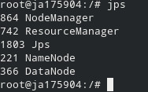

####jps Ariel

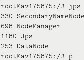

####jps Eduardo

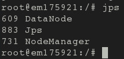

####Nodos del Cluster

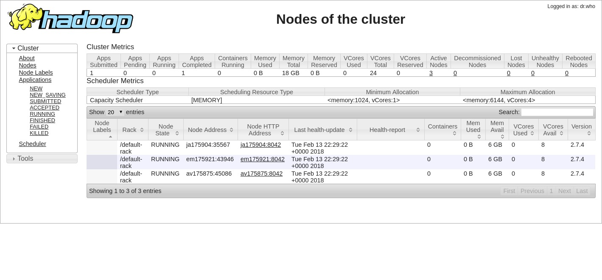

####Jobs finalizados

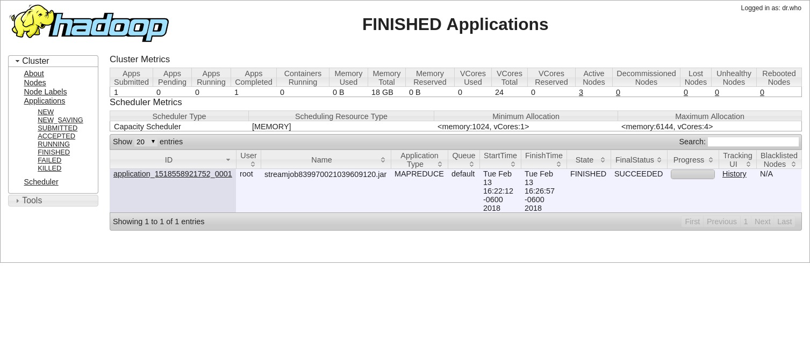

### Ejercicio 2 {.tabset}

Ejercicio 2: Con los datos de vuelos retrasados en USA hacer un join del lado del mapper con flights, airports y airlines. Primero intenta una sola llave o flights o airports

####Join en `mapper`

Encontramos lo siguiente cuando ejecutamos el comando para Hadoop que sigue:
`hadoop jar /usr/local/hadoop/share/hadoop/tools/lib/hadoop-streaming-2.7.4.jar \`\
`-files /usr/local/avallarino/flight-mr/mapper.py,/usr/local/avallarino/flight-mr/reducer.py \`\
`-input /tarea_3/parte_2/airlines.csv \`\
`-input /tarea_3/parte_2/flights.csv \`\
`-output /tarea_3/parte_2/output-airlines1 \`\
`-mapper mapper.py \`\
`-reducer reducer.py`

Aquí un extracto de las primeras líneas del output

<pre>
CODE    AEROLINEA       CANT.CANCELACIONES
AA      American Airlines Inc.  10919
AS      Alaska Airlines Inc.    669
B6      JetBlue Airways 4276
DL      Delta Air Lines Inc.    3824
EV      Atlantic Southeast Airlines     15231
F9      Frontier Airlines Inc.  588
HA      Hawaiian Airlines Inc.  171
MQ      American Eagle Airlines Inc.    15025
NK      Spirit Air Lines        2004
OO      Skywest Airlines Inc.   9960
UA      United Air Lines Inc.   6573
US      US Airways Inc. 4067
VX      Virgin America  534
WN      Southwest Airlines Co.  16043
</pre>

####mapper.py

<pre><code>
#!/usr/bin/python3
# @author: 2018 (c) Ariel Vallarino, Jorge Altamirano
# @description: JOIN entre archivos en mapper: airlines.csv, flights.csv
# @license: GPL v2
# airlines.csv: IATA_CODE	AIRLINE
# airports.csv: IATA_CODE	AIRPORT	CITY	STATE	COUNTRY	LATITUDE	LONGITUDE
# flights.csv: 	YEAR	MONTH	DAY	DAY_OF_WEEK	AIRLINE	FLIGHT_NUMBER	TAIL_NUMBER	ORIGIN_AIRPORT	
#				DESTINATION_AIRPORT	SCHEDULED_DEPARTURE	DEPARTURE_TIME	DEPARTURE_DELAY	TAXI_OUT	
#				WHEELS_OFF	SCHEDULED_TIME	ELAPSED_TIME	AIR_TIME	DISTANCE	WHEELS_ON	TAXI_IN	
# 				SCHEDULED_ARRIVAL	ARRIVAL_TIME	ARRIVAL_DELAY	DIVERTED	CANCELLED	CANCELLATION_REASON
# 				AIR_SYSTEM_DELAY	SECURITY_DELAY	AIRLINE_DELAY	LATE_AIRCRAFT_DELAY	WEATHER_DELAY
import sys

for line in sys.stdin:
        cancel = "-"
        name = "Unknown_Airline"

        line = line.strip()
        splits = line.split(",")
        if len(splits) == 2:
                # De airlines.csv se obtiene Codigo y nombre de la aerolinea:
                code = splits[0]        # IATA_CODE
                name = splits[1]        # AIRLINE
                print( '%s\t%s\t%s' % (code, name, cancel))
        elif len(splits) == 31:
                # De flights.csv se obtiene Codigo y si el vuelo fue cancelado o no:
                code = splits[4]        # AIRLINE
                cancel = splits[24]     # CANCELLED
                if cancel.strip() == "1":
                        print( '%s\t%s\t%s' % (code, name, cancel))

</code></pre>

####reducer.py

<pre><code>
#!/usr/bin/python3
# @author: 2018 (c) Ariel Vallarino, Jorge Altamirano
# @description: JOIN entre archivos en mapper: airlines.csv, flights.csv
# @license: GPL v2
# airlines.csv: IATA_CODE	AIRLINE
# airports.csv: IATA_CODE	AIRPORT	CITY	STATE	COUNTRY	LATITUDE	LONGITUDE
# flights.csv: 	YEAR	MONTH	DAY	DAY_OF_WEEK	AIRLINE	FLIGHT_NUMBER	TAIL_NUMBER	ORIGIN_AIRPORT
#				DESTINATION_AIRPORT	SCHEDULED_DEPARTURE	DEPARTURE_TIME	DEPARTURE_DELAY	TAXI_OUT
#				WHEELS_OFF	SCHEDULED_TIME	ELAPSED_TIME	AIR_TIME	DISTANCE	WHEELS_ON	TAXI_IN
# 				SCHEDULED_ARRIVAL	ARRIVAL_TIME	ARRIVAL_DELAY	DIVERTED	CANCELLED	CANCELLATION_REASON
import sys

lines = sys.stdin.readlines()
lines.sort()

previous = None
name_prev = None
sum = 0

print('CODE\tAEROLINEA\tCANT.CANCELACIONES')

# Para cada aerolinea se cuenta cuantos vuelos canceladso tuvo
for line in lines:

        code, name, cancel = line.split('\t')
        if name != "Unknown_Airline" and name_prev == "Unknown_Airline":
                #name: Virgin America, cancel: -, code: VX, name_prev: Unknown_Airline
                name_prev = name
        #print("code: %s, name: %s, cancel: %s, code: %s, name_prev: %s"%(code, name, cancel.strip(), code, name_prev))
        if code != previous:
                if previous is not None and previous != "IATA_CODE":
                        print(previous + '\t' + name_prev + '\t' + str(sum))
                previous = code
                name_prev = name
                #print("Previous: %s, Name: %s, Valor: %s"%(name_prev,name,cancel.strip()))
                sum = 0

        valor = cancel.strip()
        if valor != "-":
                valor = int(valor)
        if valor == 1:
                sum += valor

# Retorna nombde de la aerolinea y cantidad de vuelos cancelados
if code != "IATA_CODE":
        print(code + '\t' + name_prev + '\t' + str(sum))
</code></pre>

####jps Jorge

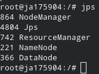

####jps Ariel

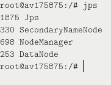

####jps Eduardo

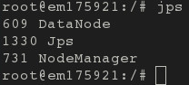

####Nodos del Cluster

####Jobs finalizados

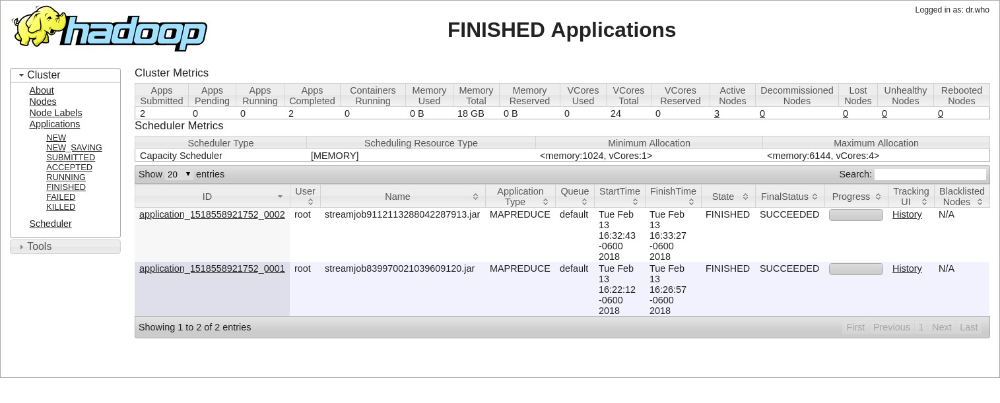

### Ejercicio 2 (revisado) {.tabset}

Ejercicio 2: Con los datos de vuelos retrasados en USA hacer un join del lado del mapper con flights, airports y airlines. Primero intenta una sola llave o flights o airports

_Este ejercicio lo corregimos en base a la sesión que dió Fernando Cisneros, incorporando el archivo flights.csv directo separado del input. De esta manera, están listos estos datos: siempre y en todos los nodos. Sin el riesgo de no tener las llaves para combinar (clave IATA)._

####Join en `mapper`

Encontramos lo siguiente cuando ejecutamos el comando para Hadoop que sigue:
`hadoop jar /usr/local/hadoop/share/hadoop/tools/lib/hadoop-streaming-2.8.3.jar \`\
`-files flights.csv,/usr/local/avallarino/flight-mr/mapper.py,/usr/local/avallarino/flight-mr/reducer.py \`\
`-input /tarea_3/parte_2/airlines.csv \`\
`-output /tarea_3/parte_2/output-airlines \`\
`-mapper mapper.py \`\
`-reducer reducer.py`

Aquí un extracto de las primeras líneas del output

<pre>
CODE    AEROLINEA       CANT.CANCELACIONES
AA      American Airlines Inc.  10919
AS      Alaska Airlines Inc.    669
B6      JetBlue Airways 4276
DL      Delta Air Lines Inc.    3824
EV      Atlantic Southeast Airlines     15231
F9      Frontier Airlines Inc.  588
HA      Hawaiian Airlines Inc.  171
MQ      American Eagle Airlines Inc.    15025
NK      Spirit Air Lines        2004
OO      Skywest Airlines Inc.   9960
UA      United Air Lines Inc.   6573
US      US Airways Inc. 4067
VX      Virgin America  534
</pre>

####mapper.py

<pre><code>
#!/usr/bin/env python3
# @author: 2018 (c) Ariel Vallarino, Jorge Altamirano
# @description: JOIN entre archivos en mapper: airlines.csv, flights.csv
# @license: GPL v2
# airlines.csv: IATA_CODE       AIRLINE
# airports.csv: IATA_CODE       AIRPORT CITY    STATE   COUNTRY LATITUDE        LONGITUDE
# flights.csv:  YEAR    MONTH   DAY     DAY_OF_WEEK     AIRLINE FLIGHT_NUMBER   TAIL_NUMBER     ORIGIN_AIRPORT  
#                               DESTINATION_AIRPORT     SCHEDULED_DEPARTURE     DEPARTURE_TIME  DEPARTURE_DELAY TAXI_OUT
#                               WHEELS_OFF      SCHEDULED_TIME  ELAPSED_TIME    AIR_TIME        DISTANCE        WHEELS_ON       TAXI_IN 
#                               SCHEDULED_ARRIVAL       ARRIVAL_TIME    ARRIVAL_DELAY   DIVERTED        CANCELLED       CANCELLATION_REASON
#                               AIR_SYSTEM_DELAY        SECURITY_DELAY  AIRLINE_DELAY   LATE_AIRCRAFT_DELAY     WEATHER_DELAY
import sys

airline = dict()
flights = list()

airlinestxt = open('airlines.csv', 'r')
for line in airlinestxt:
    line = line.strip() #hacer trim
    line2 = line.split(',') #separar
    if len(line2) == 2: #detectar airlines
        airline[line2[0]] = line2[1] #guardar en dict las aerolíneas
airlinestxt.close()

lines = sys.stdin.readlines()
lines.sort()
for line in lines:
    line = line.strip() #hacer trim nuevamente
    line2 = line.split(',') #separar nuevamente
    if len(line2) == 31 and line2[24] == "1": #detectar cancelled flights 
        flights.append([line2[4],airline[line2[4]]]) #hacer join sólo de vuelos cancelados

for flight in flights:
    print("%s\t%s"%(flight[0],flight[1])) #imprimir vuelos cancelados
</code></pre>

####reducer.py

<pre><code>
#!/usr/bin/env python3
# @author: 2018 (c) Ariel Vallarino, Jorge Altamirano
# @description: JOIN entre archivos en mapper: airlines.csv, flights.csv
# @license: GPL v2
# airlines.csv: IATA_CODE       AIRLINE
# airports.csv: IATA_CODE       AIRPORT CITY    STATE   COUNTRY LATITUDE        LONGITUDE
# flights.csv:  YEAR    MONTH   DAY     DAY_OF_WEEK     AIRLINE FLIGHT_NUMBER   TAIL_NUMBER     ORIGIN_AIRPORT
#                               DESTINATION_AIRPORT     SCHEDULED_DEPARTURE     DEPARTURE_TIME  DEPARTURE_DELAY TAXI_OUT
#                               WHEELS_OFF      SCHEDULED_TIME  ELAPSED_TIME    AIR_TIME        DISTANCE        WHEELS_ON       TAXI_IN
#                               SCHEDULED_ARRIVAL       ARRIVAL_TIME    ARRIVAL_DELAY   DIVERTED        CANCELLED       CANCELLATION_REASON
import sys

lines = sys.stdin.readlines()
lines.sort()

prev = prevName = None
sum = 1

print('CODE\tAEROLINEA\tCANT.CANCELACIONES')

# Para cada aerolinea se cuenta cuantos vuelos cancelados tuvo
for line in lines:
    line = line.strip()
    code, name = line.split('\t')
    if code == prev:
        sum += 1
    elif prev is not None:
        print("%s\t%s\t%d"%(prev, prevName, sum))
        sum = 1
    prev = code
    prevName = name
</code></pre>

####jps Jorge

####jps Ariel

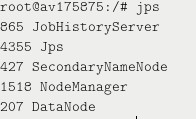

####jps Eduardo

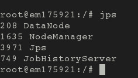

####Nodos del Cluster

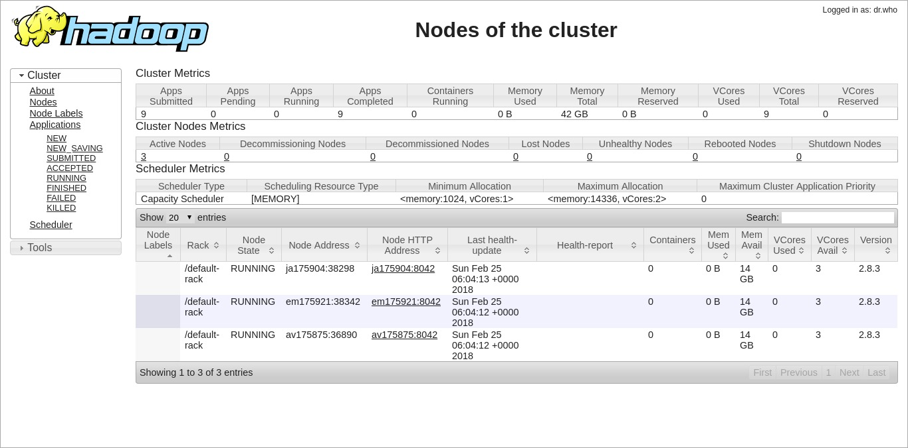

####Jobs finalizados

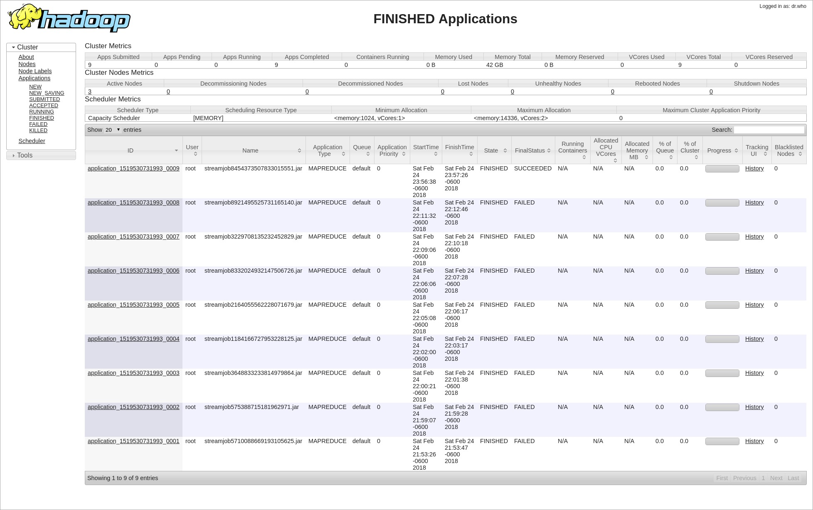

### Ejercicio 3 {.tabset}

Ejercicio 3: Con los datos de vuelos retrasados en USA hacer un join del lado del reducer con flights, airports y airlines. Primero intenta una sola llave o flights o airports

#### Join en `reducer`

Ejecutamos el siguiente comando:

`hadoop jar /usr/local/hadoop/share/hadoop/tools/lib/hadoop-streaming-2.7.4.jar \`\
` -files /usr/local/avallarino/flight-mrjoin/mapper.py,/usr/local/avallarino/flight-mrjoin/reducer.py \`\
` -input /tarea_3/parte_2/airlines.csv \ `\
` -input /tarea_3/parte_2/flights.csv \`\
` -output /tarea_3/parte_2/output-airlines2 \`\
` -mapper mapper.py \ `\
` -reducer reducer.py`

Esta fue la salida:
<pre>
IATA_CODE      AIRLINE      CANCEL_COUNT
AA      American Airlines Inc.  10919
AS      Alaska Airlines Inc.    669
B6      JetBlue Airways 4276
DL      Delta Air Lines Inc.    3824
EV      Atlantic Southeast Airlines     15231
F9      Frontier Airlines Inc.  588
HA      Hawaiian Airlines Inc.  171
MQ      American Eagle Airlines Inc.    15025
NK      Spirit Air Lines        2004
OO      Skywest Airlines Inc.   9960
UA      United Air Lines Inc.   6573
US      US Airways Inc. 4067
VX      Virgin America  534
WN      Southwest Airlines Co.  16043
</pre>

#### mapper.py

<pre><code>
#!/usr/bin/python3
# @author: 2018 (c) Ariel Vallarino, Jorge Altamirano
# @description: JOIN entre archivos:  airlines.csv  y  flights.csv
# @license: GPL v2
# airlines.csv: IATA_CODE       AIRLINE
# airports.csv: IATA_CODE       AIRPORT CITY    STATE   COUNTRY LATITUDE        LONGITUDE
# flights.csv:  YEAR    MONTH   DAY     DAY_OF_WEEK     AIRLINE FLIGHT_NUMBER   TAIL_NUMBER   ORIGIN_AIRPORT  
#                               DESTINATION_AIRPORT     SCHEDULED_DEPARTURE     DEPARTURE_TIME        DEPARTURE_DELAY TAXI_OUT
#                               WHEELS_OFF      SCHEDULED_TIME  ELAPSED_TIME    AIR_TIME      DISTANCE        WHEELS_ON       TAXI_IN 
#                               SCHEDULED_ARRIVAL       ARRIVAL_TIME    ARRIVAL_DELAYDIVERTED CANCELLED       CANCELLATION_REASON
#                               AIR_SYSTEM_DELAY        SECURITY_DELAY  AIRLINE_DELAYLATE_AIRCRAFT_DELAY      WEATHER_DELAY

import sys
import re

for line in sys.stdin:
    line = line.strip()
    line = re.sub(',', '\u00AC', line)
    line2 = line.split('\u00AC')

    if(len(line2) == 31): #detectar flights
       if(line2[24] == "1"): #detectar cancelados
           print(line2[4])
    elif len(line2) == 2: #detectar airlines
        print(line)
</code></pre>

#### reducer.py

<pre><code>
#!/usr/bin/python3
# @author: 2018 (c) Ariel Vallarino, Jorge Altamirano
# @description: JOIN entre archivos:  airlines.csv  y  flights.csv
# @license: GPL v2
import sys

lines = sys.stdin.readlines()
lines.sort()

previous = None
name_prev = None
sum = 0

print('IATA_CODE,AIRLINE,CANCEL_COUNT')

for line in lines:
    line = line.strip()
    line2 = line.split('\u00AC')
    #print("%s (%d)"% (line, len(line2)))
    if len(line2) == 1:
        sum += 1
    elif len(line2) == 2 and line2[0] != "IATA_CODE":
        print("%s\t%s\t%d"% (line2[0], line2[1], sum))
        sum = 0
</code></pre>

#### jps Jorge

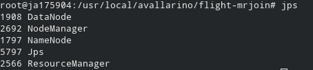

#### jps Ariel

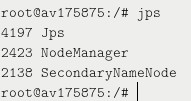

#### jps Eduardo

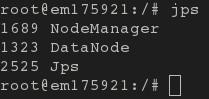

#### Nodos del Cluster

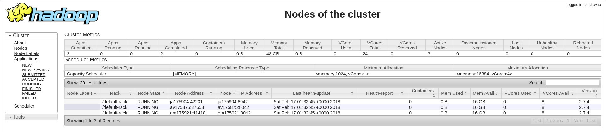

#### Jobs finalizados

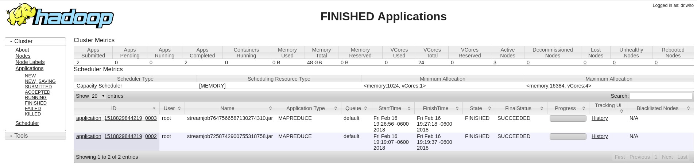

### Ejercicio Adicional {.tabset}

Consideramos hacer un ejercicio adicional en donde hicimos join completo, naturalmente en el reducer :-). El archivo resultante es de 600 MB.

#### Output

Estas son las primeras líneas del comando:

`hadoop jar /usr/local/hadoop/share/hadoop/tools/lib/hadoop-streaming-2.7.4.jar `\
` -files /usr/local/avallarino/flight-join/mapper.py,/usr/local/avallarino/flight-join/reducer.py `\
` -input /tarea_3/parte_2/airlines.csv -input /tarea_3/parte_2/flights.csv `\
` -output /tarea_3/parte_2/output-airlines3 `\
` -mapper mapper.py  `\
` -reducer reducer.py`

<pre>CODE    AIRLINE YEAR    MONTH   DAY     DAY_OF_WEEK     FLIGHT_NUMBERTAIL_NUMBER        ORIGIN_AIRPORT  DESTINATION_AIRPORT     SCHEDULED_DEPARTUREDEPARTURE_TIME       DEPARTURE_DELAY TAXI_OUT        WHEELS_OFF      SCHEDULED_TIMEELAPSED_TIME    AIR_TIME        DISTANCE        WHEELS_ON       TAXI_IN SCHEDULED_ARRIVALARRIVAL_TIME   ARRIVAL_DELAY   DIVERTED        CANCELLED       CANCELLATION_REASONAIR_SYSTEM_DELAY     SECURITY_DELAY  AIRLINE_DELAY   LATE_AIRCRAFT_DELAY  WEATHER_DELAY
AA      American Airlines Inc.  2015    1       1       4       1       N787AA  JFK     LAX     0900    0855    -5      17      0912    390     402     378     2475    1230    7       1230    1237    7       0       0
AA      American Airlines Inc.  2015    1       1       4       10      N796AA  LAX     JFK     2150    2150    0       14      2204    309     294     275     2475    0539    5       0559    0544    -15     0       0
AA      American Airlines Inc.  2015    1       1       4       1001    N4WTAA  DFW     TUS     1825    1941    76      14      1955    140     141     123     813     2058    4       1945    2102    77      0       0               1    0
        25      51      0
AA      American Airlines Inc.  2015    1       1       4       1002    N475AA  DFW     IAH     1030                                    65                      224                     1135                    0       1       B
</pre>

#### mapper.py

<pre><code>
#!/usr/bin/python3
# @author: 2018 (c) Ariel Vallarino, Jorge Altamirano
# @description: JOIN entre archivos en reducer: airlines.csv, flights.csv
# @license: GPL v2
# airlines.csv: IATA_CODE       AIRLINE
# airports.csv: IATA_CODE       AIRPORT CITY    STATE   COUNTRY LATITUDE        LONGITUDE
# flights.csv:  YEAR    MONTH   DAY     DAY_OF_WEEK     AIRLINE FLIGHT_NUMBER   TAIL_NUMBER     ORIGIN_AIRPORT  
#                               DESTINATION_AIRPORT     SCHEDULED_DEPARTURE     DEPARTURE_TIME  DEPARTURE_DELAY TAXI_OUT        
#                               WHEELS_OFF      SCHEDULED_TIME  ELAPSED_TIME    AIR_TIME        DISTANCE        WHEELS_ON       TAXI_IN 
#                               SCHEDULED_ARRIVAL       ARRIVAL_TIME    ARRIVAL_DELAY   DIVERTED        CANCELLED       CANCELLATION_REASON
#                               AIR_SYSTEM_DELAY        SECURITY_DELAY  AIRLINE_DELAY   LATE_AIRCRAFT_DELAY     WEATHER_DELAY
output = list();

import sys
for line in sys.stdin:
        
        # Elimino espacios
        line = line.strip()     
        # Separo campos por ",":
        splits = line.split(",")
        if len(splits) == 2:            
                # Genero key con la cual se ordenarán los datos:
                output = [splits[0]  + "1"]
                #Agrego campos a continuación del Key:
                output[1:len(splits)] = splits          
                # Genero salida con campos separados por TAB:
                print('\t'.join(output))                        

        else:                                           
                # Genero key con la cual se ordenarán los datos
                output = [splits[4] + "2"]                      
                # Agrego código al inico:
                output.append(splits[4])                        
                # Elimino codigo:
                del splits[4]                                           
                #Agrego campos a continuación del Key:
                output[2:len(splits)] = splits          
                # Genero salida con campos separados por TAB:
                print('\t'.join(output))                        

        output = []
</code></pre>

#### reducer.py

<pre><code>
#!/usr/bin/python3
# @author: 2018 (c) Ariel Vallarino, Jorge Altamirano
# @description: JOIN entre archivos en reducer: airlines.csv, flights.csv
# @license: GPL v2
import sys
  
current_airline_code = ""
current_airline = ""

lines = sys.stdin.readlines()           
lines.sort()

output = list();

# Cabeceras:
header = ("CODE\tAIRLINE\tYEAR\tMONTH\tDAY\tDAY_OF_WEEK\tFLIGHT_NUMBER" +
"TAIL_NUMBER\tORIGIN_AIRPORT\tDESTINATION_AIRPORT\tSCHEDULED_DEPARTURE" +
"DEPARTURE_TIME\tDEPARTURE_DELAY\tTAXI_OUT\tWHEELS_OFF\tSCHEDULED_TIME" +
"ELAPSED_TIME\tAIR_TIME\tDISTANCE\tWHEELS_ON\tTAXI_IN\tSCHEDULED_ARRIVAL" +
"ARRIVAL_TIME\tARRIVAL_DELAY\tDIVERTED\tCANCELLED\tCANCELLATION_REASON" +
"AIR_SYSTEM_DELAY\tSECURITY_DELAY\tAIRLINE_DELAY\tLATE_AIRCRAFT_DELAY\tWEATHER_DELAY")
print(header)

# input comes from STDIN
for line in lines:

    # Elimino espacios
        line = line.strip()
     
    # Separo campos por TAB
        splits = line.split("\t")
        if len(splits) == 3:
                # Obtengo codigo de la aerolinea
                current_airline_code = splits[1]
                # Obtengo Nombre 
                current_airline = splits[2]
                
        else:
                # Asigno codigo de la aerolinea
                output.append(current_airline_code)
                # Obtengo Nombre 
                output.append(current_airline)
                #Agrego el resto de los campos para generar la salida
                output[2:len(splits)] = splits[2:len(splits)]   
                # Salida:
                print('\t'.join(output))

        output = []

</code></pre>

#### jps Jorge

#### jps Ariel

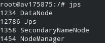

#### jps Jorge

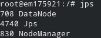

#### Nodos

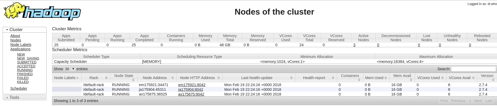

#### Jobs

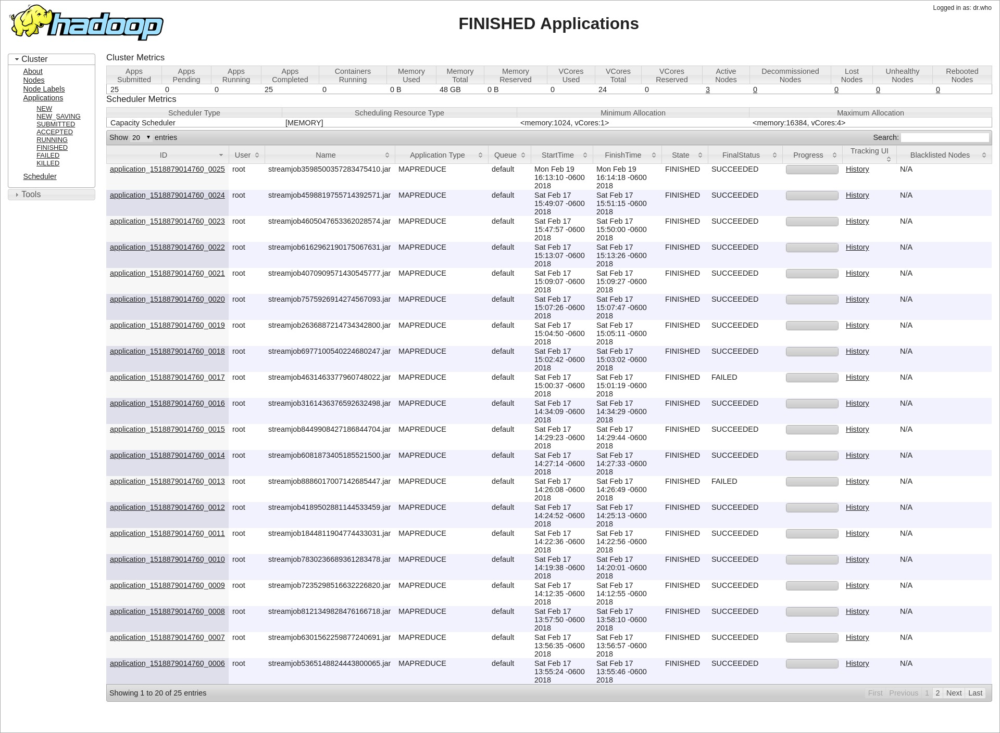
