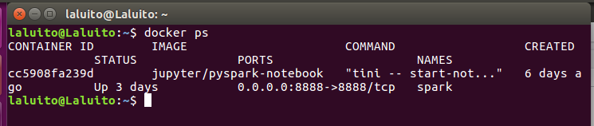
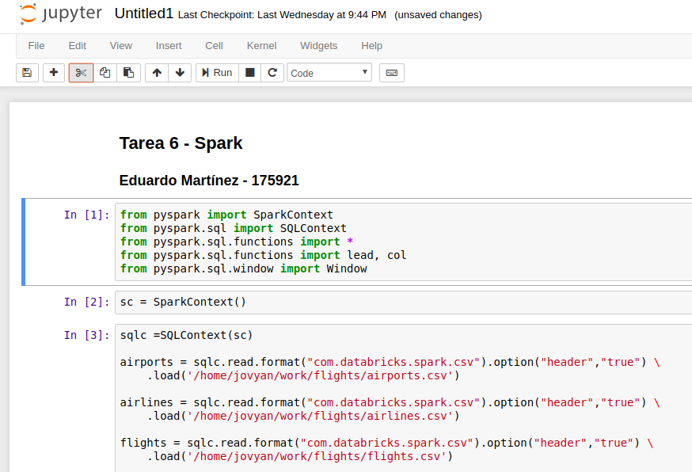

```{r setup, include=FALSE}
knitr::opts_chunk$set(echo = TRUE)
```

## Observaciones

Las consultas se llevaron a cabo en un contenedor de Docker con con Pyspak \& Jupyter Notebook y por lo tanto se editaron en un Jupyter Notebook

```
# Info. Docker:
http://maxmelnick.com/2016/06/04/spark-docker.html

# Imagen y contenedor:
# $PWD es el directorio en tu compu donde estas posicionado y que vas a mapear al contenedor:
docker run -d -p 8888:8888 -v $PWD:/home/jovyan/work --name spark jupyter/pyspark-notebook

# Token:
docker logs <docker ID>
```

##### Contenedor


#### Jupyter


## Ejercicio 1. Con la base de datos de northwind que se encuentran en el dropbox:

```
from pyspark import SparkContext 
from pyspark.sql import SQLContext 
from pyspark.sql.functions import *
from pyspark.sql.functions import lead, col
from pyspark.sql.window import Window
```

```
sc = SparkContext()
```

```
sqlc =SQLContext(sc)

airports = sqlc.read.format("com.databricks.spark.csv").option("header","true") \
    .load('/home/jovyan/work/flights/airports.csv')

airlines = sqlc.read.format("com.databricks.spark.csv").option("header","true") \
    .load('/home/jovyan/work/flights/airlines.csv')

flights = sqlc.read.format("com.databricks.spark.csv").option("header","true") \
    .load('/home/jovyan/work/flights/flights.csv')
    
employees = sqlc.read.format("com.databricks.spark.csv").option("header","true") \
    .load('/home/jovyan/work/northwind/employees.csv')
    
orders = sqlc.read.format("com.databricks.spark.csv").option("header","true") \
    .load('/home/jovyan/work/northwind/orders.csv')
```

### a.1. ¿Cuántos "jefes" hay en la tabla empleados?

Si tiene personal quien le reporta, se considerará como "jefe".

```
employees.agg(countDistinct("reportsto").alias("num_jefes")).show()

employees.agg(countDistinct("reportsto").alias("num_jefes")).rdd.saveAsTextFile("/home/jovyan/work/Pregunta1-a")
```

Con esto se obtiene

```
+---------+
|num_jefes|
+---------+
|        2|
+---------+
```

Que está guardado en la carpeta `Pregunta1-a`. Es decir, hay dos personas que tienen empleados a su cargo.

### a.2 ¿Cuáles son estos jefes: número de empleado, nombre, apellido, título, fecha de nacimiento, fecha en que iniciaron en la empresa, ciudad y país? (atributo "reportsto", ocupa "explode"" en tu respuesta) 

```
tabla_jefes =  employees.select(col("employeeid").alias("id"),
                                col("firstname").alias("nombre"),
                                col("lastname").alias("apellido"),
                                col("title").alias("titulo"),
                                col("birthdate").alias("cumpleanios"),
                                col("hiredate").alias("contratacion"),
                                col("city").alias("ciudad"),
                                col("country").alias("pais"))

tabla_jefes.join(employees, tabla_jefes.id == employees.reportsto)\
            .select("id","nombre","apellido","titulo","cumpleanios","contratacion","ciudad","pais")\
            .distinct().show()
        
tabla_jefes.join(employees, tabla_jefes.id == employees.reportsto)\
            .select("id","nombre","apellido","titulo","cumpleanios","contratacion","ciudad","pais")\
            .distinct().rdd.saveAsTextFile("/home/jovyan/work/Pregunta1-b_sin_exp")
```

Con esto se obtiene:

```
+---+------+--------+--------------------+-----------+------------+------+----+
| id|nombre|apellido|              titulo|cumpleanios|contratacion|ciudad|pais|
+---+------+--------+--------------------+-----------+------------+------+----+
|  5|Steven|Buchanan|       Sales Manager| 1955-03-04|  1993-10-17|London|  UK|
|  2|Andrew|  Fuller|Vice President, S...| 1952-02-19|  1992-08-14|Tacoma| USA|
+---+------+--------+--------------------+-----------+------------+------+----+
```

Que está guardado en `Pregunta1-b_sin_exp`.

Si se quiere realizar con el uso de `explode()`

```
artificial = employees.groupby(col("reportsto").alias("idjefe"))\
    .agg(collect_set("firstname").alias("vectorempleados")) \
    .filter(employees.reportsto > 0) \
    .orderBy("reportsto")
    
horizontal = artificial.join(employees, employees.employeeid == artificial.idjefe) \
    .select("employeeid", "firstname", "lastname", "title", "birthdate", "hiredate", "city", "country",
             "vectorempleados")
    
horizontal.select(col("employeeid").alias("id"),
                  col("firstname").alias("nombre"),
                  col("lastname").alias("apellido"),
                  col("title").alias("titulo"),
                  col("birthdate").alias("cumpleanios"),
                  col("hiredate").alias("contratacion"),
                  col("city").alias("ciudad"),
                  col("country").alias("pais"),
                  explode("vectorempleados").alias("empleados")).show()

horizontal.select(col("employeeid").alias("id"),
                  col("firstname").alias("nombre"),
                  col("lastname").alias("apellido"),
                  col("title").alias("titulo"),
                  col("birthdate").alias("cumpleanios"),
                  col("hiredate").alias("contratacion"),
                  col("city").alias("ciudad"),
                  col("country").alias("pais"),
                  explode("vectorempleados").alias("empleados"))\
                .rdd.saveAsTextFile("/home/jovyan/work/Pregunta1-b_con_exp")
```

Con esto es obtiene

```
+---+------+--------+--------------------+-----------+------------+------+----+---------+
| id|nombre|apellido|              titulo|cumpleanios|contratacion|ciudad|pais|empleados|
+---+------+--------+--------------------+-----------+------------+------+----+---------+
|  2|Andrew|  Fuller|Vice President, S...| 1952-02-19|  1992-08-14|Tacoma| USA|    Janet|
|  2|Andrew|  Fuller|Vice President, S...| 1952-02-19|  1992-08-14|Tacoma| USA|    Laura|
|  2|Andrew|  Fuller|Vice President, S...| 1952-02-19|  1992-08-14|Tacoma| USA|    Nancy|
|  2|Andrew|  Fuller|Vice President, S...| 1952-02-19|  1992-08-14|Tacoma| USA| Margaret|
|  2|Andrew|  Fuller|Vice President, S...| 1952-02-19|  1992-08-14|Tacoma| USA|   Steven|
|  5|Steven|Buchanan|       Sales Manager| 1955-03-04|  1993-10-17|London|  UK|   Robert|
|  5|Steven|Buchanan|       Sales Manager| 1955-03-04|  1993-10-17|London|  UK|     Anne|
|  5|Steven|Buchanan|       Sales Manager| 1955-03-04|  1993-10-17|London|  UK|  Michael|
+---+------+--------+--------------------+-----------+------------+------+----+---------+

```
Que está guardado en `Pregunta1-b_con_exp.csv`.

### b. ¿Quién es el segundo "mejor" empleado que más órdenes ha generado? (nombre, apellido, título, cuándo entró a la compañía, número de órdenes generadas, número de órdenes generadas por el mejor empleado (número 1)) 

```
num_ordenes = orders.groupby("employeeid").count().orderBy(desc("count")).limit(2)

tabla_con_ord = num_ordenes.withColumn('ordenes_mejor_empl', 
                      lag(num_ordenes["count"]).over(Window.orderBy(desc("count")))) \
    .orderBy("count").limit(1).join(employees, "employeeid") \
    .select("employeeid", 
            "firstname", 
            "lastname", 
            "title",            
            "hiredate", 
            "count",
            "ordenes_mejor_empl")

tabla_con_ord.show()

tabla_con_ord.rdd.saveAsTextFile("/home/jovyan/work/PreguntaB")
```

Con esto se obtiene:

```
+----------+---------+---------+--------------------+----------+-----+------------------+
|employeeid|firstname| lastname|               title|  hiredate|count|ordenes_mejor_empl|
+----------+---------+---------+--------------------+----------+-----+------------------+
|         3|    Janet|Leverling|Sales Representative|1992-04-01|  127|               156|
+----------+---------+---------+--------------------+----------+-----+------------------+
```

Que está guardado en `PreguntaB`. Es decir que la representante de ventas Janet Leverling es la segunda mejor empleada en términos de número de órdenes generadas.

### c. ¿Cuál es el delta de tiempo más grande entre una orden y otra?

```
windowSpec = Window.orderBy(orders['orderdate'].asc())

recorrido = lag(orders['orderdate']).over(windowSpec)

tabla_con_deltas = orders.select("orderid", "orderdate",recorrido.alias("fecha_recorrida"))\
    .withColumn("delta_dias", datediff("orderdate", "fecha_recorrida")) \
    .orderBy(desc("delta_dias")) \
    .select("delta_dias") \
    
tabla_con_deltas.limit(1).show()

tabla_con_deltas.limit(1).rdd.saveAsTextFile("/home/jovyan/work/PreguntaC")
```

Con esto se obtiene que

```
+----------+
|delta_dias|
+----------+
|         3|
+----------+
```
Que está guardado en `PreguntaC`. Es decir, que la máxima diferencia es de 3 unidades temporales.

## Ejercicio 2. Con los archivos de vuelos, aeropuertos y aerolíneas que están en el dropbox

### a. ¿Qué aerolíneas (nombres) llegan al aeropuerto "Honolulu International Airport"? 

Se requiere la únicas aerolíneas (con sus respectivos códigos) de los vuelos cuyo destino es "Honolulu International Airport", i.e. los renglones únicos de cuyo aeropuerto de el "Honolulu International Airport" de $$(flights \Join airports) \Join airlines$$

para poder ver el nombre explícito y no sólo el código.

```
vuelos = flights.select(col("destination_airport").alias("cod_aer_destino"),
               col("airline").alias("cod_aerolinea"))

aerolineas = airlines.select(col("airline").alias("nombre_aerol"),
              col("iata_code").alias("id_aerol"))

aeropuertos_hon = airports.select(col("iata_code").alias("id_aer"),
                            col("airport").alias("nombre_aerop"))\
                            .filter("nombre_aerop = 'Honolulu International Airport'")

cod_aerol_hon = vuelos.join(aeropuertos_hon, vuelos.cod_aer_destino == aeropuertos_hon.id_aer)

aerolineas.join(cod_aerol_hon, cod_aerol_hon.cod_aerolinea == aerolineas.id_aerol)\
.distinct().select("nombre_aerol").show()

aerolineas.join(cod_aerol_hon, cod_aerol_hon.cod_aerolinea == aerolineas.id_aerol)\
.distinct().select("nombre_aerol").rdd.saveAsTextFile("/home/jovyan/work/Pregunta2-a")
```

Con esto se obtiene 

```
+--------------------+
|        nombre_aerol|
+--------------------+
|American Airlines...|
|Hawaiian Airlines...|
|      Virgin America|
|Delta Air Lines Inc.|
|United Air Lines ...|
|     US Airways Inc.|
|Alaska Airlines Inc.|
+--------------------+
```
Que está guardado en la carpeta `Pregunta2-a`.

### b. ¿En qué horario (hora del día, no importan los minutos) hay salidas del aeropuerto de San Francisco ("SFO") a "Honolulu International Airport"?

```
aeropuertos_hon_lleg = airports.select(col("iata_code").alias("id_aer_lleg"),
                            col("airport").alias("nombre_aerop_lleg"))\
                            .filter("nombre_aerop_lleg = 'Honolulu International Airport'")
    
aeropuertos_sfo_sal = airports.select(col("iata_code").alias("id_aer_sal"))\
                            .filter("id_aer_sal = 'SFO'")
    
vuelos = flights.select("origin_airport","destination_airport","departure_time")

tabla_horas = vuelos.join(aeropuertos_sfo_sal, aeropuertos_sfo_sal.id_aer_sal == vuelos.origin_airport)\
                .join(aeropuertos_hon_lleg, aeropuertos_hon_lleg.id_aer_lleg == vuelos.destination_airport)\
                .select("departure_time")

tabla_horas.select(tabla_horas["departure_time"].substr(1, 2).alias("hora_salida"))\
.distinct().orderBy("hora_salida").show()

tabla_horas.select(tabla_horas["departure_time"].substr(1, 2).alias("hora_salida"))\
.distinct().orderBy("hora_salida").rdd.saveAsTextFile("/home/jovyan/work/Pregunta2-b")
```

Con esto se obtiene:
 
```
+-----------+
|hora_salida|
+-----------+
|       null|
|         01|
|         06|
|         07|
|         08|
|         09|
|         10|
|         11|
|         12|
|         13|
|         14|
|         15|
|         16|
|         17|
|         18|
|         19|
|         20|
|         21|
|         22|
|         23|
+-----------+
```

Que está guardado en la carpeta `Pregunta2-b`. Es decir, hubo vuelos del SFO al "Honolulu International Airport" a todas horas excepto a de 00:00-00:59 y de 2:00-5:59.

### c. ¿Qué día de la semana y en qué aerolínea nos conviene viajar a "Honolulu International Airport" para tener el menor retraso posible?

Se seleccionará el menor delay **promedio** de entre todas las parejas día de la semana / aerolínea 

```
aeropuertos_hon = airports.select(col("iata_code").alias("id_aer"),
                            col("airport").alias("nombre_aerop"))\
                            .filter("nombre_aerop = 'Honolulu International Airport'")

vuelos_sem_ar = flights.select(col("day_of_week").alias("dia_de_semana"),
                               col("airline").alias("cod_aerolin"),
                               col("destination_airport").alias("id_aerop"),
                               col("departure_delay").alias("retraso"))\
                    .groupBy("dia_de_semana", "cod_aerolin","id_aerop")\
                    .agg(avg("retraso").alias("retraso_promedio")).orderBy(asc("retraso_promedio"))

minimo_retraso_dia = aeropuertos_hon.join(vuelos_sem_ar, vuelos_sem_ar.id_aerop == aeropuertos_hon.id_aer)\
    .select("dia_de_semana","cod_aerolin","retraso_promedio").orderBy(asc("retraso_promedio")).limit(1)
    
minimo_retraso_dia.join(airlines,minimo_retraso_dia.cod_aerolin == airlines["iata_code"]).\
    select("dia_de_semana", "retraso_promedio", "AIRLINE").show()
    
minimo_retraso_dia.join(airlines,minimo_retraso_dia.cod_aerolin == airlines["iata_code"]).\
    select("dia_de_semana", "retraso_promedio", "AIRLINE").rdd.saveAsTextFile("/home/jovyan/work/Pregunta2-c")
```
Con esto se obtiene:

```
+-------------+-------------------+--------------------+
|dia_de_semana|   retraso_promedio|             AIRLINE|
+-------------+-------------------+--------------------+
|            3|-1.8235294117647058|Alaska Airlines Inc.|
+-------------+-------------------+--------------------+
```

Que está guardado en la carpeta `Pregunta2-c`. Es decir que nos conviene viajar al "Honolulu International Airport" el tercer día de la semana por "Alaska Airlines Inc", que en promedio sale dos minutos *adelantado*.

### d. ¿Cuál es el aeropuerto con mayor tráfico de entrada? 

```
entrada_maxima = flights.select(col("destination_airport").alias("id_aerop")).groupBy("id_aerop")\
            .agg(count("id_aerop").alias("conteo")).orderBy(desc("conteo")).limit(1)

aeropuertos_con_nombre = airports.select(col("iata_code").alias("id_aer"),
                            col("airport").alias("nombre_aerop"))

entrada_maxima.join(aeropuertos_con_nombre, aeropuertos_con_nombre.id_aer == entrada_maxima.id_aerop)\
    .select("nombre_aerop","conteo").show()
    
entrada_maxima.join(aeropuertos_con_nombre, aeropuertos_con_nombre.id_aer == entrada_maxima.id_aerop)\
    .select("nombre_aerop","conteo").rdd.saveAsTextFile("/home/jovyan/work/Pregunta2-d")
```

Con esto se obtiene:

```
+--------------------+------+
|        nombre_aerop|conteo|
+--------------------+------+
|Hartsfield-Jackso...|346904|
+--------------------+------+
```
Que está guardado en la carpeta `Pregunta2-d`. Es decir que el aeropuerto que es destino con mayor frecuencia es el "Hartsfield-Jackson Atlanta International Airport" con 346,904 vuelos hacia él.

### e. ¿Cuál es la aerolínea con mayor retraso de salida por día de la semana? 

```
maximo_retraso = flights.select("departure_delay",
                            col("day_of_week").alias("dia_de_semana"))\
                        .withColumn("delay", flights["departure_delay"] / 10)\
                        .groupBy("dia_de_semana")\
                        .agg(max("delay").alias("max_retraso"))\
                        .orderBy(desc("max_retraso")).orderBy("dia_de_semana")

aerol_retr = flights.select("departure_delay",
                           col("airline").alias("id_aerol"))\
                    .withColumn("deli", flights["departure_delay"] / 10)
    
maximo_diario = maximo_retraso.join(aerol_retr, maximo_retraso["max_retraso"] == aerol_retr["deli"])

maximo_diario.join(airlines, airlines["iata_code"]== maximo_diario["id_aerol"])\
                .orderBy("dia_de_semana").select("dia_de_semana", "departure_delay", "AIRLINE").show()
    
maximo_diario.join(airlines, airlines["iata_code"]== maximo_diario["id_aerol"])\
                .orderBy("dia_de_semana").select("dia_de_semana", "departure_delay", "AIRLINE")\
                .rdd.saveAsTextFile("/home/jovyan/work/Pregunta2-e")
```
Con esto se obtiene:

```
+-------------+---------------+--------------------+
|dia_de_semana|departure_delay|             AIRLINE|
+-------------+---------------+--------------------+
|            1|           1625|American Airlines...|
|            2|           1609|American Airlines...|
|            3|           1589|American Airlines...|
|            4|           1649|American Airlines...|
|            5|           1988|American Airlines...|
|            6|           1878|American Airlines...|
|            7|           1670|American Airlines...|
+-------------+---------------+--------------------+
```
Que está guardado en la carpeta `Pregunta2-e`.

### f. ¿Cuál es la tercer aerolínea con menor retraso de salida los lunes (day of week = 2)? 

Se usará el promedio por aerolínea los días martes (day of week = 2) para ordenar de menor a mayor los retrasos (promedio) de cada aerolínea.

```
promedio_retraso = flights.filter("day_of_week = 2")\
                    .select(col("airline").alias("cod_aerolin"),
                            col("departure_delay").alias("retraso")).groupBy("cod_aerolin")\
                    .agg(avg("retraso").alias("promedio_delay")).orderBy(asc("promedio_delay"))\
                    .withColumn("renglon", row_number().over(Window.orderBy("promedio_delay")))\
                    .filter("renglon = 3")

aerolinea_tercer_dos = promedio_retraso.join(airlines, airlines["iata_code"] == promedio_retraso.cod_aerolin)\
                    .select("AIRLINE", "promedio_delay", "renglon").show()
    
aerolinea_tercer_dos = promedio_retraso.join(airlines, airlines["iata_code"] == promedio_retraso.cod_aerolin)\
                    .select("AIRLINE", "promedio_delay", "renglon")\
                    .rdd.saveAsTextFile("/home/jovyan/work/Pregunta2-f")
```
Con esto se obtiene:

```
+---------------+-----------------+-------+
|        AIRLINE|   promedio_delay|renglon|
+---------------+-----------------+-------+
|US Airways Inc.|6.475248598806726|      3|
+---------------+-----------------+-------+
```

Que está guardado en la carpeta `Pregunta2-f`. Es decir que la tercera aerolínea con más retraso los `day_of_week = 2` es "US Airways Inc." con un retraso promedio de 6.47 minutos.

### g. ¿Cuál es el aeropuerto origen que llega a la mayor cantidad de aeropuertos destino diferentes?

```
num_destinos_diferentes = flights.select(col("origin_airport").alias("cod_aer_origen"),
                        col("destination_airport").alias("cod_aer_destino"))\
                .distinct().groupBy("cod_aer_origen").count().orderBy(desc("count")).limit(1)
    
aeropuertos_con_nombre = airports.select(col("iata_code").alias("id_aer"),
                            col("airport").alias("nombre_aerop"))
    
num_destinos_diferentes\
    .join(aeropuertos_con_nombre, aeropuertos_con_nombre.id_aer == num_destinos_diferentes.cod_aer_origen)\
    .select("count","nombre_aerop").show()

num_destinos_diferentes\
    .join(aeropuertos_con_nombre, aeropuertos_con_nombre.id_aer == num_destinos_diferentes.cod_aer_origen)\
    .select("count","nombre_aerop").rdd.saveAsTextFile("/home/jovyan/work/Pregunta2-g")
```

Con esto se obtiene:

```
+-----+--------------------+
|count|        nombre_aerop|
+-----+--------------------+
|  169|Hartsfield-Jackso...|
+-----+--------------------+
```

Que está guardado en la carpeta `Pregunta2-g`. Es decir, que el aeropuerto "Hartsfield-Jackson Atlanta International Airport" es el que más destinos tiene (i.e. 169 destinos)