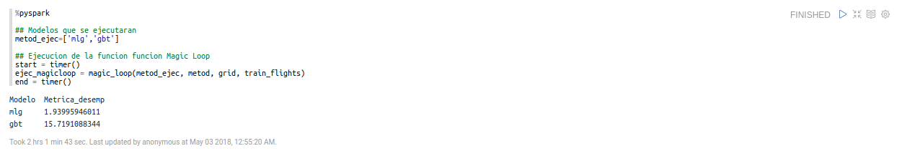
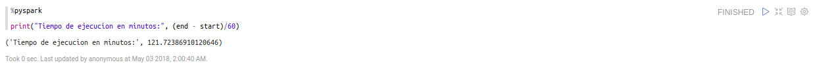
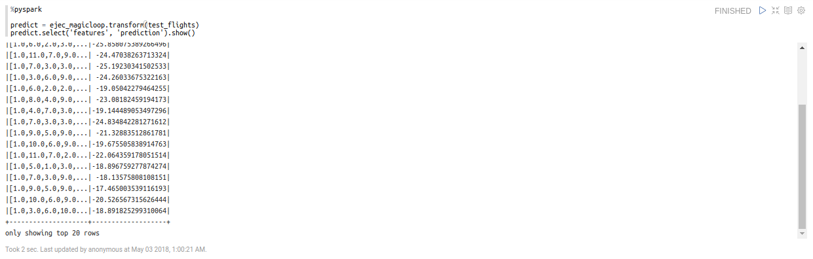
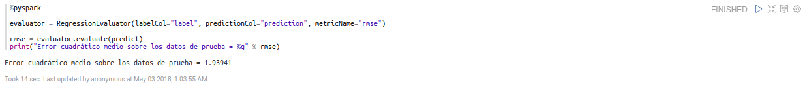
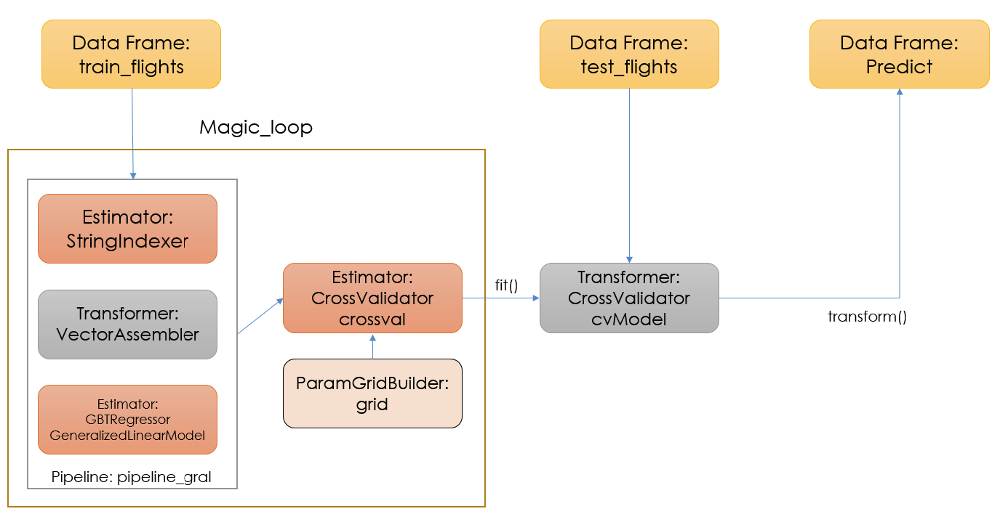
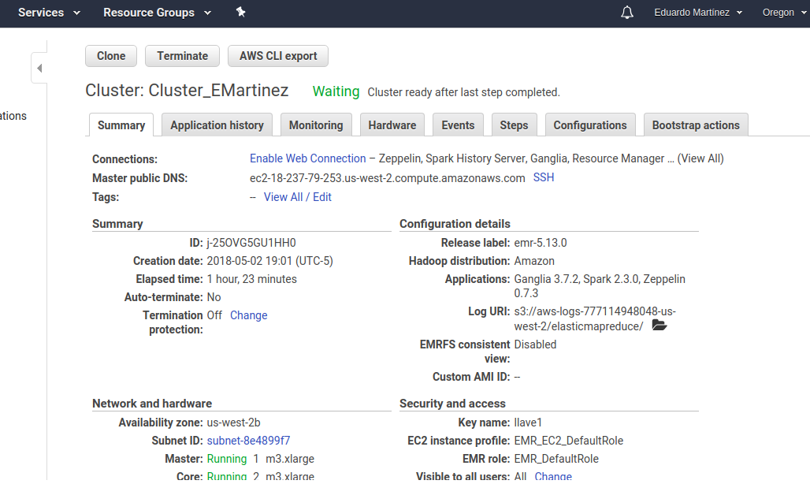
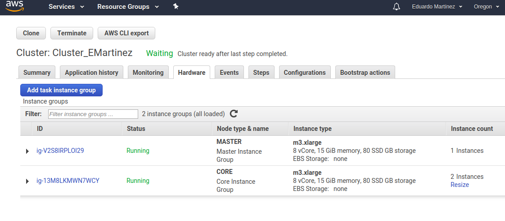
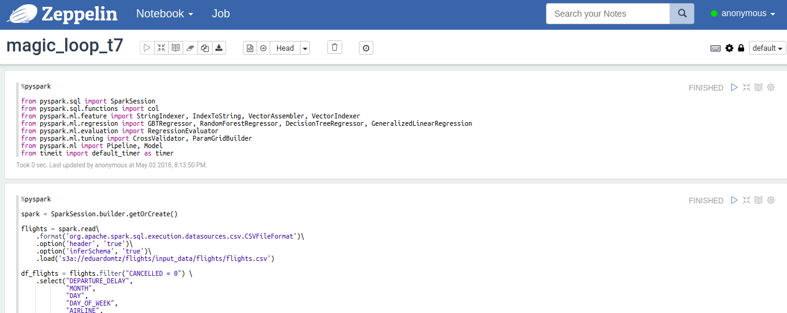

```{r setup, include=FALSE}
knitr::opts_chunk$set(echo = TRUE)
```

# Instrucciones de la tarea

Con los datos que tenemos de `flights` queremos predecir el tiempo de retraso de salida `DEPARTURE_DELAY`

+ Si requieres de hacer transformaciones a los datos, feature selection o feature engineering tendrás que hacerlos como parte de un pipeline.

+ Deberás dividir el set en entrenamiento y pruebas (70 y 30).

+ Deberás ocupar 10 como valor de $k$ en cross validation.

+ Deberás seleccionar dos algoritmos de tu preferencia para realizar la predicción. Necesitas generar un gridParamMap para modificar los parámetros de los algoritmos que seleccionaste, al menos deberás de tener tres valores diferentes en dos de los parámetros. Por ejemplo: si seleccionaste un random forest puedes modificar el número de árboles y el número de elementos mínimo para no seguir dividiendo (con tres valores diferentes).

+ Necesitas generar un magic loop para probar probar tus dos diferentes algoritmos.

+ Deberás seleccionar los mejores parámetros por algoritmo a través de un evaluador (como lo vimos en el ejemplo)

+ ¿Qué parametros resultaron mejor por algoritmo? (ver el método bestModel)

+ ¿Qué algoritmo resultó el mejor, con qué parámetros?

+ Indicar el tiempo de ejecución de la función de magic loop (ocupa python directo con la librería timeit).

# Justificaciones y soluciones

El dataset de `flights` consiste de 31 columnas

+ `YEAR` Año en el que se realizó el vuelo.

+ `MONTH`: Mes en el que se realizó el vuelo.

+ `DAY`: Día en el que se realizó el vuelo.

+ `DAY_OF_WEEK`: Día de la semana en la que se realizó el vuelo. "1" para el lunes, "2" para el martes, ..., "6" para el sábado, "7" para el domingo y "9" si se desconoce el número.

+ `AIRLINE`: Aerolínea en la que se realizó el vuelo.

+ `FLIGHT_NUMBER`: Número de vuelo. 

+ `TAIL_NUMBER`: Número de avión, i.e. ID de avión a.k.a número en la cola del avión en la que se realizó el vuelo.

+ `ORIGIN_AIRPORT`: Aeropuerto en el que se inició el vuelo.

+ `DESTINATION_AIRPORT`: Aeropuerto en el que terminó el vuelo.

+ `SCHEDULED_DEPARTURE`: Hora reloj (en formato HH:MM) a la que estaba planeada la salida del vuelo.

+ `DEPARTURE_TIME`: Hora reloj (en formato HH:MM) efectiva de la salida del vuelo.

+ `DEPARTURE_DELAY`: Minutos de diferencia entre la hora efectiva de salida y la hora de salida planeada del vuelo.

+ `TAXI_OUT`: Tiempo en minutos desde el inicio del movimiento del avión hasta que despegó.

+ `WHEELS_OFF`: Hora reloj (en formato HH:MM) en la que el avión sube las ruedas y empieza a elevarse.

+ `SCHEDULED_TIME`: Tiempo estimado de duración del viaje desde que el avión empieza a moverse hasta que el avión se detiene.

+ `ELAPSED_TIME`: Tiempo real de duración del viaje desde que el avión empieza a moverse hasta que el avión se detiene.

+ `AIR_TIME`: Tiempo real en el avión estuvo en el aire.

+ `DISTANCE`: Distancia que recorrió el avión.

+ `WHEELS_ON`: Hora reloj (en formato HH:MM) en la que el avión baja las ruedas y toca le piso.

+ `TAXI_IN`: Tiempo en minutos desde que el avión tocó tierra y el avión dejó de moverse.

+ `SCHEDULED_ARRIVAL`: Hora reloj (en formato HH:MM) estimada de llegada.

+ `ARRIVAL_TIME`: Hora reloj (en formato HH:MM) real de llegada.

+ `ARRIVAL_DELAY`: Diferencia en minutos entre la hora real de llegada y la hora estimada de llegada.

+ `DIVERTED`: Variable indicadora de desvío del vuelo: "0" si no se desvió y "1" si se desvió.

+ `CANCELLED`: Variable indicadora de cancelación del vuelo: "0" si no se canceló y "1" si se canceló.

+ `CANCELLATION_REASON`: Variable  que indica la causa de cancelación: "A" para "Carrier", "B" para "Weather", "C" para "National Air System" y "D" para "Security".

+ `AIR_SYSTEM_DELAY`: Variable indicadora "0" si no se retraso por el sistema de aire y "1" si sí.

+ `SECURITY_DELAY`: Variable indicadora "0" si no se retraso por una causa de seguridad y "1" si sí.

+ `AIRLINE_DELAY`: Variable indicadora "0" si no se retraso por causa de la aerolínea y "1" si sí.

+ `LATE_AIRCRAFT_DELAY`: Variable indicadora "0" si no se retraso por una causa de la nave y "1" si sí.

+ `WEATHER_DELAY`: Variable indicadora "0" si no se retraso por una causa climática y "1" si sí.

## Selección de variables a través de entendimiento del negocio

+ Como todos las observaciones son del año 2015, entonces se excluirá la variable `YEAR`.

+ Tampoco se considerarán las variables `FLIGHT_NUMBER` y `TAIL_NUMBER` pues son IDs cuyo valor no aporta información a la variable respuesta.

+ Como la variable `DEPARTURE_DELAY` (que es la variable respuesta en este ejercicio) es la diferencia en minutos de las variables `DEPARTURE_TIME` y `SCHEDULED_DEPARTURE` entonces no se considerarán `DEPARTURE_TIME` y `SCHEDULED_DEPARTURE`.

+ Como la variable `AIR_TIME` es la diferencia entre `WHEELS_ON` y `WHEELS_OFF`, no se considerarán `WHEELS_ON` y `WHEELS_OFF`.

+ Como la variable `ARRIVAL_DELAY` es la diferencia en minutos de las variables `ARRIVAL_TIME` y `SCHEDULED_ARRIVAL` entonces no se considerarán `ARRIVAL_TIME` y `SCHEDULED_ARRIVAL`.

+ Ya que en los vuelos cancelados no hay `DEPARTURE_DELAY` (que es la variable respuesta en este ejercicio) NO se considerará a las observaciones tales que `CANCELLED == 1`.

+ Debido a que sólo se considerarán vuelos efectivamente ocurridos y las variables `CANCELLATION_REASON`, `AIR_SYSTEM_DELAY`, `SECURITY_DELAY`, `AIRLINE_DELAY`, `LATE_AIRCRAFT_DELAY` y `WEATHER_DELAY` consideran razones por las que se cancelaron vuelos, entonces no se consdierarán estas variables.}

Entonces la variable explicativa que se considerará es `DEPARTURE_DELAY` y las variables explicativas en el modelo de aprendizaje será:

+ `MONTH`

+ `DAY`

+ `DAY_OF_WEEK`

+ `AIRLINE`

+ `ORIGIN_AIRPORT`

+ `DESTINATION_AIRPORT`

+ `TAXI_OUT`

+ `SCHEDULED_TIME`

+ `ELAPSED_TIME`

+ `AIR_TIME`

+ `DISTANCE`

+ `TAXI_IN`

+ `ARRIVAL_DELAY`

+ `DIVERTED`

Entonces con estas variables se intentará construir el modelo de ML.

+ Primero se cargarán todas las librerías necesarias (éstas no se determinaron a priori, si no conforme se fueron ocupando)

```
%pyspark

from pyspark.sql import SparkSession
from pyspark.sql.functions import col
from pyspark.ml.feature import StringIndexer, IndexToString, VectorAssembler, VectorIndexer
from pyspark.ml.regression import GBTRegressor, RandomForestRegressor, DecisionTreeRegressor, GeneralizedLinearRegression
from pyspark.ml.evaluation import RegressionEvaluator
from pyspark.ml.tuning import CrossValidator, ParamGridBuilder
from pyspark.ml import Pipeline, Model
from timeit import default_timer as timer
```

Ahora se cargarán los datos:

```
%pyspark

spark = SparkSession.builder.getOrCreate()

flights = spark.read\
    .format('org.apache.spark.sql.execution.datasources.csv.CSVFileFormat')\
    .option('header', 'true')\
    .option('inferSchema', 'true')\
    .load('s3a://eduardomtz/flights/input_data/flights/flights.csv')
```

Ahora se definirá el dataframe con las correspondientes variables y se quitarán aquellas observaciones en las que no se cuenta con la variable respuesta.

```
%pyspark

df_flights = flights.filter("CANCELLED = 0") \
    .select("DEPARTURE_DELAY",
            "MONTH", 
            "DAY",
            "DAY_OF_WEEK", 
            "AIRLINE",
            "ORIGIN_AIRPORT", 
            "DESTINATION_AIRPORT", 
            "TAXI_OUT", 
            "SCHEDULED_TIME",
            "ELAPSED_TIME", 
            "AIR_TIME", 
            "DISTANCE", 
            "TAXI_IN", 
            "ARRIVAL_DELAY",
            "DIVERTED")
            
df_flights = df_flights.na.drop(subset=["DEPARTURE_DELAY",
                                  "MONTH",
                                  "DAY",
                                  "DAY_OF_WEEK",
                                  "AIRLINE",
                                  "ORIGIN_AIRPORT", 
                                  "DESTINATION_AIRPORT", 
                                  "TAXI_OUT", 
                                  "SCHEDULED_TIME",
                                  "ELAPSED_TIME", 
                                  "AIR_TIME", 
                                  "DISTANCE", 
                                  "TAXI_IN", 
                                  "ARRIVAL_DELAY",
                                  "DIVERTED"])
                                  
df_flights = df_flights.select(col("DEPARTURE_DELAY").cast("integer").alias("label"),
                               col("MONTH").cast("integer"), 
                               col("DAY").cast("integer"),
                               col("DAY_OF_WEEK").cast("integer"), 
                               "AIRLINE",
                               "ORIGIN_AIRPORT", 
                               "DESTINATION_AIRPORT", 
                               col("TAXI_OUT").cast("integer"), 
                               col("SCHEDULED_TIME").cast("integer"), 
                               col("ELAPSED_TIME").cast("integer"), 
                               col("AIR_TIME").cast("integer"), 
                               col("DISTANCE").cast("integer"), 
                               col("TAXI_IN").cast("integer"), 
                               col("ARRIVAL_DELAY").cast("integer"),
                               col("DIVERTED").cast("integer"))
```

Una vez que se definió esto se puede ver, por ejemplo, cómo luce el dataframe:

```
%pyspark

df_flights.show()
```

Obteniéndose

```
+-----+-----+---+-----------+-------+--------------+-------------------+--------+--------------+------------+--------+--------+-------+-------------+--------+
|label|MONTH|DAY|DAY_OF_WEEK|AIRLINE|ORIGIN_AIRPORT|DESTINATION_AIRPORT|TAXI_OUT|SCHEDULED_TIME|ELAPSED_TIME|AIR_TIME|DISTANCE|TAXI_IN|ARRIVAL_DELAY|DIVERTED|
+-----+-----+---+-----------+-------+--------------+-------------------+--------+--------------+------------+--------+--------+-------+-------------+--------+
|  -11|    1|  1|          4|     AS|           ANC|                SEA|      21|           205|         194|     169|    1448|      4|          -22|       0|
|   -8|    1|  1|          4|     AA|           LAX|                PBI|      12|           280|         279|     263|    2330|      4|           -9|       0|
|   -2|    1|  1|          4|     US|           SFO|                CLT|      16|           286|         293|     266|    2296|     11|            5|       0|
|   -5|    1|  1|          4|     AA|           LAX|                MIA|      15|           285|         281|     258|    2342|      8|           -9|       0|
|   -1|    1|  1|          4|     AS|           SEA|                ANC|      11|           235|         215|     199|    1448|      5|          -21|       0|
|   -5|    1|  1|          4|     DL|           SFO|                MSP|      18|           217|         230|     206|    1589|      6|            8|       0|
|   -6|    1|  1|          4|     NK|           LAS|                MSP|      11|           181|         170|     154|    1299|      5|          -17|       0|
|   14|    1|  1|          4|     US|           LAX|                CLT|      13|           273|         249|     228|    2125|      8|          -10|       0|
|  -11|    1|  1|          4|     AA|           SFO|                DFW|      17|           195|         193|     173|    1464|      3|          -13|       0|
|    3|    1|  1|          4|     DL|           LAS|                ATL|      12|           221|         203|     186|    1747|      5|          -15|       0|
|   -6|    1|  1|          4|     DL|           DEN|                ATL|      12|           173|         149|     133|    1199|      4|          -30|       0|
|   -8|    1|  1|          4|     AA|           LAS|                MIA|      21|           268|         266|     238|    2174|      7|          -10|       0|
|    0|    1|  1|          4|     DL|           LAX|                MSP|      18|           214|         210|     188|    1535|      4|           -4|       0|
|   -6|    1|  1|          4|     DL|           SLC|                ATL|      18|           215|         199|     176|    1590|      5|          -22|       0|
|   -1|    1|  1|          4|     DL|           SEA|                MSP|      28|           189|         198|     166|    1399|      4|            8|       0|
|   -4|    1|  1|          4|     AS|           ANC|                SEA|      17|           204|         194|     173|    1448|      4|          -14|       0|
|  -14|    1|  1|          4|     DL|           ANC|                SEA|      25|           210|         200|     171|    1448|      4|          -24|       0|
|   -6|    1|  1|          4|     UA|           SFO|                IAH|      11|           218|         217|     199|    1635|      7|           -7|       0|
|   -4|    1|  1|          4|     AS|           ANC|                PDX|      11|           215|         201|     187|    1542|      3|          -18|       0|
|   -5|    1|  1|          4|     DL|           PDX|                MSP|       9|           193|         186|     171|    1426|      6|          -12|       0|
+-----+-----+---+-----------+-------+--------------+-------------------+--------+--------------+------------+--------+--------+-------+-------------+--------+
only showing top 20 rows
```

A continuación se hará la división entre muestras de entrenamiento y de prueba.

```
%pyspark

train_flights, test_flights = df_flights.randomSplit([0.7, 0.3])
```

Obteniéndose por ejemplo,

```
%pyspark

print("Número de registros de entrenamiento: " + str(train_flights.count()))
print("Número de registros de prueba: " + str(test_flights.count()))
```

```
Número de registros de entrenamiento: 4001038
Número de registros de prueba: 1712970
```

Como las variables `AIRLINE`, `ORIGIN_AIRPORT` y `DESTINATION_AIRPORT` son tipo cadena de caracteres, se necesitan convertir a numéricas de manera razonada: con la función `StringIndexer`. La función `StringIndexer` convierte una columna de cadenas de caracteres a una columna de índices (etiquetas numéricas). Los índices están en [0, número de etiquetas) y se ordenan por frecuencia, i.e. la etiqueta/cadena de caracteres más frecuente tiene el índice 0.

```
%pyspark

aerolin_indexada = StringIndexer(inputCol="AIRLINE", outputCol="AIRLINE_NUM").setHandleInvalid("skip")
origen_indexada = StringIndexer(inputCol="ORIGIN_AIRPORT", outputCol="ORIGIN_AIRPORT_NUM").setHandleInvalid("skip")
destino_indexada = StringIndexer(inputCol="DESTINATION_AIRPORT", outputCol="DESTINATION_AIRPORT_NUM").setHandleInvalid("skip")
vectorAssembler_features = VectorAssembler(inputCols=["MONTH",
                                                      "DAY",
                                                      "DAY_OF_WEEK",
                                                      "AIRLINE_NUM",
                                                      "ORIGIN_AIRPORT_NUM",
                                                      "DESTINATION_AIRPORT_NUM",
                                                      "TAXI_OUT",
                                                      "SCHEDULED_TIME",
                                                      "ELAPSED_TIME",
                                                      "AIR_TIME",
                                                      "DISTANCE",
                                                      "TAXI_IN", 
                                                      "ARRIVAL_DELAY",
                                                      "DIVERTED"],
                                            outputCol="features")
```

## Modelos a considerar

Se considerarán los modelos de regresión:

+ Gradient-boosted tree regression
+ Modelo lineal generalizado


```
GBTRegressor(labelCol="label", featuresCol="features", maxBins = 640)
GeneralizedLinearRegression(labelCol="label", featuresCol="features", family="gaussian", link="identity")
```

Se definirá un grid de hiperparámetros para hacer evaluaciones de:

+ Para el modelo lineal generalizado: `maxIter` (el número máximo de iteraciones) y `regParam` (el parámetro de regularización).

+ Para el Gradient-boosted tree regression: `maxIter` (número de árboles en cada ensamblaje GBT) y `maxDepth` (máxima profundidad en cada árbol de decisión en el ensamblaje GBT).

```
%pyspark

metod = {
    'gbt': GBTRegressor(labelCol="label", featuresCol="features", maxBins = 640),
	'mlg': GeneralizedLinearRegression(labelCol="label", featuresCol="features", family="gaussian", link="identity")
}

grid = {
    'gbt': ParamGridBuilder() \
        .addGrid(metod['gbt'].maxDepth, [2, 5, 7])\
        .addGrid(metod['gbt'].maxIter, [3, 5, 9])\
        .build(),
    
    'mlg': ParamGridBuilder() \
        .addGrid(metod['mlg'].regParam, [0.1, 0.3, 0.5])\
        .addGrid(metod['mlg'].maxIter, [3, 5, 9])\
        .build()
}
```

Y se implementará una función que recorra ambos modelos con tres combinaciones de parámetros diferentes:

```
%pyspark

def magic_loop(metod_ejec, metod, grid, train):
    ## Parametros:
    ## metod_ejec: Lista de modelos a ejecutar
    ## metod: Diccionario de modelos que se consideraran
    ## grid: ParamGrid con los parametros de los modelos a considerar
    ## train: datos de entrenamiento
    
    ## Se inicializan variables
    mejor_score = 0
    mejor_modelo = ''
    
    print("Modelo\tMetrica_desemp")
    
    for index, mdl in enumerate([metod[x] for x in metod_ejec]):

        pipeline_gral = Pipeline(stages=[aerolin_indexada,                                      
                                       origen_indexada,
                                       destino_indexada,
                                       vectorAssembler_features,
                                       mdl])

        crossval = CrossValidator(estimator=pipeline_gral,
                                  estimatorParamMaps=grid[metod_ejec[index]],
                                  evaluator=RegressionEvaluator(),
                                  numFolds=10)       

        cvModel = crossval.fit(train)

        print("{}\t{}".format(metod_ejec[index], cvModel.avgMetrics[0]))
    
        ## Se condiciona a seleccionar entre los modelos el mejor entre los modelos probados:
        if (mejor_score == 0) or (cvModel.avgMetrics[0] < mejor_score):
            mejor_score = cvModel.avgMetrics[0]
            mejor_modelo = cvModel
            
    return mejor_modelo
```

Y la ejecución de dicha rutina:

```
%pyspark

## Modelos que se ejecutaran
metod_ejec=['mlg','gbt']

## Ejecucion de la funcion funcion Magic Loop
start = timer()
ejec_magicloop = magic_loop(metod_ejec, metod, grid, train_flights)
end = timer()
```

Obteniéndose

```
Modelo	Metrica_desemp
mlg	1.93995946011
gbt	15.7191088344
```



El tiempo en el que se llevó a cabo este magic_loop se puede obtener como:

```
%pyspark

print("Tiempo de ejecucion en minutos:", (end - start)/60)
```

obteniéndose

```
('Tiempo de ejecucion en minutos:', 121.72386910120646)
```



Cuyo desempeño (error cuadrático medio) se obtiene mediante:

```
%pyspark

ejec_magicloop.avgMetrics[0]
```

obteniéndose

```
1.9399594601144243
```

Las predicciones se pueden obtener a partir de

```
%pyspark

predict = ejec_magicloop.transform(test_flights)
predict.select('features', 'prediction').show()
```

es decir

```
+--------------------+-------------------+
|            features|         prediction|
+--------------------+-------------------+
|[1.0,11.0,7.0,9.0...|  -36.8819235014684|
|[1.0,6.0,2.0,3.0,...| -35.94342573429189|
|[1.0,10.0,6.0,9.0...|-29.045780694154047|
|[1.0,2.0,5.0,9.0,...|-25.815939876304025|
|[1.0,6.0,2.0,3.0,...|-25.858075389266496|
|[1.0,11.0,7.0,9.0...| -24.47038263713324|
|[1.0,7.0,3.0,3.0,...| -25.19230341502533|
|[1.0,3.0,6.0,9.0,...| -24.26033675322163|
|[1.0,6.0,2.0,2.0,...| -19.05042279464255|
|[1.0,8.0,4.0,9.0,...| -23.08182459194173|
|[1.0,4.0,7.0,3.0,...|-19.144489053497296|
|[1.0,7.0,3.0,3.0,...|-24.834842281271612|
|[1.0,9.0,5.0,9.0,...| -21.32883512861781|
|[1.0,10.0,6.0,9.0...|-19.675505838914763|
|[1.0,11.0,7.0,2.0...|-22.064359178051514|
|[1.0,5.0,1.0,3.0,...|-18.896759277874274|
|[1.0,7.0,3.0,9.0,...| -18.13575808108151|
|[1.0,9.0,5.0,9.0,...|-17.465003539116193|
|[1.0,10.0,6.0,9.0...|-20.526567315626444|
|[1.0,3.0,6.0,10.0...|-18.891825299310064|
+--------------------+-------------------+
only showing top 20 rows
```



Finalmente, se puede obtener el desempeño (error cuadrático medio) sobre el conjunto de prueba:

```
%pyspark

evaluator = RegressionEvaluator(labelCol="label", predictionCol="prediction", metricName="rmse")

rmse = evaluator.evaluate(predict)
print("Error cuadrático medio sobre los datos de prueba = %g" % rmse)
```

obteniéndose

```
Error cuadrático medio sobre los datos de prueba = 1.93941
```



Esta rutina se puede representar mediante el siguiente diagrama:



# Anexos

## Clúster





## Zeppelin

