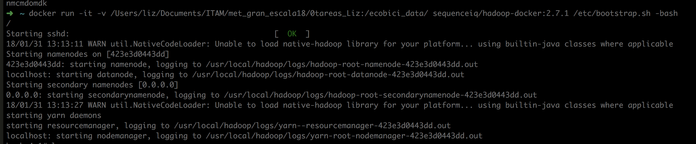
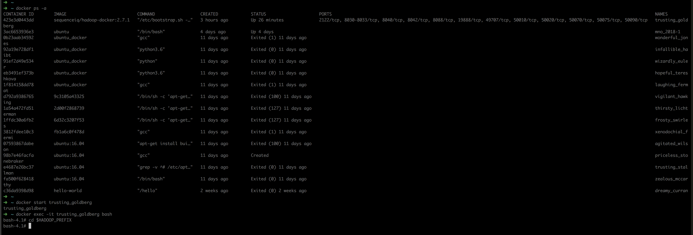
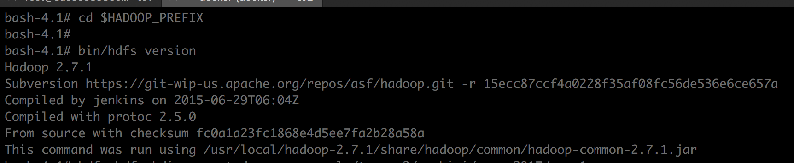
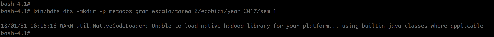
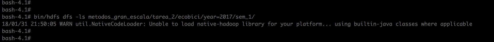
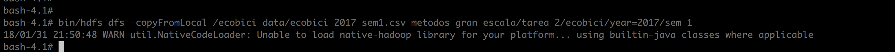
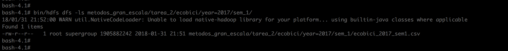
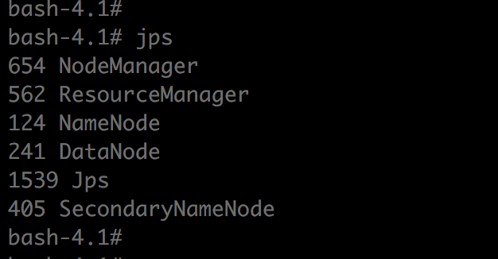
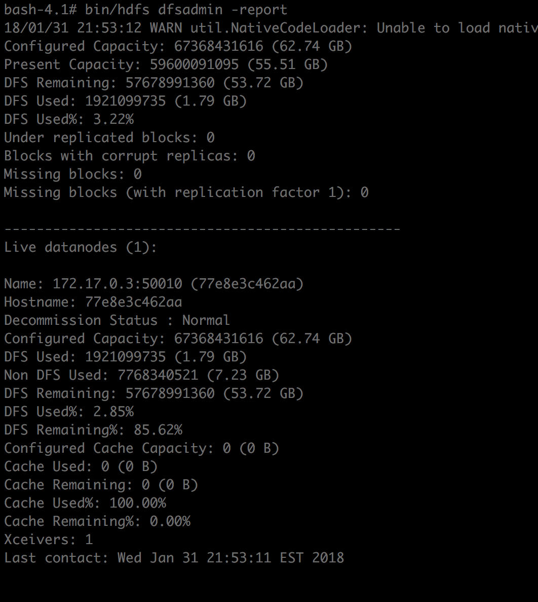
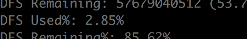

## Docker con Ubuntu y Hadoop

+ Con base en la siguiente liga obtuvimos la imagen y el contenedor de Docker: [url de docker](https://github.com/sequenceiq/hadoop-docker)

+ Dockerfile: se encuentra en la carpeta y [aqui](https://github.com/sequenceiq/hadoop-docker/blob/master/Dockerfile)

+ Comando para imagen, volumen de docker

```
docker run -it -v /Users/liz/Documents/ITAM/met_gran_escala18/0tareas_Liz:/ecobici_data/ sequenceiq/hadoop-docker:2.7.1 /etc/bootstrap.sh -bash
```




    
+ *Nota: en caso de que hayamos salido del docker podemos regresar  con los siguientes comandos, puesto que creamos el volumen* 

    - Obtener el id, en nuestro caso es *trusting_goldberg* con `docker ps -a` 
    - Lo inicializamos nuevamente `docker start trusting_goldberg`
    - Devolvemos la consola *bash* en ese contenedor `docker exec -it trusting_goldberg bash`
    - Cambiamos el directorio para ejecutar Hadoop o hdfs: `cd $HADOOP_PREFIX`
    



### Versión de Hadoop

```
bin/hdfs version
```    

    

### Crear el directorio `metodos_gran_escala/tarea_2/ecobici/year=2017/sem_1/` con `mkdir` verifica la opción `-p`

```
bin/hdfs dfs -mkdir -p metodos_gran_escala/tarea_2/ecobici/year=2017/sem_1
```




### Muestra que el directorio está vacío -no hay datos cargados- con `ls`

```
bin/hdfs dfs -ls metodos_gran_escala/tarea_2/ecobici/year=2017/sem_1/
```




### Carga los datos a este directorio que creaste ocupando `copyFromLocal`

```
bin/hdfs dfs -copyFromLocal /ecobici_data/ecobici_2017_sem1.csv metodos_gran_escala/tarea_2/ecobici/year=2017/sem_1
```


### Muestra que los datos están cargados haciendo un `ls`

```
bin/hdfs dfs -ls metodos_gran_escala/tarea_2/ecobici/year=2017/sem_1/
```


### Muestra que el *NameNode*, *DataNode*, *ResourceManager* y el *NodeManager* están activos en tu clúster de Hadoop con `jps`

```
jps 
```



### Muestra la salida del reporte generado con `dfsadmin report`

```
bin/hdfs dfsadmin -report
```




### ¿Cuál es el % de DFS utilizado una vez que ya subiste los datos?
  2.85 %
  


  


