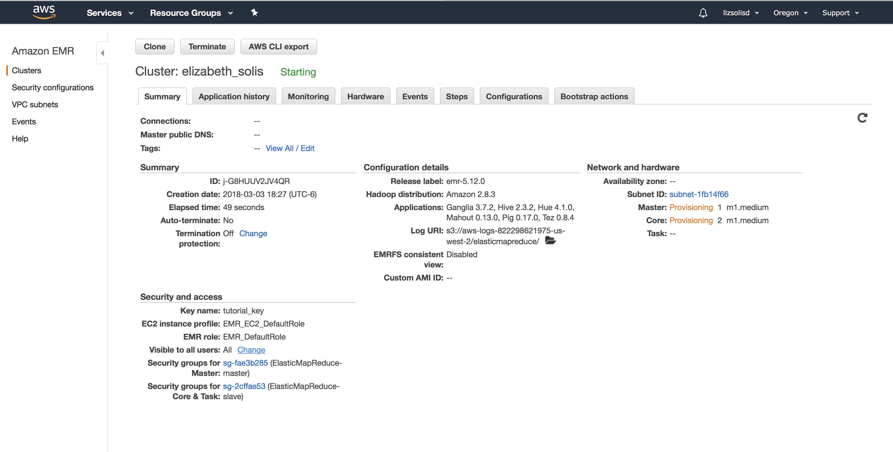
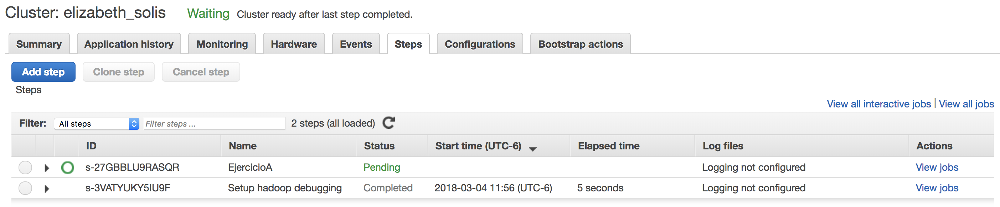
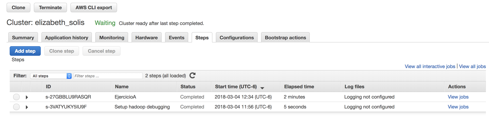
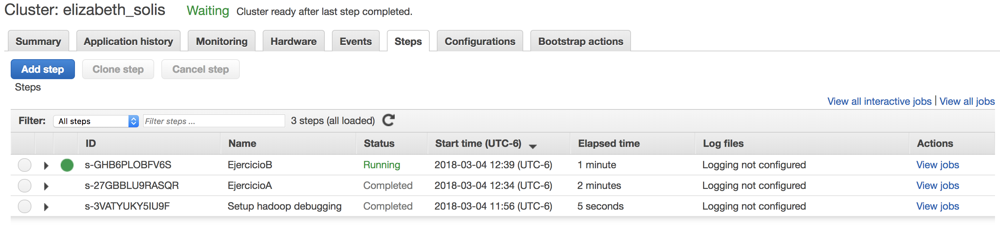
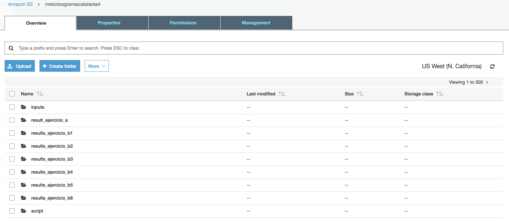

```{r setup, include=FALSE}
knitr::opts_chunk$set(echo = TRUE)
```


## Clúster de AWS 



## Ejercicio A.

Modifica el ejercicio de Rank para que en lugar de obtener el id del producto con mejor rank obtengamos el nombre del producto -requieres un join- con el mejor rank

### Evidencia del ejercicio a:


+ **Inicialización**   





+ **Completado**   





+ Lectura de datos del bucket


```
productos = load 's3://metodosgranescalatarea4/inputs/products.csv' using PigStorage(',') as (productid:chararray, productname:chararray, supplierid:chararray, categoryid:chararray, quantityperunit:int, unitprice:float, unitsinstock:int, unitsonorder:int, reorderlevel:int, discounted:int);
ordenes = load 's3://metodosgranescalatarea4/inputs/order_details.csv' using PigStorage(',') as (orderid:chararray,productid:chararray,unitprice:float,quantity:int, discount:float);
```

+ Modificamos y guardamos la consulta en un archivo Pig para que pueda ser ejecutado por el cluster

```
ordenes_agrupadas = group ordenes by productid;
cuenta_de_productos = FOREACH ordenes_agrupadas GENERATE group as productid,COUNT($1) as n;
ordenes_unidas = JOIN cuenta_de_productos by productid, productos by productid;
lista_ordenada = rank ordenes_unidas by n DESC;
rango_limitado = limit lista_ordenada 1;
resultado = FOREACH rango_limitado generate $0 as lugar, $1 as productid, $4 as nombre_de_producto, $2 as total_ordenes;
store resultado into 's3://metodosgranescalatarea4/result_ejercicio_a/' using PigStorage(',', '-schema');  
```

**Nota**: los 2 bloques de código van juntos en un archivo pig para que pueda ser incluido como un Step del cluster.

+ Resultados

```
1,59,Raclette Courdavault,54
```


##Ejercicio B.
Con los datos de aerolíneas, vuelos y aeropuertos que se encuentran en el dropbox y utilizando Pig contesta las siguietnes preguntas:
(la lectura de los datos se realiza con estas instrucciones en el script de pig)


### Evidencia del ejercicio b:

+ **Inicialización**   





+ **Completado**   


+ Lectura de datos del bucket

```
airlines = load 's3://metodosgranescalatarea4/inputs/airlines.csv'  using PigStorage(',') as (iata_code:chararray,airline:chararray);

airports = load 's3://metodosgranescalatarea4/inputs/airports.csv' using PigStorage(',') as (iata_code:chararray,	airport:chararray,	city:chararray,	state:chararray,	country:chararray,	latitude:float,	longitude:float); 

flights = load 's3://metodosgranescalatarea4/inputs/flights.csv' using PigStorage(',') as (year:int, month:int, day:int,	day_of_week:int,	airline:chararray,	flight_number:int,	tail_number:chararray,	origin_airport:chararray,	destination_airport:chararray,	scheduled_departure:int,	departure_time:int,	departure_delay:int, taxi_out:int,	wheels_off:int,	scheduled_time:int,	elapsed_time:int,	air_time:int,	distance:int,	wheels_on:int,	taxi_in:int,	scheduled_arrival:int, arrival_time:int,	arrival_delay:int,	diverted:int,	cancelled:int,	cancellation_reason:chararray,	air_system_delay:chararray,	security_delay:chararray,	airline_delay:chararray,	late_aircraft_delay:chararray,	weather_delay:chararray);
```


### 1.-¿Cuántos vuelos existen en el dataset cuyo aeropuerto destino sea el “Honolulu International Airport”?


+ Código:

```
/* Ejercicio b1 */
aeropuerto_hono = filter aeropuertos by airport in ('Honolulu International Airport');
formato_hono = FOREACH aeropuerto_hono generate iata_code, airport;
vuelos_hono = JOIN flights BY destination_airport, formato_hono BY iata_code;
vuelos_hono_agrupados = GROUP vuelos_hono ALL;
result_ejercicio1 = FOREACH vuelos_hono_agrupados GENERATE COUNT(vuelos_hono);
store result_ejercicio1 into 's3://metodosgranescalatarea4/results_ejercicio_b1/' using PigStorage(',', '-schema');
```

+ Resultado:

```
43157
```


### 2.-¿Cuál es el vuelo con más retraso? ¿De qué aerolínea es?

+ Código:

```
/* Ejercicio b2*/
retrasos_de_llegada = ORDER flights BY arrival_delay DESC;
retrasos_ordenados = FOREACH retrasos_de_llegada GENERATE airline as airline_code, flight_number, arrival_delay;
retrasos_top1 = limit retrasos_ordenados 1;
result_ejercicio2 = JOIN retrasos_top1 by airline_code,airlines by iata_code;
store result_ejercicio2 into 's3://metodosgranescalatarea4/results_ejercicio_b2/' using PigStorage(',', '-schema');
```

+ Resultado:

```
AA,1322,1971,AA,American Airlines Inc.
```


### 3.-¿Qué día es en el que más vuelos cancelados hay?

+ Código:

```
/*Ejercicio b3*/
cancelados = filter flights by cancelled == 1;
solo_dia = FOREACH cancelados GENERATE day_of_week, cancelled;
agrupado_por_dia = GROUP solo_dia by day_of_week;
cuenta_por_dia = FOREACH agrupado_por_dia GENERATE group as day_of_week, COUNT($1) as n;
result_ejercicio3 = rank cuenta_por_dia by n DESC;
result_ej3 = limit result_ejercicio3 1;
store result_ej3 into 's3://metodosgranescalatarea4/results_ejercicio_b3/' using PigStorage(',', '-schema');
```

+ Resultado:

```
1,1,21073
```


### 4.-¿Cuáles son los aeropuertos orígen con 17 cancelaciones?

+ Código: 

```
/*Ejercicio b4*/
cancelados_por_aeropuerto = FOREACH cancelados GENERATE origin_airport, cancelled;
grupo_de_cancelados = GROUP cancelados_por_aeropuerto by origin_airport;
suma_de_cancelados = FOREACH grupo_de_cancelados GENERATE group as origin_airport, COUNT($1) as n;
cancelados_de_17 = filter suma_de_cancelados by n == 17;
cancelados_unidos = JOIN cancelados_de_17 by origin_airport, aeropuertos by iata_code;
result_ejercicio4 = FOREACH cancelados_unidos GENERATE iata_code, airport, n;
store result_ejercicio4 into 's3://metodosgranescalatarea4/results_ejercicio_b4/' using PigStorage(',', '-schema');
```

+ Resultado:

```
DHN,Dothan Regional Airport,17
DIK,Dickinson Theodore Roosevelt Regional Airport,17
ESC,Delta County Airport,17
```


### 5.-¿Cuál es el aeropuerto origen con más vuelos cancelados?

+ Código: 

```
/*Ejercicio b5*/
cancelados_unidos = JOIN suma_de_cancelados by origin_airport, aeropuertos by iata_code;
cancelados_ordenados = ORDER cancelados_unidos by n DESC;
result_ejercicio5 = limit cancelados_ordenados 1;
store result_ejercicio5 into 's3://metodosgranescalatarea4/results_ejercicio_b5/' using PigStorage(',', '-schema');
```

+ Resultado:

```
ORD,8548,ORD,Chicago O'Hare International Airport,Chicago,IL,USA,41.9796,-87.90446
```


### 6.-¿Cuál es el vuelo (flight number) con mayor diversidad de aeropuertos destino, cuáles son estos destinos? (ocupar bag te ayudará en esta pregunta)

+ Código: 

```
/*Ejercicio b6*/
destinos = FOREACH flights GENERATE flight_number, destination_airport;
destinos_unicos = distinct destinos;
informacion_aeropuertos = FOREACH aeropuertos GENERATE iata_code,airport;
vuelos_agrupados = GROUP destinos by flight_number;
aeropuertos_unicos = FOREACH vuelos_agrupados {dst = destinos.destination_airport; unique_airport = distinct dst; GENERATE group as flight_number, COUNT(unique_airport) as n;};
mayores_destinos = ORDER aeropuertos_unicos by n DESC;
mayor_destino = limit mayores_destinos 1;
mayor_destino_iata = JOIN mayor_destino by flight_number,destinos_unicos by flight_number; 
mayor_destino_vuelos = JOIN mayor_destino_iata by $3,aeropuertos by iata_code;
result_ejercicio6 = FOREACH mayor_destino_vuelos GENERATE $0 as flightnumber,$1 as flights_quantity,$3 as iata_code, $5 as airline; 
store result_ejercicio6 into 's3://metodosgranescalatarea4/results_ejercicio_b6/' using PigStorage(',', '-schema');
```

+ Resultado:

```
202,68,ATL,Hartsfield-Jackson Atlanta International Airport
202,68,AUS,Austin-Bergstrom International Airport
202,68,BDL,Bradley International Airport
202,68,BNA,Nashville International Airport
202,68,BOS,Gen. Edward Lawrence Logan International Airport
202,68,BWI,Baltimore-Washington International Airport
202,68,CAK,Akron-Canton Regional Airport
202,68,CLE,Cleveland Hopkins International Airport
202,68,DCA,Ronald Reagan Washington National Airport
202,68,DEN,Denver International Airport
202,68,DTW,Detroit Metropolitan Airport
202,68,EWR,Newark Liberty International Airport
202,68,FLL,Fort Lauderdale-Hollywood International Airport
202,68,FNT,Bishop International Airport
202,68,IAD,Washington Dulles International Airport
202,68,IAH,George Bush Intercontinental Airport
202,68,IND,Indianapolis International Airport
202,68,ITO,Hilo International Airport
202,68,JFK,John F. Kennedy International Airport (New York International Airport)
202,68,LAS,McCarran International Airport
202,68,LAX,Los Angeles International Airport
202,68,LGA,LaGuardia Airport (Marine Air Terminal)
202,68,MCO,Orlando International Airport
202,68,MDW,Chicago Midway International Airport
202,68,MKE,General Mitchell International Airport
202,68,MSN,Dane County Regional Airport
202,68,MSP,Minneapolis-Saint Paul International Airport
202,68,OAK,Oakland International Airport
202,68,OGG,Kahului Airport
202,68,OKC,Will Rogers World Airport
202,68,ORD,Chicago O'Hare International Airport
202,68,PDX,Portland International Airport
202,68,PHL,Philadelphia International Airport
202,68,PHX,Phoenix Sky Harbor International Airport
202,68,PIT,Pittsburgh International Airport
202,68,RDU,Raleigh-Durham International Airport
202,68,RNO,Reno/Tahoe International Airport
202,68,RSW,Southwest Florida International Airport
202,68,SAN,San Diego International Airport (Lindbergh Field)
202,68,SAT,San Antonio International Airport
202,68,SEA,Seattle-Tacoma International Airport
202,68,SFO,San Francisco International Airport
202,68,SLC,Salt Lake City International Airport
202,68,SMF,Sacramento International Airport
202,68,TPA,Tampa International Airport
```


### Carpetas generadas en el bucket S3 para la tarea 4 (todos los incisos)

+ Los resultados del proceso se generan en una carpeta del bucket s3 




