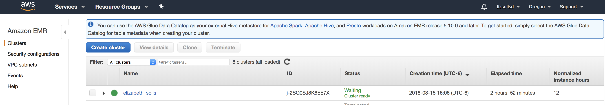
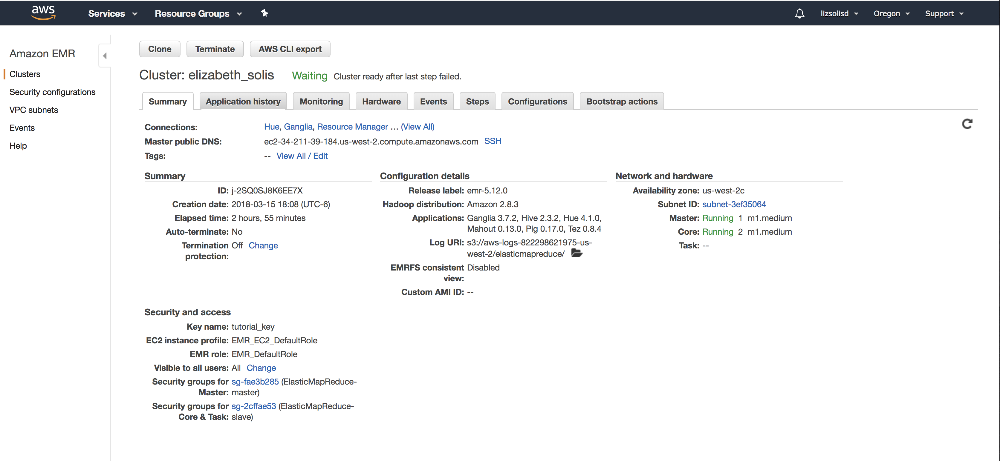
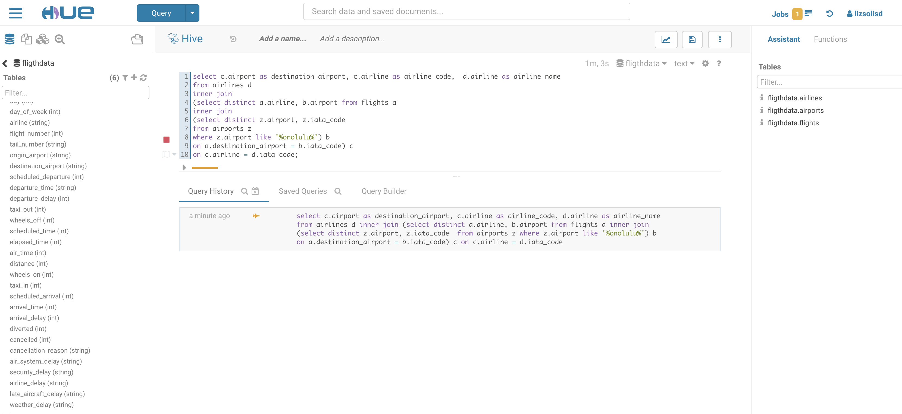
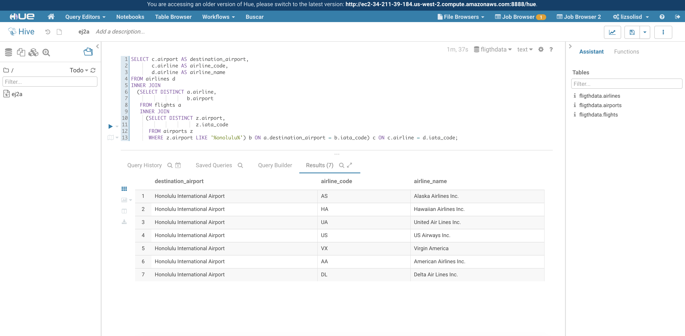

## Elizabeth Solis Díaz

### Ejercicio 1. Con la base de datos de northwind que se encuentran en el dropbox:

**1.a.1)** ¿Cuántos “jefes” hay en la tabla empleados?
```
select count(*) as num_jefes_distintos
from (
select distinct a.reportsto 
from employees a 
where a.reportsto IS NOT NULL) b;
```

**1.a.2)** ¿Cuáles son estos jefes: 
número de empleado, nombre, apellido, título, fecha de nacimiento, 
fecha en que iniciaron en la empresa, ciudad y país? 
(atributo reportsto, ocupa explode en tu respuesta)


```
create table northwind.aux_explode as 
select *
from 
(select employeeid, firstname, lastname, title, birthdate, hiredate, city, count(*) over () n_freq 
from employees where employeeid
in (select distinct reportsto from employees)) a
left join (select reportsto, collect_set(firstname) as subordinates from employees group by reportsto) b 
on  a.employeeid = b.reportsto;


select * from northwind.aux_explode 
LATERAL VIEW explode(subordinates) subordinates_a as subordinates_b;
```


**1.b)** ¿Quién es el segundo “mejor” empleado que más órdenes ha generado? 
(nombre, apellido, título, cuándo entró a la compañía, número de 
órdenes generadas, número de órdenes generadas por el mejor empleado (número 1))

+ Con el siguiente código obtenemos los 2 mejores empleados y su infomación: 
el máximo es 156 y el segundo mejor empleado tuvo 127

```
select a.lastname, a.firstname, a.title, a.hiredate, c.*
from employees as a
inner join 
	(select z.employeeid, count(*) as cnt_orders
	from orders z
	group by z.employeeid
	order by cnt_orders desc
	limit 2) c
on a.employeeid = c.employeeid;   
```

**1.c)** ¿Cuál es el delta de tiempo más grande entre una orden y otra?

```
select a.orderid, a.orderdate, datediff(a.orderdate, a.date2) as delta 
from 
(select z.orderid, z.orderdate, lag(z.orderdate) OVER(ORDER BY z.orderid) as date2 FROM orders z) a
order by delta desc limit 1;
```

### Ejercicio 2.  Con los archivos de vuelos, aeropuertos y aerolíneas que están en el dropbox

**2.a)** ¿Qué aerolíneas (nombres) llegan al aeropuerto “Honolulu International Airport”?

```
select c.airport as destination_airport, c.airline as airline_code,  d.airline as airline_name 
from airlines d
inner join
(select distinct a.airline, b.airport from flights a
inner join 
(select distinct z.airport, z.iata_code 
from airports z
where z.airport like '%onolulu%') b
on a.destination_airport = b.iata_code) c
on c.airline = d.iata_code;
```

**2.b)** ¿En qué horario (hora del día, no importan los minutos) hay 
salidas del aeropuerto de San Francisco (“SFO”) a “Honolulu International Airport”?

+ Si consideramos la hora real en la cual sale el vuelo:

```
select distinct substr(z.departure_time,1,2) as hora
from flights z
where z.origin_airport = 'SFO' 
and z.destination_airport = 'HNL'
order by hora;
```

+ Si consideramos la hora (agendada/esperada) en la cual sale el vuelo:

```
select distinct substr(z.scheduled_departure,1,2) as hora
from flights z
where z.origin_airport = 'SFO' 
and z.destination_airport = 'HNL'
order by hora;
```


**2.c** ¿Qué día de la semana y en qué aerolínea nos conviene viajar a 
“Honolulu International Airport” para tener el menor retraso posible?

```
select a.airline, b.day_of_week, avg(b.departure_delay) as mean_delay
from
flights b join airports c
on b.destination_airport = c.iata_code
join airlines a
on b.airline=a.iata_code
where c.airport like '%onolulu%'
group by a.airline, b.day_of_week
having mean_delay > 0
order by  mean_delay
limit 1;
```

**2.d** ¿Cuál es el aeropuerto con mayor tráfico de entrada?

```
select b.airport, a.* 
from airports b
inner join
(select z.destination_airport, count(*) as freq
from flights z
group by z.destination_airport
order by freq desc
limit 1) a
on a.destination_airport = b.iata_code
;
```


**2.e** ¿Cuál es la aerolínea con mayor retraso de salida por día de la semana?

```
select aa.day_of_week, aa.max_delay, b.airline from
(select z.day_of_week, max(z.del_calc) as max_delay 
from (
select a.day_of_week, a.airline, max(a.mean_delay) as del_calc 
from (
select day_of_week, airline, avg(departure_delay) as mean_delay 
from flights
group by airline, day_of_week
order by mean_delay desc) a
group by day_of_week, airline
order by del_calc desc
) z
group by day_of_week) aa
left outer join
(select day_of_week, airline, avg(departure_delay) as mean_delay 
from flights
group by airline, day_of_week
order by mean_delay desc) b ON
aa.max_delay = b.mean_delay;
```

**2.f** ¿Cuál es la tercer aerolínea con menor retraso de salida los lunes (day of week = 2)?

+ Aquí haremos el supuesto dado que hubo retraso (solo consideraremos los positivos) con base en lo comentado en `slack`

```
select b.iata_code, b.airline, a.mean_dep_delay from (
select z.airline, avg(z.departure_delay) as mean_dep_delay
from flights z
where z.day_of_week = 2
and z.departure_delay > 0
group by z.airline
order by mean_dep_delay
limit 3) a
left join 
airlines b
on a.airline = b.iata_code
order by a.mean_dep_delay desc
limit 1;
```

**2.g** ¿Cuál es el aeropuerto origen que llega a la mayor cantidad de aeropuertos destino 
diferentes?

```
select a.airport 
from airports a 
where a.iata_code in (select d.origin_airport from (
select z.origin_airport, count(distinct z.destination_airport) as freq
from flights z
group by z.origin_airport
order by freq desc
limit 1) d)
;
```


### Evidencias










