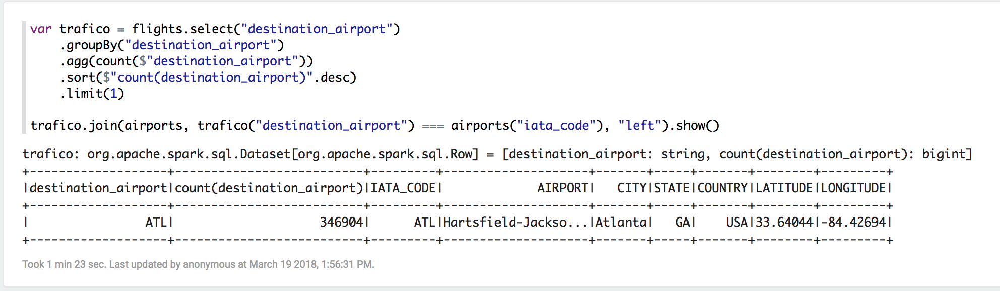

### Evidencia del cluster


### Cargamos archivos


```{spark, eval = FALSE}
// Inicializamos Spark Session
val spark = org.apache.spark.sql.SparkSession.builder
        .master("spark://master:7077")
        .appName("Spark CSV Reader")
        .getOrCreate;

//Leemos archivo de orders
val orders = spark.read
         .format("csv")
         .option("header", "true") //reading the headers
         .option("mode", "DROPMALFORMED")
         .load("s3a://metodosgranescalatarea4/fligths_files/orders.csv")
         
//Leemos archivo de employees
val employees = spark.read
         .format("csv")
         .option("header", "true") //reading the headers
         .option("mode", "DROPMALFORMED")
         .load("s3a://metodosgranescalatarea4/fligths_files/employees.csv")
         
//Leemos archivo de airlines
val airlines = spark.read
         .format("csv")
         .option("header", "true") //reading the headers
         .option("mode", "DROPMALFORMED")
         .load("s3a://metodosgranescalatarea4/fligths_files/airlines.csv")
         
//Leemos archivo de airports
val airports = spark.read
         .format("csv")
         .option("header", "true") //reading the headers
         .option("mode", "DROPMALFORMED")
         .load("s3a://metodosgranescalatarea4/fligths_files/airports.csv")
         
//Leemos archivo de flights
val flights = spark.read
         .format("csv")
         .option("header", "true") //reading the headers
         .option("mode", "DROPMALFORMED")
         .load("s3a://metodosgranescalatarea4/fligths_files/flights.csv")
```


### Ejercicio 1. Con la base de datos de northwind que se encuentran en el dropbox:

**1.a.1)** ¿Cuántos “jefes” hay en la tabla empleados?
```{spark}
// **1.a.1)** ¿Cuántos “jefes” hay en la tabla empleados?
val ej1a1 = employees
    .select("reportsto")
    .filter("reportsto is not null")
    .distinct()

ej1a1.count()
```


**1.a.2)** ¿Cuáles son estos jefes: 
número de empleado, nombre, apellido, título, fecha de nacimiento, 
fecha en que iniciaron en la empresa, ciudad y país? 
(atributo reportsto, ocupa explode en tu respuesta)


```{spark}
//ejercicio 1a2
import org.apache.spark.sql.functions._
import org.apache.spark.sql.expressions._
val table_bosses = employees.select("employeeid","firstname", "lastname", "title", "birthdate", "hiredate", "city")
    .filter($"employeeid".isin(ej1a1.select("reportsto").map(r => r.getString(0)).collect.toList: _* ) )
val subordinates = employees.select("employeeid","firstname","reportsto").withColumn("subordinates",collect_set("firstname").over(Window.partitionBy("reportsto"))).select("employeeid","subordinates")
val joined = table_bosses.join(subordinates, Seq("employeeid"))
joined.select("firstname", "lastname","title", "birthdate", "hiredate", "city","subordinates").withColumn("subordinate_explode",explode($"subordinates")).show()

```


**1.b)** ¿Quién es el segundo “mejor” empleado que más órdenes ha generado? 
(nombre, apellido, título, cuándo entró a la compañía, número de 
órdenes generadas, número de órdenes generadas por el mejor empleado (número 1))

+ Con el siguiente código obtenemos los 2 mejores empleados y su infomación: 
el máximo es 156 y el segundo mejor empleado tuvo 127

```{spark}
// **1.b)** ¿Quién es el segundo “mejor” empleado que más órdenes ha generado? 
// (nombre, apellido, título, cuándo entró a la compañía, número de 
// órdenes generadas, número de órdenes generadas por el mejor empleado (número 1))

// Obtenemos una tabla con top 2 de empleados
val top2_empleados = orders.
        groupBy("employeeid").
        count().
        sort($"count".desc).
        limit(2)

// Nos quedamos con el maximo        
val top1 = top2_empleados.
        agg(max("count").
        alias("cta_mejor_epleado"))

// Obtenemos info del segundo mejor empleado            
val sgdo_mejor = top2_empleados.
        sort($"count".asc).
        limit(1).
        join(employees, Seq("employeeid"), "left").
        select("employeeid","firstname","lastname", "title", "hiredate", "count")
                        

// Agregamos la columna con el maximo de ordenes  
```

**1.c)** ¿Cuál es el delta de tiempo más grande entre una orden y otra?

```{spark}

val w = org.apache.spark.sql.expressions.Window.orderBy("orderdate")  
import org.apache.spark.sql.functions.lag

val lagedtable = orders.select("orderid","orderdate").withColumn("lagdate", lag("orderdate", 1, 0).over(w))
val dtediff = lagedtable.select(datediff("orderdate", "lagdate") as "delta").sort($"delta".desc).limit(1)

```


### Ejercicio 2.  Con los archivos de vuelos, aeropuertos y aerolíneas que están en el dropbox

**2.a)** ¿Qué aerolíneas (nombres) llegan al aeropuerto “Honolulu International Airport”?

```{spark}
val airlinesToHonolulu = flights.select("destination_airport","airline").filter($"destination_airport" === "HNL").select("airline").distinct()

airlinesToHonolulu.join(airlines, airlines("iata_code") === airlinesToHonolulu("airline")).show()
```


**2.b)** ¿En qué horario (hora del día, no importan los minutos) hay 
salidas del aeropuerto de San Francisco (“SFO”) a “Honolulu International Airport”?

+ Si consideramos la hora real en la cual sale el vuelo:

```{spark}

flights.withColumn("hora",substring($"departure_time",1,2)).select("origin_airport","destination_airport","hora")
  .filter($"origin_airport"==="SFO").filter( $"destination_airport"=== "HNL").distinct().show()

```


**2.c** ¿Qué día de la semana y en qué aerolínea nos conviene viajar a 
“Honolulu International Airport” para tener el menor retraso posible?

```{spark}

import org.apache.spark.sql.functions._
//ejercicio 2c
var vuelosahnl = flights.select("airline","day_of_week", "departure_delay")
    .filter($"destination_airport"==="HNL")
vuelosahnl.groupBy("airline","day_of_week").agg(mean("departure_delay"))
    .sort($"avg(departure_delay)"asc)
    .limit(1).show()
```


**2.d** ¿Cuál es el aeropuerto con mayor tráfico de entrada?

```{spark}
var trafico = flights.select("destination_airport")
    .groupBy("destination_airport")
    .agg(count($"destination_airport"))
    .sort($"count(destination_airport)".desc)
    .limit(1)

trafico.join(airports, trafico("destination_airport") === airports("iata_code"), "left").show()
```


**2.e** ¿Cuál es la aerolínea con mayor retraso de salida por día de la semana?

```{spark}
var aerolineasretraso = flights.select("airline", "day_of_week","departure_delay")
  .groupBy("airline","day_of_week").agg(mean($"departure_delay").alias("mean_delay"))
  .sort($"mean_delay".desc)

var maxdelay = aerolineasretraso.groupBy("day_of_week").agg(max($"mean_delay").alias("max_delay"))

aerolineasretraso.filter($"mean_delay".isin( maxdelay.select("max_delay").map(r => r.getDouble(0)).collect.toList: _*)).show()
```


**2.f** ¿Cuál es la tercer aerolínea con menor retraso de salida los lunes (day of week = 2)?

+ Aquí haremos el supuesto dado que hubo retraso (solo consideraremos los positivos) con base en lo comentado en `slack`

```{spark}
var retrasosMartes = flights.select("airline","departure_delay")
  .filter("day_of_week = 2 and departure_delay > 0 ")
  .groupBy("airline").agg( mean("departure_delay").alias("mean_delay"))

retrasosMartes.sort($"mean_delay".asc).limit(1).show()
```


**2.g** ¿Cuál es el aeropuerto origen que llega a la mayor cantidad de aeropuertos destino 
diferentes?

```{spark}
flights.select("origin_airport","destination_airport")
  .groupBy("origin_airport")
  .agg(countDistinct("destination_airport").alias("freq"))
  .sort($"freq".desc).limit(1).show()
```


