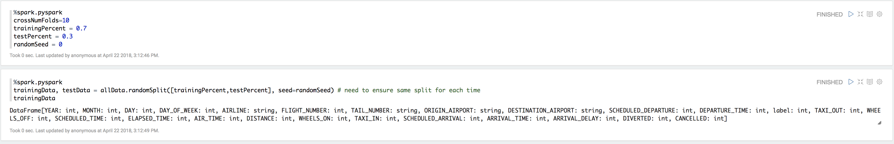
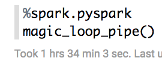

```{r setup, include=FALSE}
knitr::opts_chunk$set(echo = TRUE)
```


A entregar de manera **individual** máximo el **24 de abril de 2018 23:59:59 CST** (-0.5 por cada día de retraso) en tu carpeta `alumnos/nombre_apellido/tarea_7`

Con los datos que tenemos de `flights` queremos predecir el tiempo de retraso de salida `DEPARTURE_DELAY`

### Evidencia S3

<br>


<br>

### Evidencia Cluster


<br>


<br>


<br>


<br> 

### *La tarea fue realizada en Zeppelin y se adjunta el código comentado* 

<br>

### Incluimos librerias

<br>


<br>

<br>

### Configuracion de Spark (para aseguranos de que todo este correcto)

<br>


<br>

### Cargamos datos de flights

<br>


<br>

<br>

### Preparamos datos

<br>

+ Eliminamos `na`

+ La variable respuesta es renombrada como `label y seleccionamos variables de interés


<br>


<br>

### Pipeline

<br>

+ Transformación de los datos

+ Creación del pipeline

+ Declaración de los modelos a comparar

+ Se seleccionaron 3 algoritmos para realizar la predicción

+ Declaración del gridparams con hiperparámetros:

    + Se generó un `gridParamMap` para modificar los parámetros de los algoritmos seleccionados, con 3 valores diferentes en 2 de los parámetros.


<br>


<br>

### Separación de datos (train, test)

<br>

+ Dividir el set en entrenamiento y pruebas (70 y 30)

+ Deberás ocupar 10 como valor de k en *cross validation*

+ Asignamos semilla


<br>



<br>

### Magic loop

<br>

+ Declaramos el magic loop con cross validation

<br>


<br>

+ Ejecutamos magic loop para probar probar los dos diferentes algoritmos


<br>

### Selección de mejores params por algoritmo


<br>

+ Se selccionaron los mejores parámetros por algoritmo por medio de un evaluador (Regression Evaluator)

+ ¿Qué parametros resultaron mejor por algoritmo?


<br>

### Parámetros del mejor algoritmo

<br>

+ ¿Qué algoritmo resultó el mejor, con qué parámetros? 

Los modelos probados fueron: 

- Linear Regression

- Generalized Linear Regression (familia Gaussiana)

- Generalized Linear Regression (familia Tweedie)

Con base en las métricas generadas y que se muestran a continuación podemos decir que el mejor modelo fue el tercero:  **Generalized Linear Regression** con parámetro de regularización de 0.001 y un máximo de iteraciones de 2 y con la familia *Tweedie*. También pudimos notar que con los valores más bajos de regularización los errores disminuían y la $R^2$ mejoraba. Finalmente, cabe señalar la gran similitud en las métricas entre el modelo de Regresión Lineal y Regresión Lineal Generalizado con kernel Gaussiano.


<br>


### Tiempo de ejecución de la función de `magic loop`



<br>

### Diagrama

<br>


