```{r setup, include=FALSE}
knitr::opts_chunk$set(echo = TRUE)
```

### Métodos de Gran Escala: Pipeline de Luigi

#### Condiciones de ejecución

* Programa awscli configurado con credenciales de alumno Arturo González Bencomo
* Existencia de archivos: 
    * s3://al102964-bucket1/tarea8/all_data.csv
    * s3://al102964-bucket1/tarea8/agg.py
    * s3://al102964-bucket1/tarea8/parquet.py
* Ejecucion previa de pip3 install -r requirements.txt en computadora que ejecuto pipeline de luigi
* python3.5 configurado mediante pyenv

En este documento mostramos la evidencia de ejecución del pipeline de luigi, la lógica de ejecución está en los archivos:

* pipeline.py -> Código principal
* requirements.txt -> Módulos requeridos por el código
* agg.py  -> Lógica de agregación conteo de productos distintos por categoria
* parquet.py   -> lógica de parqueteo

#### Diagrama de pipeline de luigi 

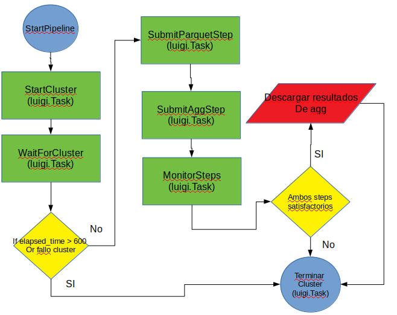


#### Instrucción de arranque

Estando parados en la carpeta donde se tiene tiene el archivo de luigi, se ejecuta el comando mostrado en la imagen para arrancar el pipeline.

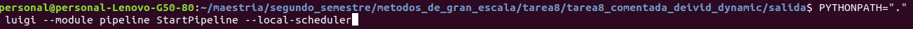


#### Resumen 
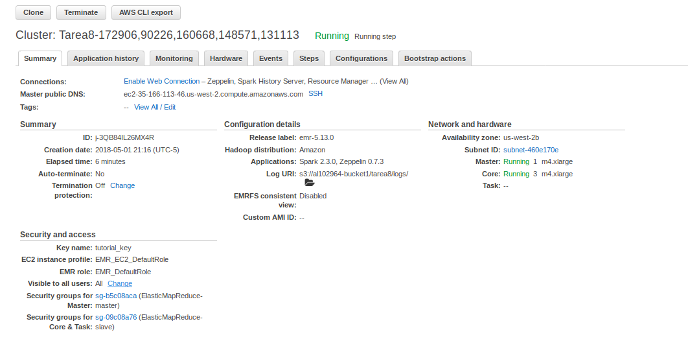


#### Lista 
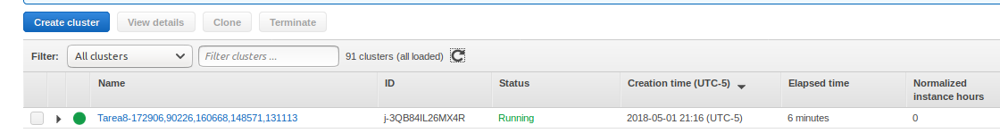


#### Nodos
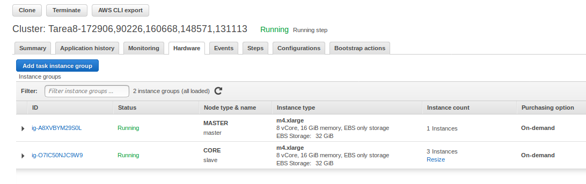


#### Iniciando cluster desde Luigi

En la imagen anterior podemos observar que el task de waitForCluster checa cada 10 segundos el status de cluster hasta que pasen 600 segundos (10 minutos) o hasta que el cluster pase a status 'waiting'

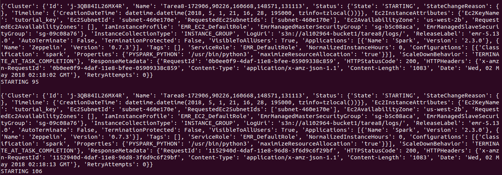


#### Waiting 
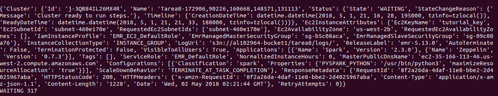

#### Submit steps
Posteriormente a que inicio el cluster es decir terminación de la tarea waitForCluster, Hacemos submit del step con lógica de parqueteo (luigi task: SubmitParquetStep) y de agregación (luigi task: SubmitAggStep) encolados en ese orden, la salida de estas tasks son los ids de los steps que posteriormente se monitorean (luigi task: MonitorSteps). Si cualquiera de ambos falla, el cluster termina con errores de falla, si ambos steps terminan exitosamente se termina el cluster con status de éxito y se procede a descargar el archivo de agregaciones de salida.

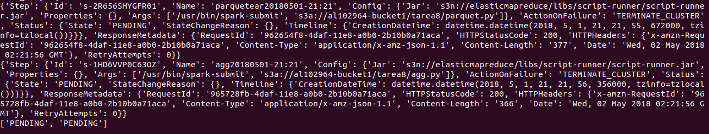

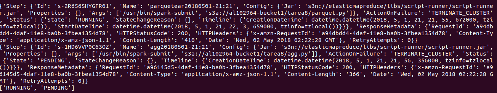

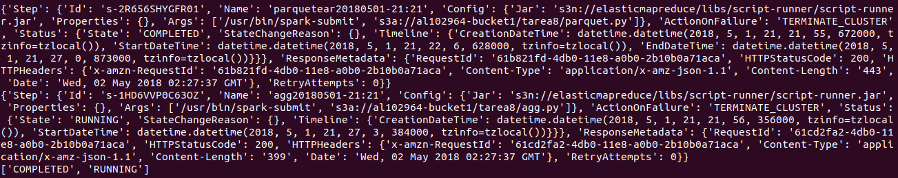

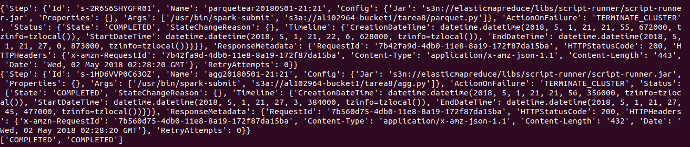


#### Steps completos
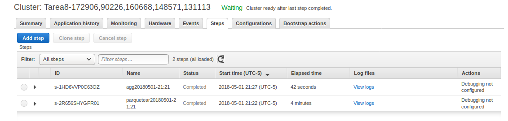


#### Status Luigi Pipeline
Podemos observar que las 8 tasks de luigi se ejecutaron de manera satisfactoria
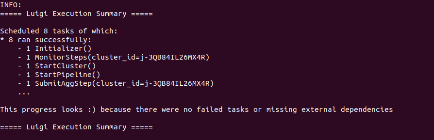


#### El archivo de salida ubicado en salida/part-00000-56af9a3f-849a-407d-af49-de76b1c192d8-c000.csv es:

    categoria,NumeroProductos
    MATERIAL ESCOLAR,68
    ARTS. PARA EL CUIDADO PERSONAL,15
    PESCADOS Y MARISCOS EN CONSERVA,3
    UTENSILIOS DOMESTICOS,1
    DETERGENTES Y PRODUCTOS SIMILARES,12
    CARNE Y VISCERAS DE RES,7
    PRODUCTOS DE TEMPORADA (NAVIDEÐOS),35
    GALLETAS PASTAS Y HARINAS DE TRIGO,11
    HORTALIZAS FRESCAS,27
    ,143
    DERIVADOS DE LECHE,25
    TORTILLAS Y DERIVADOS DEL MAIZ,6
    GRASAS ANIMALES COMESTIBLES,1
    APARATOS ELECTRONICOS,9
    LEGUMBRES SECAS,6
    CAFE,2
    MUEBLES DE COCINA,1
    CARNES FRIAS SECAS Y EMBUTIDOS,29
    CHOCOLATES Y GOLOSINAS,12
    PAN,3
    CERVEZA,1
    MEDICAMENTOS,602
    CONDIMENTOS,19
    ACEITES Y GRASAS VEG. COMESTIBLES,3
    REFRESCOS ENVASADOS,5
    TE,1
    PESCADOS Y MARISCOS,68
    CARNE DE AVE,2
    VINOS Y LICORES,7
    FRUTAS Y LEGUMBRES PROCESADAS,13
    CARNE Y VISCERAS DE CERDO,6
    FRUTAS FRESCAS,23
    ACCESORIOS DOMESTICOS,3
    ARROZ Y CEREALES PREPARADOS,13
    APARATOS ELECTRICOS,14
    ARTS. DE ESPARCIMIENTO (JUGUETES),27
    CIGARRILLOS,1
    HUEVO,1
    LECHE PROCESADA,7
    AZUCAR,1
    ARTS. DE PAPEL P/HIGIENE PERSONAL,7


#### Referencias

*http://boto3.readthedocs.io/en/latest/reference/services/emr.html
*http://luigi.readthedocs.io/en/stable/api/luigi.task.html
*http://boto3.readthedocs.io/en/latest/reference/services/emr.html
*http://luigi.readthedocs.io/en/stable/api/luigi.contrib.html
*https://aws.amazon.com/premiumsupport/knowledge-center/emr-pyspark-python-3x/
