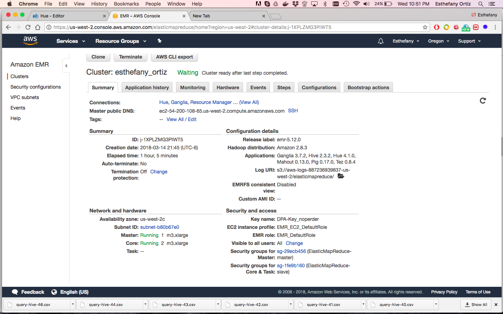
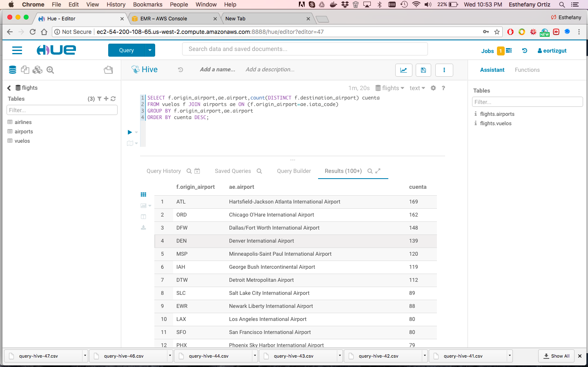

Foto del cluster 



Foto del Hue



### Pregunta 1

#### a)

```{sql eval=FALSE}
CREATE TEMPORARY TABLE collect AS
SELECT reportsto, collect_list(firstname) as empleados
FROM employees
WHERE reportsto <> ''
GROUP BY reportsto;

CREATE TEMPORARY TABLE base AS
SELECT emp.employeeid, emp.firstname, emp.lastname, emp.title, emp.hiredate, emp.city, emp.country, empleados
FROM employees emp
JOIN collect ON emp.employeeid = collect.reportsto;

SELECT employeeid, firstname, lastname, title, hiredate, city, country, empleado
FROM base
LATERAL VIEW explode(empleados) subView AS empleado;
```

#### b)
```{sql eval=FALSE}
SELECT res.firstname, res.lastname, res.title, res.hiredate, res.cant, LEAD(cant) OVER(ORDER BY cant) maximo
FROM(
    SELECT emp.firstname, emp.lastname, emp.title, emp.hiredate, 
    count(*) as cant
    FROM northwind.orders ord
    JOIN northwind.employees emp ON ord.employeeid = emp.employeeid
    GROUP BY emp.firstname, emp.lastname, emp.title, emp.hiredate
    ORDER BY cant DESC
    LIMIT 2) res
LIMIT 1;
```

#### c)
```{sql eval=FALSE}
SELECT res.delta as delta_maximo
FROM(
    SELECT orderid,
    from_utc_timestamp(date_format(orderdate,'yyyy-MM-dd HH:mm:ss.SSS'),'UTC') orderdate,
    datediff(orderdate,from_utc_timestamp(date_format(lag(orderdate) OVER(ORDER BY orderid),'yyyy-MM-dd HH:mm:ss.SSS'),'UTC')) delta
    FROM orders
    ORDER BY delta DESC) res
LIMIT 1;
```

### Pregunta 2

#### a)
```{sql eval=FALSE}
SELECT DISTINCT lines.airline
FROM vuelos v
JOIN airports ports ON v.destination_airport = ports.iata_code
JOIN airlines lines ON v.airline = lines.iata_code
WHERE ports.airport = "Honolulu International Airport";
```

#### b)
```{sql eval=FALSE}
SELECT DISTINCT SUBSTR(v.scheduled_departure,0,2) as hora
FROM vuelos v
JOIN airports portsorig ON v.origin_airport = portsorig.iata_code
JOIN airports portsdest ON v.destination_airport = portsdest.iata_code
WHERE portsorig.airport = "Honolulu International Airport" AND portsdest.airport = "San Francisco International Airport";
```

#### c)
```{sql eval=FALSE}
SELECT f.day_of_week,a.airline,min(f.departure_delay)
FROM airlines a JOIN flights f ON (a.iata_code=f.airline) JOIN airports ae ON (f.destination_airport=ae.iata_code) 
WHERE ae.airport='Honolulu International Airport' AND f.departure_delay=0
GROUP BY f.day_of_week,a.airline;
```

#### d)
```{sql eval=FALSE}
SELECT ports.airport, count(*) as trafico
FROM vuelos v
JOIN airports ports ON v.destination_airport = ports.iata_code
GROUP BY ports.airport
ORDER BY trafico DESC
LIMIT 1;
```

#### e)
```{sql eval=FALSE}
SELECT f.day_of_week,a.airline,max(f.departure_delay) maximo
FROM airlines a JOIN flights f ON (a.iata_code=f.airline) 
GROUP BY f.day_of_week,a.airline
ORDER BY maximo DESC
LIMIT 7;
```

#### f)
```{sql eval=FALSE}
SELECT v.airline, lines.airline, avg(v.departure_delay) as delay_promedio
FROM vuelos v
JOIN airlines lines ON v.airline = lines.iata_code
WHERE v.day_of_week = 2 AND v.departure_delay >= 0
GROUP BY v.airline, lines.airline, v.day_of_week
ORDER BY delay_promedio
LIMIT 3;
```

#### g)
```{sql eval=FALSE}
SELECT f.origin_airport,ae.airport,count(DISTINCT f.destination_airport) cuenta
FROM flights f JOIN airports ae ON (f.origin_airport=ae.iata_code) 
GROUP BY f.origin_airport,ae.airport
ORDER BY cuenta DESC;
```
