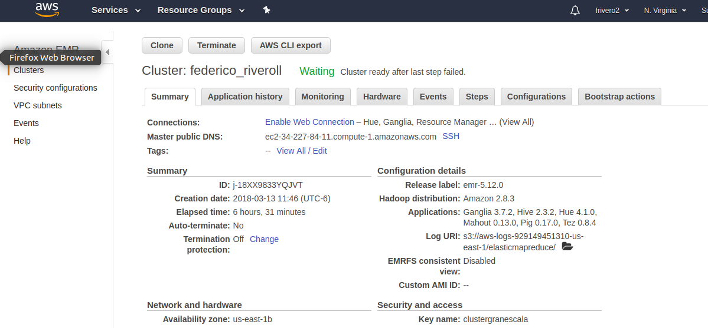
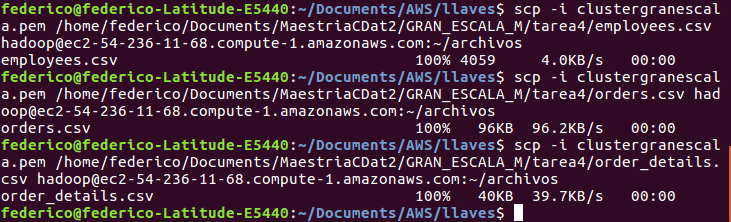
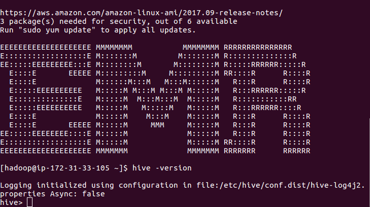
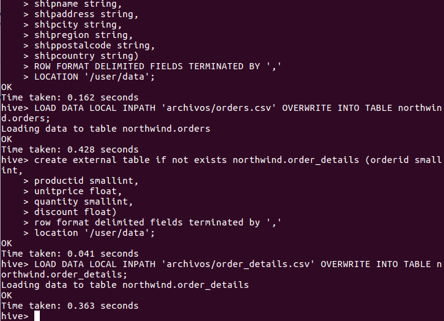
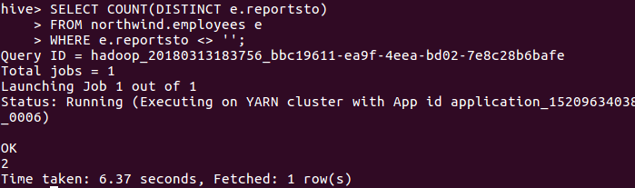
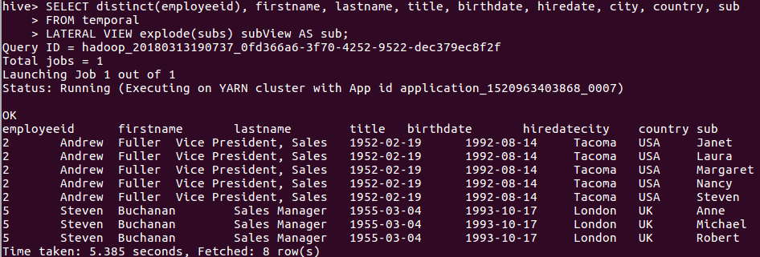
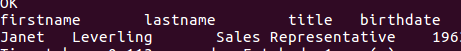

# Tarea 5
## Federico Riveroll 105898

Después de un par de intentos no pude habilitar foxy proxy para ver el editor bonito y me sentí presionado porque el EMR está encendido y dice 'waiting'. Por tanto, me conecté vía SSH y haré las consultas ahí.<br>
Cluster arriba con mi nombre:


Primero subí los datos:


Después conectando a Hive:


Consulta para crear tabla:
<code>
drop database if exists northwind cascade;
create database if not exists northwind location "/archivos/northwind/";

create external table if not exists northwind.products (productid smallint,
productname string,
supplierid smallint,
categoryid smallint,
quantityperunit string,
unitprice float,
unitsinstock smallint,
unitsonorder smallint,
reorderlevel smallint,
discontinued int)
ROW FORMAT SERDE 'org.apache.hadoop.hive.serde2.OpenCSVSerde'
LOCATION '/user/data'
tblproperties ("skip.header.line.count"="1");

LOAD DATA LOCAL INPATH 'archivos/products.csv' OVERWRITE INTO TABLE northwind.products;


create external table if not exists northwind.orders (
orderid smallint,
customerid string,
employeeid int,
orderdate timestamp,
requireddate timestamp,
shippeddate timestamp,
shipvia smallint,
freight float,
shipname string,
shipaddress string,
shipcity string,
shipregion string,
shippostalcode string,
shipcountry string)
ROW FORMAT SERDE 'org.apache.hadoop.hive.serde2.OpenCSVSerde'
LOCATION '/user/data'
tblproperties ("skip.header.line.count"="1");

LOAD DATA LOCAL INPATH 'archivos/orders.csv' OVERWRITE INTO TABLE northwind.orders;


create external table if not exists northwind.order_details (orderid smallint,
productid smallint,
unitprice float,
quantity smallint,
discount float)
ROW FORMAT SERDE 'org.apache.hadoop.hive.serde2.OpenCSVSerde'
LOCATION '/user/data'
tblproperties ("skip.header.line.count"="1");

LOAD DATA LOCAL INPATH 'archivos/order_details.csv' OVERWRITE INTO TABLE northwind.order_details;
</code>


Consulta prueba, poniendo directorio para ver resultados (ya veo por qué es tan útil el programa para hacer consultas visuales).
<code>
set hive.cli.print.header=true;
set hive.mapred.mode=nonstrict;

select od.productid, productname, count(*) as num
from northwind.orders o join northwind.order_details od
on o.orderid = od.orderid
join northwind.products p 
on p.productid = od.productid
group by od.productid, productname
having count(*) > 50
order by num desc
limit 10;
</code>

Ahora poner employees de la misma forma:


<code>

create external table if not exists northwind.employees (employeeid int,
lastname string,
firstname string,
title string,
titleofcourtesy string,
birthdate timestamp,
hiredate timestamp,
address string,
city string,
region string,
postalcode string,
country string,
homephone string,
extension string,
photo string,
notes string,
reportsto int,
photopath string)
ROW FORMAT SERDE 'org.apache.hadoop.hive.serde2.OpenCSVSerde'
LOCATION '/user/data'
tblproperties ("skip.header.line.count"="1");

LOAD DATA LOCAL INPATH 'archivos/employees.csv' OVERWRITE INTO TABLE northwind.employees;

select * from northwind.employees limit 10;

</code>

### a. ¿Cuántos "jefes" hay en la tabla empleados? ¿Cuáles son estos jefes: número de empleado, nombre, apellido, título, fecha de nacimiento, fecha en que iniciaron en la empresa, ciudad y país? (atributo reportsto, ocupa explode en tu respuesta) 

Se entiende que los jefes son a los que 'al menos alguien' les reporta.
<code>
SELECT COUNT(DISTINCT e.reportsto)
FROM northwind.employees e
WHERE e.reportsto <> '';
</code>


Los atributos de dichos jefes son:

<code>
CREATE TEMPORARY TABLE temporal AS
SELECT * FROM (SELECT employeeid, firstname, lastname, title, birthdate, hiredate, city, country
FROM northwind.employees) a
JOIN
(SELECT reportsto, collect_list(firstname) as subs
FROM northwind.employees
WHERE reportsto <> ''
GROUP BY reportsto) b 
ON a.employeeid=b.reportsto;

SELECT distinct(employeeid), firstname, lastname, title, birthdate, hiredate, city, country, sub
FROM temporal
LATERAL VIEW explode(subs) subView AS sub;
</code>

Podemos ver que son Andrew Fuller y Steven Buchanan.

### b. ¿Quién es el segundo "mejor" empleado que más órdenes ha generado? (nombre, apellido, título, cuándo entró a la compañía, número de órdenes generadas, número de órdenes generadas por el mejor empleado (número 1)) 

<code>
CREATE TEMPORARY TABLE temporal AS
SELECT b.firstname, b.lastname, b.title, b.birthdate, a.sales, LEAD(sales) OVER(ORDER BY sales) max
FROM (SELECT employeeid, COUNT(*) as sales FROM orders
GROUP BY employeeid) a
JOIN (SELECT employeeid as e2, firstname, lastname, title, hiredate
FROM employees) b ON a.employeeid=b.e2
GROUP BY b.firstname, b.lastname, b.title, b.hiredate, a.sales
ORDER BY sales DESC;

SELECT b.fistname as firstname, b.lastname as lastname, b.title as title, b.birthdate as birthdate FROM 
(SELECT row_number() OVER (partition by 1) rn, d.* FROM temporal d) q 
WHERE q.rn = 2;
</code>


Podemos ver que es Janet Leverling.

### c. ¿Cuál es el delta de tiempo más grande entre una orden y otra?

<code>SELECT MAX(diff)
  FROM (
          SELECT TIMEDIFF(datetime,@prev) AS diff,
                 (@prev:=datetime) AS datetime  
            FROM resets, 
                 (SELECT @prev:=(SELECT MIN(datetime) FROM resets)) AS init
           ORDER BY datetime
       ) AS diffs
</code>

<br>
No se me ocurrió cómo resolver este ejercicio sin un programa, ¿Es algo como el ejemplo que pongo arriba que encontré en internet?

## Ejercicio 2
Para esta pregunta también se subieron y cargaron en Hive las tablas "airplanes", "flights" y "airports".

<b>Carga en Hive</b>
<code>
set hive.cli.print.header=true;
set hive.mapred.mode=nonstrict;

drop database if exists flights cascade;
create database if not exists flights location "/archivos/flights/";

create external table if not exists flights.airlines (
iata_code string,
airline string)
ROW FORMAT SERDE 'org.apache.hadoop.hive.serde2.OpenCSVSerde'
LOCATION '/user/data'
tblproperties ("skip.header.line.count"="1");

LOAD DATA LOCAL INPATH 'archivos/airlines.csv' OVERWRITE INTO TABLE flights.airlines;


create external table if not exists flights.airports (
iata_code string,
airport string,
city string,
state string,
country string,
latitude double,
longitude double)
ROW FORMAT SERDE 'org.apache.hadoop.hive.serde2.OpenCSVSerde'
LOCATION '/user/data'
tblproperties ("skip.header.line.count"="1");

LOAD DATA LOCAL INPATH 'archivos/airports.csv' OVERWRITE INTO TABLE flights.airports;


create external table if not exists flights.flights_t(
year smallint,
month smallint,
day smallint,
day_of_week smallint,
airline string,
flight_number smallint,
tail_number string,
origin_airport string,
destination_airport string,
scheduled_departure smallint,
departure_time smallint,
departure_delay smallint,
taxi_out smallint,
wheels_off smallint,
scheduled_time smallint,
elapsed_time smallint,
air_time smallint,
distance smallint,
wheels_on smallint,
taxi_in smallint,
scheduled_arrival smallint,
arrival_time smallint,
arrival_delay smallint,
diverted smallint,
cancelled smallint,
cancellation_reason string,
air_system_delay string,
security_delay string,
airline_delay string,
late_aircraft_delay string,
weather_delay string)
ROW FORMAT SERDE 'org.apache.hadoop.hive.serde2.OpenCSVSerde'
LOCATION '/user/data'
tblproperties ("skip.header.line.count"="1");

LOAD DATA LOCAL INPATH 'archivos/flights.csv' OVERWRITE INTO TABLE flights.flights_t;

</code>

a. ¿Qué aerolíneas (nombres) llegan al aeropuerto "Honolulu International Airport"? 
<code>
SELECT DISTINCT al.airline
FROM
flights.flights_t f JOIN flights.airports ap
ON f.destination_airport = ap.iata_code
JOIN flights.airlines al
ON f.airline=al.iata_code
WHERE ap.airport="Honolulu International Airport";
</code>
---------------------------------------
Salida:
<br><br>
<b>
al.airline <br>
Alaska Airlines Inc.<br>
Hawaiian Airlines Inc.<br>
United Air Lines Inc.<br>
Virgin America<br>
American Airlines Inc.<br>
Delta Air Lines Inc.<br>
US Airways Inc.<br>
</b>

b. ¿En qué horario (hora del día, no importan los minutos) hay salidas del aeropuerto de San Francisco ("SFO") a "Honolulu International Airport"? 

<code>
SELECT DISTINCT SUBSTR(f.scheduled_departure,0,2) as hora
FROM flights.flights_t f 
JOIN flights.airports ap ON f.destination_airport = ap.iata_code
JOIN flights.airports ap2 ON f.origin_airport = ap2.iata_code
JOIN flights.airlines al ON f.airline=al.iata_code
WHERE ap.airport="Honolulu International Airport" AND ap2.airport="San Francisco International Airport"
ORDER BY hora;
</code>
-----------------------------------------
Salida:
<br><br>
<b>
hora<br>
06<br>
13<br>
15<br>
16<br>
11<br>
12<br>
14<br>
18<br>
09<br>
10<br>
17<br>
19<br>
07<br>
08<br>
</b>

c. ¿Qué día de la semana y en qué aerolínea nos conviene viajar a "Honolulu International Airport" para tener el menor retraso posible? 

<code>
SELECT f.day_of_week, al.airline,  AVG(f.departure_delay) as retraso
FROM
flights.flights_t f JOIN flights.airports ap ON f.destination_airport = ap.iata_code
JOIN flights.airlines al ON f.airline=al.iata_code
WHERE ap.airport="Honolulu International Airport"
GROUP BY al.airline, f.day_of_week
HAVING retraso = 0
ORDER BY retraso;
</code>
-----------------------------------------
Salida:
<br><br>
<b>
f.day_of_week,al.airline,retraso<br>
1,American Airlines Inc.,0<br>
1,Delta Air Lines Inc.,0<br>
1,Virgin America,0<br>
2,Alaska Airlines Inc.,0<br>
2,American Airlines Inc.,0<br>
2,Delta Air Lines Inc.,0<br>
2,Hawaiian Airlines Inc.,0<br>
2,US Airways Inc.,0<br>
2,United Air Lines Inc.,0<br>
3,Delta Air Lines Inc.,0<br>
4,Alaska Airlines Inc.,0<br>
4,Hawaiian Airlines Inc.,0<br>
5,US Airways Inc.,0<br>
6,American Airlines Inc.,0<br>
6,United Air Lines Inc.,0<br>
7,Alaska Airlines Inc.,0<br>
7,US Airways Inc.,0<br>
7,United Air Lines Inc.,0<br>
1,Alaska Airlines Inc.,0<br>
1,Hawaiian Airlines Inc.,0<br>
1,US Airways Inc.,0<br>
1,United Air Lines Inc.,0<br>
2,Virgin America,0<br>
3,Alaska Airlines Inc.,0<br>
3,American Airlines Inc.,0<br>
3,Hawaiian Airlines Inc.,0<br>
3,US Airways Inc.,0<br>
3,United Air Lines Inc.,0<br>
4,American Airlines Inc.,0<br>
4,Delta Air Lines Inc.,0<br>
4,US Airways Inc.,0<br>
4,United Air Lines Inc.,0<br>
5,Alaska Airlines Inc.,0<br>
5,American Airlines Inc.,0<br>
5,Delta Air Lines Inc.,0<br>
5,Hawaiian Airlines Inc.,0<br>
5,United Air Lines Inc.,0<br>
6,Alaska Airlines Inc.,0<br>
6,Delta Air Lines Inc.,0<br>
6,Hawaiian Airlines Inc.,0<br>
6,US Airways Inc.,0<br>
6,Virgin America,0<br>
7,American Airlines Inc.,0<br>
7,Delta Air Lines Inc.,0<br>
7,Hawaiian Airlines Inc.,0<br>
7,Virgin America,0<br>
</b>
<br><br>
Parece ser que los no retrasos se distribuyen de manera uniforme en la semana en nuestro conjunto, pero el día 4 es el que menos 'a tiempo' tiene, a falta de ver muchos otros detalles.

d. ¿Cuál es el aeropuerto con mayor tráfico de entrada? 

<code>
SELECT f.destination_airport, ap.airport, COUNT(*) as trafico
FROM
flights.flights_t f JOIN flights.airports ap ON f.destination_airport = ap.iata_code
GROUP BY ap.airport
ORDER BY trafico DESC
LIMIT 1;
</code>
-----------------------------------------
Salida:
<br><br>
<b>
f.destination_airport,ae.airport,cuenta<br>
ATL,Hartsfield-Jackson Atlanta International Airport,346904<br>
</b>

e. ¿Cuál es la aerolínea con mayor retraso de salida por día de la semana? 
<code>
select f.day_of_week, a.airline, max(f.departure_delay) as maximo
from flights.airlines a join flights.flights_t f on (a.iata_code=f.airline)
group by f.day_of_week, a.airline
order by maximo desc
limit 6;
</code>
-----------------------------------------
Salida:
<br><br>
<b>
f.day_of_week,a.airline,maximo<br>
5,American Airlines Inc.,1988<br>
6,American Airlines Inc.,1878<br>
7,American Airlines Inc.,1670<br>
4,American Airlines Inc.,1649<br>
1,American Airlines Inc.,1625<br>
2,American Airlines Inc.,1609<br>
</b>

f. ¿Cuál es la tercer aerolínea con menor retraso de salida los lunes (day of week = 2)? 
<code>
select f.day_of_week, a.airline, min(f.departure_delay) as minimo
from flights.airlines a join flights.flights_t f on (a.iata_code=f.airline)
where f.day_of_week = 2 and f.departure_delay = 0
group by f.day_of_week, a.airline
order by minimo desc
limit 3;
</code>
-----------------------------------------
Salida:
<br><br>
<b>
f.day_of_week,a.airline,minimo<br>
2,Alaska Airlines Inc.,0<br>
2,American Airlines Inc.,0<br>
2,American Eagle Airlines Inc.,0<br>
</b>

g. ¿Cuál es el aeropuerto origen que llega a la mayor cantidad de aeropuertos destino diferentes?
<code>
select f.origin_airport, ar.airport, count(distinct f.destination_airport) as cuantas
from flights.flights_t f join flights.airports ar on (f.origin_airport = ar.iata_code)
group by f.origin_airport, ar.airport
order by cuantas desc
limit 1;
</code>
-----------------------------------------
Salida:
<br><br>
<b>
f.origin_airport,ae.airport,cuantas<br>
ATL,Hartsfield-Jackson Atlanta International Airport,169<br>
</b>


```python

```


```python

```
