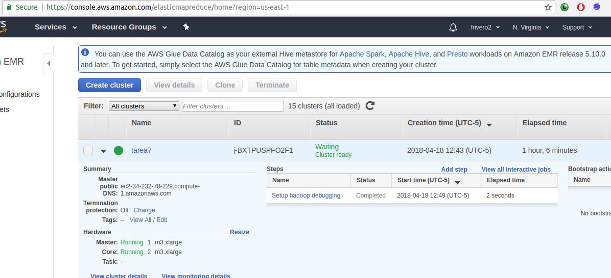
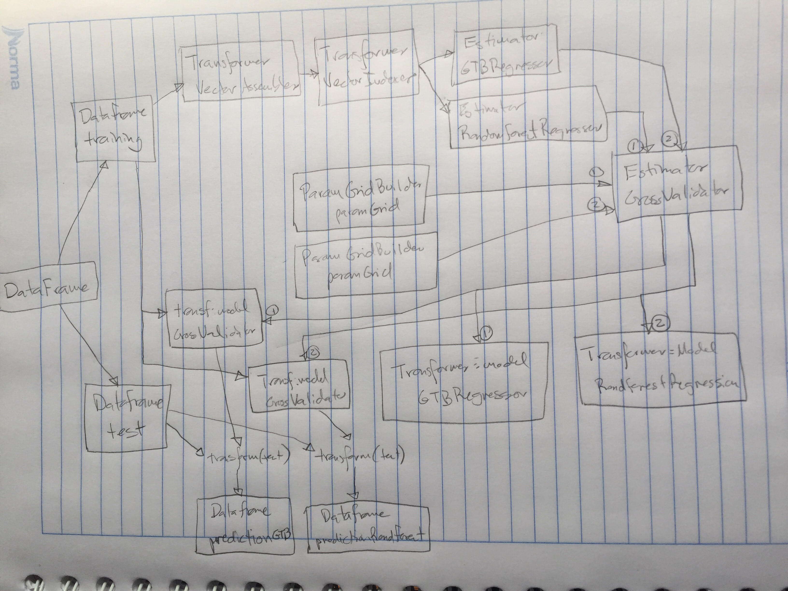
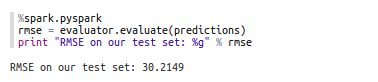
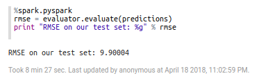

# Métodos de Gran Escala
## Tarea 7
### Federico Riveroll Gonzalez

### Especificaciones
Para el presente trabajo se utilizaron los algoritmos de regresión <b>RandomForestRegressor</b> y <b>GBTRegressor</b>.<br>

El script de pyspark con comentarios detallados se encuentra en:<br>
<i>script/script_pyspark.py</i>
<br>
<br>
El archivo para zeppelin que se uso para correr todo se encuentra en:<br>
<i>script/tarea7.json</i>
<br>
<br>


Para esta tarea, utilicé un cluster en AWS de 3 nodos:<br>


### Diagrama de elementos (transformadores, estimadores, data frames, pipeline):



### Duración de Magic Loop:
<b>Seis horas</b> (cabe mencionar que primero intenté en mi computadora y no corrió, tuvo errores de memoria de java).

<br>
Resultado de mejor GBTRegressor:<br>

<br>
Resultado de mejor RandomForestRegressor:<br>


Los mejores parámetros para GBT fueron maxDepth = 10, maxIter = 20.<br>
Los mejores parámetros para RFR fueron maxDepth = 7, numTrees = 30.<br>


```python

```
