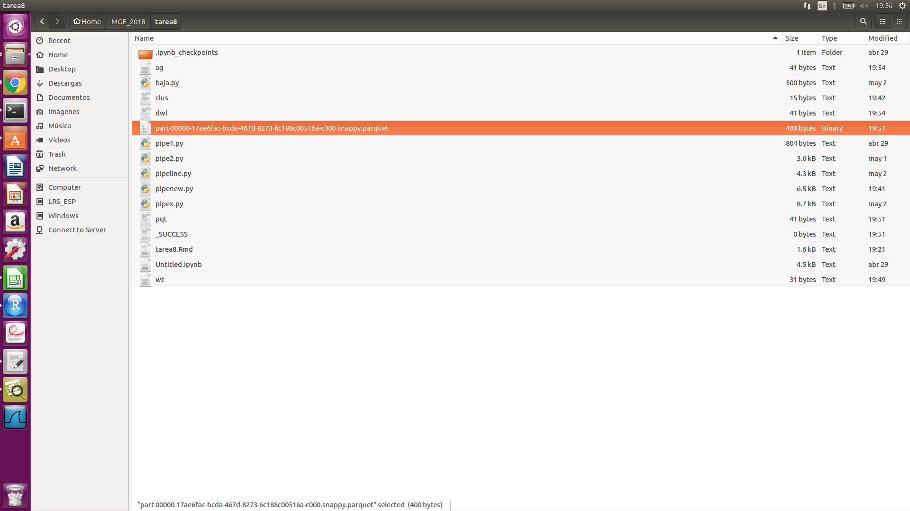

### Requerimientos

Para correr la aplicación es necesario tener instalados los requerimientos de 'requirements.txt';

boto3
time 
luigi 
os 
sys 

Y tener una cuenta con crédito en AWS.

### Ejecución

Es necesario subír los programas 'agg.py' y 'parquet.py' a una carpeta de s3, y también los datos proporcionados 'all_data.csv'.

Es necesario actualizar los datos de AWS a los propios en el programa 'pipeline.py', tales como la llave, la región AWS, un subnet ID válido de tu cuenta de AWS, y el url de tu carpeta en s3. 

Para la ejecución de la aplicación es necesario ir a carpeta raíz y correr el siguiente comando; 

python pipeline.py --local-scheduler Pipeline

### Resultado

El script hace uso de Luigi para correr el pipeline que levanta el cluster directamente en AWS, 

después lee el archivo 'all_data.csv' y lo guarda como un parquet:

desupés lee el parquet a un dataframe de pyspark y saca el promedio de la variable 'precio', y este resultado lo guarda como un parquet.

y finalmente descarga el resultado a la carpeta local y manda a cerrar el clúster.

salida de terminal:

Referencias

https://github.com/spotify/luigi/blob/master/luigi/contrib/batch.py
 
https://stackoverflow.com/questions/33332058/luigi-pipeline-beginning-in-s3
 
https://www.crobak.org/2014/09/luigi-aws/
 
https://github.com/spotify/luigi/blob/master/luigi/contrib/ecs.py

