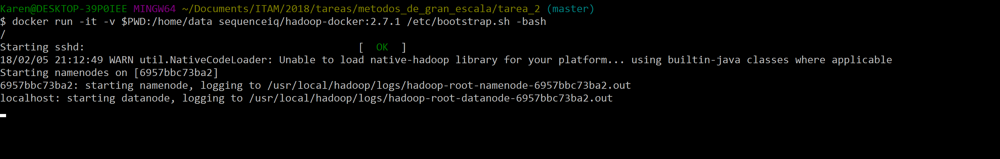
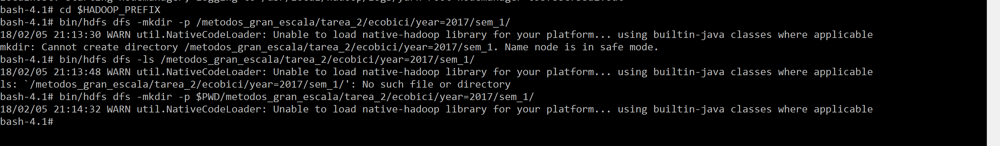
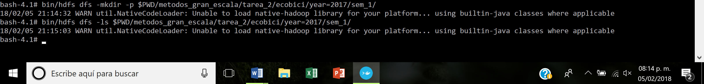
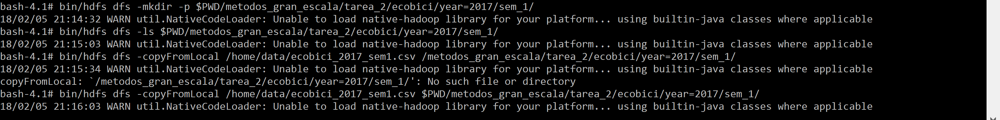
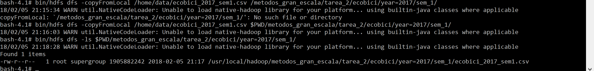
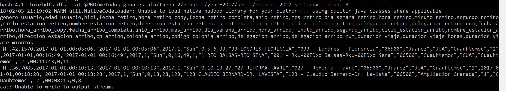
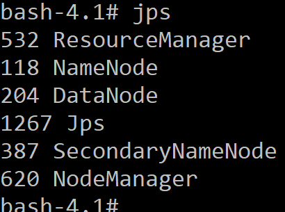
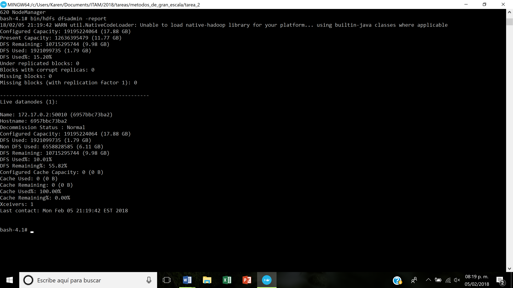

Los pasos que se siguien para realizar esta tarea fueron los siguientes:

+ Descargar una imagen de docker
+ Inicializarla en un contenedor con volumen
+ Crear el directorio en HDFS
+ Copiar el archivo de ecobici
+ Verificar el funcionamiento del sistema

## 1. Descargar una imagen de docker

Se descarga la imagen sequenceiq/hadoop-docker en su versión 2.7.1 desde https://hub.docker.com/r/sequenceiq/hadoop-docker/ con el comando  
`docker pull sequenceiq/hadoop-docker:2.7.1`

## 2. Inicializar un contenedor

`docker run -it -v $PWD:/home/data sequenceiq/hadoop-docker:2.7.1 /etc/bootstrap.sh -bash`
 
 
 
## 3. Crear el directorio en HDFS

+ Crea el directorio /metodos_gran_escala/tarea_2/ecobici/year=2017/sem_1/ con mkdir verifica la opción -p

`cd $HADOOP_PREFIX/bin/hdfs dfs -mkdir -p /metodos_gran_escala/tarea_2/ecobici/year=2017/sem_1/ `
 
  

+ Muestra que el directorio está vacío -no hay datos cargados- con ls

`bin/hdfs dfs -ls /metodos_gran_escala/tarea_2/ecobici/year=2017/sem_1/ `

  
 
## 4. Copiar el archivo de Ecobici

+ Carga los datos a este directorio que creaste ocupando copyFromLocal

`bin/hdfs dfs -copyFromLocal /home/data/ecobici_2017_sem1.csv $PWD/metodos_gran_escala/tarea_2/ecobici/year=2017/sem_1/`
 
  

+ Muestra que los datos están cargados haciendo un ls

`bin/hdfs dfs -ls $PWD/metodos_gran_escala/tarea_2/ecobici/year=2017/sem_1/`
 
  

`bin/hdfs dfs -cat $PWD/metodos_gran_escala/tarea_2/ecobici/year=2017/sem_1/ecobici_2017_sem1.csv | head -3`

  

## 5. Verificar el funcionamiento del sistema

+ Muestra que el NameNode, DataNode, ResourceManager y el NodeManager están activos en tu clúster de Hadoop con jps
 
  

+ Muestra la salida del reporte generado con dfsadmin report

`bin/hdfs dfsadmin -report` 
 
  

+ ¿Cuál es el % de DFS utilizado una vez que ya subiste los datos?

10.01%

