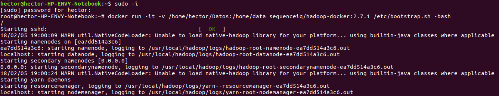
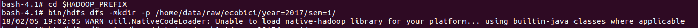
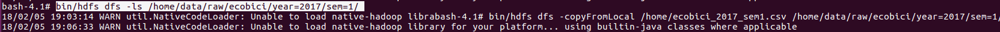
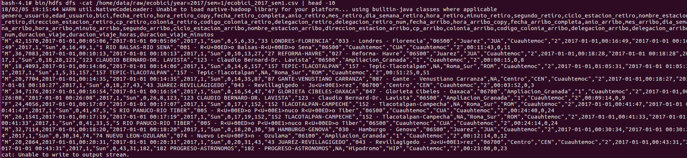
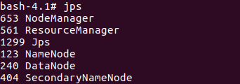
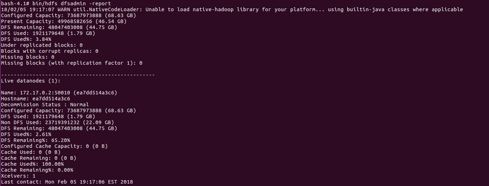

```{r setup, include=FALSE}
knitr::opts_chunk$set(echo = TRUE)
```

# Tarea 2

### Paso 1: Descargar los datos

Descarga de la base de datos desde dropbox con la siguiente url: https://www.dropbox.com/sh/u0g3g378xfdyxot/AACN77EAFN1rjNkPemkX-PWZa?dl=0

### Paso 2: Bajar la imagen de Hadoop

Se hace un docker pull a la imagen de hadoop de sequenceiq con el comando:
docker pull sequenceiq/hadoop-docker:2.7.1. 

La url del github es la siguiente: https://github.com/sequenceiq/hadoop-docker

### Paso 3: Correr la imagen de Hadoop

Se ejecuta la imagen de hadoop que se bajó y se generó un volumen mediante el siguiente comando:
docker run -it -v /home/hector/Datos:/home/data sequenceiq/hadoop-docker:2.7.1 /etc/bootstrap.sh -bash


### Paso 4: Crear el directorio en HDFS

Primero hay que localizarse donde se encuentran los archivos binarios de HDFS con el comando:
cd $HADOOP_PREFIX
y enseguida se crea el directorio utilizando el comando
bin/hdfs dfs -mkdir -p /home/data/raw/ecobici/year=2017/sem=1/
En la tarea se pidió crear /metodos_gran_escala/tarea_2/ecobici/year=2017/sem_1/ ; se me fue y cree /home/data/raw/.... dado lo que venía aprendiendo de las notas. Espero no me bajes muchos puntos :(


### Paso 5: Verificar que el directorio en HDFS est? vac?o

Verificar que est? vac?o mediante el comando
bin/hdfs dfs -ls /home/data/raw/ecobici/year=2017/sem=1/



### Paso 6: Copiar el archivo .csv desde nuestro volumen hacia el HDFS

Copiar los datos de ecobice desde el volumen  local hacia el HDFS con el comando:
bin/hdfs dfs -copyFromLocal /home/data/ecobici_2017_sem1.csv /home/data/raw/ecobici/year=2017/sem=1/


### Paso 7: Verificar que el directorio en HDFS tenga el archivo local
Mediante el comando
bin/hdfs dfs -ls /home/data/raw/ecobici/year=2017/sem=1/


Y se imprimen las primeras diez filas
bin/hdfs dfs -cat /home/data/raw/ecobici/year=2017/sem=1/ecobici_2017_sem1.csv | head -10



### Paso 8: Verificar que est?n levantados Hadoop (namenode y datanode) as? como yarn (resource-manager y node-manager)
Utilizar el comando
jps



### Paso 9: Verificar el % del DFS que est? ocupado los datos cargados
Se utiliza el comando 
bin/hdfs dfsadmin -report
y se observa que se ha utilizado el 2.61% del HDFS

