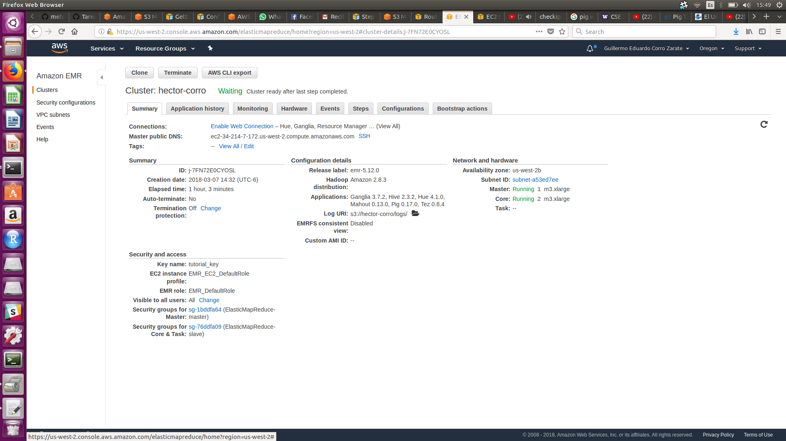

```{r setup, include=FALSE}
knitr::opts_chunk$set(echo = TRUE)
```

# Tarea 4

## Imagen cluster:



## Imagen de Steps:

En varias partes porque levanté y maté el cluster varias veces:


## Ejercicio A.

Modifica el ejercicio de Rank para que en lugar de obtener el id del producto con mejor rank obtengamos el nombre del producto -requieres un join- con el mejor rank

[tarea4ejA.pig](tarea4ejA.pig)

```{r eval=FALSE}
products = LOAD '$INPUT/products.csv' using PigStorage(',') as (productid:chararray, productname:chararray, supplierid:chararray, categoryid:chararray, quantityperunit:int, unitprice:float, unitsinstock:int, unitsonorder:int, reorderlevel:int, discounted:int);
order_details = LOAD '$INPUT/order_details.csv' using PigStorage(',') as (orderid:chararray, productid:chararray, unitprice:float, quantity:int, discount:float);
group_orders = GROUP order_details BY productid;
count_products = FOREACH group_orders GENERATE group as productid , COUNT($1) as n;
ranked = rank count_products by n DESC;
limited_rank = limit ranked 10;
join_product = JOIN limited_rank BY productid, products BY productid;
result = FOREACH join_product GENERATE $1 as productid, productname, n;
STORE result INTO '$OUTPUT/resultado2/' USING PigStorage(',');
```

Archivo resultado:
[Archivo resultado](tarea4A)

##Ejercicio B.

Con los datos de aerolíneas, vuelos y aeropuertos que se encuentran en el dropbox y utilizando Pig contesta las siguietnes preguntas:

    1.- ¿Cuántos vuelos existen en el dataset cuyo aeropuerto destino sea el "Honolulu International Airport"?
    
[ejerciciobp1.pig ](ejerciciobp1.pig)

```{r eval=FALSE}
airports = LOAD '$INPUT/airports.csv' using PigStorage(',') as (iata_code:chararray, airport:chararray, city:chararray, state:chararray, country:chararray, latitude:float, longitude:float);
flights = LOAD '$INPUT/flights.csv' using PigStorage(',') as (year:int, month:int, day:int, day_of_week:int, airline:chararray, flight_number:int, tail_number:chararray, origin_airport:chararray, destination_airport:chararray, scheduled_departure:chararray, departure_time:chararray, departure_delay:int, taxi_out:int, wheels_off:chararray, scheduled_time:chararray, elapsed_time:int, air_time:int, distance:int, wheels_on:chararray, taxi_in:int, scheduled_arrival:chararray, arrival_time:chararray, arrival_delay:int, diverted:chararray, cancelled:chararray, cancellation_reason:chararray, air_system_delay:chararray, security_delay:chararray, airline_delay:chararray, late_aircraft_delay:chararray, weather_delay:chararray);
vuelos_por_aeropuerto = JOIN flights BY destination_airport , airports BY iata_code;
honolulu = FILTER vuelos_por_aeropuerto BY airport == 'Honolulu International Airport';
agrupa_honolulu = GROUP honolulu by airport;
honolulu_ordenado = FOREACH agrupa_honolulu GENERATE group as airport, COUNT($1) as n;
STORE honolulu_ordenado INTO '$OUTPUT/respuesta1/' USING PigStorage(',');
```

Resultado:
[tarea4_1](tarea4_1)

    2.- ¿Cuál es el vuelo con más retraso? ¿De qué aerolínea es?
    
[ejercicio2.pig](ejercicio2.pig)

```{r eval=FALSE}
flights = LOAD '$INPUT/flights.csv' using PigStorage(',') as (year:int, month:int, day:int, day_of_week:int, airline:chararray, flight_number:int, tail_number:chararray, origin_airport:chararray, destination_airport:chararray, scheduled_departure:chararray, departure_time:chararray, departure_delay:int, taxi_out:int, wheels_off:chararray, scheduled_time:chararray, elapsed_time:int, air_time:int, distance:int, wheels_on:chararray, taxi_in:int, scheduled_arrival:chararray, arrival_time:chararray, arrival_delay:int, diverted:chararray, cancelled:chararray, cancellation_reason:chararray, air_system_delay:chararray, security_delay:chararray, airline_delay:chararray, late_aircraft_delay:chararray, weather_delay:chararray);
airlines =LOAD '$INPUT/airlines.csv' using PigStorage(',') as (iata_code:chararray,airline_name:chararray);
vuelo_aerolinea = JOIN flights by airline, airlines by iata_code;
aerolinea_ordenada = ORDER vuelo_aerolinea BY arrival_delay DESC;
demora = LIMIT aerolinea_ordenada 1;
resultado = FOREACH demora GENERATE flight_number, airline_name, iata_code;
store resultado into '$OUTPUT/respuesta2/'  using PigStorage(',');
```

Resultado:
[tarea4_2](tarea4_2)

    3.- ¿Qué día es en el que más vuelos cancelados hay?
    
[ejercicio3.pig](ejercicio3.pig)

```{r eval=FALSE}
flights = LOAD '$INPUT/flights.csv' using PigStorage(',') as (year:int, month:int, day:int, day_of_week:int, airline:chararray, flight_number:int, tail_number:chararray, origin_airport:chararray, destination_airport:chararray, scheduled_departure:chararray, departure_time:chararray, departure_delay:int, taxi_out:int, wheels_off:chararray, scheduled_time:chararray, elapsed_time:int, air_time:int, distance:int, wheels_on:chararray, taxi_in:int, scheduled_arrival:chararray, arrival_time:chararray, arrival_delay:int, diverted:chararray, cancelled:int, cancellation_reason:chararray, air_system_delay:chararray, security_delay:chararray, airline_delay:chararray, late_aircraft_delay:chararray, weather_delay:chararray);
cancelados = FILTER flights by cancelled == 1;
cancelado_por_dia = GROUP cancelados by day_of_week;
cuenta = FOREACH cancelado_por_dia GENERATE group as day_of_week, COUNT($1) as n;
top_cancel = rank cuenta by n DESC;
limited_top_cancel = limit top_cancel 1;
store limited_top_cancel into '$OUTPUT/respuesta3/' using PigStorage(',');
```

Resultado:
[tarea4_3](tarea4_3)

    4.- ¿Cuáles son los aeropuertos orígen con 17 cancelaciones?
    
[ejercicio4.pig](ejercicio4.pig)

```{r eval=FALSE}
flights = LOAD '$INPUT/flights.csv' using PigStorage(',') as (year:int, month:int, day:int, day_of_week:int, airline:chararray, flight_number:int, tail_number:chararray, origin_airport:chararray, destination_airport:chararray, scheduled_departure:chararray, departure_time:chararray, departure_delay:int, taxi_out:int, wheels_off:chararray, scheduled_time:chararray, elapsed_time:int, air_time:int, distance:int, wheels_on:chararray, taxi_in:int, scheduled_arrival:chararray, arrival_time:chararray, arrival_delay:int, diverted:chararray, cancelled:int, cancellation_reason:chararray, air_system_delay:chararray, security_delay:chararray, airline_delay:chararray, late_aircraft_delay:chararray, weather_delay:chararray);
airports = LOAD '$INPUT/airports.csv' using PigStorage(',') as (iata_code:chararray, airport:chararray, city:chararray, state:chararray, country:chararray, latitude:float, longitude:float);
vuelos_por_airport = JOIN flights by origin_airport, airports by iata_code;
vuelos_cancelados = FILTER vuelos_por_airport by cancelled == 1;
cancelados = GROUP vuelos_cancelados by airport;
cuenta = FOREACH cancelados GENERATE group as airport, COUNT($1) as n;
malos = FILTER cuenta by n==17;
resultado = FOREACH malos GENERATE airport, n;
store resultado into '$OUTPUT/resultado4/' using PigStorage(',');
```

Resultado:
[tarea4_4](tarea4_4)

    5.- ¿Cuál es el aeropuerto origen con más vuelos cancelados?
    
[ejercicio5.pig](ejercicio5.pig)
    
```{r eval=FALSE}
flights = LOAD '$INPUT/flights.csv' using PigStorage(',') as (year:int, month:int, day:int, day_of_week:int, airline:chararray, flight_number:int, tail_number:chararray, origin_airport:chararray, destination_airport:chararray, scheduled_departure:chararray, departure_time:chararray, departure_delay:int, taxi_out:int, wheels_off:chararray, scheduled_time:chararray, elapsed_time:int, air_time:int, distance:int, wheels_on:chararray, taxi_in:int, scheduled_arrival:chararray, arrival_time:chararray, arrival_delay:int, diverted:chararray, cancelled:int, cancellation_reason:chararray, air_system_delay:chararray, security_delay:chararray, airline_delay:chararray, late_aircraft_delay:chararray, weather_delay:chararray);
airports = LOAD '$INPUT/airports.csv' using PigStorage(',') as (iata_code:chararray, airport:chararray, city:chararray, state:chararray, country:chararray, latitude:float, longitude:float);
vuelos_por_airport = JOIN flights by origin_airport, airports by iata_code;
vuelos_cancelados = FILTER vuelos_por_airport by cancelled == 1;
cancelados = GROUP vuelos_cancelados by airport;
cuenta = FOREACH cancelados GENERATE group as airport, COUNT($1) as n;
cuenta2 = FOREACH cuenta GENERATE airport, n;
ranking = ORDER cuenta2 by n DESC;
resultado = LIMIT ranking 1;
store resultado into '$OUTPUT/resultado5/' using PigStorage(',');
```

Resultado: 
[tarea4_5](tarea4_5)

    6.- ¿Cuál es el vuelo (flight number) con mayor diversidad de aeropuertos destino, cuáles son estos destinos? (ocupar bag te ayudará en esta pregunta)
    
[ejercicio6a.pig](ejercicio6a.pig)

```{r eval=FALSE}
flights = LOAD '$INPUT/flights.csv' using PigStorage(',') as (year:int, month:int, day:int, day_of_week:int, airline:chararray, flight_number:int, tail_number:chararray, origin_airport:chararray, destination_airport:chararray, scheduled_departure:chararray, departure_time:chararray, departure_delay:int, taxi_out:int, wheels_off:chararray, scheduled_time:chararray, elapsed_time:int, air_time:int, distance:int, wheels_on:chararray, taxi_in:int, scheduled_arrival:chararray, arrival_time:chararray, arrival_delay:int, diverted:chararray, cancelled:int, cancellation_reason:chararray, air_system_delay:chararray, security_delay:chararray, airline_delay:chararray, late_aircraft_delay:chararray, weather_delay:chararray);
airports = LOAD '$INPUT/airports.csv' using PigStorage(',') as (iata_code:chararray, airport:chararray, city:chararray, state:chararray, country:chararray, latitude:float, longitude:float);

vuelos_aeropuerto = JOIN flights BY destination_airport, airports by iata_code;
agrupa_vuelos = GROUP vuelos_aeropuerto by flight_number;
unicos = FOREACH agrupa_vuelos { destino = FOREACH vuelos_aeropuerto GENERATE destination_airport; destino_unico = DISTINCT destino; GENERATE flatten(group) as flight_number, COUNT(destino_unico)as n;};
ordena_destino = ORDER unicos BY n DESC;
ordena_standing = LIMIT ordena_destino 1;
otros_vuelos = DISTINCT flights;
vuelos_varios = JOIN ordena_standing by flight_number, otros_vuelos by flight_number;
resultado = JOIN vuelos_varios by destination_airport LEFT OUTER, airports by iata_code;
store resultado into '$OUTPUT/resultado6/' using PigStorage(',');
```

Resultado:
[tarea4_6](tarea4_6)
