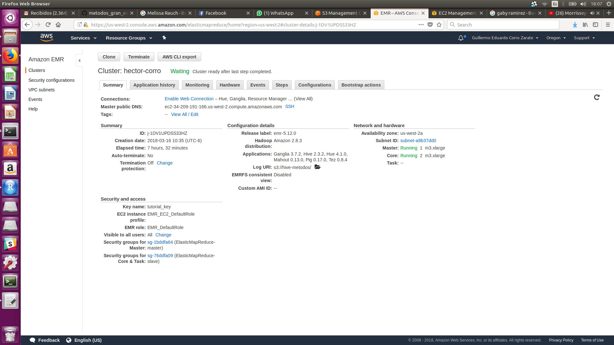
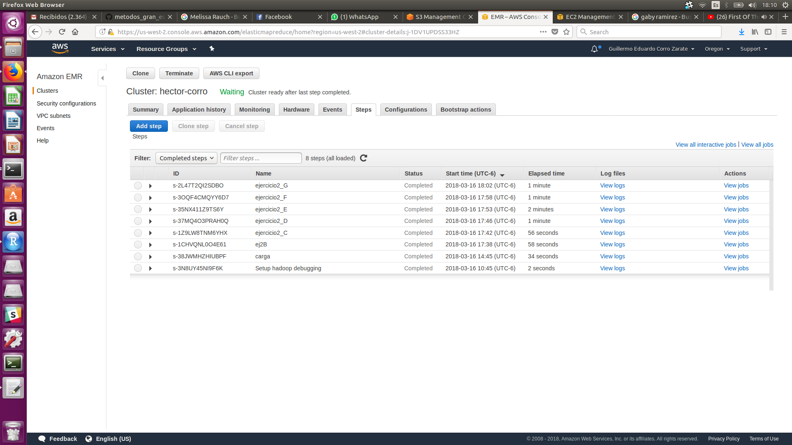

```{r setup, include=FALSE}
knitr::opts_chunk$set(echo = TRUE)
```

# Tarea 5

## Imagen cluster:



## Imagen de Steps:

Sólo puse los del 2do ejercicio, los del 1ero ya los había hecho en otra parte pero al clonar el cluster valieron :( :




## Ejercicio 1.

Ejercicio 1. Con la base de datos de northwind que se encuentran en el dropbox:

    a. ¿Cuántos "jefes" hay en la tabla empleados? ¿Cuáles son estos jefes: número de empleado, nombre, apellido, título, fecha de nacimiento, fecha en que iniciaron en la empresa, ciudad y país? (atributo reportsto, ocupa explode en tu respuesta)
    
[ej1_Acuenta.hql](ej1_Acuenta.hql)

```{r eval=FALSE}
use northwind;

select count(*) as boss_count
  from employees emp 
  join (select distinct reportsto from employees) bosses 
  on bosses.reportsto = emp.employeeid; 
```

Archivo resultado:

[Archivo resultado](result_ej1A.txt)


    b. ¿Quién es el segundo "mejor" empleado que más órdenes ha generado? (nombre, apellido, título, cuándo entró a la compañía, número de órdenes generadas, número de órdenes generadas por el mejor empleado (número 1))
    
[ej1_B.hql](ej1_B.hql)    

```{r eval=FALSE}
use northwind;

select a.employeeid, concat(e.lastname ," ",  e.firstname) as name, e.title, e.hiredate, a.total, lead(a.total,1) over (order by a.total) as first
    from ( 
    select o.employeeid, count(*) as total
    from orders o
    group by o.employeeid
    ) a
    join employees e
    on e.employeeid = a.employeeid
    order by first desc limit 1;

```

Archivo resultado

[Archivo resultado](result_ej1B.txt)

    c. ¿Cuál es el delta de tiempo más grande entre una orden y otra?
    
[ejercicio1_C.hql](ejercicio1_C.hql) 

```{r eval=FALSE}
use northwind;

SELECT rango.orderid as orderid, datediff(rango.orderdate, rango.diference) as rango
FROM(SELECT orderid, orderdate, (LAG(orderdate) OVER(ORDER BY orderid)) as diference FROM orders) rango
ORDER BY rango DESC
LIMIT 1;

```

Archivo resultado

[Archivo resultado](result_ej1C.txt)

##Ejercicio B.

Con los archivos de vuelos, aeropuertos y aerolíneas que están en el dropbox

    a. ¿Qué aerolíneas (nombres) llegan al aeropuerto "Honolulu International Airport"? 
    
[ejercicio2_A.hql](ejercicio2_A.hql)

```{r eval=FALSE}
use flights;

SELECT DISTINCT(vuelo.airline) as airline, a.airline FROM flights vuelo 
JOIN airlines a 
on a.iata_code = vuelo.airline
WHERE destination_airport = 'HNL'; 
```

Resultado:
[tare5_A](result_ej2A.txt)

    b. ¿En qué horario (hora del día, no importan los minutos) hay salidas del aeropuerto de San Francisco ("SFO") a "Honolulu International Airport"?
    
[ejercicio2_B.hql](ejercicio2_B.hql)

```{r eval=FALSE}
use flights;

SELECT DISTINCT substring(lpad(scheduled_departure,4,"0"),1,2) AS timevuelo 
FROM flights vuelo WHERE vuelo.destination_airport ='HNL' AND vuelo.origin_airport ='SFO'; 
```

Resultado:
[tarea5_B](result_ej2B.txt)

    c. ¿Qué día de la semana y en qué aerolínea nos conviene viajar a "Honolulu International Airport" para tener el menor retraso posible?
    
[ejercicio2_C.hql](ejercicio2_C.hql)

```{r eval=FALSE}
use flights;

SELECT flight.day_of_week, flight.airline, air.airline, MIN(flight.departure_delay) as retraso
 from flights flight join airlines air on air.iata_code = flight.airline 
WHERE flight.destination_airport ='HNL' 
group by flight.day_of_week, flight.airline, air.airline
order by retraso asc limit 1; 
```

Resultado:
[tarea5_C](result_ej2C.txt)

    D. ¿Cuál es el aeropuerto con mayor tráfico de entrada?
    
[ejercicio2_D.hql](ejercicio2_D.hql)
    
```{r eval=FALSE}
use flights;

SELECT fly.destination_airport, air.airport, count(fly.destination_airport) as arrival FROM flights fly
JOIN airports air 
ON air.iata_code = fly.destination_airport
GROUP BY fly.destination_airport, air.airport ORDER BY arrival DESC LIMIT 1;

```

Resultado: 
[tarea5_D](result_ej2D.txt)

    E. ¿Cuál es la aerolínea con mayor retraso de salida por día de la semana? 
    
[ejercicio2_E.hql](ejercicio2_E.hql)

```{r eval=FALSE}
use flights;

SELECT fly.day_of_week, air.airline, MAX(fly.departure_delay) mucho FROM airlines air JOIN flights fly ON (air.iata_code = fly.airline) GROUP BY fly.day_of_week, air.airline
ORDER BY mucho DESC
LIMIT 2;
```

Resultado:
[tarea5_D](result_ej2E.txt)

    f. ¿Cuál es la tercer aerolínea con menor retraso de salida los lunes (day of week = 2)?
    
[ejercicio2_F.hql](ejercicio2_F.hql)
    
```{r eval=FALSE}

use flights; 

SELECT  fly.airline, air.airline, MIN(fly.departure_delay) AS optimo FROM flights fly JOIN airlines air ON air.iata_code = fly.airline WHERE day_of_week = 2
GROUP BY fly.airline, air.airline
ORDER BY optimo ASC
LIMIT 1 OFFSET 2;

```

Resultado:
[tarea5_F](result_ej2F.txt)

    g. ¿Cuál es el aeropuerto origen que llega a la mayor cantidad de aeropuertos destino diferentes?
    
[ejercicio2_G.hql](ejercicio2_G.hql)

```{r eval=FALSE}

use flights; 

SELECT air.airport, COUNT(DISTINCT fly.destination_airport) AS destinos FROM flights fly JOIN airports air ON air.iata_code = fly.origin_airport 
GROUP BY air.airport
ORDER BY destinos DESC
limit 1; 

```

Resultado:
[tarea5_G](result_ej2G.txt)

##Ejercicio 1 y 2.

###Carga de base 1:

```{r eval=FALSE}

drop database if exists northwind cascade;

create database if not exists northwind location "s3://hive-metodos/hive/northwind"; 

create external table if not exists northwind.products (productid smallint,
productname string,
supplierid smallint,
categoryid smallint,
quantityperunit string,
unitprice float,
unitsinstock smallint,
unitsonorder smallint,
reorderlevel smallint,
discontinued int)
ROW FORMAT DELIMITED FIELDS TERMINATED BY ','
LOCATION 's3://hive-metodos/hive/northwind/products';

LOAD DATA INPATH 's3://hive-metodos/northwind/products.csv' INTO table northwind.products;

create external table if not exists northwind.orders (
orderid smallint,
customerid string,
employeeid smallint,
orderdate timestamp,
requireddate timestamp,
shippeddate timestamp,
shipvia smallint,
freight float,
shipname string,
shipaddress string,
shipcity string,
shipregion string,
shippostalcode string,
shipcountry string)
ROW FORMAT DELIMITED FIELDS TERMINATED BY ','
LOCATION 's3://hive-metodos/hive/northwind/orders';

LOAD DATA INPATH 's3://hive-metodos/northwind/orders.csv'
INTO table northwind.orders;

create external table if not exists northwind.order_details (orderid smallint,
productid smallint,
unitprice float,
quantity smallint,
discount float)
row format delimited fields terminated by ','
location 's3://hive-metodos/hive/northwind/orderdetails';

LOAD DATA INPATH 's3://hive-metodos/northwind/order_details.csv'
INTO table northwind.order_details;


create external table if not exists northwind.employees(
employeeid smallint,
lastname string,
firstname string,
title string ,
titleofcourtesy string,
birthdate string,
hiredate string,
address string,
city string,
region string,
postalcode string,
country string,
homephone string,
extension string,
photo string,
notes string,
reportsto smallint,
photopath string)
row format delimited fields terminated by ','
location 's3://hive-metodos/hive/northwind/employees';

LOAD DATA INPATH 's3://hive-metodos/northwind/employees.csv'
INTO table northwind.employees;

```

[northwind_carga.hql](northwind_carga.hql)

###Carga de base 2:

```{r eval=FALSE}

drop database if exists flights cascade;

create database if not exists flights location "s3://hive-metodos2/database/flights";

create external table if not exists flights.airlines (
iata_code string,
airline string)
ROW FORMAT DELIMITED FIELDS TERMINATED BY ','
LOCATION 's3://hive-metodos2/database/flights/airlines'
tblproperties ("skip.header.line.count"="1");
LOAD DATA INPATH 's3://hive-metodos2/Data/airlines.csv' INTO table flights.airlines;

create external table if not exists flights.airports (
iata_code string,
airport string,
city string,
state string,
country string,
latitude double,
longitude double)
ROW FORMAT DELIMITED FIELDS TERMINATED BY ','
LOCATION 's3://hive-metodos2/database/flights/airports'
tblproperties ("skip.header.line.count"="1");
LOAD DATA INPATH 's3://hive-metodos2/Data/airports.csv' INTO table flights.airports;

create external table if not exists flights.flights (
year smallint,
month smallint,
day smallint,
day_of_week smallint,
airline string,
flight_number smallint,
tail_number string,
origin_airport string,
destination_airport string,
scheduled_departure smallint,
departure_time smallint,
departure_delay smallint,
taxi_out smallint,
wheels_off smallint,
scheduled_time smallint,
elapsed_time smallint,
air_time smallint,
distance smallint,
wheels_on smallint,
taxi_in smallint,
scheduled_arrival smallint,
arrival_time smallint,
arrival_delay smallint,
diverted smallint,
cancelled smallint,
cancellation_reason string,
air_system_delay string,
security_delay string,
airline_delay string,
late_aircraft_delay string,
weather_delay string
)
ROW FORMAT DELIMITED FIELDS TERMINATED BY ','
LOCATION 's3://hive-metodos2/database/flights/flights'
tblproperties ("skip.header.line.count"="1");
LOAD DATA INPATH 's3://hive-metodos2/Data/flights.csv' INTO table flights.flights;

```

[flights_carga.hql](flights_carga.hql)
