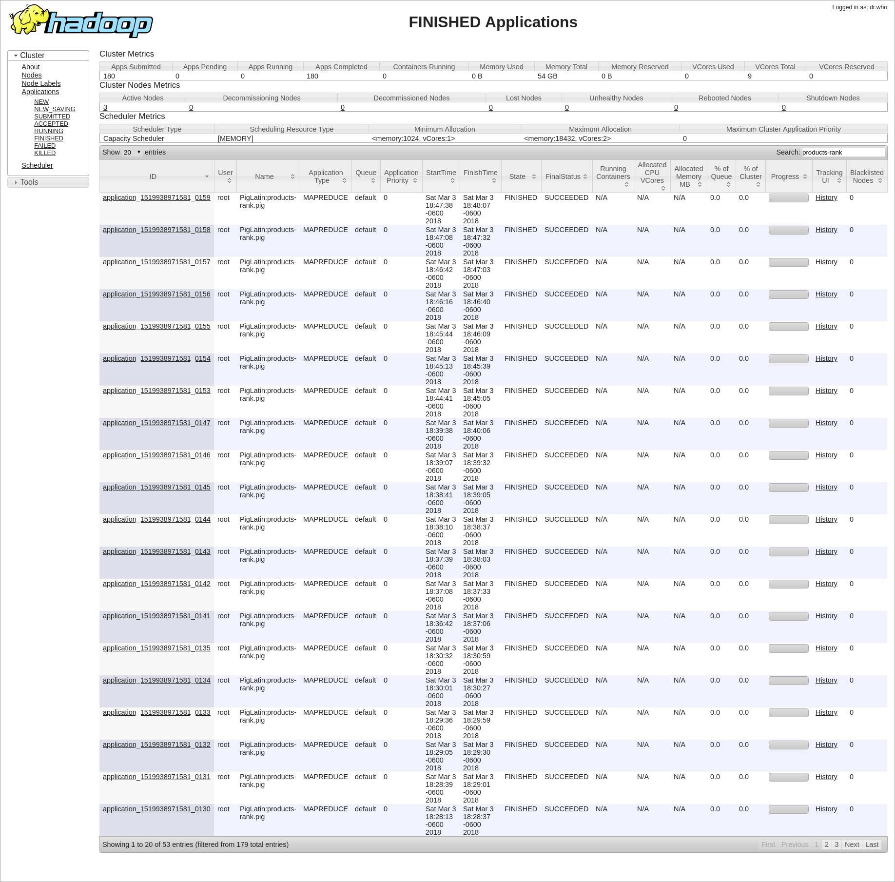

_175904 - Jorge III Altamirano Astorga_

## {.tabset}

### Cluster {.tabset}

Yo mantuve el cluster que tengo en una máquina, por lo que opté esta opción, en vez de Amazon Web Services. Esta opción es mucho más conveniente, dado que quien me patrocina (Peñoles) va a optar por _on-prem_ en vez.

Los nodos mantienen por esta razón los nombres de los integrantes de mi equipo :-)

#### Nodos

#### JPS Nodo Master

#### JPS Nodo 2

#### JPS Nodo 3

### Ejercicio A {.tabset}

Los datos de northwind se encuentran en  [dropbox](https://www.dropbox.com/sh/qormkgqgt5o8zk3/AADNbqwqeXEfM_tNcieeX0B-a?dl=0)

Modifica el ejercicio de Rank para que en lugar de obtener el id del producto con mejor rank obtengamos el nombre del producto -requieres un join- con el mejor rank

_El ID  es el 45, el cual corresponde a Raclette Courdavault._

#### Código Pig

<pre><code>
customers = load '/data/northwind/customers.csv' using PigStorage(',') as (
  customerid:chararray, companyname:chararray, contactname:chararray,
  contacttitle:chararray, address:chararray, city:chararray, 
  region:chararray, postalcode:chararray, country:chararray,
  phone:chararray, fax:chararray
);
employees = load '/data/northwind/employees.csv' using PigStorage(',') as (
  employeeid:int, lastname:chararray, firstname:chararray,
  title:chararray, titleofcourtesy:chararray, birthdate:chararray,
  hiredate:chararray, address:chararray, city:chararray, 
  region:chararray, postalcode:chararray, country:chararray, 
  homephone:chararray, extension:chararray, photo:chararray, 
  notes:chararray, reportsto:chararray, photopath:chararray
);
orderdetails = load '/data/northwind/order_details.csv' using PigStorage(',') as (
  orderid:int, productid:int, unitprice:float, quantity:int,
  discount:float
);
--- didn't implement as datetime due to data loss prevention :-)
orders = load '/data/northwind/orders.csv' using PigStorage(',') as (
  orderid:int, customerid:chararray, employeeid:int,
  orderdate:chararray, requireddate:chararray, shippeddate:chararray, 
  shipvia:int, freight:float, shipname:chararray,
  shipaddress:chararray, shipcity:chararray, shipregion:chararray,
  shippostalcode:chararray, shipcountry:chararray
);
products = load '/data/northwind/products.csv' using PigStorage(',') as (
  productid:int, productname:chararray, supplierid:int,
  categoryid:int, quantityperunit:chararray, unitprice:float,
  unitsinstock:int, unitsonorder:int, reorderlevel:int,
  discontinued:boolean
);

group_orders = group orderdetails by productid;
count_products = FOREACH group_orders GENERATE group as productid, COUNT($1) as n;
ranked = rank count_products by n DESC;
limited_rank = limit ranked 1;
out = JOIN products by productid, limited_rank by productid;
store out into '/tarea_4/ejercicio_a' USING org.apache.pig.piggybank.storage.CSVExcelStorage(',', 'NO_MULTILINE', 'UNIX', 'WRITE_OUTPUT_HEADER');
</code></pre>

#### Output

<pre><code>
products::productid,products::productname,products::supplierid,products::categoryid,products::quantityperunit,products::unitprice,products::unitsinstock,products::unitsonorder,products::reorderlevel,products::discontinued,limited_rank::rank_count_products,limited_rank::productid,limited_rank::n
59,Raclette Courdavault,28,4,5 kg pkg.,55.0,79,0,0,,1,59,54
</code></pre>

#### Jobs 

### Ejercicio B {.tabset}

Con los datos de aerolíneas, vuelos y aeropuertos que se encuentran en el [dropbox](https://www.dropbox.com/sh/rdd78b7nofjb5vy/AAAwUm97baTusv5l8QY2ZAi2a?dl=0) y **utilizando Pig** contesta las siguietnes preguntas:

#### Parte 1 {.tabset}

1. ¿Cuántos vuelos existen en el dataset cuyo aeropuerto destino sea el "Honolulu International Airport"?

_Existen 43157 con destino a Honolulu International Airport (HNL)._

##### Pig

<pre><code>
flights = load '/data/flights/flights.csv' using PigStorage(',') as (
  year:int, month:int, day:int, day_of_week:int, 
  airline:chararray, flight_number:int, tail_number:chararray,
  origin_airport:chararray, destination_airport:chararray,
  scheduled_departure:int, departure_time:int,
  departure_delay:long, taxi_out:int, wheels_off:int,
  scheduled_time:int, elapsed_time:int, air_time:int,
  distance:int, wheels_on:int, taxi_in:int, 
  scheduled_arrival:int, arrival_time:int, arrival_delay:int,
  diverted:int, cancelled:int, cancellation_reason:chararray,
  air_system_delay:chararray, security_delay:chararray,
  airline_delay:chararray, late_aircraft_delay:chararray,
  weather_delay:chararray);
airports = load '/data/flights/airports.csv' using PigStorage(',') as (
  iata_code:chararray, airport:chararray, city:chararray,
  state:chararray, country:chararray,
  latitude:double, longitude:double);
airlines = load '/data/flights/airlines.csv' using PigStorage(',') as (
  iata_code:chararray, airline:chararray);

airlines_airport_arr = JOIN flights by destination_airport, airports by iata_code;
airlines_filter = FILTER airlines_airport_arr BY airport matches 'Honolulu International Airport';
airlines_group = GROUP airlines_filter BY airport;
airlines_count = FOREACH airlines_group GENERATE COUNT($1) AS n_flights, group, flatten(airlines_filter.iata_code) AS iata_code;
airlines_limit = LIMIT airlines_count 1;
store airlines_limit into '/tarea_4/ejercicio_b.1' USING org.apache.pig.piggybank.storage.CSVExcelStorage(',', 'NO_MULTILINE', 'UNIX', 'WRITE_OUTPUT_HEADER');
</code></pre>

##### Output

<pre><code>
n_flights,group,iata_code
43157,Honolulu International Airport,HNL
</code></pre>

##### Jobs 

#### Parte 2 {.tabset}

2. ¿Cuál es el vuelo con más retraso? ¿De qué aerolínea es? 

_La aerolínea con el vuelo con mayor retraso es de American Airlines (AA)._

##### Pig

<pre><code>
flights = load '/data/flights/flights.csv' using PigStorage(',') as (
  year:int, month:int, day:int, day_of_week:int, 
  airline:chararray, flight_number:int, tail_number:chararray,
  origin_airport:chararray, destination_airport:chararray,
  scheduled_departure:int, departure_time:int,
  departure_delay:long, taxi_out:int, wheels_off:int,
  scheduled_time:int, elapsed_time:int, air_time:int,
  distance:int, wheels_on:int, taxi_in:int, 
  scheduled_arrival:int, arrival_time:int, arrival_delay:int,
  diverted:int, cancelled:int, cancellation_reason:chararray,
  air_system_delay:chararray, security_delay:chararray,
  airline_delay:chararray, late_aircraft_delay:chararray,
  weather_delay:chararray);
airports = load '/data/flights/airports.csv' using PigStorage(',') as (
  iata_code:chararray, airport:chararray, city:chararray,
  state:chararray, country:chararray,
  latitude:double, longitude:double);
airlines = load '/data/flights/airlines.csv' using PigStorage(',') as (
  iata_code:chararray, airline:chararray);

flights_delay = FOREACH flights GENERATE flight_number AS flight_number, 
  airline AS airline, arrival_delay AS arrival_delay;
flights_order = ORDER flights_delay BY arrival_delay DESC; 
flights_limit = LIMIT flights_order 1;
flights_join = JOIN flights_limit by airline, airlines by iata_code;

--- airlines_airport_arr = JOIN flights by destination_airport, airports by iata_code;
--- airlines_filter = FILTER airlines_airport_arr BY airport matches 'Honolulu International Airport';

store flights_join into '/tarea_4/ejercicio_b.2' USING org.apache.pig.piggybank.storage.CSVExcelStorage(',', 'NO_MULTILINE', 'UNIX', 'WRITE_OUTPUT_HEADER');
</code></pre>

##### Output

<pre><code>
flights_limit::flight_number,flights_limit::airline,flights_limit::arrival_delay,airlines::iata_code,airlines::airline
1322,AA,1971,AA,American Airlines Inc.
</code></pre>

##### Jobs 

#### Parte 3 {.tabset}

3. ¿Qué día es en el que más vuelos cancelados hay? 

_El primer día de la semana (Lunes o el Domingo, dependiendo del contexto, pero se puede interpretar que es Lunes, por los [estándares internacionales](https://www.timeanddate.com/calendar/days/)) con 21,073 vuelos cancelados._

##### Pig

<pre><code>
flights = load '/data/flights/flights.csv' using PigStorage(',') as (
  year:int, month:int, day:int, day_of_week:int, 
  airline:chararray, flight_number:int, tail_number:chararray,
  origin_airport:chararray, destination_airport:chararray,
  scheduled_departure:int, departure_time:int,
  departure_delay:long, taxi_out:int, wheels_off:int,
  scheduled_time:int, elapsed_time:int, air_time:int,
  distance:int, wheels_on:int, taxi_in:int, 
  scheduled_arrival:int, arrival_time:int, arrival_delay:int,
  diverted:int, cancelled:int, cancellation_reason:chararray,
  air_system_delay:chararray, security_delay:chararray,
  airline_delay:chararray, late_aircraft_delay:chararray,
  weather_delay:chararray);
airports = load '/data/flights/airports.csv' using PigStorage(',') as (
  iata_code:chararray, airport:chararray, city:chararray,
  state:chararray, country:chararray,
  latitude:double, longitude:double);
airlines = load '/data/flights/airlines.csv' using PigStorage(',') as (
  iata_code:chararray, airline:chararray);

flights_cancel = FILTER flights BY cancelled == 1;
flights_group = GROUP flights_cancel BY day_of_week;
flights_delay = FOREACH flights_group GENERATE group AS day_of_week, COUNT($1) AS n_cancelled;
flights_order = ORDER flights_delay BY n_cancelled DESC; 
flights_limit = LIMIT flights_order 1;

store flights_limit into '/tarea_4/ejercicio_b.3' USING org.apache.pig.piggybank.storage.CSVExcelStorage(',', 'NO_MULTILINE', 'UNIX', 'WRITE_OUTPUT_HEADER');
</code></pre>

##### Output

<pre><code>
day_of_week,n_cancelled
1,21073
</code></pre>

##### Jobs 

#### Parte 4 {.tabset}

4. ¿Cuáles son los aeropuertos orígen con 17 cancelaciones? 

_Son:_

* _DHN, Dothan Regional Airport, Dothan, AL, USA_
* _DIK, Dickinson Theodore Roosevelt Regional Airport, Dickinson, ND, USA_
* _ESC, Delta County Airport, Escanaba, MI, USA_

##### Pig

<pre><code>
flights = load '/data/flights/flights.csv' using PigStorage(',') as (
  year:int, month:int, day:int, day_of_week:int, 
  airline:chararray, flight_number:int, tail_number:chararray,
  origin_airport:chararray, destination_airport:chararray,
  scheduled_departure:int, departure_time:int,
  departure_delay:long, taxi_out:int, wheels_off:int,
  scheduled_time:int, elapsed_time:int, air_time:int,
  distance:int, wheels_on:int, taxi_in:int, 
  scheduled_arrival:int, arrival_time:int, arrival_delay:int,
  diverted:int, cancelled:int, cancellation_reason:chararray,
  air_system_delay:chararray, security_delay:chararray,
  airline_delay:chararray, late_aircraft_delay:chararray,
  weather_delay:chararray);
airports = load '/data/flights/airports.csv' using PigStorage(',') as (
  iata_code:chararray, airport:chararray, city:chararray,
  state:chararray, country:chararray,
  latitude:double, longitude:double);
airlines = load '/data/flights/airlines.csv' using PigStorage(',') as (
  iata_code:chararray, airline:chararray);

flights_cancel = FILTER flights BY cancelled == 1;
flights_group = GROUP flights_cancel BY origin_airport;
flights_4each = FOREACH flights_group GENERATE group AS origin_airport, COUNT($1) AS n_cancelled;
flights_airpr = FILTER flights_4each BY n_cancelled == 17;
flights_join = JOIN flights_airpr BY origin_airport, airports BY iata_code;

store flights_join into '/tarea_4/ejercicio_b.4' USING org.apache.pig.piggybank.storage.CSVExcelStorage(',', 'NO_MULTILINE', 'UNIX', 'WRITE_OUTPUT_HEADER');
</code></pre>

##### Output

<pre><code>
flights_airpr::origin_airport,flights_airpr::n_cancelled,airports::iata_code,airports::airport,airports::city,airports::state,airports::country,airports::latitude,airports::longitude
DHN,17,DHN,Dothan Regional Airport,Dothan,AL,USA,31.32134,-85.44963
DIK,17,DIK,Dickinson Theodore Roosevelt Regional Airport,Dickinson,ND,USA,46.79739,-102.80195
ESC,17,ESC,Delta County Airport,Escanaba,MI,USA,45.72267,-87.09373
</code></pre>

##### Jobs 

#### Parte 5 {.tabset}

5. ¿Cuál es el aeropuerto origen con más vuelos cancelados? 

_El aeropuerto es Chicago O'Hare International Airport (ORD)._

##### Pig

<pre><code>
flights = load '/data/flights/flights.csv' using PigStorage(',') as (
  year:int, month:int, day:int, day_of_week:int, 
  airline:chararray, flight_number:int, tail_number:chararray,
  origin_airport:chararray, destination_airport:chararray,
  scheduled_departure:int, departure_time:int,
  departure_delay:long, taxi_out:int, wheels_off:int,
  scheduled_time:int, elapsed_time:int, air_time:int,
  distance:int, wheels_on:int, taxi_in:int, 
  scheduled_arrival:int, arrival_time:int, arrival_delay:int,
  diverted:int, cancelled:int, cancellation_reason:chararray,
  air_system_delay:chararray, security_delay:chararray,
  airline_delay:chararray, late_aircraft_delay:chararray,
  weather_delay:chararray);
airports = load '/data/flights/airports.csv' using PigStorage(',') as (
  iata_code:chararray, airport:chararray, city:chararray,
  state:chararray, country:chararray,
  latitude:double, longitude:double);
airlines = load '/data/flights/airlines.csv' using PigStorage(',') as (
  iata_code:chararray, airline:chararray);

SET DEFAULT_PARALLEL 5;

flights_cancel = FILTER flights BY cancelled == 1;
flights_group = GROUP flights_cancel BY origin_airport;
flights_4each = FOREACH flights_group GENERATE group AS origin_airport, COUNT($1) AS n_cancelled;
flights_order = ORDER flights_4each BY n_cancelled DESC;
flights_limit = LIMIT flights_order 1;
flights_join = JOIN flights_limit BY origin_airport, airports BY iata_code;

store flights_join into '/tarea_4/ejercicio_b.5' USING org.apache.pig.piggybank.storage.CSVExcelStorage(',', 'NO_MULTILINE', 'UNIX', 'WRITE_OUTPUT_HEADER');
</code></pre>

##### Output

<pre><code>
flights_limit::origin_airport,flights_limit::n_cancelled,airports::iata_code,airports::airport,airports::city,airports::state,airports::country,airports::latitude,airports::longitude
ORD,8548,ORD,Chicago O'Hare International Airport,Chicago,IL,USA,41.9796,-87.90446
</code></pre>

##### Jobs 

#### Parte 6 {.tabset}

6. ¿Cuál es el vuelo (flight number) con mayor diversidad de aeropuertos destino, cuáles son estos destinos? (ocupar bag te ayudará en esta pregunta)

_Es el vuelo 202 con 46 destinos:_

* _airports::airport (flights_flatt::destination)_
* _Hartsfield-Jackson Atlanta International Airport (ATL)_
* _Austin-Bergstrom International Airport (AUS)_
* _Bradley International Airport (BDL)_
* _Nashville International Airport (BNA)_
* _Gen. Edward Lawrence Logan International Airport (BOS)_
* _Baltimore-Washington International Airport (BWI)_
* _Akron-Canton Regional Airport (CAK)_
* _Cleveland Hopkins International Airport (CLE)_
* _Ronald Reagan Washington National Airport (DCA)_
* _Denver International Airport (DEN)_
* _Detroit Metropolitan Airport (DTW)_
* _Newark Liberty International Airport (EWR)_
* _Fort Lauderdale-Hollywood International Airport (FLL)_
* _Bishop International Airport (FNT)_
* _Washington Dulles International Airport (IAD)_
* _George Bush Intercontinental Airport (IAH)_
* _Indianapolis International Airport (IND)_
* _Hilo International Airport (ITO)_
* _John F. Kennedy International Airport (New York International Airport) (JFK)_
* _McCarran International Airport (LAS)_
* _Los Angeles International Airport (LAX)_
* _LaGuardia Airport (Marine Air Terminal) (LGA)_
* _Orlando International Airport (MCO)_
* _Chicago Midway International Airport (MDW)_
* _General Mitchell International Airport (MKE)_
* _Dane County Regional Airport (MSN)_
* _Minneapolis-Saint Paul International Airport (MSP)_
* _Oakland International Airport (OAK)_
* _Kahului Airport (OGG)_
* _Will Rogers World Airport (OKC)_
* _Chicago O'Hare International Airport (ORD)_
* _Portland International Airport (PDX)_
* _Philadelphia International Airport (PHL)_
* _Phoenix Sky Harbor International Airport (PHX)_
* _Pittsburgh International Airport (PIT)_
* _Raleigh-Durham International Airport (RDU)_
* _Reno/Tahoe International Airport (RNO)_
* _Southwest Florida International Airport (RSW)_
* _San Diego International Airport (Lindbergh Field) (SAN)_
* _San Antonio International Airport (SAT)_
* _Seattle-Tacoma International Airport (SEA)_
* _San Francisco International Airport (SFO)_
* _Salt Lake City International Airport (SLC)_
* _Sacramento International Airport (SMF)_
* _Tampa International Airport (TPA)_

##### Pig

<pre><code>
flights = load '/data/flights/flights.csv' using PigStorage(',') as (
  year:int, month:int, day:int, day_of_week:int, 
  airline:chararray, flight_number:int, tail_number:chararray,
  origin_airport:chararray, destination_airport:chararray,
  scheduled_departure:int, departure_time:int,
  departure_delay:long, taxi_out:int, wheels_off:int,
  scheduled_time:int, elapsed_time:int, air_time:int,
  distance:int, wheels_on:int, taxi_in:int, 
  scheduled_arrival:int, arrival_time:int, arrival_delay:int,
  diverted:int, cancelled:int, cancellation_reason:chararray,
  air_system_delay:chararray, security_delay:chararray,
  airline_delay:chararray, late_aircraft_delay:chararray,
  weather_delay:chararray);
airports = load '/data/flights/airports.csv' using PigStorage(',') as (
  iata_code:chararray, airport:chararray, city:chararray,
  state:chararray, country:chararray,
  latitude:double, longitude:double);

SET DEFAULT_PARALLEL 10;
flights_4each = FOREACH flights GENERATE flight_number, dest;
flights_group = GROUP flights BY flight_number;
flights_disti = FOREACH flights_group {
  DA = DISTINCT flights.destination_airport;
  GENERATE
    group AS flight_number, 
    DA as destinations,
    COUNT(DA) AS  n_destinations; };
flights_order = ORDER flights_disti BY n_destinations DESC;
flights_limit = LIMIT flights_order 1;
flights_flatt = FOREACH flights_limit GENERATE
  flight_number, n_destinations,
  flatten(destinations) AS destination;
flights_join  = JOIN flights_flatt BY destination, airports BY iata_code;
flights_out   = FOREACH flights_join GENERATE
  flight_number, n_destinations, destination, airport, city, state, country;

store flights_out into '/tarea_4/ejercicio_b.6' USING org.apache.pig.piggybank.storage.CSVExcelStorage(',', 'NO_MULTILINE', 'UNIX', 'WRITE_OUTPUT_HEADER');
</code></pre>

##### Output

<pre><code>
flights_flatt::flight_number,flights_flatt::n_destinations,flights_flatt::destination,airports::airport,airports::city,airports::state,airports::country
202,68,ATL,Hartsfield-Jackson Atlanta International Airport,Atlanta,GA,USA
202,68,AUS,Austin-Bergstrom International Airport,Austin,TX,USA
202,68,BDL,Bradley International Airport,Windsor Locks,CT,USA
202,68,BNA,Nashville International Airport,Nashville,TN,USA
202,68,BOS,Gen. Edward Lawrence Logan International Airport,Boston,MA,USA
202,68,BWI,Baltimore-Washington International Airport,Baltimore,MD,USA
202,68,CAK,Akron-Canton Regional Airport,Akron,OH,USA
202,68,CLE,Cleveland Hopkins International Airport,Cleveland,OH,USA
202,68,DCA,Ronald Reagan Washington National Airport,Arlington,VA,USA
202,68,DEN,Denver International Airport,Denver,CO,USA
202,68,DTW,Detroit Metropolitan Airport,Detroit,MI,USA
202,68,EWR,Newark Liberty International Airport,Newark,NJ,USA
202,68,FLL,Fort Lauderdale-Hollywood International Airport,Ft. Lauderdale,FL,USA
202,68,FNT,Bishop International Airport,Flint,MI,USA
202,68,IAD,Washington Dulles International Airport,Chantilly,VA,USA
202,68,IAH,George Bush Intercontinental Airport,Houston,TX,USA
202,68,IND,Indianapolis International Airport,Indianapolis,IN,USA
202,68,ITO,Hilo International Airport,Hilo,HI,USA
202,68,JFK,John F. Kennedy International Airport (New York International Airport),New York,NY,USA
202,68,LAS,McCarran International Airport,Las Vegas,NV,USA
202,68,LAX,Los Angeles International Airport,Los Angeles,CA,USA
202,68,LGA,LaGuardia Airport (Marine Air Terminal),New York,NY,USA
202,68,MCO,Orlando International Airport,Orlando,FL,USA
202,68,MDW,Chicago Midway International Airport,Chicago,IL,USA
202,68,MKE,General Mitchell International Airport,Milwaukee,WI,USA
202,68,MSN,Dane County Regional Airport,Madison,WI,USA
202,68,MSP,Minneapolis-Saint Paul International Airport,Minneapolis,MN,USA
202,68,OAK,Oakland International Airport,Oakland,CA,USA
202,68,OGG,Kahului Airport,Kahului,HI,USA
202,68,OKC,Will Rogers World Airport,Oklahoma City,OK,USA
202,68,ORD,Chicago O'Hare International Airport,Chicago,IL,USA
202,68,PDX,Portland International Airport,Portland,OR,USA
202,68,PHL,Philadelphia International Airport,Philadelphia,PA,USA
202,68,PHX,Phoenix Sky Harbor International Airport,Phoenix,AZ,USA
202,68,PIT,Pittsburgh International Airport,Pittsburgh,PA,USA
202,68,RDU,Raleigh-Durham International Airport,Raleigh,NC,USA
202,68,RNO,Reno/Tahoe International Airport,Reno,NV,USA
202,68,RSW,Southwest Florida International Airport,Ft. Myers,FL,USA
202,68,SAN,San Diego International Airport (Lindbergh Field),San Diego,CA,USA
202,68,SAT,San Antonio International Airport,San Antonio,TX,USA
202,68,SEA,Seattle-Tacoma International Airport,Seattle,WA,USA
202,68,SFO,San Francisco International Airport,San Francisco,CA,USA
202,68,SLC,Salt Lake City International Airport,Salt Lake City,UT,USA
202,68,SMF,Sacramento International Airport,Sacramento,CA,USA
202,68,TPA,Tampa International Airport,Tampa,FL,USA
</code></pre>

##### Jobs 

### Conclusiones

1. Lidiar con los datos es difícil
1. Pig es relativamente intuitivo para los que venimos en Java
1. En todos los _pig scripts_ puse todas las tablas con el fin de clarificar, y dado que no tiene pérdida de rendimiento al ser muy inteligente Pig :-), pues entonces los dejé por dicha razón.
1. Los bags son diferentes de manejar y que toma tiempo entenderles, pues como al ser más orientado a trabajos por lote (batch) que interactivo o en línea. Demora más el aprendizaje.