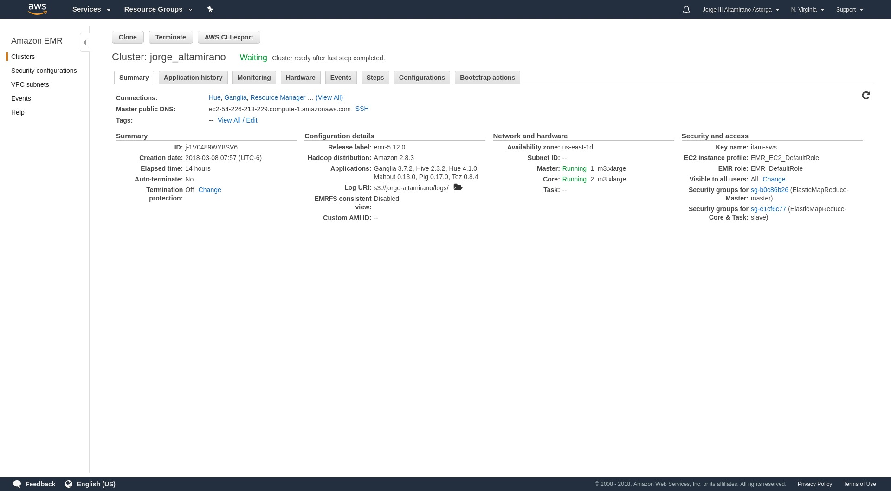
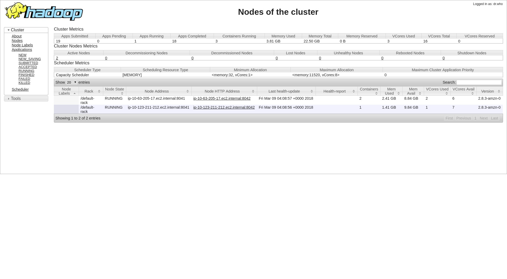
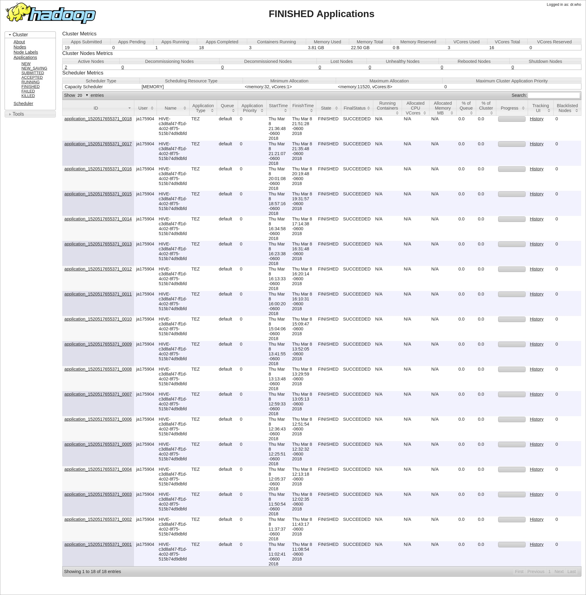

## {.tabset}

### Cluster {.tabset}

Originalmente intenté realizarlo como la _Tarea 4_ on-prem, pero me costó mucho tiempo y esfuerzo echar a andar HUE, por lo que opté por utilizar Amazon Web Services. Mis esfuerzos están en el siguiente repo separado: [github.com/philwebsurfer/hadoop-c7](https://github.com/philwebsurfer/hadoop-c7)

Con tiempo libre le sigo :-), después de los exámenes.

#### AWS EMR Cluster

Muestro mi cluster con mi nombre.

#### Nodos

Esta es una diferencia notoria: aquí el nodo master no procesa más allá de la _orquestación_.

#### Jobs

Noté que Hive funciona mucho más distinto a Pig, el cual es sólo un simple convertidor. En este caso, como que mantiene todo el tiempo un Map Reduce en _hot standby_. Además no todo lo manda a MapRed.

### Ejercicio 1 {.tabset}

#### Ejercicio 1.a {.tabset}

¿Cuántos "jefes" hay en la tabla empleados? ¿Cuáles son estos jefes: número de empleado, nombre, apellido, título, fecha de nacimiento, fecha en que iniciaron en la empresa, ciudad y país? (atributo `reportsto`, ocupa `explode` en tu respuesta)

_Son 2 ejefes: Steven Buchanan._

##### Hive QL

<pre><code>
SELECT t2.reportsto employeeid, t1.firstname, t1.lastname,
    t1.birthdate, t1.hiredate, t1.city, t1.country
    FROM employees t1
    JOIN (
        SELECT reportsto
        FROM employees
        WHERE char_length(reportsto) > 0
    ) t2
    ON t2.reportsto = t1.employeeid
    GROUP BY t2.reportsto, t1.firstname, t1.lastname,
    t1.birthdate, t1.hiredate, t1.city, t1.country;
    
--- Datos solicitados: (con explode)
--- número de empleado, nombre, apellido, título, 
--- fecha de nacimiento, aniv empresa, ciudad y país
--- SELECT collect_set(reportsto) 
---    FROM employees 
---    WHERE char_length(reportsto) > 0;
SELECT t.employeeid employeeid, t.firstname firstname, 
    t.lastname lastname, t.title title, t.birthdate birthdate,
    t.hiredate hiredate, t.city city, t.country country,
    v1.reportees reportees FROM
(
  SELECT t1.employeeid, t1.firstname, t1.lastname, 
    t1.title as title, t1.birthdate, t1.hiredate,
    t1.city, t1.country, t2.reportee
  FROM employees t1
  JOIN
  (
    SELECT reportsto, collect_list((firstname||' ')||lastname) AS reportee
    FROM employees
    WHERE reportsto > 0
    GROUP BY reportsto
  ) t2
  ON t1.employeeid = t2.reportsto
) t
LATERAL VIEW explode(t.reportee) v1 as reportees;
</code></pre>

##### Output

<pre><code>
employeeid	firstname	lastname	title	birthdate	hiredate	city	country	reportees
5	Steven	Buchanan	Sales Manager	1955-03-04	1993-10-17	London	UK	Michael Suyama
5	Steven	Buchanan	Sales Manager	1955-03-04	1993-10-17	London	UK	Robert King
5	Steven	Buchanan	Sales Manager	1955-03-04	1993-10-17	London	UK	Anne Dodsworth
5	Steven	Buchanan	Sales Manager	1955-03-04	1993-10-17	London	UK	Michael Suyama
5	Steven	Buchanan	Sales Manager	1955-03-04	1993-10-17	London	UK	Robert King
5	Steven	Buchanan	Sales Manager	1955-03-04	1993-10-17	London	UK	Anne Dodsworth
5	Steven	Buchanan	Sales Manager	1955-03-04	1993-10-17	London	UK	Michael Suyama
5	Steven	Buchanan	Sales Manager	1955-03-04	1993-10-17	London	UK	Robert King
5	Steven	Buchanan	Sales Manager	1955-03-04	1993-10-17	London	UK	Anne Dodsworth
5	Steven	Buchanan	Sales Manager	1955-03-04	1993-10-17	London	UK	Michael Suyama
5	Steven	Buchanan	Sales Manager	1955-03-04	1993-10-17	London	UK	Robert King
5	Steven	Buchanan	Sales Manager	1955-03-04	1993-10-17	London	UK	Anne Dodsworth
5	Steven	Buchanan	Sales Manager	1955-03-04	1993-10-17	London	UK	Michael Suyama
5	Steven	Buchanan	Sales Manager	1955-03-04	1993-10-17	London	UK	Robert King
5	Steven	Buchanan	Sales Manager	1955-03-04	1993-10-17	London	UK	Anne Dodsworth
5	Steven	Buchanan	Sales Manager	1955-03-04	1993-10-17	London	UK	Michael Suyama
5	Steven	Buchanan	Sales Manager	1955-03-04	1993-10-17	London	UK	Robert King
5	Steven	Buchanan	Sales Manager	1955-03-04	1993-10-17	London	UK	Anne Dodsworth
5	Steven	Buchanan	Sales Manager	1955-03-04	1993-10-17	London	UK	Michael Suyama
5	Steven	Buchanan	Sales Manager	1955-03-04	1993-10-17	London	UK	Robert King
5	Steven	Buchanan	Sales Manager	1955-03-04	1993-10-17	London	UK	Anne Dodsworth
5	Steven	Buchanan	Sales Manager	1955-03-04	1993-10-17	London	UK	Michael Suyama
5	Steven	Buchanan	Sales Manager	1955-03-04	1993-10-17	London	UK	Robert King
5	Steven	Buchanan	Sales Manager	1955-03-04	1993-10-17	London	UK	Anne Dodsworth
5	Steven	Buchanan	Sales Manager	1955-03-04	1993-10-17	London	UK	Michael Suyama
5	Steven	Buchanan	Sales Manager	1955-03-04	1993-10-17	London	UK	Robert King
5	Steven	Buchanan	Sales Manager	1955-03-04	1993-10-17	London	UK	Anne Dodsworth
2	Andrew	Fuller	"Vice President	 Sales"	1952-02-19	1992-08-14	Tacoma	USA	Nancy Davolio
2	Andrew	Fuller	"Vice President	 Sales"	1952-02-19	1992-08-14	Tacoma	USA	Janet Leverling
2	Andrew	Fuller	"Vice President	 Sales"	1952-02-19	1992-08-14	Tacoma	USA	Margaret Peacock
2	Andrew	Fuller	"Vice President	 Sales"	1952-02-19	1992-08-14	Tacoma	USA	Steven Buchanan
2	Andrew	Fuller	"Vice President	 Sales"	1952-02-19	1992-08-14	Tacoma	USA	Laura Callahan
2	Andrew	Fuller	"Vice President	 Sales"	1952-02-19	1992-08-14	Tacoma	USA	Nancy Davolio
2	Andrew	Fuller	"Vice President	 Sales"	1952-02-19	1992-08-14	Tacoma	USA	Janet Leverling
2	Andrew	Fuller	"Vice President	 Sales"	1952-02-19	1992-08-14	Tacoma	USA	Margaret Peacock
2	Andrew	Fuller	"Vice President	 Sales"	1952-02-19	1992-08-14	Tacoma	USA	Steven Buchanan
2	Andrew	Fuller	"Vice President	 Sales"	1952-02-19	1992-08-14	Tacoma	USA	Laura Callahan
2	Andrew	Fuller	"Vice President	 Sales"	1952-02-19	1992-08-14	Tacoma	USA	Nancy Davolio
2	Andrew	Fuller	"Vice President	 Sales"	1952-02-19	1992-08-14	Tacoma	USA	Janet Leverling
2	Andrew	Fuller	"Vice President	 Sales"	1952-02-19	1992-08-14	Tacoma	USA	Margaret Peacock
2	Andrew	Fuller	"Vice President	 Sales"	1952-02-19	1992-08-14	Tacoma	USA	Steven Buchanan
2	Andrew	Fuller	"Vice President	 Sales"	1952-02-19	1992-08-14	Tacoma	USA	Laura Callahan
2	Andrew	Fuller	"Vice President	 Sales"	1952-02-19	1992-08-14	Tacoma	USA	Nancy Davolio
2	Andrew	Fuller	"Vice President	 Sales"	1952-02-19	1992-08-14	Tacoma	USA	Janet Leverling
2	Andrew	Fuller	"Vice President	 Sales"	1952-02-19	1992-08-14	Tacoma	USA	Margaret Peacock
2	Andrew	Fuller	"Vice President	 Sales"	1952-02-19	1992-08-14	Tacoma	USA	Steven Buchanan
2	Andrew	Fuller	"Vice President	 Sales"	1952-02-19	1992-08-14	Tacoma	USA	Laura Callahan
2	Andrew	Fuller	"Vice President	 Sales"	1952-02-19	1992-08-14	Tacoma	USA	Nancy Davolio
2	Andrew	Fuller	"Vice President	 Sales"	1952-02-19	1992-08-14	Tacoma	USA	Janet Leverling
2	Andrew	Fuller	"Vice President	 Sales"	1952-02-19	1992-08-14	Tacoma	USA	Margaret Peacock
2	Andrew	Fuller	"Vice President	 Sales"	1952-02-19	1992-08-14	Tacoma	USA	Steven Buchanan
2	Andrew	Fuller	"Vice President	 Sales"	1952-02-19	1992-08-14	Tacoma	USA	Laura Callahan
2	Andrew	Fuller	"Vice President	 Sales"	1952-02-19	1992-08-14	Tacoma	USA	Nancy Davolio
2	Andrew	Fuller	"Vice President	 Sales"	1952-02-19	1992-08-14	Tacoma	USA	Janet Leverling
2	Andrew	Fuller	"Vice President	 Sales"	1952-02-19	1992-08-14	Tacoma	USA	Margaret Peacock
2	Andrew	Fuller	"Vice President	 Sales"	1952-02-19	1992-08-14	Tacoma	USA	Steven Buchanan
2	Andrew	Fuller	"Vice President	 Sales"	1952-02-19	1992-08-14	Tacoma	USA	Laura Callahan
2	Andrew	Fuller	"Vice President	 Sales"	1952-02-19	1992-08-14	Tacoma	USA	Nancy Davolio
2	Andrew	Fuller	"Vice President	 Sales"	1952-02-19	1992-08-14	Tacoma	USA	Janet Leverling
2	Andrew	Fuller	"Vice President	 Sales"	1952-02-19	1992-08-14	Tacoma	USA	Margaret Peacock
2	Andrew	Fuller	"Vice President	 Sales"	1952-02-19	1992-08-14	Tacoma	USA	Steven Buchanan
2	Andrew	Fuller	"Vice President	 Sales"	1952-02-19	1992-08-14	Tacoma	USA	Laura Callahan
2	Andrew	Fuller	"Vice President	 Sales"	1952-02-19	1992-08-14	Tacoma	USA	Nancy Davolio
2	Andrew	Fuller	"Vice President	 Sales"	1952-02-19	1992-08-14	Tacoma	USA	Janet Leverling
2	Andrew	Fuller	"Vice President	 Sales"	1952-02-19	1992-08-14	Tacoma	USA	Margaret Peacock
2	Andrew	Fuller	"Vice President	 Sales"	1952-02-19	1992-08-14	Tacoma	USA	Steven Buchanan
2	Andrew	Fuller	"Vice President	 Sales"	1952-02-19	1992-08-14	Tacoma	USA	Laura Callahan
2	Andrew	Fuller	"Vice President	 Sales"	1952-02-19	1992-08-14	Tacoma	USA	Nancy Davolio
2	Andrew	Fuller	"Vice President	 Sales"	1952-02-19	1992-08-14	Tacoma	USA	Janet Leverling
2	Andrew	Fuller	"Vice President	 Sales"	1952-02-19	1992-08-14	Tacoma	USA	Margaret Peacock
2	Andrew	Fuller	"Vice President	 Sales"	1952-02-19	1992-08-14	Tacoma	USA	Steven Buchanan
2	Andrew	Fuller	"Vice President	 Sales"	1952-02-19	1992-08-14	Tacoma	USA	Laura Callahan
</code></pre>

#### Ejercicio 1.b {.tabset}

¿Quién es el segundo "mejor" empleado que más órdenes ha generado? (nombre, apellido, título, cuándo entró a la compañía, número de órdenes generadas, número de órdenes generadas por el mejor empleado (número 1))

_El segundo mejor lugar con 254 ventas es Janet Leverling que es Representante de Ventas, fue contratada el 1 de Marzo de 1992. El máximo número de ventas es 312, que corresponde al primer lugar en ventas._

##### Hive QL

<pre><code>
--- nombre, apellido, título, cuándo entró a la compañía, número de órdenes generadas, 
--- número de órdenes generadas por el mejor empleado (número 1)
SELECT 
    t2.firstname firstname, t2.lastname lastname, t2.title title,
    t2.hiredate hiredate, t1.n n_orders, t1.rank rank, 
    lead(t1.n) OVER (ORDER BY t1.n) maximum_sales_count
    FROM (SELECT  employeeid, 
        COUNT(employeeid) n, 
        rank() OVER (ORDER BY COUNT(o.employeeid) DESC) rank
        FROM orders o
        GROUP BY employeeid
        ORDER BY n DESC
        LIMIT 2) t1
    JOIN
        (SELECT employeeid, firstname, lastname, title, hiredate
        FROM employees) t2
    ON t1.employeeid = t2.employeeid
    GROUP BY t2.firstname, t2.lastname, t2.title,
    t2.hiredate, n, 
    rank
    --GROUP BY t1.employeeid, n, rank
    LIMIT 1;
</code></pre>

##### Output

<pre><code>
firstname	lastname	title	hiredate	n_orders	rank	maximum_sales_count
Janet	Leverling	Sales Representative	1992-04-01	254	2	312
</code></pre>

#### Ejercicio 1.c {.tabset}

¿Cuál es el delta de tiempo más grande entre una orden y otra?

_Es la orden 10248 con 7912 días entre órdenes._

##### Hive QL

<pre><code>
SELECT t2.orderid orderid, 
    datediff(from_utc_timestamp(date_format("2018-03-03",'yyyy-MM-dd HH:mm:ss.SSS'),'UTC'), orderdate) delta
FROM (
    SELECT t1.orderid,
        from_utc_timestamp(date_format(orderdate,'yyyy-MM-dd HH:mm:ss.SSS'),'UTC') orderdate,
        from_utc_timestamp(date_format(lag(orderdate) OVER(ORDER BY t1.orderid),'yyyy-MM-dd HH:mm:ss.SSS'),'UTC') delta
        FROM orders t1
    ) t2
ORDER BY delta DESC
LIMIT 1;
</code></pre>

##### Output

<pre><code>
orderid	delta
10248	7912
</code></pre>

### Ejercicio 2 {.tabset}

#### Ejercicio 2.a {.tabset}

¿Qué aerolíneas (nombres) llegan al aeropuerto "Honolulu International Airport"?

_Las aerolíneas que llegan al aeropuerto de Honolulu HNL son: US Airways, Delta, Hawaiian (obviamente), United, Virgin America, Alaska, AA._

##### Hive QL

<pre><code>
SELECT f.airline, al.airline
FROM flights f
JOIN airlines al 
    ON f.airline = al.iata_code
WHERE destination_airport IN (
    SELECT iata_code
    FROM airports
    WHERE airport in ('Honolulu International Airport')
)
GROUP BY f.airline, al.airline;
</code></pre>

##### Output

<pre><code>
f.airline	al.airline
US	US Airways Inc.
DL	Delta Air Lines Inc.
HA	Hawaiian Airlines Inc.
UA	United Air Lines Inc.
VX	Virgin America
AS	Alaska Airlines Inc.
AA	American Airlines Inc.
</code></pre>

#### Ejercicio 2.b {.tabset}

¿En qué horario (hora del día, no importan los minutos) hay salidas del aeropuerto de San Francisco ("SFO") a "Honolulu International Airport"?

_Salen a las siguientes horas: 6, 7, 8, 9, 10, 11, 12, 13, 14, 15, 16, 17, 18 y 19. En formato 24 hrs._

##### Hive QL

<pre><code>
SELECT DISTINCT(floor(f.scheduled_departure / 100)) AS departures
FROM flights f
WHERE f.destination_airport IN (
    SELECT iata_code
    FROM airports
    WHERE airport in ('Honolulu International Airport')
) AND 
    f.origin_airport IN ('SFO');
</code></pre>

##### Output

<pre><code>
departures
8
10
11
17
18
19
9
13
14
16
6
7
12
15
</code></pre>

#### Ejercicio 2.c {.tabset}

¿Qué día de la semana y en qué aerolínea nos conviene viajar a "Honolulu International Airport" para tener el menor retraso posible?

_Nos conviene viajar en domingo (day of week 1) por Virgin America, el cual no solo no tiene retraso, sino llega usualmente antes._

##### Hive QL

<pre><code>
SELECT avg(f.arrival_delay) delay, f.day_of_week, 
    f.airline, al.airline
FROM flights f
JOIN airlines al 
    ON f.airline = al.iata_code
WHERE destination_airport IN (
    SELECT iata_code
    FROM airports
    WHERE airport in ('Honolulu International Airport')
)
GROUP BY f.day_of_week, f.airline, al.airline
ORDER BY delay
LIMIT 1;
</code></pre>

##### Output

<pre><code>
delay	f.day_of_week	f.airline	al.airline
-14.222222222222221	1	VX	Virgin America
</code></pre>

#### Ejercicio 2.d {.tabset}

¿Cuál es el aeropuerto con mayor tráfico de entrada?

_El aeropuerto con más tráfico de entrada es: Hartsfield-Jackson Atlanta (GA, USA). Investigando un poco, esto se debe a que es el Hub de [Delta](https://en.wikipedia.org/wiki/Delta_Air_Lines)_ _(una de las mayores aerolíneas) y de [Sky Team](https://en.wikipedia.org/wiki/SkyTeam) (una de las mayores alianzas y hub de estas)._ 

##### Hive QL

<pre><code>
SELECT count(f.destination_airport) n_incom_traffic, ap.airport
FROM flights f
JOIN airports ap
    ON f.destination_airport = ap.iata_code
GROUP BY f.destination_airport, ap.airport
ORDER BY n_incom_traffic DESC
LIMIT 1;
</code></pre>

##### Output

<pre><code>
n_incom_traffic	ap.airport
693808	Hartsfield-Jackson Atlanta International Airport
</code></pre>

#### Ejercicio 2.e {.tabset}

¿Cuál es la aerolínea con mayor retraso de salida por día de la semana?

_* Domingo, Lunes, Jueves, Viernes y Sábado la de mayor retraso es Spirit._

_* Martes y Miércoles es United._

##### Hive QL

<pre><code>
SELECT DISTINCT f.day_of_week day_of_week, f.iata_code iata_code, al.airline airline
FROM (
    SELECT rank() OVER(PARTITION BY day_of_week ORDER BY avg(departure_delay) DESC) rank, 
        avg(departure_delay) delay,
        day_of_week day_of_week, 
        airline iata_code
    FROM flights
    GROUP BY day_of_week, airline
    ORDER BY rank, day_of_week, iata_code
    LIMIT 7
) f JOIN airlines al
ON f.iata_code = al.iata_code
WHERE f.rank = 1 
ORDER BY f.day_of_week;
</code></pre>

##### Output

<pre><code>
day_of_week	iata_code	airline
1	NK	Spirit Air Lines
2	NK	Spirit Air Lines
3	UA	United Air Lines Inc.
4	UA	United Air Lines Inc.
5	NK	Spirit Air Lines
6	NK	Spirit Air Lines
7	NK	Spirit Air Lines
</code></pre>

#### Ejercicio 2.f {.tabset}

¿Cuál es la tercer aerolínea con menor retraso de salida los lunes (day of week = 2)?

_Es Frontier tercera aerolínea con más atraso los lunes._

##### Hive QL

<pre><code>
SELECT f.iata_code iata_code, al.airline airline
FROM (
SELECT 
    rank() OVER (ORDER BY avg(departure_delay) DESC) rank,
    airline iata_code
FROM flights
WHERE day_of_week = 2 
GROUP BY airline, airline
LIMIT 3
) f 
JOIN airlines al 
    ON f.iata_code = al.iata_code
WHERE f.rank = 3
GROUP BY f.iata_code, al.airline;
</code></pre>

##### Output

<pre><code>
iata_code	airline
F9	Frontier Airlines Inc.
</code></pre>

#### Ejercicio 2.g {.tabset}

¿Cuál es el aeropuerto origen que llega a la mayor cantidad de aeropuertos destino diferentes?

_El aeropuerto con más destinos diferentes es Hartsfield-Jackson, como se mencione en el Ejercicio 2D_.

##### Hive QL

<pre><code>
SELECT f.origin_airport, ap.airport, count(f.destination_airport) AS n_destination
FROM flights f
JOIN airports ap
    ON f.origin_airport = ap.iata_code
GROUP BY f.origin_airport, ap.airport
ORDER BY n_destination DESC
LIMIT 1;
</code></pre>

##### Output

<pre><code>
f.origin_airport	ap.airport	n_destination
ATL	Hartsfield-Jackson Atlanta International Airport	693672
</code></pre>

### Referencias

* [LanguageManual UDF](https://cwiki.apache.org/confluence/display/Hive/LanguageManual+UDF#LanguageManualUDF-OperatorsonComplexTypes)
* [LanguageManual WindowingAndAnalytics](https://cwiki.apache.org/confluence/display/Hive/LanguageManual+WindowingAndAnalytics)
* [Hive Operators and User-Defined Functions (UDFs)](https://cwiki.apache.org/confluence/display/Hive/LanguageManual+UDF)
* [AWS Documentation: View Web Interfaces Hosted on Amazon EMR Clusters](https://docs.aws.amazon.com/emr/latest/ManagementGuide/emr-web-interfaces.html)